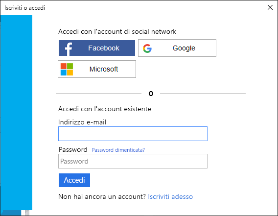
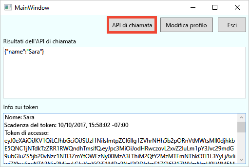

# <a name="quickstart-set-up-sign-in-for-a-desktop-app-using-azure-active-directory-b2c"></a>Guida introduttiva: Configurare l'accesso per un'app desktop tramite Azure Active Directory B2C 

Azure Active Directory (Azure AD) B2C consente la gestione delle identità del cloud per garantire la protezione costante dell'applicazione, delle attività aziendali e dei clienti. Azure AD B2C consente alle applicazioni di eseguire l'autenticazione per account di social networking e account aziendali usando protocolli standard aperti. In questa guida introduttiva si usa un'applicazione desktop WPF (Windows Presentation Foundation) per eseguire l'accesso con un provider di identità basato su social network e chiamare un'API Web protetta da Azure AD B2C.

[!INCLUDE [quickstarts-free-trial-note](../../includes/quickstarts-free-trial-note.md)]

## <a name="prerequisites"></a>Prerequisiti

- [Visual Studio 2017](https://www.visualstudio.com/downloads/) con il carico di lavoro **Sviluppo ASP.NET e Web**. 
- Un account di social networking di Facebook, Google, Microsoft o Twitter.
- [Scaricare un file ZIP](https://github.com/Azure-Samples/active-directory-b2c-dotnet-desktop/archive/master.zip) o clonare l'app Web di esempio da GitHub.

    ```
    git clone https://github.com/Azure-Samples/active-directory-b2c-dotnet-desktop.git
    ```

## <a name="run-the-application-in-visual-studio"></a>Eseguire l'applicazione in Visual Studio

1. Nella cartella del progetto dell'applicazione di esempio aprire la soluzione **active-directory-b2c-wpf.sln** in Visual Studio.
2. Premere **F5** per eseguire il debug dell'applicazione.

## <a name="sign-in-using-your-account"></a>Eseguire l'accesso con il proprio account

1. Fare clic su **Accedi** per avviare il flusso di lavoro **Iscrizione o accesso**.

    

    L'esempio supporta alcune opzioni di iscrizione, tra cui l'uso di un provider di identità di social networking o la creazione di un account locale tramite un indirizzo di posta elettronica. Per questa guida introduttiva, usare un account di provider di identità basato su social network, ovvero un account di Facebook, Google, Microsoft o Twitter. 


2. Azure AD B2C presenta una pagina di accesso personalizzata per un marchio fittizio denominato Wingtip Toys per l'app Web di esempio. Per iscriversi usando un provider di identità basato su social network, fare clic sul pulsante del provider di identità che si vuole usare. 

    

    Per leggere le informazioni dell'account di social networking, eseguire l'autenticazione (accesso) tramite le credenziali di tale account e autorizzare l'applicazione. Dopo la concessione dell'accesso, l'applicazione può recuperare le informazioni sul profilo dall'account, ad esempio il nome e la città dell'utente. 

2. Completare il processo di accesso per il provider di identità.

    I dettagli del nuovo profilo dell'account sono già popolati con informazioni derivate dall'account di social networking.

## <a name="edit-your-profile"></a>Modificare il profilo

Azure AD B2C offre funzionalità che consentono agli utenti di aggiornare il proprio profilo. L'app Web di esempio usa un flusso utente di modifica dei profili di Azure AD B2C per il flusso di lavoro. 

1. Sulla barra dei menu dell'applicazione fare clic su **Edit profile** (Modifica profilo) per modificare il profilo creato.

    

2. Scegliere il provider di identità associato all'account creato. Se ad esempio per la creazione dell'account si è usato Twitter come provider di identità, scegliere Twitter per modificare i dettagli del profilo associato.

3. Modificare **Display name** (Nome visualizzato) o **City** (Città) e quindi fare clic su **Continue** (Continua).

    Nella casella di testo *Token info* (Informazioni token) viene visualizzato un nuovo token di accesso. Se si vogliono verificare le modifiche al profilo, copiare e incollare il token di accesso nel decodificatore di token https://jwt.ms.

## <a name="access-a-protected-api-resource"></a>Accedere a una risorsa API protetta

Fare clic su **Call API** (Chiama API) per inviare una richiesta alla risorsa protetta. 

    

    The application includes the Azure AD access token in the request to the protected web API resource. The web API sends back the display name contained in the access token.

È stato usato l'account utente di Azure AD B2C per eseguire una chiamata autorizzata a un'API Web protetta di Azure AD B2C.

## <a name="clean-up-resources"></a>Pulire le risorse

È possibile usare il tenant di Azure AD B2C se si prevede di provare altre guide introduttive o esercitazioni relative ad Azure AD B2C. Quando non è più necessario, è possibile [eliminare il tenant di Azure AD B2C](active-directory-b2c-faqs.md#how-do-i-delete-my-azure-ad-b2c-tenant).

## <a name="next-steps"></a>Passaggi successivi

In questa guida introduttiva è stata usata un'applicazione desktop di esempio per accedere con una pagina di accesso personalizzata e con un provider di identità basato su social network, creare un account Azure AD B2C e chiamare un'API Web protetta da Azure AD B2C. 

Iniziare ora a creare un tenant di Azure AD B2C. 

> [!div class="nextstepaction"]
> [Creare un tenant di Azure Active Directory B2C nel portale di Azure](tutorial-create-tenant.md)
