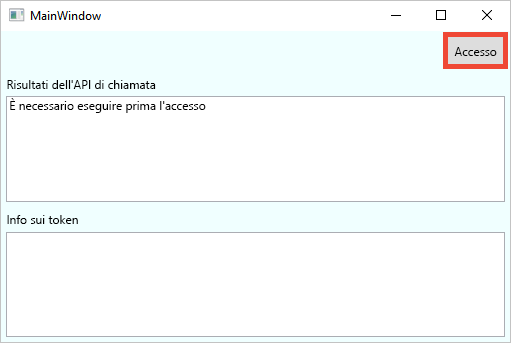
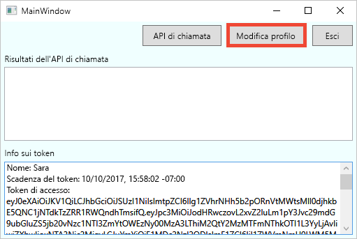

# <a name="quickstart-set-up-sign-in-for-a-desktop-app-using-azure-active-directory-b2c"></a>Guida introduttiva: Configurare l'accesso per un'app desktop tramite Azure Active Directory B2C 

Azure Active Directory (Azure AD) B2C consente la gestione delle identità del cloud per garantire la protezione costante dell'applicazione, delle attività aziendali e dei clienti. Azure AD B2C consente alle app di eseguire l'autenticazione ad account di social networking e account aziendali usando protocolli standard aperti.

In questa guida introduttiva si usa un'app desktop WPF (Windows Presentation Foundation) di esempio abilitata per Azure AD B2C per eseguire l'accesso tramite un provider di identità di social networking e chiamare un'API Web protetta da Azure AD B2C.

[!INCLUDE [quickstarts-free-trial-note](../../includes/quickstarts-free-trial-note.md)]

## <a name="prerequisites"></a>prerequisiti

* [Visual Studio 2017](https://www.visualstudio.com/downloads/) con il carico di lavoro **Sviluppo ASP.NET e Web**. 
* Un account di social networking di Facebook, Google, Microsoft o Twitter.

## <a name="download-the-sample"></a>Scaricare l'esempio

[Scaricare un file ZIP](https://github.com/Azure-Samples/active-directory-b2c-dotnet-desktop/archive/master.zip) o clonare l'app Web di esempio da GitHub.

```
git clone https://github.com/Azure-Samples/active-directory-b2c-dotnet-desktop.git
```

## <a name="run-the-app-in-visual-studio"></a>Eseguire l'app in Visual Studio

Nella cartella del progetto dell'applicazione di esempio aprire la soluzione `active-directory-b2c-wpf.sln` in Visual Studio.

Premere **F5** per eseguire il debug dell'applicazione.

## <a name="create-an-account"></a>Creare un account

Fare clic su **Accedi** per avviare il flusso di lavoro **Iscrizione o accesso** basato su un criterio di Azure AD B2C.



L'esempio supporta alcune opzioni di iscrizione, tra cui l'uso di un provider di identità di social networking o la creazione di un account locale tramite un indirizzo di posta elettronica. Per questa guida introduttiva, usare un account di provider di identità basato su social network, ovvero un account di Facebook, Google, Microsoft o Twitter. 

### <a name="sign-up-using-a-social-identity-provider"></a>Iscriversi usando un provider di identità basato su social network

Azure AD B2C presenta una pagina di accesso personalizzata per un marchio fittizio denominato Wingtip Toys per l'app Web di esempio. 

1. Per iscriversi usando un provider di identità basato su social network, fare clic sul pulsante del provider di identità che si vuole usare. 

    

    Per leggere le informazioni dell'account di social networking, eseguire l'autenticazione (accesso) tramite le credenziali di tale account e autorizzare l'applicazione. Dopo la concessione dell'accesso, l'applicazione può recuperare le informazioni sul profilo dall'account, ad esempio il nome e la città dell'utente. 

2. Completare il processo di accesso per il provider di identità. Se ad esempio si è scelto Twitter, immettere le credenziali di Twitter e fare clic su **Sign in** (Accedi).

    

    I dettagli del nuovo profilo dell'account sono già popolati con informazioni derivate dall'account di social networking. 

3. Modificare i dettagli, se si vuole, e fare clic su **Continua**. I valori immessi vengono usati per il profilo dell'account utente di Azure AD B2C.

    

    È stato creato un nuovo account utente di Azure AD B2C che usa un provider di identità. Dopo l'accesso, il token di accesso viene visualizzato nella casella di testo *Token info* (Informazioni token). Il token di accesso viene usato quando si accede alla risorsa API.

## <a name="edit-your-profile"></a>Modificare il profilo

Azure Active Directory B2C offre funzionalità che consentono agli utenti di aggiornare il profilo.  L'app Web di esempio usa un criterio di modifica dei profili di Azure AD B2C per il flusso di lavoro. 

1. Fare clic su **Modifica profilo** per modificare il profilo creato.

    

2. Scegliere il provider di identità associato all'account creato. Se ad esempio per la creazione dell'account si è usato Twitter come provider di identità, scegliere Twitter per modificare i dettagli del profilo associato.

3. Modificare il **Nome visualizzato** o la **Città** e fare clic su **Continua**.

    Nella casella di testo *Token info* (Informazioni token) viene visualizzato un nuovo token di accesso. Se si vogliono verificare le modifiche al profilo, copiare e incollare il token di accesso nel decodificatore di token https://jwt.ms.

## <a name="access-a-protected-web-api-resource"></a>Accedere a una risorsa API Web protetta

Fare clic su **Call API** (Chiama API) per inviare una richiesta alla risorsa protetta di Azure AD B2C https://fabrikamb2chello.azurewebsites.net/hello. 


L'applicazione include il token di accesso di Azure AD nella richiesta alla risorsa dell'API Web protetta. L'API Web restituisce il nome visualizzato contenuto nel token di accesso.

È stato usato l'account utente di Azure AD B2C per eseguire una chiamata autorizzata a un'API Web protetta di Azure AD B2C.

## <a name="clean-up-resources"></a>Pulire le risorse

È possibile usare il tenant di Azure AD B2C se si prevede di provare altre guide introduttive o esercitazioni relative ad Azure AD B2C. Quando non è più necessario, è possibile [eliminare il tenant di Azure AD B2C](active-directory-b2c-faqs.md#how-do-i-delete-my-azure-ad-b2c-tenant).

## <a name="next-steps"></a>Passaggi successivi

Il passaggio successivo consiste nel creare un tenant di Azure AD B2C e nel configurare l'esempio per l'esecuzione con il tenant. 

> [!div class="nextstepaction"]
> [Creare un tenant di Azure Active Directory B2C nel portale di Azure](active-directory-b2c-get-started.md)
