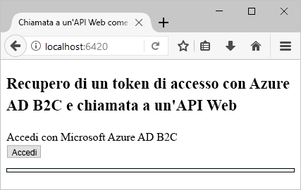
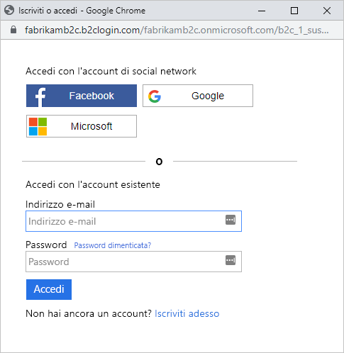
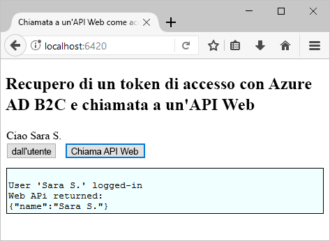

# <a name="quickstart-set-up-sign-in-for-a-single-page-app-using-azure-active-directory-b2c"></a>Guida introduttiva: Configurare l'accesso per un'app a singola pagina tramite Azure Active Directory B2C

Azure Active Directory (Azure AD) B2C consente la gestione delle identità del cloud per garantire la protezione costante dell'applicazione, delle attività aziendali e dei clienti. Azure AD B2C consente alle app di eseguire l'autenticazione ad account di social networking e account aziendali usando protocolli standard aperti.

In questa guida introduttiva si usa un'app a singola pagina di esempio abilitata per Azure AD B2C per eseguire l'accesso tramite un provider di identità di social networking e chiamare un'API Web protetta da Azure AD B2C.

[!INCLUDE [quickstarts-free-trial-note](../../includes/quickstarts-free-trial-note.md)]

## <a name="prerequisites"></a>prerequisiti

* [Visual Studio 2017](https://www.visualstudio.com/downloads/) con il carico di lavoro **Sviluppo ASP.NET e Web**.
* Installare [Node.js](https://nodejs.org/en/download/)
* Un account di social networking di Facebook, Google, Microsoft o Twitter.

## <a name="download-the-sample"></a>Scaricare l'esempio

[Scaricare un file ZIP](https://github.com/Azure-Samples/active-directory-b2c-javascript-msal-singlepageapp/archive/master.zip) o clonare l'app Web di esempio da GitHub.

```
git clone https://github.com/Azure-Samples/active-directory-b2c-javascript-msal-singlepageapp.git
```

## <a name="run-the-sample-application"></a>Eseguire l'applicazione di esempio

Per eseguire l'esempio dal prompt dei comandi di Node.js: 

```
cd active-directory-b2c-javascript-msal-singlepageapp
npm install && npm update
node server.js
```

L'app Node.js restituisce come output il numero di porta su cui rimane in ascolto su localhost.

```
Listening on port 6420...
```

Passare all'URL `http://localhost:6420` dell'app in un Web browser.



## <a name="create-an-account"></a>Creare un account

Fare clic su **Accedi** per avviare il flusso di lavoro **Iscrizione o accesso** di Azure AD B2C basato su un criterio di Azure AD B2C. 

L'esempio supporta alcune opzioni di iscrizione, tra cui l'uso di un provider di identità di social networking o la creazione di un account locale tramite un indirizzo di posta elettronica. Per questa guida introduttiva, usare un account di provider di identità basato su social network, ovvero un account di Facebook, Google, Microsoft o Twitter. 

### <a name="sign-up-using-a-social-identity-provider"></a>Iscriversi usando un provider di identità basato su social network

Azure AD B2C presenta una pagina di accesso personalizzata per un marchio fittizio denominato Wingtip Toys per l'app Web di esempio. 

1. Per iscriversi usando un provider di identità basato su social network, fare clic sul pulsante del provider di identità che si vuole usare.

    

    Per leggere le informazioni dell'account di social networking, eseguire l'autenticazione (accesso) tramite le credenziali di tale account e autorizzare l'applicazione. Dopo la concessione dell'accesso, l'applicazione può recuperare le informazioni sul profilo dall'account, ad esempio il nome e la città dell'utente. 

2. Completare il processo di accesso per il provider di identità. Se ad esempio si è scelto Twitter, immettere le credenziali di Twitter e fare clic su **Sign in** (Accedi).

    

    I dettagli del nuovo profilo dell'account sono già popolati con informazioni derivate dall'account di social networking. 

3. Aggiornare i campi Nome visualizzato, Posizione e Città e fare clic su **Continua**.  I valori immessi vengono usati per il profilo dell'account utente di Azure AD B2C.

    È stato creato un nuovo account utente di Azure AD B2C che usa un provider di identità. 

## <a name="access-a-protected-web-api-resource"></a>Accedere a una risorsa API Web protetta

Fare clic sul pulsante **Call Web API** (Chiama API Web) per ottenere il nome visualizzato dalla chiamata API Web come oggetto JSON. 



L'app a singola pagina di esempio include un token di accesso di Azure AD nella richiesta alla risorsa API Web protetta per eseguire l'operazione per la restituzione dell'oggetto JSON.

## <a name="clean-up-resources"></a>Pulire le risorse

È possibile usare il tenant di Azure AD B2C se si prevede di provare altre guide introduttive o esercitazioni relative ad Azure AD B2C. Quando non è più necessario, è possibile [eliminare il tenant di Azure AD B2C](active-directory-b2c-faqs.md#how-do-i-delete-my-azure-ad-b2c-tenant).

## <a name="next-steps"></a>Passaggi successivi

In questa guida introduttiva è stata usata un'app ASP.NET di esempio abilitata per Azure AD B2C per l'accesso con una pagina di accesso personalizzata, l'accesso tramite un provider di identità di social networking, la creazione di un account Azure AD B2C e la chiamata a un'API Web protetta da Azure AD B2C. 

Il passaggio successivo consiste nel creare un tenant di Azure AD B2C e nel configurare l'esempio per l'esecuzione con il tenant. 

> [!div class="nextstepaction"]
> [Creare un tenant di Azure Active Directory B2C nel portale di Azure](active-directory-b2c-get-started.md)