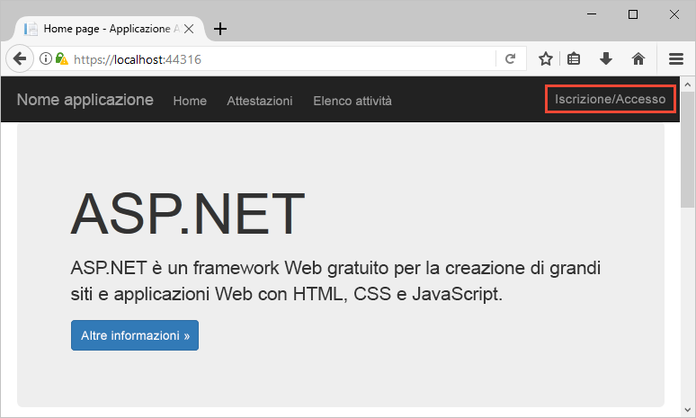
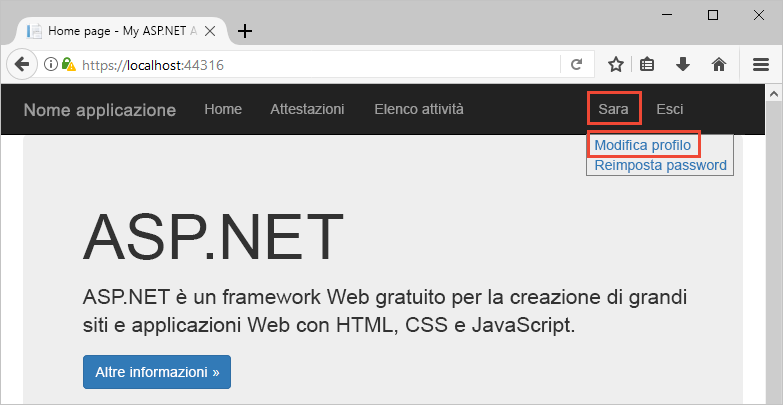

# <a name="quickstart-test-drive-an-azure-ad-b2c-enabled-web-app"></a>Guida introduttiva: Eseguire il test drive di un'app Web abilitata per Azure AD B2C

Azure Active Directory (Azure AD) B2C consente la gestione delle identità del cloud per garantire la protezione costante dell'applicazione, delle attività aziendali e dei clienti. Azure AD B2C consente alle app di eseguire l'autenticazione ad account di social networking e account aziendali usando protocolli standard aperti.

In questa guida introduttiva si usa un'app ASP.NET di esempio abilitata per Azure AD B2C per eseguire l'accesso tramite un provider di identità di social networking e chiamare un'API Web protetta da Azure AD B2C.

[!INCLUDE [quickstarts-free-trial-note](../../includes/quickstarts-free-trial-note.md)]

## <a name="prerequisites"></a>prerequisiti

* [Visual Studio 2017](https://www.visualstudio.com/downloads/) con il carico di lavoro **Sviluppo ASP.NET e Web**. 
* Un account di social networking di Facebook, Google, Microsoft o Twitter.

## <a name="download-the-sample"></a>Scaricare l'esempio

[Scaricare un file ZIP](https://github.com/Azure-Samples/active-directory-b2c-dotnet-webapp-and-webapi/archive/master.zip) o clonare l'app Web di esempio da GitHub.

```
git clone https://github.com/Azure-Samples/active-directory-b2c-dotnet-webapp-and-webapi.git
```

## <a name="run-the-app-in-visual-studio"></a>Eseguire l'app in Visual Studio

Nella cartella del progetto dell'applicazione di esempio aprire la soluzione `B2C-WebAPI-DotNet.sln` in Visual Studio.

La soluzione di esempio contiene due progetti:

**App Web di esempio (TaskWebApp):** app Web per la creazione e modifica di un elenco di attività. L'app Web usa il criterio di **iscrizione o accesso** per l'iscrizione o l'accesso degli utenti.

**App di esempio dell'API Web (TaskService):** API Web che supporta la funzionalità di creazione, lettura, aggiornamento ed eliminazione dell'elenco di attività. L'API Web è protetta da Azure AD B2C e chiamata dall'app Web.

Per questa guida introduttiva entrambi i progetti `TaskWebApp` e `TaskService` vengono eseguiti contemporaneamente. 

1. Selezionare la soluzione `B2C-WebAPI-DotNet` in Esplora soluzioni.
2. Dal menu di Visual Studio scegliere **Progetti > Imposta progetti di avvio**. 
3. Selezionare il pulsante di opzione **Progetti di avvio multipli**.
4. Modificare il valore di **Azione** in entrambi i progetti in **Avvia**. Fare clic su **OK**.

Premere **F5** per eseguire il debug di entrambe le applicazioni. Ogni applicazione viene visualizzata in una scheda del browser separata:

`https://localhost:44316/`: questa pagina è l'applicazione Web ASP.NET. Nella guida introduttiva si interagisce direttamente con l'applicazione.
`https://localhost:44332/`: questa pagina è l'API Web chiamata dall'applicazione Web ASP.NET.

## <a name="create-an-account"></a>Creare un account

Fare clic sul collegamento **Sign up/Sign in** (Iscrizione/Accesso) nell'applicazione Web ASP.NET per avviare il flusso di lavoro **Iscrizione o accesso** basato su un criterio Azure AD B2C.



L'esempio supporta alcune opzioni di iscrizione, tra cui l'uso di un provider di identità di social networking o la creazione di un account locale tramite un indirizzo di posta elettronica. Per questa guida introduttiva, usare un account di provider di identità basato su social network, ovvero un account di Facebook, Google, Microsoft o Twitter. 

### <a name="sign-up-using-a-social-identity-provider"></a>Iscriversi usando un provider di identità basato su social network

Azure AD B2C presenta una pagina di accesso personalizzata per un marchio fittizio denominato Wingtip Toys per l'app Web di esempio. 

1. Per iscriversi usando un provider di identità basato su social network, fare clic sul pulsante del provider di identità che si vuole usare.

    

    Per leggere le informazioni dell'account di social networking, eseguire l'autenticazione (accesso) tramite le credenziali di tale account e autorizzare l'applicazione. Dopo la concessione dell'accesso, l'applicazione può recuperare le informazioni sul profilo dall'account, ad esempio il nome e la città dell'utente. 

2. Completare il processo di accesso per il provider di identità. Se ad esempio si è scelto Twitter, immettere le credenziali di Twitter e fare clic su **Sign in** (Accedi).

    

    I dettagli del nuovo profilo dell'account di Azure AD B2C sono già popolati con informazioni derivate dall'account di social networking.

3. Aggiornare i campi Nome visualizzato, Posizione e Città e fare clic su **Continua**.  I valori immessi vengono usati per il profilo dell'account utente di Azure AD B2C.

    

    È stata usata correttamente l'app Web di esempio che usa un criterio di Azure AD B2C per l'autenticazione tramite un provider di identità e la creazione di un account utente di Azure AD B2C. 

## <a name="edit-your-profile"></a>Modificare il profilo

Azure Active Directory B2C offre funzionalità che consentono agli utenti di aggiornare il profilo. L'app Web di esempio usa un criterio di modifica dei profili di Azure AD B2C per il flusso di lavoro. 

1. Sulla barra dei menu dell'applicazione Web fare clic sul nome del profilo e selezionare **Modifica profilo** per modificare il profilo creato.

    

2. Modificare **Nome visualizzato** e **Città**.  
3. Fare clic su **Continua** per aggiornare il profilo. Il nuovo nome visualizzato viene mostrato in alto a destra nella home page dell'app Web.

## <a name="access-a-protected-web-api-resource"></a>Accedere a una risorsa API Web protetta

1. Fare clic su **Elenco attività** per immettere e modificare gli elementi elenco attività. 

2. Immettere il testo nella casella di testo **Nuovo elemento**. Fare clic su **Aggiungi** per chiamare l'API Web protetta di Azure AD B2C che aggiunge un elemento elenco attività.

    

    L'applicazione Web ASP.NET include un token di accesso di Azure AD nella richiesta alla risorsa API Web protetta per l'esecuzione di operazioni sugli elementi elenco attività dell'utente.

È stato usato l'account utente di Azure AD B2C per eseguire una chiamata autorizzata a un'API Web protetta di Azure AD B2C.

## <a name="clean-up-resources"></a>Pulire le risorse

È possibile usare il tenant di Azure AD B2C se si prevede di provare altre guide introduttive o esercitazioni relative ad Azure AD B2C. Quando non è più necessario, è possibile [eliminare il tenant di Azure AD B2C](active-directory-b2c-faqs.md#how-do-i-delete-my-azure-ad-b2c-tenant).

## <a name="next-steps"></a>Passaggi successivi

In questa guida introduttiva è stata usata un'app ASP.NET di esempio abilitata per Azure AD B2C per l'accesso con una pagina di accesso personalizzata, l'accesso tramite un provider di identità di social networking, la creazione di un account Azure AD B2C e la chiamata a un'API Web protetta da Azure AD B2C. 

Passare all'esercitazione che illustra come configurare l'app ASP.NET di esempio in modo che usi il tenant Azure AD B2C personalizzato dell'utente.

> [!div class="nextstepaction"]
> [Esercitazione: Eseguire l'autenticazione degli utenti con Azure Active Directory B2C in un'app Web ASP.NET](active-directory-b2c-tutorials-web-app.md)