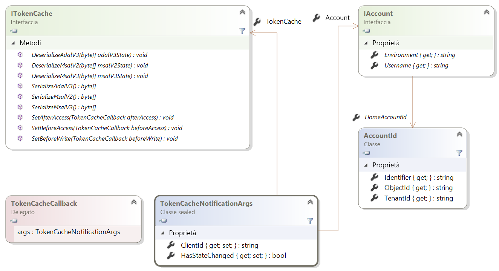
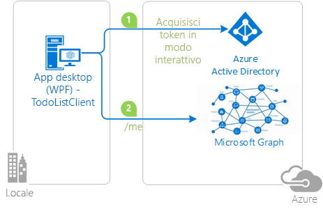

# <a name="token-cache-serialization-in-msalnet"></a>Serializzazione della cache dei token in MSAL.NET
Dopo l'[acquisizione di un token](msal-acquire-cache-tokens.md), questo viene memorizzato nella cache da Microsoft Authentication Library (MSAL).  Il codice dell'applicazione deve tentare di ottenere un token dalla cache prima di acquisire un token con un altro metodo.  Questo articolo illustra la serializzazione predefinita e personalizzata della cache dei token in MSAL.NET.

Questo articolo riguarda MSAL.NET 3.x. Se si è interessati a MSAL.NET 2.x, vedere [Serializzazione della cache dei token in MSAL.NET 2.x](https://github.com/AzureAD/microsoft-authentication-library-for-dotnet/wiki/Token-cache-serialization-2x).

## <a name="default-serialization-for-mobile-platforms"></a>Serializzazione predefinita per le piattaforme per dispositivi mobili

In MSAL.NET viene fornita per impostazione predefinita una cache dei token in memoria. La serializzazione viene fornita per impostazione predefinita per le piattaforme in cui l'archiviazione sicura è disponibile per un utente come parte della piattaforma. Questo vale per la piattaforma UWP (Universal Windows Platform), Xamarin.iOS e Xamarin.Android.

> [!Note]
> Quando si esegue la migrazione di un progetto Xamarin.Android da MSAL.NET 1.x a MSAL.NET 3.x, può essere consigliabile aggiungere `android:allowBackup="false"` al progetto per evitare che vengano applicati i precedenti token memorizzati nella cache quando le distribuzioni di Visual Studio attivano un ripristino dell'archiviazione locale. Vedere il [problema n. 659](https://github.com/AzureAD/microsoft-authentication-library-for-dotnet/issues/659#issuecomment-436181938).

## <a name="custom-serialization-for-windows-desktop-apps-and-web-appsweb-apis"></a>Serializzazione personalizzata per app desktop di Windows e app Web/API Web

Tenere presente che la serializzazione personalizzata non è disponibile nelle piattaforme per dispositivi mobili (UWP, Xamarin.iOS e Xamarin.Android). MSAL definisce già un meccanismo di serializzazione sicuro e ad alte prestazioni per queste piattaforme. Le applicazioni desktop .NET e .NET Core, tuttavia, avranno differenti architetture e MSAL non può implementare un meccanismo di serializzazione per utilizzo generico. Ad esempio, i siti Web possono scegliere di archiviare i token in una cache Redis o le app desktop possono archiviare i token in un file crittografato. Pertanto, la serializzazione non è fornita in modo predefinito. Per disporre di un'applicazione persistente della cache dei token in .NET desktop o .NET Core, è necessario personalizzare la serializzazione.

Le classi e le interfacce seguenti sono usate nella serializzazione della cache dei token:

- `ITokenCache`, che definisce gli eventi per la sottoscrizione delle richieste di serializzazione della cache dei token, nonché i metodi per serializzare o deserializzare la cache in diversi formati (ADAL v3.0, MSAL 2.x e MSAL 3.x = ADAL v5.0).
- `TokenCacheCallback` è un callback passato agli eventi in modo da consentire di gestire la serializzazione. Verranno chiamati con argomenti di tipo `TokenCacheNotificationArgs`.
- `TokenCacheNotificationArgs` fornisce solo il `ClientId` dell'applicazione e un riferimento all'utente per cui è disponibile il token.

  

> [!IMPORTANT]
> MSAL.NET crea token memorizzati nella cache e fornisce la cache `IToken` quando si chiamano le proprietà `UserTokenCache` e `AppTokenCache` di un'applicazione. Non è necessario implementare l'interfaccia autonomamente. Quando si implementa una serializzazione della cache dei token personalizzata, occorre:
> - Reagire a "eventi" `BeforeAccess` e `AfterAccess` (o le relative versioni asincrone). Il delegato `BeforeAccess` ha la responsabilità di deserializzare la cache, mentre quello `AfterAccess` è responsabile per la serializzazione della cache.
> - Alcuni di questi eventi archiviano o caricano BLOB, che vengono passati tramite l'argomento dell'evento al tipo di archiviazione desiderato.

Le strategie sono diverse a seconda del fatto che si stia scrivendo una serializzazione della cache dei token per un'[applicazione client pubblica](msal-client-applications.md) (desktop) o un'[applicazione client riservata](msal-client-applications.md) (app Web, API Web, app daemon).

### <a name="token-cache-for-a-public-client"></a>Cache dei token per un client pubblico 

A partire da MSAL.NET v2.x sono disponibili diverse opzioni per la serializzazione della cache dei token di un client pubblico. È possibile serializzare la cache solo per il formato MSAL.NET (la cache in formato unificato è comune tra MSAL e le piattaforme).  È anche possibile supportare la serializzazione della cache dei token [legacy](https://github.com/AzureAD/azure-activedirectory-library-for-dotnet/wiki/Token-cache-serialization) di ADAL V3.

La personalizzazione della serializzazione della cache dei token per condividere lo stato Single Sign-On tra ADAL.NET 3.x, ADAL.NET 5.x e MSAL.NET è illustrata in parte dell'esempio seguente: [active-directory-dotnet-v1-to-v2](https://github.com/Azure-Samples/active-directory-dotnet-v1-to-v2).

> [!Note]
> Il formato della cache dei token di MSAL.NET 1.1.4-preview non è più supportato in MSAL 2.x. Se si dispone di applicazioni che usano MSAL.NET 1.x, gli utenti dovranno ripetere l'accesso. In alternativa, è supportata la migrazione da ADAL 4.x (e 3.x).

#### <a name="simple-token-cache-serialization-msal-only"></a>Serializzazione semplice della cache dei token (solo MSAL)

Di seguito è riportato un esempio di implementazione semplice della serializzazione personalizzata di una cache dei token per le applicazioni desktop. In questo caso, la cache dei token dell'utente è un file nella stessa cartella dell'applicazione.

Dopo aver creato l'applicazione, si abilita la serializzazione eseguendo la chiamata del metodo `TokenCacheHelper.EnableSerialization()` e passando `UserTokenCache` all'applicazione.

```csharp
app = PublicClientApplicationBuilder.Create(ClientId)
    .Build();
TokenCacheHelper.EnableSerialization(app.UserTokenCache);
```

La classe helper `TokenCacheHelper` viene definita come segue:

```csharp
static class TokenCacheHelper
 {
  public static void EnableSerialization(ITokenCache tokenCache)
  {
   tokenCache.SetBeforeAccess(BeforeAccessNotification);
   tokenCache.SetAfterAccess(AfterAccessNotification);
  }

  /// <summary>
  /// Path to the token cache
  /// </summary>
  public static readonly string CacheFilePath = System.Reflection.Assembly.GetExecutingAssembly().Location + ".msalcache.bin3";

  private static readonly object FileLock = new object();


  private static void BeforeAccessNotification(TokenCacheNotificationArgs args)
  {
   lock (FileLock)
   {
    args.TokenCache.DeserializeMsalV3(File.Exists(CacheFilePath)
            ? ProtectedData.Unprotect(File.ReadAllBytes(CacheFilePath),
                                      null,
                                      DataProtectionScope.CurrentUser)
            : null);
   }
  }

  private static void AfterAccessNotification(TokenCacheNotificationArgs args)
  {
   // if the access operation resulted in a cache update
   if (args.HasStateChanged)
   {
    lock (FileLock)
    {
     // reflect changesgs in the persistent store
     File.WriteAllBytes(CacheFilePath,
                         ProtectedData.Protect(args.TokenCache.SerializeMsalV3(),
                                                 null,
                                                 DataProtectionScope.CurrentUser)
                         );
    }
   }
  }
 }
```

Un'anteprima di un serializzatore basato su file della cache dei token per la qualità del prodotto per le applicazioni client pubbliche (per le applicazioni desktop in esecuzione in Windows, Mac e Linux) è disponibile dalla libreria open source [Microsoft.Identity.Client.Extensions.Msal](https://github.com/AzureAD/microsoft-authentication-extensions-for-dotnet/tree/master/src/Microsoft.Identity.Client.Extensions.Msal). È possibile includerla nelle applicazioni dal pacchetto NuGet seguente: [Microsoft.Identity.Client.Extensions.Msal](https://www.nuget.org/packages/Microsoft.Identity.Client.Extensions.Msal/).

#### <a name="dual-token-cache-serialization-msal-unified-cache-and-adal-v3"></a>Serializzazione doppia della cache dei token (cache unificata MSAL e ADAL v3)

Se si vuole implementare la serializzazione della cache dei token con il formato della cache unificato (comune a ADAL.NET 4.x, MSAL.NET 2.x e altre versioni di MSAL della stessa generazione o meno recenti, sulla stessa piattaforma), esaminare il codice seguente:

```csharp
string appLocation = Path.GetDirectoryName(Assembly.GetEntryAssembly().Location;
string cacheFolder = Path.GetFullPath(appLocation) + @"..\..\..\..");
string adalV3cacheFileName = Path.Combine(cacheFolder, "cacheAdalV3.bin");
string unifiedCacheFileName = Path.Combine(cacheFolder, "unifiedCache.bin");

IPublicClientApplication app;
app = PublicClientApplicationBuilder.Create(clientId)
                                    .Build();
FilesBasedTokenCacheHelper.EnableSerialization(app.UserTokenCache,
                                               unifiedCacheFileName,
                                               adalV3cacheFileName);

```

In questo caso, la classe helper viene definita come:

```csharp
using System;
using System.IO;
using System.Security.Cryptography;
using Microsoft.Identity.Client;

namespace CommonCacheMsalV3
{
 /// <summary>
 /// Simple persistent cache implementation of the dual cache serialization (ADAL V3 legacy
 /// and unified cache format) for a desktop applications (from MSAL 2.x)
 /// </summary>
 static class FilesBasedTokenCacheHelper
 {
  /// <summary>
  /// Enables the serialization of the token cache
  /// </summary>
  /// <param name="adalV3CacheFileName">File name where the cache is serialized with the
  /// ADAL V3 token cache format. Can
  /// be <c>null</c> if you don't want to implement the legacy ADAL V3 token cache
  /// serialization in your MSAL 2.x+ application</param>
  /// <param name="unifiedCacheFileName">File name where the cache is serialized
  /// with the Unified cache format, common to
  /// ADAL V4 and MSAL V2 and above, and also across ADAL/MSAL on the same platform.
  ///  Should not be <c>null</c></param>
  /// <returns></returns>
  public static void EnableSerialization(ITokenCache tokenCache, string unifiedCacheFileName, string adalV3CacheFileName)
  {
   UnifiedCacheFileName = unifiedCacheFileName;
   AdalV3CacheFileName = adalV3CacheFileName;

   tokenCache.SetBeforeAccess(BeforeAccessNotification);
   tokenCache.SetAfterAccess(AfterAccessNotification);
  }

  /// <summary>
  /// File path where the token cache is serialized with the unified cache format
  /// (ADAL.NET V4, MSAL.NET V3)
  /// </summary>
  public static string UnifiedCacheFileName { get; private set; }

  /// <summary>
  /// File path where the token cache is serialized with the legacy ADAL V3 format
  /// </summary>
  public static string AdalV3CacheFileName { get; private set; }

  private static readonly object FileLock = new object();

  public static void BeforeAccessNotification(TokenCacheNotificationArgs args)
  {
   lock (FileLock)
   {
    args.TokenCache.DeserializeAdalV3(ReadFromFileIfExists(AdalV3CacheFileName));
    try
    {
     args.TokenCache.DeserializeMsalV3(ReadFromFileIfExists(UnifiedCacheFileName));
    }
    catch(Exception ex)
    {
     // Compatibility with the MSAL v2 cache if you used one
     args.TokenCache.DeserializeMsalV2(ReadFromFileIfExists(UnifiedCacheFileName));
    }
   }
  }

  public static void AfterAccessNotification(TokenCacheNotificationArgs args)
  {
   // if the access operation resulted in a cache update
   if (args.HasStateChanged)
   {
    lock (FileLock)
    {
     WriteToFileIfNotNull(UnifiedCacheFileName, args.TokenCache.SerializeMsalV3());
     if (!string.IsNullOrWhiteSpace(AdalV3CacheFileName))
     {
      WriteToFileIfNotNull(AdalV3CacheFileName, args.TokenCache.SerializeAdalV3());
     }
    }
   }
  }

  /// <summary>
  /// Read the content of a file if it exists
  /// </summary>
  /// <param name="path">File path</param>
  /// <returns>Content of the file (in bytes)</returns>
  private static byte[] ReadFromFileIfExists(string path)
  {
   byte[] protectedBytes = (!string.IsNullOrEmpty(path) && File.Exists(path))
       ? File.ReadAllBytes(path) : null;
   byte[] unprotectedBytes = encrypt ?
       ((protectedBytes != null) ? ProtectedData.Unprotect(protectedBytes, null, DataProtectionScope.CurrentUser) : null)
       : protectedBytes;
   return unprotectedBytes;
  }

  /// <summary>
  /// Writes a blob of bytes to a file. If the blob is <c>null</c>, deletes the file
  /// </summary>
  /// <param name="path">path to the file to write</param>
  /// <param name="blob">Blob of bytes to write</param>
  private static void WriteToFileIfNotNull(string path, byte[] blob)
  {
   if (blob != null)
   {
    byte[] protectedBytes = encrypt
      ? ProtectedData.Protect(blob, null, DataProtectionScope.CurrentUser)
      : blob;
    File.WriteAllBytes(path, protectedBytes);
   }
   else
   {
    File.Delete(path);
   }
  }

  // Change if you want to test with an un-encrypted blob (this is a json format)
  private static bool encrypt = true;
 }
}
```

### <a name="token-cache-for-a-web-app-confidential-client-application"></a>Cache dei token per un'app Web (applicazione client riservata)

Nelle app Web o nelle API Web la cache può sfruttare la sessione, una cache Redis o un database.

Un aspetto importante da ricordare è che per le app Web e le API Web deve essere presente una sola cache dei token per ogni utente (per ogni account). È necessario serializzare la cache dei token per ogni account.

Esempi di come usare le cache dei token per le app Web e le API Web sono disponibili in [Esercitazione sull'app Web ASP.NET Core](https://ms-identity-aspnetcore-webapp-tutorial), nella fase [2-2 Cache dei token](https://github.com/Azure-Samples/active-directory-aspnetcore-webapp-openidconnect-v2/tree/master/2-WebApp-graph-user/2-2-TokenCache). Per le implementazioni, esaminare la cartella [TokenCacheProviders](https://github.com/AzureAD/microsoft-authentication-extensions-for-dotnet/tree/master/src/Microsoft.Identity.Client.Extensions.Web/TokenCacheProviders) nella libreria [microsoft-authentication-extensions-for-dotnet](https://github.com/AzureAD/microsoft-authentication-extensions-for-dotnet) (nella cartella [Microsoft.Identity.Client.Extensions.Web](https://github.com/AzureAD/microsoft-authentication-extensions-for-dotnet/tree/master/src/Microsoft.Identity.Client.Extensions.Web)). 

## <a name="next-steps"></a>Passaggi successivi
Gli esempi seguenti illustrano la serializzazione della cache dei token.

| Esempio | Piattaforma | DESCRIZIONE|
| ------ | -------- | ----------- |
|[active-directory-dotnet-desktop-msgraph-v2](https://github.com/azure-samples/active-directory-dotnet-desktop-msgraph-v2) | Desktop (WPF) | Applicazione .NET per Windows Desktop (WPF) che chiama l'API Microsoft Graph. |
|[active-directory-dotnet-v1-to-v2](https://github.com/Azure-Samples/active-directory-dotnet-v1-to-v2) | Desktop (Console) | Set di soluzioni di Visual Studio che illustra la migrazione delle applicazioni di Azure AD v1.0 (che usano ADAL.NET) alle applicazioni di Azure AD v2.0, anche denominate applicazioni con convergenza (che usano MSAL.NET), in particolare la [migrazione della cache dei token](https://github.com/Azure-Samples/active-directory-dotnet-v1-to-v2/blob/master/TokenCacheMigration/README.md)|
