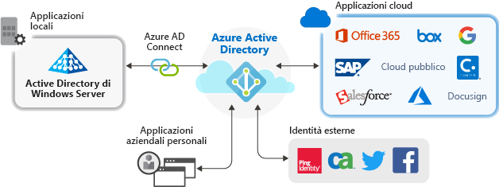

# Gestione di applicazioni con Azure Active Directory

Azure Active Directory (Azure AD) offre un accesso efficiente e sicuro alle applicazioni cloud e locali. Gli utenti possono eseguire la procedura di accesso una sola volta e accedere a Office 365 e altre applicazioni aziendali Microsoft, applicazioni SaaS (Software as a Service), applicazioni locali e app line-of-business. Consente inoltre di ridurre i costi amministrativi automatizzando il provisioning degli utenti e di usare l'autenticazione a più fattori e i criteri di accesso condizionale per fornire un accesso sicuro alle applicazioni.

## Perché gestire le applicazioni con una soluzione cloud?

In molte organizzazioni sono presenti centinaia di applicazioni a cui devono ricorrere i dipendenti per poter portare a termine il proprio lavoro. Gli utenti accedono a queste applicazioni da dispositivi e luoghi diversi. Ogni giorno, inoltre, vengono aggiunte, sviluppate e ritirate nuove applicazioni. Con un numero così elevato di applicazioni e punti di accesso, è ormai essenziale usare una soluzione basata sul cloud per gestire l'accesso degli utenti a tutte le applicazioni.

## Gestione dei rischi con i criteri di accesso condizionale
Combinando l'accesso Single Sign-On (SSO) di Azure AD con i criteri di accesso condizionale, è possibile garantire elevati livelli di sicurezza per l'accesso alle applicazioni. Le funzionalità di sicurezza includono la protezione dell'identità a livello di cloud, il controllo degli accessi basato sul rischio, l'autenticazione a più fattori nativa e i criteri di accesso condizionale. Queste funzionalità supportano criteri di controllo granulare basati sulle applicazioni o sui gruppi che necessitano di livelli di sicurezza superiori.

## Migliorare la produttività con l'accesso Single Sign-On
L'abilitazione dell'accesso Single Sign-On (SSO) nelle applicazioni e in Office 365 offre agli utenti esistenti un'esperienza di accesso migliore riducendo o eliminando le richieste di accesso. L'ambiente dell'utente risulta inoltre più coerente ed è più difficile distrarsi senza dover gestire molteplici richieste di accesso o innumerevoli password. Il gruppo aziendale può gestire e approvare gli accessi tramite la modalità self-service e l'appartenenza dinamica. Consentendo al personale aziendale di competenza di gestire gli accessi a un'applicazione, è possibile anche migliorare la sicurezza del sistema delle identità.

L'accesso SSO migliora la sicurezza. *Senza l'accesso Single Sign-On*, gli amministratori devono creare e aggiornare account utente per ogni singola applicazione, con una considerevole perdita di tempo. Gli utenti devono inoltre tenere traccia di più credenziali per accedere alle applicazioni. Gli utenti, quindi, tendono a prendere nota delle password o a usare soluzioni di gestione delle password che comportano altri rischi per la sicurezza dei dati. 

## Gestione della governance e della conformità
Con Azure AD è possibile monitorare gli accessi alle applicazioni tramite report basati sugli strumenti di monitoraggio di eventi imprevisti della sicurezza. È possibile accedere ai report dal portale o dalle API. A livello di codice, è possibile anche controllare chi può accedere alle applicazioni e rimuovere l'accesso agli utenti inattivi tramite verifiche di accesso.

## Gestire i costi
Eseguendo la migrazione ad Azure AD è possibile anche risparmiare sui costi ed eliminare le complessità correlate alla gestione dell'infrastruttura locale. Azure AD consente infatti l'accesso self-service alle applicazioni, con un considerevole risparmio di tempo per gli amministratori e gli utenti. L'accesso Single Sign-On elimina le password specifiche delle applicazioni. La possibilità di eseguire l'accesso una sola volta consente di risparmiare sui costi correlati alla reimpostazione delle password delle applicazioni e alla perdita di produttività per il recupero delle password.

