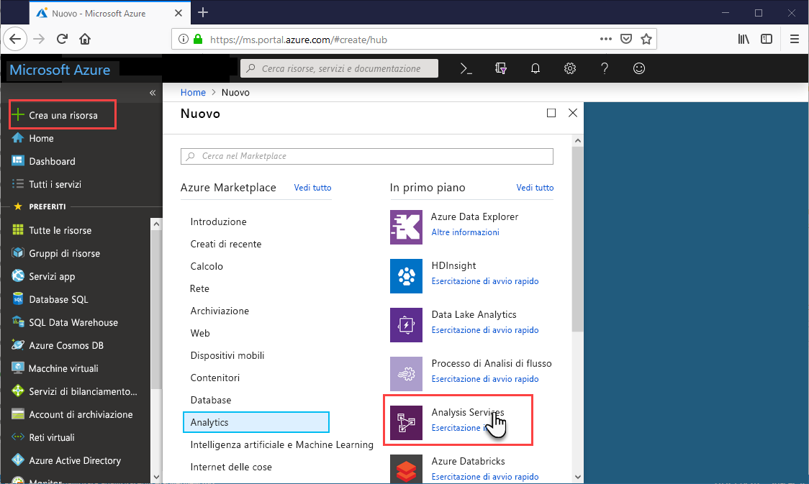

# Creare un server Analysis Services nel portale di Azure
Questo articolo illustra la creazione di una risorsa server Analysis Services nella sottoscrizione di Azure.

Prima di iniziare, è necessario disporre di quanto segue: 

* **Sottoscrizione di Azure**: visitare la pagina [Versione di valutazione gratuita di Azure](https://azure.microsoft.com/offers/ms-azr-0044p/) per creare un account.
* **Azure Active Directory**: la sottoscrizione deve essere associata a un tenant Azure Active Directory. Inoltre è necessario essere registrati ad Azure con un account nell'Azure Active Directory specifica. Per altre informazioni, vedere [Autenticazione e autorizzazioni utente](analysis-services-manage-users.md).

## Accedere al Portale di Azure 

Accedere al [portale di Azure](https://portal.azure.com)

## Creare un server

1. Fare clic su **+ Crea una risorsa** > **Dati e analisi** > **Analysis Services**.

    

2. In **Analysis Services** compilare i campi obbligatori e quindi fare clic su **Crea**.
   
    
   
   * **Nome server**: digitare un nome univoco usato per fare riferimento al server.
   * **Sottoscrizione**: selezionare la sottoscrizione a cui il server verrà associato.
   * **Gruppo di risorse**: creare un nuovo gruppo di risorse o selezionarne uno già esistente. I gruppi di risorse sono progettati per facilitare la gestione di una raccolta di risorse di Azure. Per altre informazioni, vedere [Gruppi di risorse](../azure-resource-manager/resource-group-overview.md).
   * **Località**: località del data center di Azure che ospita il server. Selezionare una località vicina alla base di utenti più estesa.
   * **Piano tariffario**: selezionare un piano tariffario. Se si sta eseguendo il test e si intende installare il database modello di esempio, selezionare il piano gratuito **D1**. Per altre informazioni, vedere [Prezzi di Azure Analysis Services](https://azure.microsoft.com/pricing/details/analysis-services/). 
    * **Amministratore**: per impostazione predefinita, sarà l'account con cui si esegue l'accesso. È possibile scegliere un altro account da Azure Active Directory.
    * **Impostazione dell'archiviazione di backup**: facoltativa. Se si ha già un [account di archiviazione](../storage/common/storage-introduction.md), è possibile specificarlo come account predefinito per il backup del database modello. Le impostazioni di [backup e ripristino](analysis-services-backup.md) possono essere specificate successivamente.
    * **Scadenza della chiave di archiviazione**: facoltativa. Specificare un periodo di scadenza della chiave di archiviazione.
3. Fare clic su **Crea**.

La creazione richiede in genere meno di un minuto. Se si seleziona **Add to Portal** (Aggiungi al portale), spostarsi nel portale per vedere il nuovo server. In alternativa, passare a **Tutti i servizi** > **Analysis Services** per vedere se il server è pronto.

## Pulire le risorse
Quando non è più necessario, eliminare il server. Nel riquadro **Panoramica** del server, fare clic su **Elimina**. 

 

## Passaggi successivi

[Aggiungere un modello di dati di esempio](analysis-services-create-sample-model.md) al server.  
[Installare un gateway dati locale](analysis-services-gateway-install.md) se il modello di dati si collega alle origini dati locali.  
[Distribuire un progetto di modello tabulare](analysis-services-deploy.md) da Visual Studio.   

