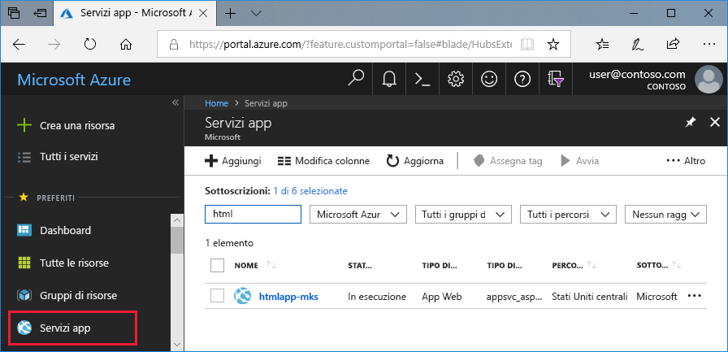
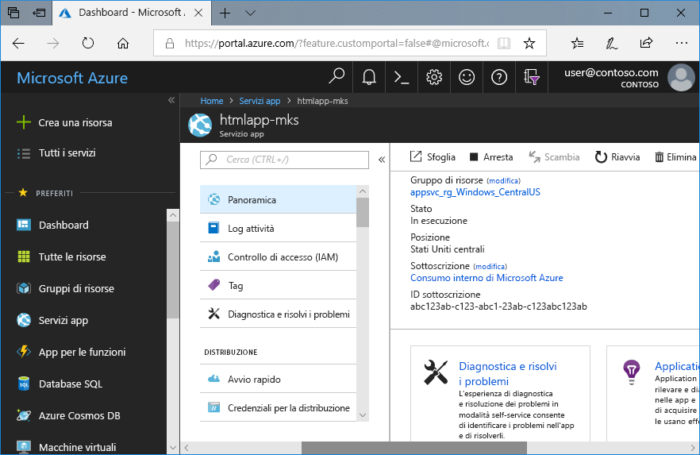

# <a name="create-a-static-html-web-app-in-azure"></a>Creare un'app Web HTML statica in Azure

Le [app Web di Azure](app-service-web-overview.md) forniscono un servizio di hosting Web ad alta scalabilità e con funzioni di auto-correzione. Questa guida introduttiva illustra come distribuire un sito HTML e CSS di base in un'app Web di Azure. Questa guida introduttiva verrà completata in [Cloud Shell](https://docs.microsoft.com/azure/cloud-shell/overview), ma gli stessi comandi possono essere eseguiti anche in locale con l'[interfaccia della riga di comando di Azure](/cli/azure/install-azure-cli).


[!INCLUDE [quickstarts-free-trial-note](../../includes/quickstarts-free-trial-note.md)]

[!INCLUDE [cloud-shell-try-it.md](../../includes/cloud-shell-try-it.md)]

## <a name="install-web-app-extension-for-cloud-shell"></a>Installare l'estensione di app Web per Cloud Shell

Per completare questa guida introduttiva è necessario aggiungere l'[estensione di app Web az](https://docs.microsoft.com/cli/azure/extension?view=azure-cli-latest#az-extension-add). Se l'estensione è già installata, occorre aggiornarla all'ultima versione. Per aggiornare l'estensione dell'app Web, digitare `az extension update -n webapp`.

Per installare l'estensione dell'app Web, eseguire il comando seguente:

```bash
az extension add --name webapp
```

Una volta installata l'estensione, Cloud Shell mostra le informazioni come nell'esempio seguente:

```bash
The installed extension 'webapp' is in preview.
```

## <a name="download-the-sample"></a>Scaricare l'esempio

In Cloud Shell creare una directory quickstart e passare ad essa.

```bash
mkdir quickstart

cd quickstart
```

Eseguire quindi il comando seguente per clonare il repository dell'app di esempio nella directory quickstart.

```bash
git clone https://github.com/Azure-Samples/html-docs-hello-world.git
```

## <a name="create-a-web-app"></a>Creare un'app Web

Passare alla directory contenente il codice di esempio ed eseguire il comando `az webapp up`.

Nell'esempio seguente sostituire <app_name> con un nome di app univoco.

```bash
cd html-docs-hello-world

az webapp up --location westeurope --name <app_name>
```

Il comando `az webapp up` esegue le azioni seguenti:

- Crea un gruppo di risorse predefinito.

- Crea un piano di servizio app predefinito.

- Crea un'app con il nome specificato.

- [Distribuisce con zipdeploy](https://docs.microsoft.com/azure/app-service/app-service-deploy-zip) i file dalla directory di lavoro corrente all'app Web.

L'esecuzione del comando può richiedere alcuni minuti. Durante l'esecuzione, il comando visualizza informazioni simili all'esempio seguente:

```json
{
  "app_url": "https://<app_name>.azurewebsites.net",
  "location": "westeurope",
  "name": "<app_name>",
  "os": "Windows",
  "resourcegroup": "appsvc_rg_Windows_westeurope",
  "serverfarm": "appsvc_asp_Windows_westeurope",
  "sku": "FREE",
  "src_path": "/home/<username>/quickstart/html-docs-hello-world ",
  < JSON data removed for brevity. >
}
```

Annotare il valore `resourceGroup`. È necessario per la sezione [Pulire le risorse](#clean-up-resources).

## <a name="browse-to-the-app"></a>Passare all'app

In un browser passare all'URL dell'app Web di Azure: `http://<app_name>.azurewebsites.net`.

La pagina è in esecuzione come un'app Web del servizio app di Azure.


**Congratulazioni** La distribuzione della prima app HTML nel Servizio app è stata completata.

## <a name="update-and-redeploy-the-app"></a>Aggiornare e ridistribuire l'app

In Cloud Shell digitare `nano index.html` per aprire l'editor di testo Nano. Nel tag di intestazione `<h1>` modificare "Azure App Service - Sample Static HTML Site" in "Azure App Service", come mostrato più avanti.


Salvare le modifiche e uscire da Nano. Usare il comando `^O` per salvare e `^X` per uscire.

Ora l'applicazione verrà ridistribuita con lo stesso comando `az webapp up`.

```bash
az webapp up --location westeurope --name <app_name>
```

Al termine della distribuzione, tornare alla finestra del browser aperta nel passaggio **Passare all'app** e aggiornare la pagina.


## <a name="manage-your-new-azure-web-app"></a>Gestire la nuova app Web di Azure

Accedere al <a href="https://portal.azure.com" target="_blank">portale di Azure</a> per gestire l'app Web creata.

Nel menu a sinistra fare clic su **Servizi app** e quindi sul nome dell'app Web di Azure.



Verrà visualizzata la pagina di panoramica dell'app Web. Qui è possibile eseguire attività di gestione di base come l'esplorazione, l'arresto, l'avvio, il riavvio e l'eliminazione dell'app.



Il menu a sinistra fornisce varie pagine per la configurazione dell'app.

## <a name="clean-up-resources"></a>Pulire le risorse

Nei passaggi precedenti sono state create risorse di Azure in un gruppo di risorse. Se si ritiene che queste risorse non saranno necessarie in futuro, eliminare il gruppo di risorse eseguendo questo comando in Cloud Shell. Si ricorda che il nome del gruppo di risorse è stato generato automaticamente nel passaggio [Creare un'app Web](#create-a-web-app).

```bash
az group delete --name appsvc_rg_Windows_westeurope
```

L'esecuzione del comando può richiedere un minuto.

## <a name="next-steps"></a>Passaggi successivi

> [!div class="nextstepaction"]
> [Eseguire il mapping di un dominio personalizzato](app-service-web-tutorial-custom-domain.md)
