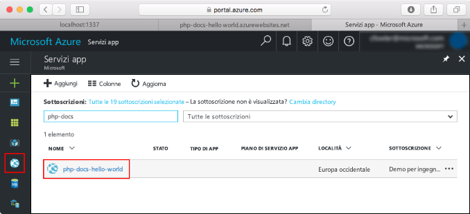

# <a name="create-a-python-app-in-azure-app-service-on-linux-preview"></a>Creare un'app Python nel Servizio app di Azure in Linux (anteprima)

Il [Servizio app in Linux](app-service-linux-intro.md) offre un servizio di hosting Web con scalabilità elevata e funzioni di auto-correzione basato sul sistema operativo Linux. Questa guida introduttiva illustra come distribuire un'app Python sull'immagine Python predefinita (anteprima) nel Servizio app in Linux mediante [Cloud Shell](https://docs.microsoft.com/azure/cloud-shell/overview).

È possibile seguire la procedura disponibile in questo articolo con un computer Mac, Windows o Linux.


[!INCLUDE [quickstarts-free-trial-note](../../../includes/quickstarts-free-trial-note.md)]

[!INCLUDE [cloud-shell-try-it.md](../../../includes/cloud-shell-try-it.md)]

## <a name="download-the-sample"></a>Scaricare l'esempio

In Cloud Shell creare una directory quickstart e passare ad essa.

```bash
mkdir quickstart

cd quickstart
```

Eseguire quindi il comando seguente per clonare il repository dell'app di esempio nella directory quickstart.

```bash
git clone https://github.com/Azure-Samples/python-docs-hello-world
```

Durante l'esecuzione, il comando visualizza informazioni simili all'esempio seguente:

```bash
Cloning into 'python-docs-hello-world'...
remote: Enumerating objects: 43, done.
remote: Total 43 (delta 0), reused 0 (delta 0), pack-reused 43
Unpacking objects: 100% (43/43), done.
Checking connectivity... done.
```

## <a name="create-a-web-app"></a>Creare un'app Web

Passare alla directory contenente il codice di esempio ed eseguire il comando `az webapp up`.

Nell'esempio seguente sostituire <app_name> con un nome di app univoco.

```bash
cd python-docs-hello-world

az webapp up -n <app_name>
```

L'esecuzione del comando può richiedere alcuni minuti. Durante l'esecuzione, il comando visualizza informazioni simili all'esempio seguente:

```json
The behavior of this command has been altered by the following extension: webapp
Creating Resource group 'appsvc_rg_Linux_CentralUS' ...
Resource group creation complete
Creating App service plan 'appsvc_asp_Linux_CentralUS' ...
App service plan creation complete
Creating app '<app_name>' ....
Webapp creation complete
Creating zip with contents of dir /home/username/quickstart/python-docs-hello-world ...
Preparing to deploy contents to app.
All done.
{
  "app_url": "https:/<app_name>.azurewebsites.net",
  "location": "Central US",
  "name": "<app_name>",
  "os": "Linux",
  "resourcegroup": "appsvc_rg_Linux_CentralUS ",
  "serverfarm": "appsvc_asp_Linux_CentralUS",
  "sku": "BASIC",
  "src_path": "/home/username/quickstart/python-docs-hello-world ",
  "version_detected": "-",
  "version_to_create": "python|3.7"
}
```

Il comando `az webapp up` esegue le azioni seguenti:

- Crea un gruppo di risorse predefinito.

- Crea un piano di servizio app predefinito.

- Crea un'app con il nome specificato.

- [Distribuire file ZIP](https://docs.microsoft.com/azure/app-service/deploy-zip) i dalla directory di lavoro corrente all'app.

## <a name="browse-to-the-app"></a>Passare all'app

Passare all'applicazione distribuita con il Web browser.

```bash
http://<app_name>.azurewebsites.net
```

Il codice di esempio Python è in esecuzione nel servizio app in Linux con un'immagine predefinita.


**Congratulazioni** La distribuzione della prima app Python nel Servizio app di Azure in Linux è stata completata.

## <a name="update-locally-and-redeploy-the-code"></a>Aggiornare e ridistribuire il codice in locale

In Cloud Shell digitare `code application.py` per aprire l'editor di Cloud Shell.


 Apportare una piccola modifica al testo nella chiamata a `return`:

```python
return "Hello Azure!"
```

Salvare le modifiche e uscire dall'editor. Usare il comando `^S` per salvare e `^Q` per uscire.

A questo punto occorre ridistribuire l'app. Sostituire `<app_name>` con l'app.

```bash
az webapp up -n <app_name>
```

Al termine della distribuzione, tornare alla finestra del browser aperta nel passaggio **Passare all'app** e aggiornare la pagina.


## <a name="manage-your-new-azure-app"></a>Gestire la nuova app Azure

Accedere al <a href="https://portal.azure.com" target="_blank">portale di Azure</a> per gestire l'app creata.

Nel menu a sinistra fare clic su **Servizi app** e quindi sul nome dell'app Azure.



Verrà visualizzata la pagina Panoramica dell'app. Qui è possibile eseguire attività di gestione di base come l'esplorazione, l'arresto, l'avvio, il riavvio e l'eliminazione dell'app.


Il menu a sinistra fornisce varie pagine per la configurazione dell'app. 

[!INCLUDE [cli-samples-clean-up](../../../includes/cli-samples-clean-up.md)]

## <a name="next-steps"></a>Passaggi successivi

L'immagine incorporata di Python nel servizio app in Linux è attualmente in anteprima ed è possibile personalizzare il comando usato per avviare l'app. È anche possibile creare app Python di produzione usando un contenitore personalizzato.

> [!div class="nextstepaction"]
> [Python con PostgreSQL](tutorial-python-postgresql-app.md)

> [!div class="nextstepaction"]
> [Configurare un comando di avvio personalizzato](how-to-configure-python.md#customize-startup-command)

> [!div class="nextstepaction"]
> [Risoluzione dei problemi](how-to-configure-python.md#troubleshooting)

> [!div class="nextstepaction"]
> [Use custom images](tutorial-custom-docker-image.md) (Usare immagini personalizzate)
