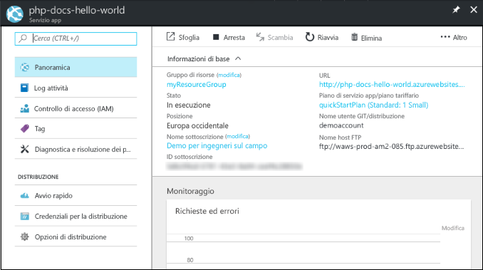

# <a name="create-a-python-app-in-azure-app-service-on-linux-preview"></a>Creare un'app Python nel Servizio app di Azure in Linux (anteprima)

Il [Servizio app in Linux](app-service-linux-intro.md) offre un servizio di hosting Web con scalabilità elevata e funzioni di auto-correzione basato sul sistema operativo Linux. Questa guida introduttiva illustra come distribuire un'app Python nella parte superiore dell'immagine Python predefinita (anteprima) nel Servizio app di Azure in Linux mediante l'[interfaccia della riga di comando di Azure](/cli/azure/install-azure-cli).

È possibile seguire la procedura disponibile in questo articolo con un computer Mac, Windows o Linux.


[!INCLUDE [quickstarts-free-trial-note](../../../includes/quickstarts-free-trial-note.md)]

## <a name="prerequisites"></a>Prerequisiti

Per completare questa guida introduttiva:

* <a href="https://www.python.org/downloads/" target="_blank">Installare Python 3.7</a>
* <a href="https://git-scm.com/" target="_blank">Installare Git</a>

## <a name="download-the-sample"></a>Scaricare l'esempio

In una finestra del terminale eseguire i comandi seguenti per clonare l'applicazione di esempio nel computer locale e passare alla directory con il codice di esempio.

```bash
git clone https://github.com/Azure-Samples/python-docs-hello-world
cd python-docs-hello-world
```

Il repository contiene un file *application.py*, che indica al servizio app che il repository contiene un'app Flask. Per altre informazioni, vedere [Processo di avvio di contenitore e personalizzazioni](how-to-configure-python.md).

## <a name="run-the-app-locally"></a>Eseguire l'app in locale

Eseguire l'applicazione in locale, in modo da verificare l'aspetto che assumerà dopo la distribuzione in Azure. Aprire una finestra del terminale e usare i comandi seguenti per installare le dipendenze necessarie e avviare il server di sviluppo predefinito. 

```bash
# In Bash
python3 -m venv venv
source venv/bin/activate
pip install -r requirements.txt
FLASK_APP=application.py flask run

# In PowerShell
py -3 -m venv env
env\scripts\activate
pip install -r requirements.txt
Set-Item Env:FLASK_APP ".\application.py"
flask run
```

Aprire un Web browser e passare all'app di esempio all'indirizzo `http://localhost:5000/`.

Nella pagina verrà visualizzato il messaggio **Hello World!** dell'app di esempio.


Nella finestra del terminale premere **CTRL+C** per uscire dal server Web.

[!INCLUDE [cloud-shell-try-it.md](../../../includes/cloud-shell-try-it.md)]

[!INCLUDE [Configure deployment user](../../../includes/configure-deployment-user.md)]

[!INCLUDE [Create resource group](../../../includes/app-service-web-create-resource-group-linux.md)]

[!INCLUDE [Create app service plan](../../../includes/app-service-web-create-app-service-plan-linux.md)]

## <a name="create-a-web-app"></a>Creare un'app Web

[!INCLUDE [Create web app](../../../includes/app-service-web-create-web-app-python-linux-no-h.md)]

Passare al sito per visualizzare la nuova app creata con l'immagine predefinita. Sostituire _&lt;app name>_ con il nome dell'app.

```bash
http://<app_name>.azurewebsites.net
```

Ecco l'aspetto che avrà la nuova app:


[!INCLUDE [Push to Azure](../../../includes/app-service-web-git-push-to-azure.md)] 

```bash
Counting objects: 42, done.
Delta compression using up to 8 threads.
Compressing objects: 100% (39/39), done.
Writing objects: 100% (42/42), 9.43 KiB | 0 bytes/s, done.
Total 42 (delta 15), reused 0 (delta 0)
remote: Updating branch 'master'.
remote: Updating submodules.
remote: Preparing deployment for commit id 'c40efbb40e'.
remote: Generating deployment script.
remote: Generating deployment script for python Web Site
.
.
.
remote: Finished successfully.
remote: Running post deployment command(s)...
remote: Deployment successful.
remote: App container will begin restart within 10 seconds.
To https://user2234@cephalin-python.scm.azurewebsites.net/cephalin-python.git
 * [new branch]      master -> master
 ```

## <a name="browse-to-the-app"></a>Passare all'app

Passare all'applicazione distribuita con il Web browser.

```bash
http://<app_name>.azurewebsites.net
```

Il codice di esempio Python è in esecuzione nel servizio app in Linux con un'immagine predefinita.


**Congratulazioni** La distribuzione della prima app Python nel Servizio app di Azure in Linux è stata completata.

## <a name="update-locally-and-redeploy-the-code"></a>Aggiornare e ridistribuire il codice in locale

Nel repository locale aprire il file `application.py` e apportare una piccola modifica al testo nell'ultima riga:

```python
return "Hello Azure!"
```

Eseguire il commit delle modifiche in Git e quindi effettuare il push delle modifiche al codice in Azure.

```bash
git commit -am "updated output"
git push azure master
```

Al termine della distribuzione, tornare alla finestra del browser aperta nel passaggio **Passare all'app** e aggiornare la pagina.


## <a name="manage-your-new-azure-app"></a>Gestire la nuova app Azure

Accedere al <a href="https://portal.azure.com" target="_blank">portale di Azure</a> per gestire l'app creata.

Nel menu a sinistra fare clic su **Servizi app** e quindi sul nome dell'app Azure.


Verrà visualizzata la pagina Panoramica dell'app. Qui è possibile eseguire attività di gestione di base come l'esplorazione, l'arresto, l'avvio, il riavvio e l'eliminazione dell'app.



Il menu a sinistra fornisce varie pagine per la configurazione dell'app. 

[!INCLUDE [cli-samples-clean-up](../../../includes/cli-samples-clean-up.md)]

## <a name="next-steps"></a>Passaggi successivi

L'immagine incorporata di Python nel servizio app in Linux è attualmente in anteprima ed è possibile personalizzare il comando usato per avviare l'app. È anche possibile creare app Python di produzione usando un contenitore personalizzato.

> [!div class="nextstepaction"]
> [Python con PostgreSQL](tutorial-python-postgresql-app.md)

> [!div class="nextstepaction"]
> [Configurare un comando di avvio personalizzato](how-to-configure-python.md#custom-startup-command)

> [!div class="nextstepaction"]
> [Risoluzione dei problemi](how-to-configure-python.md#troubleshooting)

> [!div class="nextstepaction"]
> [Use custom images](tutorial-custom-docker-image.md) (Usare immagini personalizzate)
