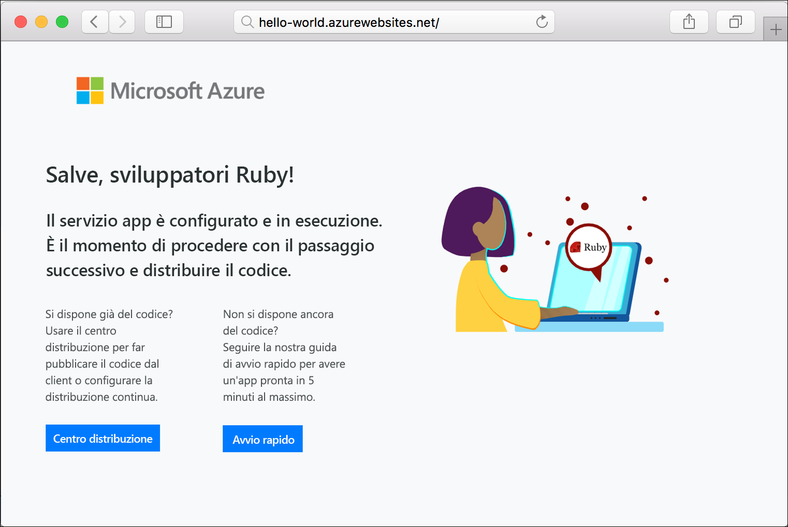

# <a name="create-a-ruby-on-rails-app-in-app-service-on-linux"></a>Creare un'app Ruby on Rails con il Servizio app di Azure in Linux

Il [servizio app di Azure in Linux](app-service-linux-intro.md) fornisce un servizio di hosting Web ad alta scalabilità e con funzioni di auto-correzione. In questa guida introduttiva viene illustrato come creare un'applicazione [Ruby on Rails](https://rubyonrails.org/) di base che può quindi essere distribuita come App Web in Linux.

> [!NOTE]
> In questo momento lo stack di sviluppo di Ruby supporta solo Ruby on Rails. Se si desidera utilizzare una piattaforma diversa, ad esempio Sinatra, vedere la guida introduttiva [App Web per contenitori](https://docs.microsoft.com/azure/app-service/containers/).


[!INCLUDE [quickstarts-free-trial-note](../../../includes/quickstarts-free-trial-note.md)]

## <a name="prerequisites"></a>Prerequisiti

* <a href="https://www.ruby-lang.org/en/documentation/installation/#rubyinstaller" target="_blank">Installare Ruby 2.3 o versione successiva</a>
* <a href="https://git-scm.com/" target="_blank">Installare Git</a>

## <a name="download-the-sample"></a>Scaricare l'esempio

In una finestra del terminale eseguire il comando seguente per clonare il repository dell'app di esempio nel computer locale:

```bash
git clone https://github.com/Azure-Samples/ruby-docs-hello-world
```

## <a name="run-the-application-locally"></a>Eseguire l'applicazione in locale

Eseguire l'applicazione in locale, in modo da verificare l'aspetto che assumerà dopo la distribuzione in Azure. Aprire una finestra del terminale, passare alla directory `hello-world` e usare il comando `rails server` per avviare il server.

Il primo passaggio consiste nell'installare le gemme necessarie. È presente un `Gemfile` incluso nell'esempio in modo che non sia necessario specificare le gemme da installare. A questo fine useremo un bundler:

```
bundle install
```

Una volta installate le gemme, useremo il bundler per avviare l'app:

```bash
bundle exec rails server
```

Tramite il Web browser, passare a `http://localhost:3000` per testare l'app in locale.


[!INCLUDE [Try Cloud Shell](../../../includes/cloud-shell-try-it.md)]

[!INCLUDE [Configure deployment user](../../../includes/configure-deployment-user.md)]

[!INCLUDE [Create resource group](../../../includes/app-service-web-create-resource-group-linux.md)]

[!INCLUDE [Create app service plan](../../../includes/app-service-web-create-app-service-plan-linux.md)]

## <a name="create-a-web-app"></a>Creare un'app Web

[!INCLUDE [Create web app](../../../includes/app-service-web-create-web-app-ruby-linux-no-h.md)] 

Passare al sito per visualizzare l'app Web con immagine incorporata appena creata. Sostituire _&lt;app name>_ con il nome dell'app Web.

```bash
http://<app_name>.azurewebsites.net
```

Ecco l'aspetto che avrà la nuova app Web:



## <a name="deploy-your-application"></a>Distribuire l'applicazione

Eseguire i comandi seguenti per distribuire l'applicazione locale al sito Web di Azure:

```bash
git remote add azure <Git deployment URL from above>
git add -A
git commit -m "Initial deployment commit"
git push azure master
```

Verificare che per le operazioni di distribuzione in remoto venga segnalato l'esito positivo. I comandi generano un output simile al testo seguente:

```bash
remote: Using sass-rails 5.0.6
remote: Updating files in vendor/cache
remote: Bundle gems are installed into ./vendor/bundle
remote: Updating files in vendor/cache
remote: ~site/repository
remote: Finished successfully.
remote: Running post deployment command(s)...
remote: Deployment successful.
To https://<your web app name>.scm.azurewebsites.net/<your web app name>.git
  579ccb....2ca5f31  master -> master
myuser@ubuntu1234:~workspace/<app name>$
```

Dopo aver completato la distribuzione, riavviare l'app Web affinché la distribuzione venga applicata tramite il comando [`az webapp restart`](/cli/azure/webapp?view=azure-cli-latest#az-webapp-restart), come mostrato di seguito:

```azurecli-interactive
az webapp restart --name <app name> --resource-group myResourceGroup
```

Passare al sito e verificare i risultati.

```bash
http://<app name>.azurewebsites.net
```


> [!NOTE]
> Mentre l'app viene riavviata, il tentativo di aprire il sito genera un codice di stato HTTP `Error 503 Server unavailable`. Il completamento del riavvio potrebbe richiedere alcuni minuti.
>

[!INCLUDE [Clean-up section](../../../includes/cli-script-clean-up.md)]

## <a name="next-steps"></a>Passaggi successivi

> [!div class="nextstepaction"]
> [Ruby on Rails con MySQL](tutorial-ruby-postgres-app.md)
