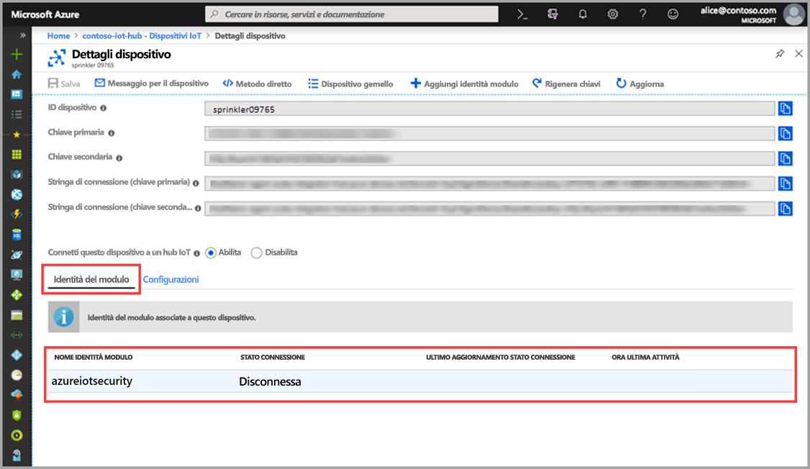

# Guida introduttiva: Creare un modulo gemello azureiotsecurity

> [!IMPORTANT]
> Centro sicurezza di Azure per IoT è attualmente in versione di anteprima pubblica. Questa versione di anteprima viene messa a disposizione senza contratto di servizio e non è consigliata per i carichi di lavoro di produzione. Alcune funzionalità potrebbero non essere supportate o potrebbero presentare funzionalità limitate. Per altre informazioni, vedere [Condizioni supplementari per l'utilizzo delle anteprime di Microsoft Azure](https://azure.microsoft.com/support/legal/preview-supplemental-terms/).

Questo argomento di avvio rapido spiega come creare singoli moduli gemelli _azureiotsecurity_ per i nuovi dispositivi o effettuare la creazione batch di moduli gemelli per tutti i dispositivi in un hub IoT.  

## Informazioni sui moduli gemelli azureiotsecurity 

Per le soluzioni IoT integrate in Azure, i dispositivi gemelli svolgono un ruolo fondamentale sia nella gestione dei dispositivi che nell'automazione dei processi. 

Il Centro sicurezza di Azure per IoT offre l'integrazione completa con la piattaforma di gestione dispositivi IoT esistente, consentendo di gestire lo stato di sicurezza dei dispositivi, nonché di usufruire delle funzionalità di controllo dispositivi esistenti.
L'integrazione del Centro sicurezza di Azure per IoT si ottiene usando il meccanismo del dispositivo gemello dell'hub IoT.  

Per informazioni sul concetto generale dei moduli gemelli nell'hub IoT di Azure, vedere [Moduli gemelli nell'hub IoT](https://docs.microsoft.com/azure/iot-hub/iot-hub-devguide-module-twins). 
 
Il Centro sicurezza di Azure per IoT usa il meccanismo dei moduli gemelli, mantenendo un modulo gemello di sicurezza denominato _azureiotsecurity_ per ogni dispositivo.
Il modulo gemello di sicurezza contiene tutte le informazioni pertinenti alla sicurezza del dispositivo per ognuno dei dispositivi. 
 
Per avvalersi di tutte le funzionalità del Centro sicurezza di Azure per IoT, è necessario creare, configurare e usare questi moduli gemelli di sicurezza per ogni dispositivo nel servizio.  

## Creare un modulo gemello azureiotsecurity 

I moduli gemelli _azureiotsecurity_ possono essere creati in due modi:
1. [Script batch del modulo](https://aka.ms/iot-security-github-create-module): crea automaticamente il modulo gemello per i nuovi dispositivi o per quelli che ne sono privi usando la configurazione predefinita.
2. Modifica manuale di ogni singolo modulo gemello con configurazioni specifiche per ogni dispositivo.

>[!NOTE] 
> L'uso del metodo batch non sovrascrive i moduli gemelli azureiotsecurity esistenti, ma crea SOLO nuovi moduli gemelli per i dispositivi che ne sono privi. 

Per informazioni su come modificare o cambiare la configurazione di un modulo gemello esistente, vedere l'articolo sulla [configurazione degli agenti](how-to-agent-configuration.md). 

Per creare manualmente un nuovo modulo gemello _azureiotsecurity_ per un dispositivo, seguire queste istruzioni: 

1. Nell'hub IoT, trovare e selezionare il dispositivo per cui si vuole creare un modulo gemello di sicurezza.
1. Fare clic sul dispositivo e quindi su **Aggiungi identità modulo**.
1. Nel campo **Nome identità del modulo** immettere **azureiotsecurity**.

1. Fare clic su **Save**. 

## Verificare la creazione di un modulo gemello

Per verificare se è presente un modulo gemello di sicurezza per un dispositivo specifico:

1. Nell'hub IoT di Azure, selezionare **Dispositivi IoT** dal menu **Strumenti di esplorazione**.    
1. Immettere l'ID del dispositivo o selezionare un'opzione nel **campo Esegui query sui dispositivi** e fare clic su **Esegui query sui dispositivi**. 
    
1. Selezionare il dispositivo oppure fare doppio clic per aprire la pagina Dettagli dispositivo. 
1. Selezionare il menu **Identità del modulo** e verificare l'esistenza del modulo **azureiotsecurity** nell'elenco delle identità dei moduli associate al dispositivo. 
    

Per altre informazioni sulla personalizzazione delle proprietà dei moduli gemelli del Centro sicurezza di Azure per IoT, vedere [Configurazione dell'agente](how-to-agent-configuration.md).

## Passaggi successivi

Per informazioni su come configurare gli avvisi personalizzati, passare all'articolo successivo...

> [!div class="nextstepaction"]
> [Configurare avvisi personalizzati](quickstart-create-custom-alerts.md)
