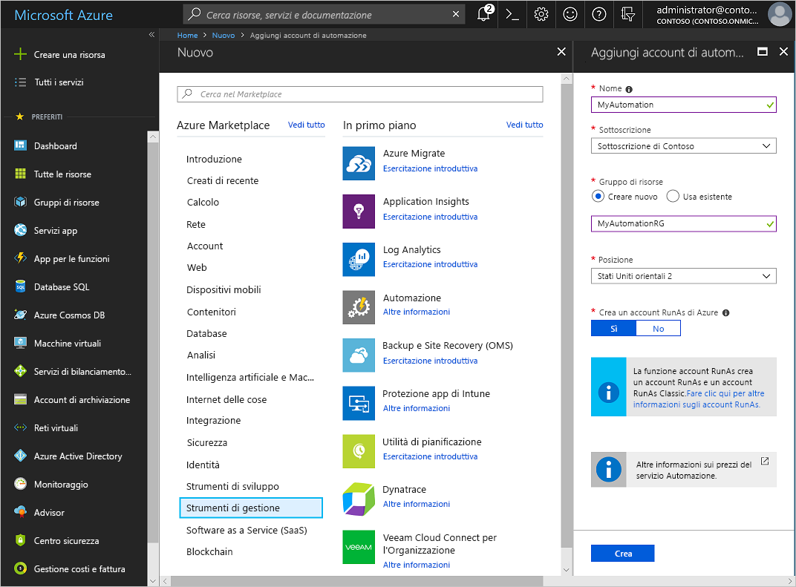
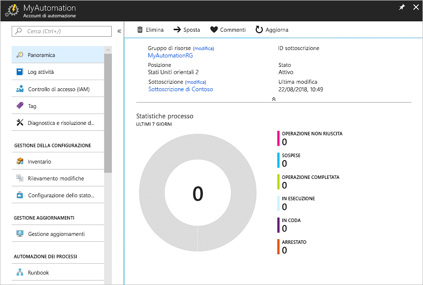
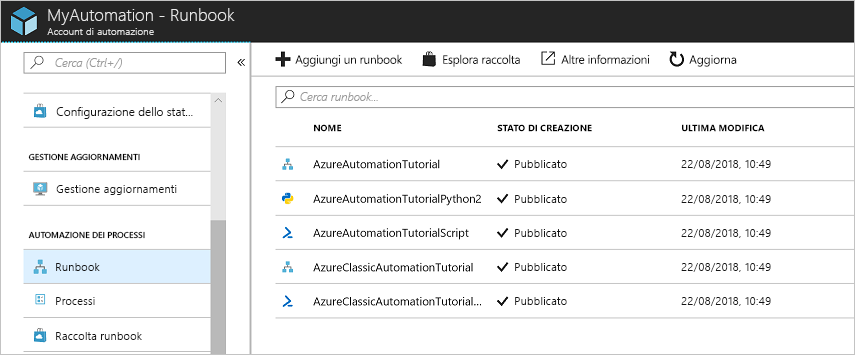
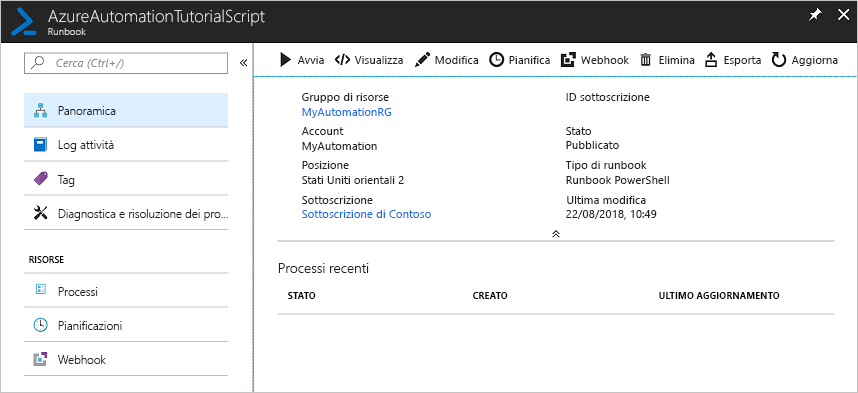
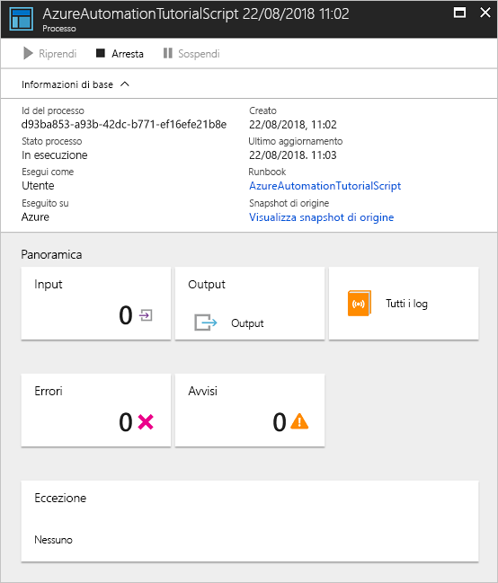

# Creare un account di Automazione di Azure

È possibile creare account di Automazione di Azure tramite Azure. Questo metodo fornisce un'interfaccia utente basata sul browser per la creazione e la configurazione degli account di Automazione e delle risorse correlate. Questa guida introduttiva illustra la creazione di un account di Automazione e l'esecuzione di un runbook nell'account.

Se non si ha una sottoscrizione di Azure, creare un [account Azure gratuito](https://azure.microsoft.com/free/?WT.mc_id=A261C142F) prima di iniziare.

## Accedere ad Azure

Accedere ad Azure all'indirizzo https://portal.azure.com

## Creare l'account di Automazione

1. Fare clic sul pulsante **Crea una risorsa** nell'angolo superiore sinistro di Azure.

1. Selezionare **Strumenti di gestione** e quindi selezionare **Automazione**.

1. Immettere le informazioni account. Per **Crea un account RunAs di Azure** scegliere **Sì** per abilitare automaticamente gli elementi che consentono di semplificare l'autenticazione in Azure. Quando si crea un account di automazione, è importante notare che non è possibile modificarne il nome dopo che viene scelto. *I nomi degli account di Automazione devono essere univoci in ogni area e gruppo di risorse. I nomi per gli account di Automazione che sono stati eliminati potrebbero non essere subito disponibili.* Un account di Automazione può gestire le risorse in tutte le aree e le sottoscrizioni di uno specifico tenant. Al termine fare clic su **Crea**, per avviare la distribuzione dell'account di Automazione.

      

    > [!NOTE]
    > Per un elenco aggiornato delle località in cui è possibile distribuire un account di automazione, vedere [Prodotti disponibili in base all'area](https://azure.microsoft.com/en-us/global-infrastructure/services/?products=automation&regions=all).

1. Al termine della distribuzione fare clic su **Tutti i servizi**, selezionare **Account di automazione** e quindi scegliere l'account di automazione creato.

    

## Eseguire un runbook

Eseguire uno dei runbook di esercitazione.

1. Fare clic su **Runbook** in **AUTOMAZIONE PROCESSI**. Viene visualizzato l'elenco di runbook. Per impostazione predefinita, sono abilitati più runbook di esercitazione nell'account.

    

1. Selezionare il runbook **AzureAutomationTutorialScript**. Questa azione apre la pagina di panoramica del runbook.

    

1. Fare clic su **Avvia** e nella pagina **Avvia runbook** fare clic su **OK** per avviare il runbook.

    

1. Quando **Stato processo** viene impostato su **In esecuzione**, fare clic su **Output** o su **Tutti i log** per visualizzare l'output del processo del runbook. Per questo runbook di esercitazione, l'output è un elenco delle risorse di Azure.

## Passaggi successivi

In questa guida introduttiva è stato distribuito un account di Automazione, è stato avviato il processo di un runbook e sono stati visualizzati i risultati del processo. Per altre informazioni su Automazione di Azure, passare alla guida introduttiva sulla creazione del primo runbook.

> [!div class="nextstepaction"]
> [Guida introduttiva di Automazione - Creare un runbook](./automation-quickstart-create-runbook.md)

