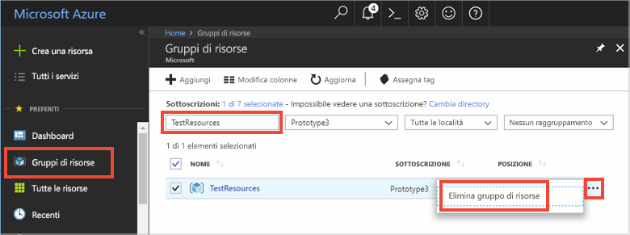

# <a name="quickstart-use-azure-cache-for-redis-with-python"></a>Guida introduttiva: Usare Cache Redis di Azure con Python


## <a name="introduction"></a>Introduzione

Questa guida introduttiva illustra come connettersi a un'istanza di Cache Redis di Azure con Python per leggere e scrivere in una cache. 


[!INCLUDE [quickstarts-free-trial-note](../../includes/quickstarts-free-trial-note.md)]

## <a name="prerequisites"></a>Prerequisiti

* [Ambiente Python 2 o Python 3](https://www.python.org/downloads/) installato con [pip](https://pypi.org/project/pip/). 

## <a name="create-an-azure-cache-for-redis-on-azure"></a>Creare una cache di Azure per Redis in Azure
[!INCLUDE [redis-cache-create](../../includes/redis-cache-create.md)]

[!INCLUDE [redis-cache-create](../../includes/redis-cache-access-keys.md)]

## <a name="install-redis-py"></a>Installare redis-py

[Redis py](https://github.com/andymccurdy/redis-py) è un'interfaccia di Python per Cache Redis di Azure. Usare lo strumento per i pacchetti Python *pip* per installare il pacchetto redis-py. 

L'esempio seguente usa *pip3* per Python3 per installare il pacchetto redis-py in Windows 10 usando un prompt dei comandi per gli sviluppatori per Visual Studio 2017 con privilegi di amministratore elevati.

    pip3 install redis


## <a name="read-and-write-to-the-cache"></a>Leggere e scrivere nella cache

Eseguire Python e testare l'uso della cache dalla riga di comando. Sostituire `<Your Host Name>` e `<Your Access Key>` con i valori per l'istanza di Cache Redis di Azure. 

```python
>>> import redis
>>> r = redis.StrictRedis(host='<Your Host Name>.redis.cache.windows.net',
        port=6380, db=0, password='<Your Access Key>', ssl=True)
>>> r.set('foo', 'bar')
True
>>> r.get('foo')
b'bar'
```

## <a name="create-a-python-script"></a>Creare uno script Python

Creare un nuovo file di testo di script denominato *PythonApplication1.py*.

Aggiungere lo script seguente in *PythonApplication1.py* e salvare il file. Questo script eseguirà il test di accesso alla cache. Sostituire `<Your Host Name>` e `<Your Access Key>` con i valori per l'istanza di Cache Redis di Azure. 

```python
import redis

myHostname = "<Your Host Name>.redis.cache.windows.net"
myPassword = "<Your Access Key>"

r = redis.StrictRedis(host=myHostname, port=6380,password=myPassword,ssl=True)

result = r.ping()
print("Ping returned : " + str(result))

result = r.set("Message", "Hello!, The cache is working with Python!")
print("SET Message returned : " + str(result))

result = r.get("Message")
print("GET Message returned : " + result.decode("utf-8"))

result = r.client_list()
print("CLIENT LIST returned : ") 
for c in result:
    print("id : " + c['id'] + ", addr : " + c['addr'])
```

Eseguire lo script con Python.


## <a name="clean-up-resources"></a>Pulire le risorse

Se si prevede di proseguire con un'altra esercitazione, è possibile conservare le risorse create in questa guida introduttiva e riutilizzarle.

In caso contrario, se si è terminato il lavoro con l'applicazione di esempio di avvio rapido, è possibile eliminare le risorse di Azure create in questo avvio rapido per evitare i costi correlati. 

> [!IMPORTANT]
> L'eliminazione di un gruppo di risorse è irreversibile e comporta l'eliminazione definitiva del gruppo di risorse e di tutte le risorse incluse nel gruppo. Assicurarsi di non eliminare accidentalmente il gruppo di risorse sbagliato o le risorse errate. Se le risorse per questo esempio sono state create all'interno di un gruppo di risorse esistente che contiene anche elementi da mantenere, è possibile eliminare ogni elemento singolarmente dai rispettivi pannelli anziché eliminare il gruppo di risorse.
>

Accedere al [portale di Azure](https://portal.azure.com) e fare clic su **Gruppi di risorse**.

Nella casella di testo **Filtra per nome...** immettere il nome del gruppo di risorse. Le istruzioni di questo articolo usano un gruppo di risorse denominato *TestResources*. Nel gruppo di risorse nell'elenco dei risultati fare clic su **...** quindi su **Elimina gruppo di risorse**.



Verrà chiesto di confermare l'eliminazione del gruppo di risorse. Immettere il nome del gruppo di risorse per confermare e fare clic su **Elimina**.

Dopo qualche istante il gruppo di risorse e tutte le risorse che contiene vengono eliminati.


## <a name="next-steps"></a>Passaggi successivi

> [!div class="nextstepaction"]
> [Creare una semplice app Web ASP.NET che usa Cache Redis di Azure.](./cache-web-app-howto.md)


<!--Image references-->
[1]: ./media/cache-python-get-started/redis-cache-new-cache-menu.png
[2]: ./media/cache-python-get-started/redis-cache-cache-create.png
