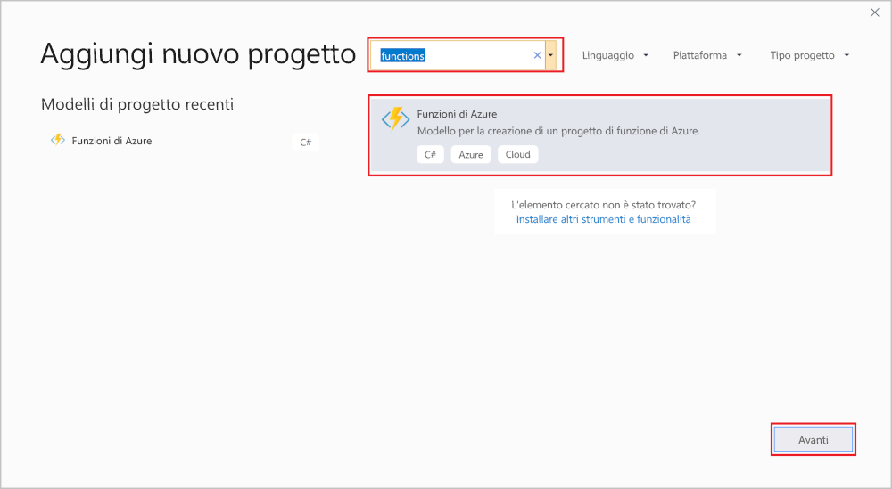
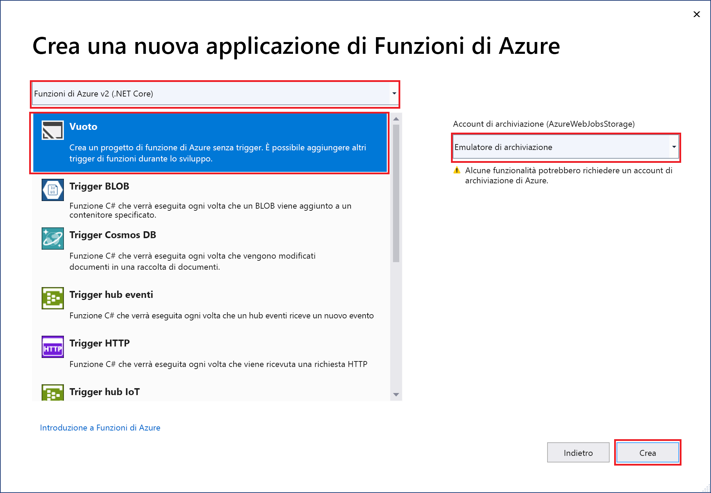
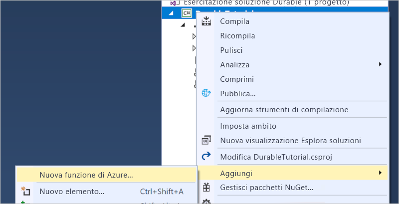
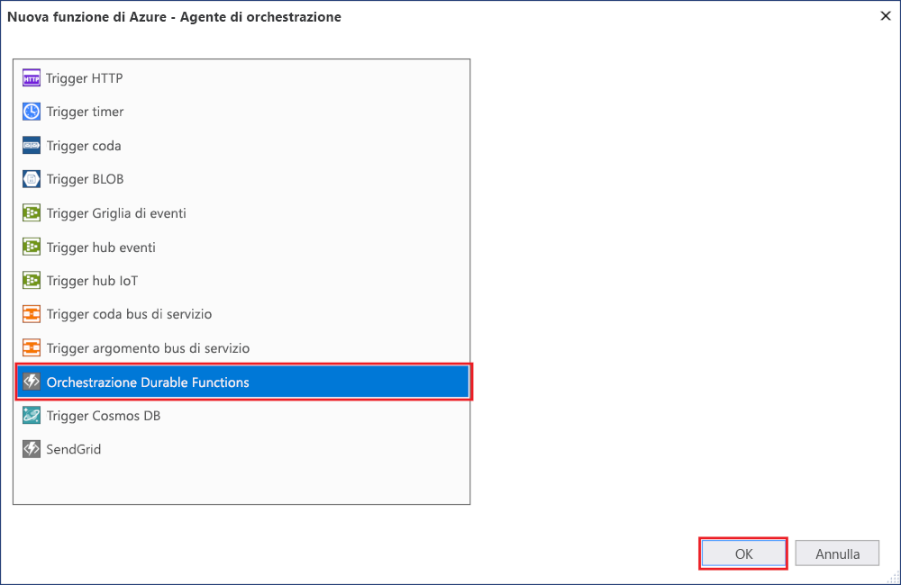

# <a name="create-your-first-durable-function-in-c"></a>Creare la prima funzione durevole in C\#

*Durable Functions* è un'estensione di [Funzioni di Azure](../functions-overview.md) che consente di scrivere funzioni con stato in un ambiente senza server. L'estensione gestisce automaticamente lo stato, i checkpoint e i riavvii.

Questo articolo spiega come usare gli strumenti di Visual Studio 2017 per Funzioni di Azure per creare e testare una funzione durevole "hello world" in locale.  Questa funzione orchestra e concatena le chiamate ad altre funzioni. Il codice della funzione verrà quindi pubblicato in Azure. Questi strumenti sono disponibili come parte del carico di lavoro di sviluppo di Azure in Visual Studio 2017.


## <a name="prerequisites"></a>Prerequisiti

Per completare questa esercitazione:

* Installare [Visual Studio 2017](https://azure.microsoft.com/downloads/). Assicurarsi che sia installato anche il carico di lavoro **Sviluppo di Azure**.

* Assicurarsi di avere gli [strumenti di Funzioni di Azure più recenti](../functions-develop-vs.md#check-your-tools-version).

* Verificare che [Emulatore di archiviazione di Azure](../../storage/common/storage-use-emulator.md) sia installato e in esecuzione.

[!INCLUDE [quickstarts-free-trial-note](../../../includes/quickstarts-free-trial-note.md)]

## <a name="create-a-function-app-project"></a>Creare un progetto di app per le funzioni

Il modello di Funzioni di Azure crea un progetto che può essere pubblicato in un'app per le funzioni in Azure. Un'app per le funzioni consente di raggruppare le funzioni come un'unità logica per la gestione, la distribuzione e la condivisione delle risorse.

1. In Visual Studio selezionare **Nuovo** > **Progetto** dal menu **File**.

2. Nella finestra di dialogo **Nuovo progetto** selezionare **Installato**, espandere **Visual C#** > **Cloud**, selezionare **Funzioni di Azure**, digitare un **nome** per il progetto e fare clic su **OK**. Il nome dell'app per le funzioni deve essere valido come spazio dei nomi C#, quindi non usare caratteri di sottolineatura, trattini o altri caratteri non alfanumerici.

    

3. Usare le impostazioni specificate nella tabella disponibile sotto l'immagine.

    

    | Impostazione      | Valore consigliato  | DESCRIZIONE                      |
    | ------------ |  ------- |----------------------------------------- |
    | **Versione** | Funzioni di Azure 2.x <br />(.NET Core) | Crea un progetto per le funzioni in cui viene usata la versione 2.x del runtime di Funzioni di Azure che supporta .NET Core. Funzioni di Azure 1.x supporta .NET Framework. Per altre informazioni, vedere [Come specificare le versioni del runtime per Funzioni di Azure](../functions-versions.md).   |
    | **Modello** | Empty | Crea un'app per le funzioni vuota. |
    | **Account di archiviazione**  | Emulatore di archiviazione | Per gestire lo stato della funzione durevole è necessario un account di archiviazione. |

4. Fare clic su **OK** per creare un progetto di app per le funzioni vuota. Questo progetto contiene i file di configurazione di base necessari per eseguire le funzioni.

## <a name="add-functions-to-the-app"></a>Aggiungere funzioni all'app

La procedura seguente usa un modello per creare il codice di funzione durevole nel progetto.

1. Fare clic con il pulsante destro del mouse sul progetto in Visual Studio e scegliere **Aggiungi** > **Nuova funzione di Azure**.

    

2. Verificare che **Funzione di Azure** sia selezionata dal menu Aggiungi e assegnare un nome al file C#.  Fare clic su **Aggiungi**.

3. Selezionare il modello **Durable Functions Orchestration** (Orchestrazione di Durable Functions) e fare clic su **OK**.

      

All'app verrà aggiunta una nuova funzione durevole.  Aprire il nuovo file con estensione cs per visualizzarne il contenuto. Questa funzione durevole è un esempio di concatenamento di funzioni semplici con i metodi seguenti:  

| Metodo | FunctionName | DESCRIZIONE |
| -----  | ------------ | ----------- |
| **`RunOrchestrator`** | `<file-name>` | Gestisce l'orchestrazione permanente. In questo caso, l'orchestrazione viene avviata, crea un elenco e aggiunge il risultato di tre chiamate di funzione all'elenco.  Quando le tre chiamate sono completate, la funzione restituisce l'elenco. |
| **`SayHello`** | `<file-name>_Hello` | La funzione restituisce un hello. Questa è la funzione che contiene la logica di business che viene orchestrata. |
| **`HttpStart`** | `<file-name>_HttpStart` | Un' [funzione attivata da HTTP](../functions-bindings-http-webhook.md) che avvia un'istanza dell'orchestrazione e restituisce una risposta di controllo stato. |

Dopo aver creato il progetto per le funzioni e una funzione durevole, è possibile testare la funzione nel computer locale.

## <a name="test-the-function-locally"></a>Testare la funzione in locale

Azure Functions Core Tools consente di eseguire un progetto Funzioni di Azure nel computer di sviluppo locale. Verrà richiesto di installare questi strumenti al primo avvio di una funzione da Visual Studio.

1. Per testare la funzione premere F5. Se viene visualizzata, accettare la richiesta di Visual Studio di scaricare e installare gli strumenti dell'interfaccia della riga di comando Azure Functions Core Tools. Potrebbe essere necessario anche abilitare un'eccezione del firewall per consentire agli strumenti di gestire le richieste HTTP.

2. Copiare l'URL della funzione dall'output di runtime di Funzioni di Azure.

    

3. Incollare l'URL per la richiesta HTTP nella barra degli indirizzi del browser ed eseguire la richiesta. Di seguito è illustrata la risposta nel browser alla richiesta GET locale restituita dalla funzione:

    

    La risposta è il risultato iniziale restituito dalla funzione HTTP per comunicare che l'orchestrazione durevole è stata avviata correttamente.  Non è ancora il risultato finale dell'orchestrazione.  La risposta include alcuni URL utili.  Per il momento si eseguirà una query relativa allo stato dell'orchestrazione.

4. Copiare il valore dell'URL per `statusQueryGetUri`, incollarlo nella barra degli indirizzi del browser ed eseguire la richiesta.

    La richiesta eseguirà una query per determinare lo stato dell'istanza di orchestrazione. Si otterrà una risposta finale con un aspetto simile all'esempio seguente.  Questa risposta mostra che l'istanza è stata completata e include l'output o i risultati della funzione durevole.

    ```json
    {
        "instanceId": "d495cb0ac10d4e13b22729c37e335190",
        "runtimeStatus": "Completed",
        "input": null,
        "customStatus": null,
        "output": [
            "Hello Tokyo!",
            "Hello Seattle!",
            "Hello London!"
        ],
        "createdTime": "2018-11-08T07:07:40Z",
        "lastUpdatedTime": "2018-11-08T07:07:52Z"
    }
    ```

5. Per interrompere il debug, premere **MAIUSC+F5**.

Dopo aver verificato la corretta esecuzione della funzione nel computer locale, è possibile pubblicare il progetto in Azure.

## <a name="publish-the-project-to-azure"></a>Pubblicare il progetto in Azure

Per poter pubblicare il progetto, è necessario che la sottoscrizione di Azure includa un'app per le funzioni. È possibile creare un'app per le funzioni direttamente da Visual Studio.

[!INCLUDE [Publish the project to Azure](../../../includes/functions-vstools-publish.md)]

## <a name="test-your-function-in-azure"></a>Testare la funzione in Azure

1. Copiare l'URL di base dell'app per le funzioni dalla pagina del profilo di pubblicazione. Sostituire la parte `localhost:port` dell'URL usato durante il test della funzione in locale con il nuovo URL di base.

    L'URL che chiama il trigger HTTP della funzione durevole dovrebbe avere il formato seguente:

        http://<APP_NAME>.azurewebsites.net/api/<FUNCTION_NAME>_HttpStart

2. Incollare questo nuovo URL per la richiesta HTTP nella barra degli indirizzi del browser. Quando si usa l'app pubblicata si dovrebbe ottenere la stessa risposta di stato restituita in precedenza.

## <a name="next-steps"></a>Passaggi successivi

Si è usato Visual Studio per creare e pubblicare un'app per le funzioni durevoli in C#.

> [!div class="nextstepaction"]
> [Informazioni sui criteri comuni delle funzioni durevoli](durable-functions-concepts.md)
