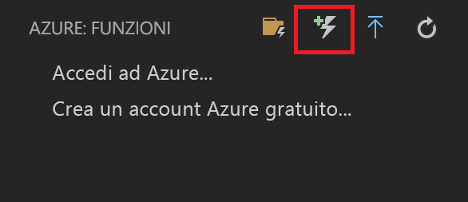
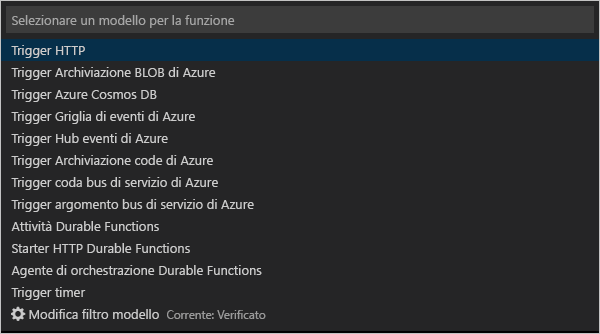

# <a name="create-your-first-durable-function-in-javascript"></a>Creare la prima funzione durevole in JavaScript

*Durable Functions* è un'estensione di [Funzioni di Azure](../functions-overview.md) che consente di scrivere funzioni con stato in un ambiente senza server. L'estensione gestisce automaticamente lo stato, i checkpoint e i riavvii.

Questo articolo spiega come l'estensione di Funzioni di Azure in Visual Studio Code per creare e testare una funzione durevole "hello world" in locale.  Questa funzione orchestrerà e concatenerà le chiamate ad altre funzioni. Il codice della funzione verrà quindi pubblicato in Azure.


## <a name="prerequisites"></a>Prerequisiti

Per completare questa esercitazione:

* Installare [Visual Studio Code](https://code.visualstudio.com/download).

* Assicurarsi di avere gli [strumenti di Funzioni di Azure più recenti](../functions-develop-vs.md#check-your-tools-version).

* In un computer Windows verificare che [Emulatore di archiviazione di Azure](../../storage/common/storage-use-emulator.md) sia installato e in esecuzione. In un computer Mac o Linux è necessario usare un account di archiviazione Azure effettivo.

* Verificare che sia installata la versione 8.0 o successiva di [Node.js](https://nodejs.org/).

[!INCLUDE [quickstarts-free-trial-note](../../../includes/quickstarts-free-trial-note.md)]

[!INCLUDE [functions-install-vs-code-extension](../../../includes/functions-install-vs-code-extension.md)]

[!INCLUDE [functions-create-function-app-vs-code](../../../includes/functions-create-function-app-vs-code.md)]

## <a name="install-the-durable-functions-npm-package"></a>Installare il pacchetto npm di Durable Functions

1. Installare il `durable-functions`pacchetto npm eseguendo`npm install durable-functions` nella directory radice dell'app per le funzioni.

## <a name="create-a-starter-function"></a>Creare una funzione di avvio

Prima di tutto, creare una funzione attivata da HTTP che avvia l'orchestrazione di una funzione durevole.

1. Da **Azure: Funzioni** scegliere l'icona Crea funzione.

    

2. Selezionare la cartella contenente il progetto di app per le funzioni e quindi selezionare il modello di funzione **Trigger HTTP**.

    

3. Digitare `HttpStart` come nome della funzione, premere INVIO e quindi selezionare **Anonima** come tipo di autenticazione.

    

    Viene creata una funzione nel linguaggio prescelto usando il modello per una funzione attivata tramite HTTP.

4. Sostituire index.js con il codice JavaScript seguente:

    [!code-javascript[Main](~/samples-durable-functions/samples/javascript/HttpStart/index.js)]

5. Sostituire function.json con il codice JSON seguente:

    [!code-json[Main](~/samples-durable-functions/samples/javascript/HttpStart/function.json)]

A questo punto è stato creato un punto di ingresso nella funzione durevole. Verrà ora aggiunto un agente di orchestrazione.

## <a name="create-an-orchestrator-function"></a>Creare una funzione di agente di orchestrazione

Successivamente, si crea un'altra funzione che fungerà da agente di orchestrazione. Per motivi di praticità, viene usato il modello di funzione di trigger HTTP. Il codice della funzione viene sostituito dal codice dell'agente di orchestrazione.

1. Ripetere i passaggi della sezione precedente per creare una seconda funzione usando il modello di trigger HTTP. Questa volta assegnare alla funzione il nome `OrchestratorFunction`.

2. Aprire il file index.js per la nuova funzione e sostituire il contenuto con il codice seguente:

    [!code-json[Main](~/samples-durable-functions/samples/javascript/E1_HelloSequence/index.js)]

3. Aprire il file function.json e sostituirlo con il codice JSON seguente:

    [!code-json[Main](~/samples-durable-functions/samples/javascript/E1_HelloSequence/function.json)]

È stato aggiunto un agente di orchestrazione per coordinare le funzioni dell'attività. Verrà ora aggiunta la funzione dell'attività di riferimento.

## <a name="create-an-activity-function"></a>Creare una funzione di attività

1. Ripetere i passaggi delle sezioni precedenti per creare una terza funzione usando il modello di trigger HTTP, ma questa volta assegnare alla funzione il nome `E1_SayHello`.

2. Aprire il file index.js per la nuova funzione e sostituire il contenuto con il codice seguente:

    [!code-javascript[Main](~/samples-durable-functions/samples/javascript/E1_SayHello/index.js)]

3. Sostituire function.json con il codice JSON seguente:

    [!code-json[Main](~/samples-durable-functions/samples/csx/E1_SayHello/function.json)]

A questo punto, sono stati aggiunti tutti i componenti necessari per avviare un'orchestrazione e concatenare le funzioni dell'attività.

## <a name="test-the-function-locally"></a>Testare la funzione in locale

Azure Functions Core Tools consente di eseguire un progetto Funzioni di Azure nel computer di sviluppo locale. Viene richiesto di installare questi strumenti al primo avvio di una funzione da Visual Studio Code.  

1. In un computer Windows avviare l'emulatore di archiviazione di Azure e verificare che la proprietà **AzureWebJobsStorage** di local.settings.json sia impostata su `UseDevelopmentStorage=true`. 

    Per l'emulatore di archiviazione 5.8 verificare che la proprietà **AzureWebJobsStorage** di local.settings.json sia impostata su `files`. In un computer Mac o Linux è necessario impostare la proprietà **AzureWebJobsStorage** sulla stringa di connessione di un account di archiviazione di Azure esistente. Sarà possibile creare un account di archiviazione più avanti in questo articolo.

2. Per testare la funzione, impostare un punto di interruzione nel codice della funzione e premere F5 per avviare il progetto di app per le funzioni. L'output dagli strumenti di base viene visualizzato nel pannello **Terminale**. Se è la prima volta che si usa Durable Functions, l'estensione Durable Functions viene installata e la compilazione potrebbe richiedere alcuni secondi.

    > [!NOTE]
    > Durable Functions di JavaScript richiedono una versione **1.7.0** o superiore delle estensioni **Microsoft.Azure.WebJobs.Extensions.DurableTask**. Eseguire il comando seguente dalla cartella radice dell'app Funzioni di Azure per installare l'estensione Durable Functions `func extensions install -p Microsoft.Azure.WebJobs.Extensions.DurableTask -v 1.7.0`

3. Nel pannello **Terminale** copiare l'endpoint dell'URL della funzione attivata da HTTP.

    

4. Sostituire `{functionName}` con `OrchestratorFunction`.

5. Con uno strumento come [Postman](https://www.getpostman.com/) o [cURL](https://curl.haxx.se/), inviare una richiesta HTTP POST all'endpoint URL.

   La risposta è il risultato iniziale restituito dalla funzione HTTP per comunicare che l'orchestrazione durevole è stata avviata correttamente. Non è ancora il risultato finale dell'orchestrazione. La risposta include alcuni URL utili. Per il momento si eseguirà una query relativa allo stato dell'orchestrazione.

6. Copiare il valore dell'URL per `statusQueryGetUri`, incollarlo nella barra degli indirizzi del browser ed eseguire la richiesta. In alternativa è possibile continuare a usare Postman per inviare la richiesta GET.

   La richiesta eseguirà una query per determinare lo stato dell'istanza di orchestrazione. Si otterrà eventualmente una risposta che mostra che l'istanza è stata completata e include l'output o i risultati della funzione durevole. L'aspetto sarà simile al seguente: 

    ```json
    {
        "instanceId": "d495cb0ac10d4e13b22729c37e335190",
        "runtimeStatus": "Completed",
        "input": null,
        "customStatus": null,
        "output": [
            "Hello Tokyo!",
            "Hello Seattle!",
            "Hello London!"
        ],
        "createdTime": "2018-11-08T07:07:40Z",
        "lastUpdatedTime": "2018-11-08T07:07:52Z"
    }
    ```

7. Per interrompere il debug, premere **MAIUSC+F5** in VS Code.

Dopo aver verificato la corretta esecuzione della funzione nel computer locale, è possibile pubblicare il progetto in Azure.

[!INCLUDE [functions-create-function-app-vs-code](../../../includes/functions-sign-in-vs-code.md)]

[!INCLUDE [functions-publish-project-vscode](../../../includes/functions-publish-project-vscode.md)]

## <a name="test-your-function-in-azure"></a>Testare la funzione in Azure

1. Copiare l'URL del trigger HTTP dal pannello **Output**. Il formato dell'URL che chiama la funzione attivata tramite HTTP sarà simile al seguente:

        http://<functionappname>.azurewebsites.net/orchestrators/<functionname>

2. Incollare questo nuovo URL per la richiesta HTTP nella barra degli indirizzi del browser. Quando si usa l'app pubblicata si dovrebbe ottenere la stessa risposta di stato restituita in precedenza.

## <a name="next-steps"></a>Passaggi successivi

Si è usato Visual Studio Code per creare e pubblicare un'app per le funzioni durevoli in JavaScript.

> [!div class="nextstepaction"]
> [Informazioni sui criteri di funzione permanente comuni](durable-functions-concepts.md)
