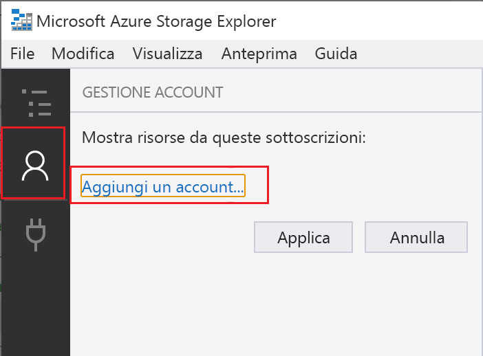
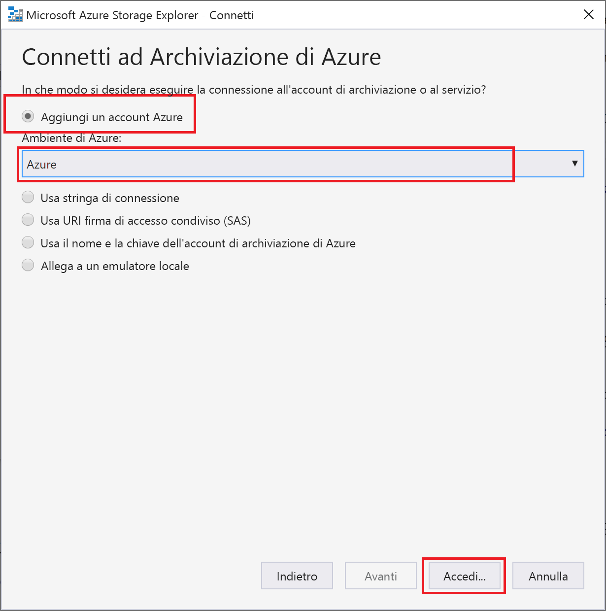
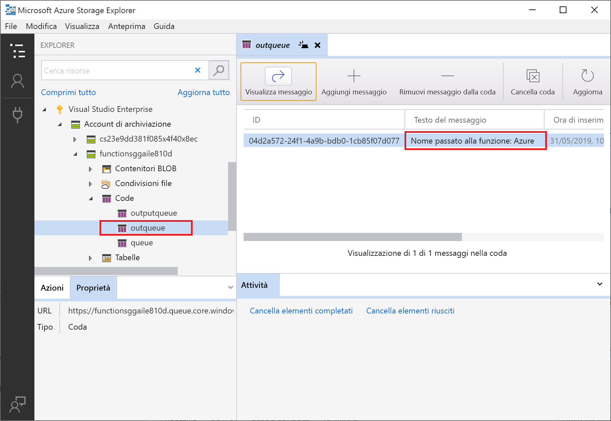
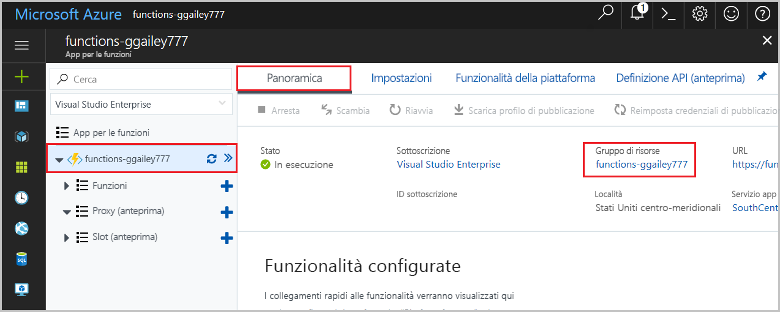

# <a name="connect-functions-to-azure-storage-using-visual-studio-code"></a>Connettere funzioni ad Archiviazione di Azure con Visual Studio Code

La soluzione Funzioni di Azure consente di connettere le funzioni ai servizi di Azure e ad altre risorse senza la necessità di scrivere codice di integrazione personalizzato. Questi *binding*, che rappresentano sia input che output, vengono dichiarati all'interno della definizione di funzione. I dati dei binding vengono forniti alla funzione come parametri. Un trigger è un tipo speciale di binding di input. Anche se una funzione include un solo trigger, può avere più binding di input e output. Per altre informazioni, vedere [Concetti su trigger e binding di Funzioni di Azure](functions-triggers-bindings.md).

Questo articolo illustra come usare Visual Studio Code per connettere la funzione creata nel [precedente argomento di avvio rapido](functions-create-first-function-vs-code.md) ad Archiviazione di Azure. Il binding di output che si aggiunge a questa funzione scrive i dati della richiesta HTTP in un messaggio della coda di Archiviazione code di Azure. 

La maggior parte dei binding richiede una stringa di connessione archiviata che verrà usata da Funzioni per accedere al servizio associato. Per semplicità, usare l'account di archiviazione creato con l'app per le funzioni. La connessione a questo account è già archiviata in un'impostazione dell'app denominata `AzureWebJobsStorage`.  

## <a name="prerequisites"></a>Prerequisiti

Prima di iniziare questo articolo, è necessario soddisfare i requisiti seguenti:

* Installare l'[estensione Archiviazione di Azure per Visual Studio Code](https://marketplace.visualstudio.com/items?itemName=ms-azuretools.vscode-azurestorage).
* Installare [Azure Storage Explorer](https://storageexplorer.com/). Storage Explorer è uno strumento che consente di esaminare i messaggi della coda generati dal binding di output. Storage Explorer è supportato nei sistemi operativi macOS, Windows e Linux.
* Installare gli [strumenti dell'interfaccia della riga di comando di .NET Core](https://docs.microsoft.com/dotnet/core/tools/?tabs=netcore2x) (solo progetti in C#).
* Completare i passaggi descritti nella [parte 1 dell'argomento di avvio rapido su Visual Studio Code](functions-create-first-function-vs-code.md). 

Questo articolo presuppone che sia già stato eseguito l'accesso alla sottoscrizione di Azure da Visual Studio Code. È possibile accedere eseguendo `Azure: Sign In` dal riquadro comandi. 

## <a name="download-the-function-app-settings"></a>Scaricare le impostazioni dell'app per le funzioni

Nel [precedente argomento di avvio rapido](functions-create-first-function-vs-code.md) è stata creata un'app per le funzioni in Azure insieme all'account di archiviazione necessario. La stringa di connessione per questo account è archiviata in modo sicuro nelle impostazioni dell'app in Azure. In questo articolo verranno scritti messaggi in una coda di archiviazione dello stesso account. Per connettersi all'account di archiviazione durante l'esecuzione della funzione in locale, è necessario scaricare le impostazioni dell'app nel file local.settings.json. 

1. Premere F1 per aprire il riquadro comandi, quindi cercare ed eseguire il comando `Azure Functions: Download Remote Settings....`. 

1. Scegliere l'app per le funzioni creata nell'articolo precedente. Selezionare **Sì per tutti** per sovrascrivere le impostazioni locali esistenti. 

    > [!IMPORTANT]  
    > Il file local.settings.json contiene segreti, quindi non viene mai pubblicato e viene escluso dal controllo del codice sorgente.

1. Copiare il valore `AzureWebJobsStorage`, che corrisponde alla chiave per il valore della stringa di connessione dell'account di archiviazione. Usare questa connessione per verificare se il binding di output funziona come previsto.

## <a name="register-binding-extensions"></a>Registrare le estensioni delle associazioni

Dato che si usa un binding di output di Archiviazione code, è necessario che l'estensione dei binding di archiviazione sia installata prima di eseguire il progetto. 

### <a name="javascript"></a>JavaScript

[!INCLUDE [functions-extension-bundles](../../includes/functions-extension-bundles.md)]

### <a name="c-class-library"></a>Libreria di classi C\#

Ad eccezione dei trigger HTTP e timer, i binding vengono implementati come pacchetti di estensione. Eseguire il comando [dotnet add package](/dotnet/core/tools/dotnet-add-package) seguente nella finestra del terminale per aggiungere il pacchetto di estensione di archiviazione nel progetto.

```bash
dotnet add package Microsoft.Azure.WebJobs.Extensions.Storage --version 3.0.4
```

Ora è possibile aggiungere il binding di output di archiviazione nel progetto.

## <a name="add-an-output-binding"></a>Aggiungere un binding di output

In Funzioni ogni tipo di binding richiede di definire `direction`, `type` e un valore univoco `name` nel file function.json. Il modo in cui si definiscono questi attributi dipende dal linguaggio dell'app per le funzioni.

### <a name="javascript"></a>JavaScript

Gli attributi di binding vengono definiti direttamente nel file function.json. A seconda del tipo di binding, potrebbero essere necessarie altre proprietà. La tabella di [configurazione dell'output della coda](functions-bindings-storage-queue.md#output---configuration) indica i campi necessari per un binding della coda di archiviazione di Azure. L'estensione semplifica l'aggiunta di binding nel file function.json. 

Per creare un binding, fare clic con il pulsante destro del mouse (CTRL+clic in macOS) sul file `function.json` nella cartella HttpTrigger e scegliere **Aggiungi binding**. Seguire i prompt per definire le proprietà seguenti per il nuovo binding:

| Prompt | Valore | DESCRIZIONE |
| -------- | ----- | ----------- |
| **Selezionare la direzione di binding** | `out` | Il binding è un binding di output. |
| **Selezionare il binding con direzione** | `Azure Queue Storage` | Il binding è un binding della coda di archiviazione di Azure. |
| **Il nome usato per identificare questo binding nel codice** | `msg` | Nome che identifica il parametro di binding a cui viene fatto riferimento nel codice. |
| **La coda a cui verrà inviato il messaggio** | `outqueue` | Il nome della coda in cui scrive il binding. Se *queueName* non esiste, il binding lo crea al primo utilizzo. |
| **Selezionare l'impostazione da "local.setting.json"** | `AzureWebJobsStorage` | Il nome dell'impostazione dell'applicazione che contiene la stringa di connessione per l'account di archiviazione. L'impostazione `AzureWebJobsStorage` contiene la stringa di connessione per l'account di archiviazione creato con l'app per le funzioni. |

Viene aggiunto un binding alla matrice `bindings` nel file function.json, che dovrà essere come indicato nell'esempio seguente:

```json
{
   ...

  "bindings": [
    {
      "authLevel": "function",
      "type": "httpTrigger",
      "direction": "in",
      "name": "req",
      "methods": [
        "get",
        "post"
      ]
    },
    {
      "type": "http",
      "direction": "out",
      "name": "$return"
    },
    {
      "type": "queue",
      "direction": "out",
      "name": "msg",
      "queueName": "outqueue",
      "connection": "AzureWebJobsStorage"
    }
  ]
}
```

### <a name="c-class-library"></a>Libreria di classi C\#

In un progetto di libreria di classi C# i binding vengono definiti come attributi di binding nel metodo della funzione. Il file function.json viene quindi generato automaticamente in base a questi attributi.

Aprire il file di progetto HttpTrigger.cs e aggiungere l'istruzione `using` seguente:

```cs
using Microsoft.Azure.WebJobs.Extensions.Storage;
```

Aggiungere il parametro seguente alla definizione del metodo `Run`:

```cs
[Queue("outqueue"),StorageAccount("AzureWebJobsStorage")] ICollector<string> msg
```

Il parametro `msg` è un tipo `ICollector<T>`, che rappresenta una raccolta di messaggi scritti in un binding di output al completamento della funzione. In questo caso, l'output è una coda di archiviazione denominata `outqueue`. La stringa di connessione per l'account di archiviazione è impostata da `StorageAccountAttribute`. Questo attributo indica l'impostazione che contiene la stringa di connessione dell'account di archiviazione e può essere applicato a livello di classe, metodo o parametro. In questo caso, è possibile omettere `StorageAccountAttribute`, perché si usa già l'account di archiviazione predefinito.

La definizione del metodo Run dovrà ora essere come indicato di seguito:  

```cs
[FunctionName("HttpTrigger")]
public static async Task<IActionResult> Run(
    [HttpTrigger(AuthorizationLevel.Function, "get", "post", Route = null)] HttpRequest req, 
    [Queue("outqueue"),StorageAccount("AzureWebJobsStorage")] ICollector<string> msg, ILogger log)
```

## <a name="add-code-that-uses-the-output-binding"></a>Aggiungere il codice che usa l'associazione di output

Una volta definito il binding, è possibile usare il relativo valore `name` per accedervi come attributo nella firma della funzione. Usando un binding di output, non è necessario usare il codice di Azure Storage SDK per l'autenticazione, per recuperare un riferimento alla coda o per scrivere dati. Queste attività vengono eseguite automaticamente dal runtime di Funzioni e dal binding di output.

### <a name="javascript"></a>JavaScript

Aggiungere il codice che usa l'oggetto `msg` del binding di output in `context.bindings` per creare un messaggio della coda. Aggiungere questo codice prima dell'istruzione `context.res`.

```javascript
// Add a message to the Storage queue.
context.bindings.msg = "Name passed to the function: " + 
(req.query.name || req.body.name);
```

A questo punto, la funzione sarà come indicato di seguito:

```javascript
module.exports = async function (context, req) {
    context.log('JavaScript HTTP trigger function processed a request.');

    if (req.query.name || (req.body && req.body.name)) {
        // Add a message to the Storage queue.
        context.bindings.msg = "Name passed to the function: " + 
        (req.query.name || req.body.name);
        context.res = {
            // status: 200, /* Defaults to 200 */
            body: "Hello " + (req.query.name || req.body.name)
        };
    }
    else {
        context.res = {
            status: 400,
            body: "Please pass a name on the query string or in the request body"
        };
    }
};
```

### <a name="c"></a>C\#

Aggiungere il codice che usa l'oggetto `msg` del binding di output per creare un messaggio della coda. Aggiungere questo codice prima dell'output restituito dal metodo.

```cs
if (!string.IsNullOrEmpty(name))
{
    // Add a message to the output collection.
    msg.Add(string.Format("Name passed to the function: {0}", name));
}
```

A questo punto, la funzione sarà come indicato di seguito:

```cs
[FunctionName("HttpTrigger")]
public static async Task<IActionResult> Run(
    [HttpTrigger(AuthorizationLevel.Function, "get", "post", Route = null)] HttpRequest req, 
    [Queue("outqueue"),StorageAccount("AzureWebJobsStorage")] ICollector<string> msg, ILogger log)
{
    log.LogInformation("C# HTTP trigger function processed a request.");

    string name = req.Query["name"];

    string requestBody = await new StreamReader(req.Body).ReadToEndAsync();
    dynamic data = JsonConvert.DeserializeObject(requestBody);
    name = name ?? data?.name;

    if (!string.IsNullOrEmpty(name))
    {
        // Add a message to the output collection.
        msg.Add(string.Format("Name passed to the function: {0}", name));
    }
    return name != null
        ? (ActionResult)new OkObjectResult($"Hello, {name}")
        : new BadRequestObjectResult("Please pass a name on the query string or in the request body");
}
```

[!INCLUDE [functions-run-function-test-local-vs-code](../../includes/functions-run-function-test-local-vs-code.md)]

Quando il binding di output viene usato per la prima volta, nell'account di archiviazione viene creata dal runtime Funzioni una nuova coda denominata **outqueue**. Usare Storage Explorer per verificare che siano stati creati la coda e un nuovo messaggio.

### <a name="connect-storage-explorer-to-your-account"></a>Connettere Storage Explorer all'account

Ignorare questa sezione se Azure Storage Explorer è già stato installato e connesso all'account di archiviazione.

1. Eseguire lo strumento [Azure Storage Explorer], selezionare l'icona della connessione a sinistra, quindi selezionare **Aggiungi un account**.

    

1. Nella finestra di dialogo **Connect** (Connessione) scegliere **Add an Azure account** (Aggiungi un account Azure), scegliere il proprio **ambiente di Azure** e selezionare **Sign in** (Accedi). 

    

Dopo aver eseguito l'accesso all'account, verranno visualizzate le sottoscrizioni di Azure associate.

### <a name="examine-the-output-queue"></a>Esaminare la coda di output

1. In Visual Studio Code premere F1 per aprire il riquadro comandi, quindi cercare ed eseguire il comando `Azure Storage: Open in Storage Explorer` e scegliere il nome dell'account di archiviazione. L'account di archiviazione si apre in Azure Storage Explorer.  

1. Espandere il nodo **Code** e quindi selezionare la coda denominata **outqueue**. 

   La coda contiene il messaggio creato dall'associazione di output della coda quando è stata eseguita la funzione attivata da HTTP. Se la funzione è stata richiamata con il valore predefinito di `name` *Azure*, il messaggio della coda è *Name passed to the function: Azure*.

    

1. Eseguire di nuovo la funzione e inviare un'altra richiesta. Nella coda verrà visualizzato un nuovo messaggio.  

Ora è il momento di ripubblicare l'app per le funzioni aggiornata in Azure.

## <a name="redeploy-and-test-the-updated-app"></a>Ridistribuire e testare l'app aggiornata

1. In Visual Studio Code premere F1 per aprire il riquadro comandi. Nel riquadro comandi cercare e selezionare `Azure Functions: Deploy to function app...`.

1. Scegliere l'app per le funzioni creata nel primo articolo. Poiché il progetto viene ridistribuito nella stessa app, selezionare **Distribuisci** per ignorare l'avviso sulla sovrascrittura di file.

1. Al termine della distribuzione, è possibile usare di nuovo cURL o un browser per testare la funzione ridistribuita. Come prima, aggiungere la stringa di query `&name=<yourname>` all'URL, come nell'esempio seguente:

    ```bash
    curl https://myfunctionapp.azurewebsites.net/api/httptrigger?code=cCr8sAxfBiow548FBDLS1....&name=<yourname>
    ```

1. [Visualizzare di nuovo il messaggio nella coda di archiviazione](#examine-the-output-queue) per verificare che il binding di output genera anche in questo caso un nuovo messaggio nella coda.

## <a name="clean-up-resources"></a>Pulire le risorse

Il termine *risorse* in Azure si riferisce ad app per le funzioni, funzioni, account di archiviazione e così via. Le risorse sono raggruppate in *gruppi di risorse*, ed è possibile eliminare tutti gli elementi in un gruppo eliminando il gruppo.

Per completare queste guide introduttive sono state create risorse. Per tali risorse potrebbero venire addebitati costi, a seconda dello [stato dell'account](https://azure.microsoft.com/account/) e dei [prezzi dei servizi](https://azure.microsoft.com/pricing/). Se le risorse non sono più necessarie, ecco come eliminarle:

1. In Visual Studio Code premere F1 per aprire il riquadro comandi. Nel riquadro comandi cercare e selezionare `Azure Functions: Open in portal`.

1. Scegliere l'app per le funzioni e premere INVIO. La pagina dell'app per le funzioni viene aperta nel [portale di Azure](https://portal.azure.com).

1. Nella scheda **Panoramica** selezionare il collegamento denominato sotto **Gruppo di risorse**.

    

1. Nella pagina **Gruppo di risorse** esaminare l'elenco delle risorse incluse e verificare che siano quelle da eliminare.
 
1. Selezionare **Elimina gruppo di risorse** e seguire le istruzioni.

   L'eliminazione potrebbe richiedere alcuni minuti. Al termine, viene visualizzata una notifica per pochi secondi. È anche possibile selezionare l'icona a forma di campana nella parte superiore della pagina per visualizzare la notifica.

## <a name="next-steps"></a>Passaggi successivi

La funzione di trigger HTTP è stata aggiornata per scrivere dati in una coda di archiviazione. Per altre informazioni sullo sviluppo di funzioni, vedere [Sviluppare Funzioni di Azure con Visual Studio Code](functions-develop-vs-code.md).

Quindi, è consigliabile abilitare il monitoraggio di Application Insights per l'app per le funzioni:

> [!div class="nextstepaction"]
> [Abilitare l'integrazione di Application Insights](functions-monitoring.md#manually-connect-an-app-insights-resource)

[Azure Storage Explorer]: https://storageexplorer.com/
