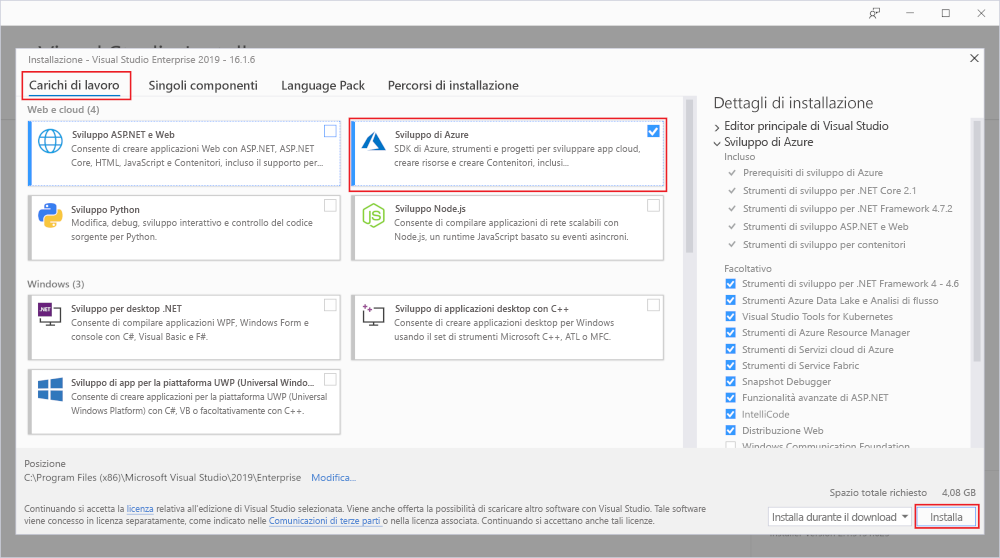

# Creare la prima funzione con Visual Studio

Funzioni di Azure consente di eseguire il codice in un ambiente [senza server](https://azure.microsoft.com/solutions/serverless/), senza dover prima creare una macchina virtuale o pubblicare un'applicazione Web.

Questo articolo spiega come usare Visual Studio 2019 per creare e testare in locale una funzione "hello world" e quindi pubblicarla in Azure. Questo argomento di avvio rapido è destinato a Visual Studio 2019. Se si crea un progetto di Funzioni con Visual Studio 2017, è necessario prima installare gli [strumenti più recenti di Funzioni di Azure](functions-develop-vs.md#check-your-tools-version).

## Prerequisiti

Per completare questa esercitazione, è innanzitutto necessario installare [Visual Studio 2019](https://azure.microsoft.com/downloads/). Assicurarsi che sia installato anche il carico di lavoro **Sviluppo di Azure**.

[!INCLUDE [quickstarts-free-trial-note](../../includes/quickstarts-free-trial-note.md)]

## Creare un progetto di app per le funzioni

[!INCLUDE [Create a project using the Azure Functions template](../../includes/functions-vstools-create.md)]

Visual Studio crea un progetto e una classe che contiene il codice boilerplate per il tipo di funzione trigger HTTP. L'attributo `FunctionName` del metodo imposta il nome della funzione, che per impostazione predefinita è `HttpTrigger`. L'attributo `HttpTrigger` specifica che la funzione è attivata da una richiesta HTTP. Il codice boilerplate invia una risposta HTTP che include un valore presente nel corpo della richiesta o nella stringa di query.

È possibile espandere le funzionalità della funzione usando binding di input e output tramite l'applicazione degli attributi appropriati al metodo. Per altre informazioni, vedere la sezione [Trigger e associazioni](functions-dotnet-class-library.md#triggers-and-bindings) di [Guida di riferimento per gli sviluppatori C# di Funzioni di Azure](functions-dotnet-class-library.md).

Ora che è stato creato il progetto di funzione con una funzione attivata tramite HTTP, è possibile testare la funzione nel computer locale.

## Eseguire la funzione in locale

Visual Studio si integra con Azure Functions Core Tools, per cui è possibile testare le funzioni in locale usando il runtime completo di Funzioni.  

[!INCLUDE [functions-run-function-test-local-vs](../../includes/functions-run-function-test-local-vs.md)]

Dopo aver verificato la corretta esecuzione della funzione nel computer locale, è possibile pubblicare il progetto in Azure.

## Pubblicare il progetto in Azure

Per poter pubblicare il progetto, è necessario che la sottoscrizione di Azure includa un'app per le funzioni. La pubblicazione di Visual Studio crea un'app per le funzioni la prima volta che si pubblica il progetto.

[!INCLUDE [Publish the project to Azure](../../includes/functions-vstools-publish.md)]

## Testare la funzione in Azure

1. Copiare l'URL di base dell'app per le funzioni dalla pagina del profilo di pubblicazione. Sostituire la parte `localhost:port` dell'URL usato durante il test della funzione in locale con il nuovo URL di base. Come prima, assicurarsi di accodare la stringa di query `?name=<YOUR_NAME>` all'URL ed eseguire la richiesta.

    Il formato dell'URL che chiama la funzione attivata tramite HTTP sarà simile al seguente:

        http://<APP_NAME>.azurewebsites.net/api/<FUNCTION_NAME>?name=<YOUR_NAME> 

2. Incollare questo nuovo URL per la richiesta HTTP nella barra degli indirizzi del browser. Di seguito è illustrata la risposta nel browser alla richiesta GET remota restituita dalla funzione:

    

## Passaggi successivi

È stato usato Visual Studio per creare e pubblicare un'app per le funzioni C# in Azure con una semplice funzione attivata tramite HTTP. Per altre informazioni sullo sviluppo di funzioni come librerie di classi .NET, vedere [Guida di riferimento per gli sviluppatori C# di Funzioni di Azure](functions-dotnet-class-library.md).

> [!div class="nextstepaction"]
> [Aggiungere un binding della coda di archiviazione di Azure alla funzione](functions-add-output-binding-storage-queue-vs.md)
