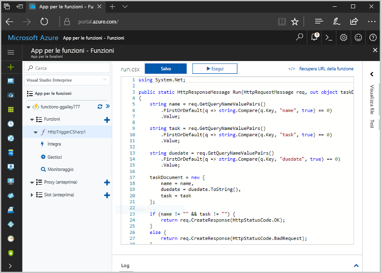
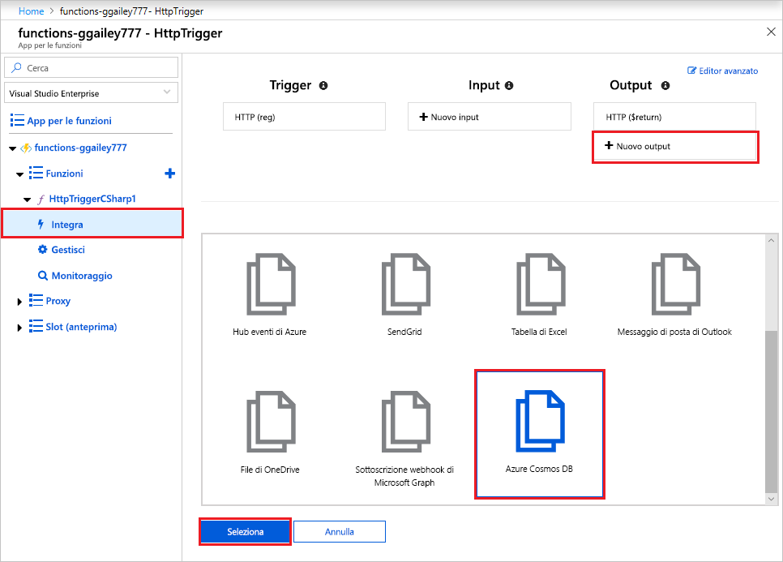
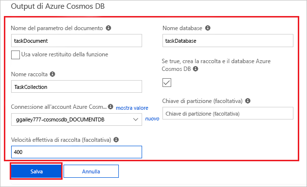
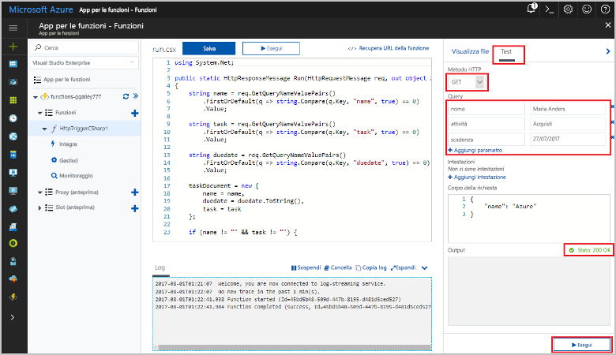
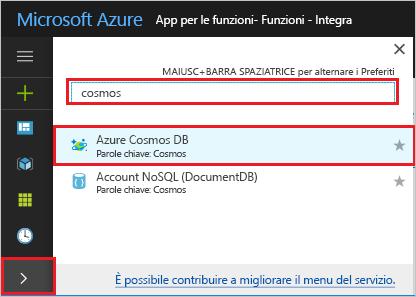
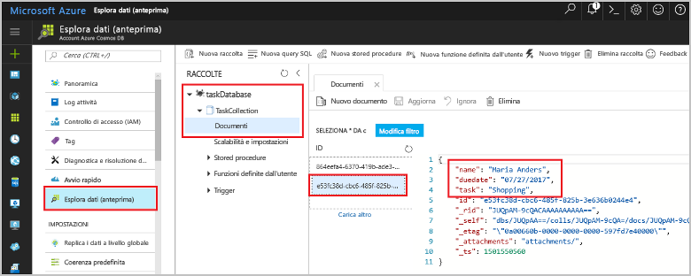

# <a name="store-unstructured-data-using-azure-functions-and-azure-cosmos-db"></a>Archiviare dati non strutturati usando Funzioni di Azure e Azure Cosmos DB

[Azure Cosmos DB](https://azure.microsoft.com/services/cosmos-db/) offre un approccio ottimale per archiviare dati non strutturati e JSON. Insieme a Funzioni di Azure, Cosmos DB semplifica e velocizza l'archiviazione dei dati con una quantità minore di codice rispetto a quella necessaria per l'archiviazione dei dati in un database relazionale.

> [!NOTE]
> Al momento, il trigger e le associazioni di input e output di Azure Cosmos DB funzionano solo con gli account API SQL e API Graph.

In Funzioni di Azure, i binding di input e di output forniscono una modalità dichiarativa per connettersi a dati di servizio esterni dalla funzione. Questo articolo illustra come aggiornare una funzione esistente per l'aggiunta di un binding di output che archivia dati non strutturati in un documento di Azure Cosmos DB.



## <a name="prerequisites"></a>Prerequisiti

Per completare questa esercitazione:

[!INCLUDE [Previous quickstart note](../../includes/functions-quickstart-previous-topics.md)]

## <a name="create-an-azure-cosmos-db-account"></a>Creare un account Azure Cosmos DB

Prima di creare il binding di output è necessario un account Azure Cosmos DB che usa l'API SQL.

[!INCLUDE [cosmos-db-create-dbaccount](../../includes/cosmos-db-create-dbaccount.md)]

## <a name="add-an-output-binding"></a>Aggiungere un binding di output

1. Nel portale passare all'app per le funzioni creata in precedenza ed espandere sia l'app per le funzioni che la funzione.

1. Selezionare **Integrazione** e **Nuovo output** in alto a destra nella pagina. Scegliere **Azure Cosmos DB**, quindi fare clic su **Seleziona**.

    

1. Se viene visualizzato un messaggio **Estensioni non installate**, scegliere **Installa** per installare l'estensione dei binding di Azure Cosmos DB nell'app per le funzioni. L'installazione può richiedere alcuni minuti.

    

1. Usare le impostazioni di **Azure Cosmos DB output** (Output di Azure Cosmos DB) specificate nella tabella:

    

    | Impostazione      | Valore consigliato  | DESCRIZIONE                                |
    | ------------ | ---------------- | ------------------------------------------ |
    | **Nome del parametro del documento** | taskDocument | Nome che fa riferimento all'oggetto Cosmos DB nel codice. |
    | **Nome database** | taskDatabase | Nome del database per il salvataggio dei documenti. |
    | **Nome raccolta** | TaskCollection | Nome della raccolta di database. |
    | **Se true, crea il database e la raccolta di Cosmos DB** | Selezionato | La raccolta non esiste ancora, quindi crearla. |
    | **Connessione all'account Azure Cosmos DB** | Nuova impostazione | Selezionare **Nuova**, scegliere **Sottoscrizione**, l'**account di database** creato in precedenza e fare clic su **Seleziona**. Viene creata un'impostazione applicazione per la connessione all'account. Questa impostazione viene usata dal binding per la connessione al database. |
    | **Velocità effettiva di raccolta** |400 UR| Se si vuole ridurre la latenza, è possibile aumentare la velocità effettiva in un secondo momento. |

1. Selezionare **Salva** per creare il binding.

## <a name="update-the-function-code"></a>Aggiornare il codice funzione

Sostituire il codice della funzione esistente con quello seguente nel linguaggio scelto:

# <a name="ctabcsharp"></a>[C#](#tab/csharp)

Sostituire la funzione C# esistente con il codice seguente:

```csharp
#r "Newtonsoft.Json"

using Microsoft.AspNetCore.Mvc;
using Microsoft.AspNetCore.Http;
using Microsoft.Extensions.Logging;

public static IActionResult Run(HttpRequest req, out object taskDocument, ILogger log)
{
    string name = req.Query["name"];
    string task = req.Query["task"];
    string duedate = req.Query["duedate"];

    // We need both name and task parameters.
    if (!string.IsNullOrEmpty(name) && !string.IsNullOrEmpty(task))
    {
        taskDocument = new
        {
            name,
            duedate,
            task
        };

        return (ActionResult)new OkResult();
    }
    else
    {
        taskDocument = null;
        return (ActionResult)new BadRequestResult();
    }
}
```

# <a name="javascripttabjavascript"></a>[JavaScript](#tab/javascript)

Sostituire la funzione JavaScript esistente con il codice seguente:

```js
module.exports = async function (context, req) {

    // We need both name and task parameters.
    if (req.query.name && req.query.task) {

        // Set the output binding data from the query object.
        context.bindings.taskDocument = req.query;

        // Success.
        context.res = {
            status: 200
        };
    }
    else {
        context.res = {
            status: 400,
            body: "The query options 'name' and 'task' are required."
        };
    }
};
```
---

Questo esempio di codice legge le stringhe della query di richiesta HTTP e le assegna ai campi dell'oggetto `taskDocument`. Il binding `taskDocument` invia i dati dell'oggetto di questo parametro di binding per l'archiviazione nel database di documenti associato. Il database viene creato alla prima esecuzione della funzione.

## <a name="test-the-function-and-database"></a>Testare la funzione e il database

1. Espandere la finestra di destra e selezionare **Test**. In **Query** fare clic su **Aggiungi parametro** e aggiungere i parametri seguenti per la stringa di query:

    + `name`
    + `task`
    + `duedate`

1. Fare clic su **Esegui** e verificare che venga restituito uno stato 200.

    

1. Sul lato sinistro del portale di Azure espandere la barra delle icone, digitare `cosmos` nel campo di ricerca e selezionare **Azure Cosmos DB**.

    

1. Scegliere l'account di Azure Cosmos DB, quindi selezionare **Esplora dati**.

1. Espandere i nodi **Raccolte**, selezionare il nuovo documento e verificare che il documento contenga i valori della stringa di query, oltre ad alcuni metadati aggiuntivi.

    

È stato aggiunto un binding al trigger HTTP per archiviare dati non strutturati in un'istanza di Azure Cosmos DB.

[!INCLUDE [Clean-up section](../../includes/clean-up-section-portal.md)]

## <a name="next-steps"></a>Passaggi successivi

Per altre informazioni sul binding a un database Cosmos DB, vedere [Binding di Azure Cosmos DB in Funzioni di Azure](functions-bindings-cosmosdb.md).

[!INCLUDE [functions-quickstart-next-steps](../../includes/functions-quickstart-next-steps-2.md)]
