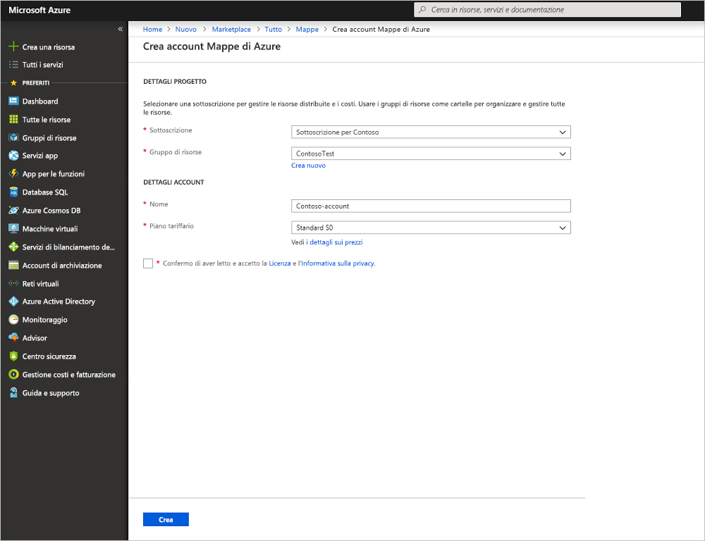
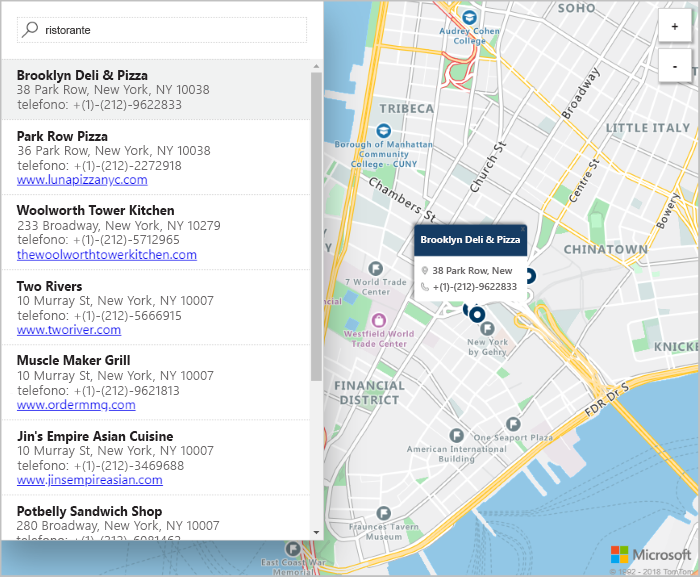

# Creare una mappa per la ricerca interattiva con Mappe di Azure

Questo articolo illustra le funzionalità di Mappe di Azure che consentono di creare una mappa che offre agli utenti un'esperienza di ricerca interattiva. L'articolo descrive le operazioni di base seguenti:
* Creare un proprio account di Mappe di Azure.
* Ottenere la chiave dell'account da usare nell'applicazione Web demo.

Se non si ha una sottoscrizione di Azure, creare un [account gratuito](https://azure.microsoft.com/free/?WT.mc_id=A261C142F) prima di iniziare.

## Accedere al portale di Azure

Accedere al [portale di Azure](https://portal.azure.com/).

## Creare un account e ottenere la chiave

1. Nell'angolo in alto a sinistra del [portale di Azure](https://portal.azure.com) selezionare **Crea una risorsa**.
2. Nella casella **Cerca nel Marketplace** immettere **Mappe**.
3. Fra i **risultati** selezionare **Mappe**. Selezionare il pulsante **Crea** visualizzato sotto la mappa.
4. Nella pagina **Crea account di Mappe di Azure** immettere i valori seguenti:
    - Il **nome** del nuovo account.
    - La **sottoscrizione** da usare per l'account.
    - Il **gruppo di risorse** per l'account. Per il gruppo di risorse è possibile selezionare l'opzione **Crea nuovo** o **Usa esistente**.
    - Selezionare il **piano tariffario** scelto.
    - Leggere la **Licenza** e l'**Informativa sulla privacy**. Selezionare la casella di controllo per accettare le condizioni.
    - Infine, selezionare il pulsante **Crea**.

    

5. Dopo avere creato l'account, aprirlo e trovare la sezione delle impostazioni del menu dell'account. Selezionare **Chiavi** per visualizzare le chiavi primaria e secondaria per l'account di Mappe di Azure. Copiare il valore di **Chiave primaria** negli Appunti in locale per usarlo nella sezione seguente.

## Scaricare l'applicazione

1. Scaricare o copiare il contenuto del file [interactiveSearch.html](https://github.com/Azure-Samples/azure-maps-samples/blob/master/src/interactiveSearch.html).
2. Salvare il contenuto del file in locale come **AzureMapDemo.html**. Aprirlo in un editor di testo.
3. Cercare la stringa `<insert-key>`. Sostituirla con il valore di **Chiave primaria** ottenuto nella sezione precedente.

## Aprire l'applicazione

1. Aprire il file **AzureMapDemo.html** nel browser che si preferisce.
2. Osservare la mappa visualizzata della città di Los Angeles. Fare zoom avanti e indietro per osservare come la mappa esegue automaticamente il rendering con più o meno informazioni a seconda del livello di zoom. 
3. Modificare il centro predefinito della mappa. Nel file **AzureMapDemo.html** cercare la variabile denominata **center**. Sostituire il valore della coppia longitudine, latitudine di questa variabile con i nuovi valori **[-74,0060, 40,7128]**. Salvare il file e aggiornare il browser.
4. Provare l'esperienza di ricerca interattiva. Nella casella di ricerca nell'angolo in alto a sinistra dell'applicazione Web demo cercare **restaurants**.
5. Spostare il puntatore del mouse sull'elenco di indirizzi e posizioni visualizzato sotto la casella di ricerca. Osservare che l'indicatore corrispondente sulla mappa visualizza le informazioni sulla posizione corrispondente. Per la privacy delle aziende private, sono visualizzati nomi e indirizzi fittizi.

    

## Pulire le risorse

Le esercitazioni analizzano in dettaglio come usare e configurare Mappe di Azure con l'account. Non eliminare le risorse create in questa guida introduttiva se si prevede di continuare con le esercitazioni. Se non si intende continuare, eseguire questi passaggi per pulire le risorse:

1. Chiudere il browser che esegue l'applicazione Web **AzureMapDemo.html**.
2. Dal menu a sinistra nel portale di Azure selezionare **Tutte le risorse**. Quindi, selezionare il proprio account di Mappe di Azure. Nella parte superiore del pannello **Tutte le risorse** selezionare **Elimina**.

## Passaggi successivi

In questa guida introduttiva è stato creato l'account di Mappe di Azure ed è stata creata un'app demo. Per informazioni su come creare un'applicazione usando le API di Mappe di Azure, continuare con l'esercitazione seguente:

> [!div class="nextstepaction"]
> [Eseguire ricerche vicino a punti di interesse con Mappe di Azure](./tutorial-search-location.md)

Per altri esempi di codice e un'esperienza interattiva di codifica, vedere queste guide:

> [!div class="nextstepaction"]
> [Trovare un indirizzo usando il servizio di ricerca di Mappe di Azure](./how-to-search-for-address.md)

> [!div class="nextstepaction"]
> [Usare il controllo mappa di Mappe di Azure](./how-to-use-map-control.md)
