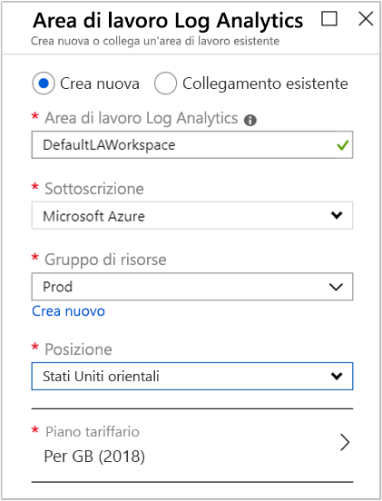
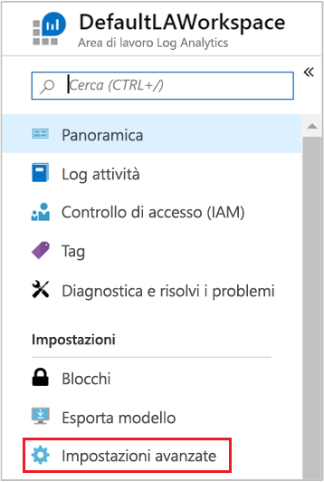
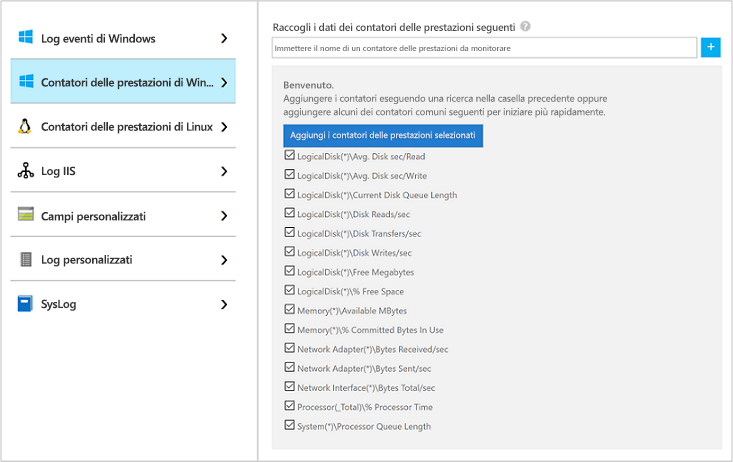
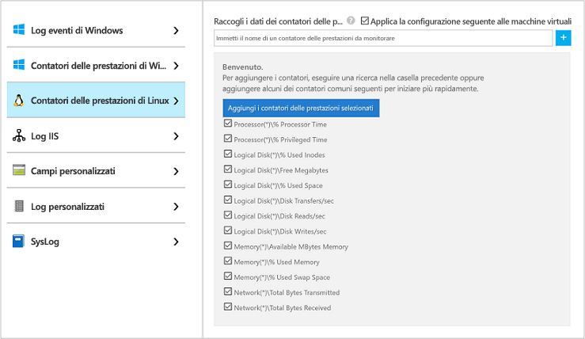

# Raccogliere dati sulle macchine virtuali di Azure
[Azure Log Analytics](../../azure-monitor/log-query/log-query-overview.md) può raccogliere i dati direttamente dalle macchine virtuali di Azure e da altre risorse dell'ambiente in un unico archivio per analisi dettagliate e per la correlazione.  Questa guida introduttiva illustra come configurare e raccogliere dati dalle VM Linux o Windows di Azure in pochi semplici passaggi.  
 
Questa guida introduttiva presuppone che esista già una macchina virtuale di Azure. In caso contrario, è possibile [creare una VM Windows](../../virtual-machines/windows/quick-create-portal.md) o [creare una VM Linux](../../virtual-machines/linux/quick-create-cli.md) seguendo le guide introduttive sulle VM.

## Accedere al portale di Azure
Accedere al portale di Azure all'indirizzo [https://portal.azure.com](https://portal.azure.com). 

## Creare un'area di lavoro
1. Nel portale di Azure fare clic su **Tutti i servizi**. Nell'elenco delle risorse digitare **Log Analytics**. Non appena si inizia a digitare, l'elenco viene filtrato in base all'input. Selezionare **Log Analytics**.

       

2. Fare clic su **Crea** e quindi selezionare le opzioni per gli elementi seguenti:

  * Specificare un nome per la nuova **area di lavoro di Log Analytics**, ad esempio *DefaultLAWorkspace*. Le aree di lavoro OMS sono ora denominate aree di lavoro di Log Analytics.  
  * Selezionare una **sottoscrizione** a cui collegarsi. Se la sottoscrizione selezionata per impostazione predefinita non è appropriata, è possibile sceglierne una dall'elenco a discesa.
  * Per **Gruppo di risorse**, selezionare un gruppo di risorse esistente contenente una o più macchine virtuali di Azure.  
  * Selezionare la **località** in cui sono distribuite le VM.  Per altre informazioni, vedere le [are in cui è disponibile Log Analytics](https://azure.microsoft.com/regions/services/).
  * Se si sta creando un'area di lavoro in una nuova sottoscrizione creata dopo il 2 aprile 2018, verrà automaticamente usato il piano di determinazione dei prezzi *Per GB* e non sarà disponibile l'opzione che consente di selezionare un piano tariffario.  Se si sta creando un'area di lavoro per una sottoscrizione esistente creata prima del 2 aprile o per una sottoscrizione collegata a un Contratto Enterprise esistente, selezionare il piano tariffario preferito.  Per altre informazioni sui piani specifici, vedere [Dettagli prezzi di Log Analytics](https://azure.microsoft.com/pricing/details/log-analytics/).
  
         

3. Dopo aver specificato le informazioni necessarie nel riquadro **Area di lavoro di Log Analytics**, fare clic su **OK**.  

Per tenere traccia dello stato di avanzamento della verifica delle informazioni e della creazione dell'area di lavoro, è possibile usare la voce **Notifiche** nel menu. 

## Abilitare l'estensione macchina virtuale di Log Analytics

[!INCLUDE [log-analytics-agent-note](../../../includes/log-analytics-agent-note.md)] 

Per le macchine virtuali Windows e Linux già distribuite in Azure, si installa l'agente di Log Analytics con l'estensione VM di Log Analytics. L'uso dell'estensione macchina virtuale consente di semplificare il processo di installazione e di configurare automaticamente l'agente per l'invio di dati all'area di lavoro di Log Analytics specificata. L'agente viene anche aggiornato automaticamente in modo da garantire la presenza delle funzionalità e delle correzioni più recenti. Prima di procedere, verificare che la macchina virtuale sia in esecuzione, in caso contrario il processo non verrà completato correttamente.  

>[!NOTE]
>L'agente di Log Analytics per Linux non può essere configurato per inviare report a più di un'area di lavoro di Log Analytics. 

1. Nel portale di Azure fare clic su **Tutti i servizi** nell'angolo superiore sinistro. Nell'elenco delle risorse digitare **Log Analytics**. Non appena si inizia a digitare, l'elenco viene filtrato in base all'input. Selezionare **Log Analytics**.
2. Nell'elenco di aree di lavoro di Log Analytics selezionare *DefaultLAWorkspace* creata prima.
3. Nel menu a sinistra fare clic su **Macchine virtuali** in Origini dati dell'area di lavoro.  
4. Nell'elenco **Macchine virtuali** selezionare una macchina virtuale in cui si vuole installare l'agente. Si noti che lo **stato della connessione di Log Analytics** per la macchina virtuale sarà **Non connesso**.
5. Nei dettagli relativi alla macchina virtuale selezionare **Connetti**. L'agente viene automaticamente installato e configurato per l'area di lavoro di Log Analytics. Il processo richiede alcuni minuti, durante i quali lo **stato** è **Connessione**.
6. Al termine dell'installazione e della connessione dell'agente, lo **stato della connessione di Log Analytics** verrà aggiornato in **Questa area di lavoro**.

## Raccogliere dati su eventi e prestazioni
Log Analytics può raccogliere gli eventi dai registri eventi di Windows o da Syslog Linux e i contatori delle prestazioni specificati per l'analisi a lungo termine e la creazione di report e intervenire quando viene rilevata una particolare condizione.  Seguire questi passaggi per configurare la raccolta di eventi dal registro di sistema di Windows e da Syslog Linux e di diversi comuni contatori delle prestazioni con cui iniziare.  

### Raccolta di dati da una VM Windows
1. Selezionare **Impostazioni avanzate**.

    

3. Selezionare **Dati** e quindi selezionare **Registri eventi di Windows**.  
4. Si aggiunge un registro eventi digitandone il nome.  Digitare **Sistema** e quindi fare clic sul segno **+**.  
5. Nella tabella selezionare i livelli di gravità **Errore** e **Avviso**.   
6. Fare clic su **Salva** nella parte superiore della pagina per salvare la configurazione.
7. Selezionare **Windows Performance Data** (Dati di prestazione di Windows) per abilitare la raccolta di contatori delle prestazioni in un computer Windows. 
8. Quando si configurano i contatori delle prestazioni di Windows per la prima volta per una nuova area di lavoro di Log Analytics, è possibile creare rapidamente numerosi contatori comuni. Viene visualizzato l'elenco dei contatori con le caselle di controllo corrispondenti.

    

    Fare clic su **Aggiungi i contatori delle prestazioni selezionati**.  Vengono aggiunti e preimpostati con un intervallo di esempio tra le raccolte di dieci secondi.
  
9. Fare clic su **Salva** nella parte superiore della pagina per salvare la configurazione.

### Raccolta di dati da una VM Linux

1. Selezionare **Syslog**.  
2. Si aggiunge un registro eventi digitandone il nome.  Digitare **Syslog** e quindi fare clic sul segno **+**.  
3. Nella tabella deselezionare i livelli di gravità **Informativo**, **Avviso** e **Debug**. 
4. Fare clic su **Salva** nella parte superiore della pagina per salvare la configurazione.
5. Selezionare **Linux Performance Data** (Dati di prestazione di Linux) per abilitare la raccolta di contatori delle prestazioni in un computer Linux. 
6. Quando si configurano i contatori delle prestazioni di Linux per la prima volta per una nuova area di lavoro di Log Analytics, è possibile creare rapidamente numerosi contatori comuni. Viene visualizzato l'elenco dei contatori con le caselle di controllo corrispondenti.

    

    Fare clic su **Aggiungi i contatori delle prestazioni selezionati**.  Vengono aggiunti e preimpostati con un intervallo di esempio tra le raccolte di dieci secondi.  

7. Fare clic su **Salva** nella parte superiore della pagina per salvare la configurazione.

## Visualizzare i dati raccolti
Ora che la raccolta di dati è stata abilitata, verrà eseguito un semplice esempio di ricerca log per visualizzare alcuni dati dalle VM di destinazione.  

1. Nel portale di Azure passare a Log Analytics e selezionare l'area di lavoro creata prima.
2. Fare clic sul riquadro **Ricerca log** e nel riquadro Ricerca log digitare `Perf` nel campo della query e quindi premere INVIO o fare clic sul pulsante della ricerca a destra del campo della query.

     

La query nella figura seguente, ad esempio, ha restituito 735 record relativi alle prestazioni.  I risultati effettivi saranno molti di meno. 

## Pulire le risorse
Quando non è più necessaria, eliminare l'area di lavoro di Log Analytics. A questo scopo, selezionare l'area di lavoro di Log Analytics creata prima e nella pagina delle risorse fare clic su **Elimina**.

## Passaggi successivi
Ora che è in corso la raccolta di dati operativi e sulle prestazioni dalle macchine virtuali Windows o Linux, è possibile iniziare facilmente a esplorare, analizzare e modificare i dati raccolti *gratuitamente*.  

Per informazioni su come visualizzare e analizzare i dati, passare all'esercitazione.   

> [!div class="nextstepaction"]
> [View or analyze data in Log Analytics (Visualizzare o analizzare i dati in Log Analytics)](../../azure-monitor/learn/tutorial-viewdata.md)
