# <a name="creating-and-deploying-azure-resource-groups-through-visual-studio"></a>Creazione e distribuzione di gruppi di risorse di Azure tramite Visual Studio

Con Visual Studio è possibile creare un progetto che distribuisce l'infrastruttura e il codice in Azure. Ad esempio, è possibile definire l'host Web, il sito Web e il database per l'app e distribuire l'infrastruttura insieme al codice. Visual Studio offre molti modelli di partenza per la distribuzione di scenari comuni. In questo articolo viene eseguita la distribuzione di un'app Web e un database SQL.  

Questo articolo illustra come usare [Visual Studio 2017 con lo sviluppo di Azure e i carichi di lavoro ASP.NET installati](/dotnet/azure/dotnet-tools). Se si usa Visual Studio 2015 Update 2 e Microsoft Azure SDK per .NET 2.9 oppure Visual Studio 2013 con Azure SDK 2.9, l'esperienza è sostanzialmente uguale.

## <a name="create-azure-resource-group-project"></a>Creare un progetto Gruppo di risorse di Azure

In questa sezione verrà creato un progetto Gruppo di risorse di Azure con un modello **App Web e SQL**.

1. In Visual Studio scegliere **File**, **Nuovo progetto** e quindi **C#** o **Visual Basic**. Il linguaggio scelto non ha alcun impatto sulle fasi successive perché questi progetti includono solo contenuto JSON e PowerShell. Scegliere quindi **Cloud** e scegliere il progetto **Gruppo di risorse di Azure**.
   
    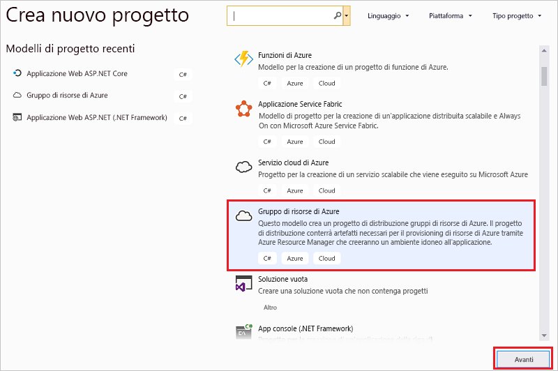
2. Scegliere il modello da distribuire in Gestione risorse di Azure. Si noti che sono disponibili molte opzioni diverse in base al tipo di progetto da distribuire. Per questo articolo scegliere il modello **App Web e SQL** .
   
    
   
    Il modello scelto è solo un punto di partenza. È possibile aggiungere e rimuovere risorse per ottenere lo scenario desiderato.
   
   > [!NOTE]
   > Visual Studio consente di recuperare un elenco dei modelli disponibili online. L'elenco è soggetto a modifiche.
   > 
   > 
   
    Visual Studio crea un progetto di distribuzione di tipo Gruppo di risorse per l'app Web e il database SQL.
3. Per visualizzare gli elementi creati, esaminare i nodi nel progetto di distribuzione.
   
    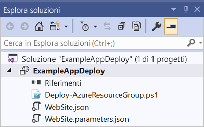
   
    Poiché per questo esempio è stato scelto il modello App Web e SQL, verranno visualizzati i file seguenti: 
   
   | Nome file | DESCRIZIONE |
   | --- | --- |
   | Deploy-AzureResourceGroup.ps1 |Script di PowerShell che esegue i comandi di PowerShell per la distribuzione in Azure Resource Manager.<br />**Nota** : Visual Studio usa questo script di PowerShell per distribuire il modello. Eventuali modifiche apportate allo script influiscono sulla distribuzione in Visual Studio, quindi è opportuno prestare attenzione. |
   | WebSiteSQLDatabase.json |Modello di Resource Manager che definisce l'infrastruttura da distribuire in Azure e parametri che si possono specificare durante la distribuzione. Definisce anche le dipendenze tra le risorse, per consentire a Resource Manager di distribuire le risorse nell'ordine corretto. |
   | WebSiteSQLDatabase.parameters.json |File di parametri contenente i valori necessari per il modello, che vengono passati per personalizzare ogni distribuzione. |
   
    Tutti i progetti di distribuzione di tipo Gruppo di risorse contengono questi file di base. Altri progetti potrebbero includere file aggiuntivi per supportare altre funzionalità.

## <a name="customize-the-resource-manager-template"></a>Personalizzare il modello di Gestione risorse
È possibile personalizzare un progetto di distribuzione modificando i modelli JSON che descrivono le risorse da distribuire. JSON è l'acronimo di JavaScript Object Notation ed è un formato dati serializzati facile da usare. I file JSON usano uno schema a cui viene fatto riferimento all'inizio di ogni file. Per comprendere meglio lo schema, è possibile scaricarlo e analizzarlo. Lo schema definisce gli elementi validi, i tipi e i formati dei campi e i valori possibili di una proprietà. Per informazioni sugli elementi del modello di Gestione risorse, vedere [Creazione di modelli di Gestione risorse di Azure](resource-group-authoring-templates.md).

Per utilizzare il modello, aprire il file **WebSiteSQLDatabase.json**.

L'editor di Visual Studio offre strumenti utili per la modifica del modello di Resource Manager. La finestra **Struttura JSON** semplifica la visualizzazione degli elementi definiti nel modello.

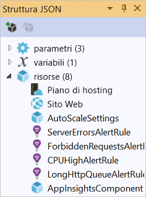

Se si seleziona un elemento disponibile nella struttura, viene visualizzata la parte corrispondente del modello e viene evidenziato il rispettivo codice JSON.

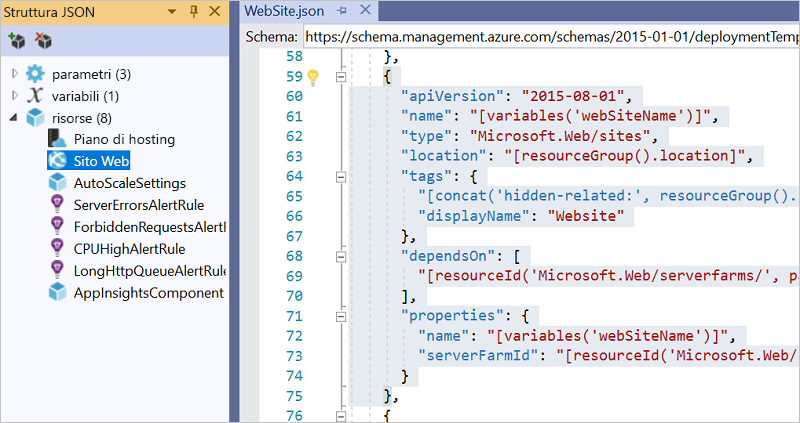

È possibile aggiungere una risorsa facendo clic sul pulsante **Aggiungi risorsa** nella parte superiore della finestra Struttura JSON oppure facendo clic con il pulsante destro del mouse su **risorse** e scegliendo **Aggiungi nuova risorsa**.

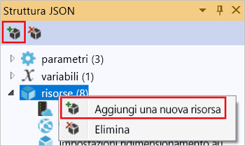

Per questa esercitazione selezionare **Account di archiviazione** e specificare un nome. Specificare un nome contenente non più di 11 caratteri costituiti solo da numeri e lettere minuscole.

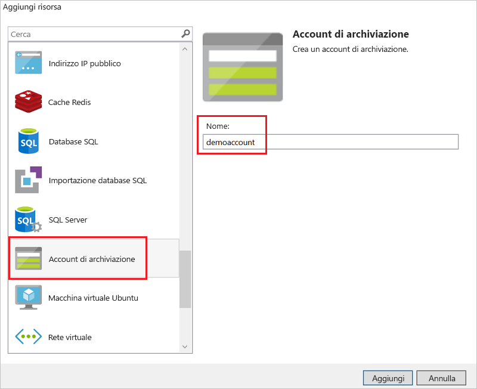

Si noti che non è stata aggiunta solo la risorsa, ma anche un parametro per il tipo di account di archiviazione e una variabile per il nome dell'account di archiviazione.

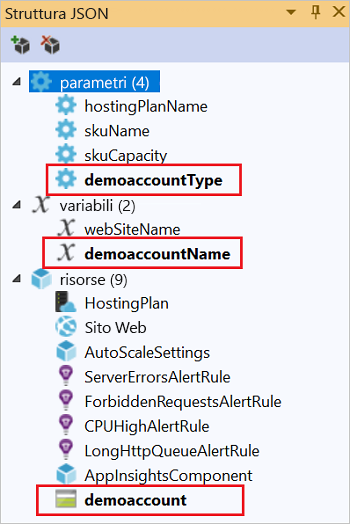

Il parametro **storageType** è preimpostato con i tipi consentiti e un tipo predefinito. È possibile usare questi valori o modificarli per il proprio scenario. Per impedire agli utenti di distribuire un account di archiviazione di tipo **Premium_LRS** tramite questo modello, rimuoverlo dai tipi consentiti. 

```json
"storageType": {
  "type": "string",
  "defaultValue": "Standard_LRS",
  "allowedValues": [
    "Standard_LRS",
    "Standard_ZRS",
    "Standard_GRS",
    "Standard_RAGRS"
  ]
}
```

Visual Studio fornisce anche il supporto per IntelliSense, per semplificare l'individuazione delle proprietà disponibili durante la modifica del modello. Ad esempio, per modificare le proprietà del piano di servizio app, passare alla risorsa **HostingPlan** e aggiungere un nuovo valore per **properties**. Si noti che IntelliSense mostra i valori disponibili e fornisce una descrizione di ogni valore.


È possibile impostare **numberOfWorkers** su 1.

```json
"properties": {
  "name": "[parameters('hostingPlanName')]",
  "numberOfWorkers": 1
}
```

## <a name="deploy-the-resource-group-project-to-azure"></a>Distribuire il progetto di tipo Gruppo di risorse in Azure
È ora possibile distribuire il progetto. Quando si distribuisce un progetto di Azure Resource Manager, lo si distribuisce in un gruppo di risorse di Azure. Il gruppo di risorse è un raggruppamento logico di risorse che condividono un ciclo di vita comune.

1. Dal menu di scelta rapida del nodo del progetto di distribuzione scegliere **Distribuisci** > **Nuovo**.
   
    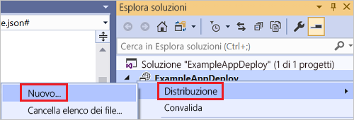
   
    Verrà visualizzata la finestra di dialogo **Distribuisci in gruppo di risorse** .
   
    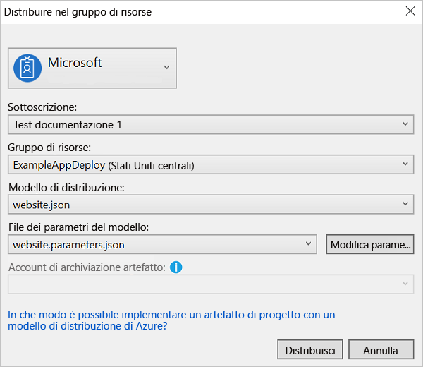
2. Nella casella di riepilogo a discesa **Gruppo di risorse** scegliere un gruppo di risorse esistente o crearne uno nuovo. Per creare un gruppo di risorse, aprire la casella di riepilogo a discesa **Gruppo di risorse** e scegliere **Crea nuovo**.
   
    
   
    Viene visualizzata la finestra di dialogo **Crea gruppo di risorse** . Specificare un nome e una posizione per il gruppo, quindi selezionare **Crea** .
   
    
3. Modificare i parametri per la distribuzione selezionando il pulsante **Modifica parametri** .
   
    
4. Specificare i valori per i parametri vuoti e fare clic sul pulsante **Salva** . I parametri vuoti sono **hostingPlanName**, **administratorLogin**, **administratorLoginPassword** e **databaseName**.
   
    **hostingPlanName** specifica un nome per il [piano di servizio app da creare](../app-service/overview-hosting-plans.md) . 
   
    **administratorLogin** specifica il nome utente per l'amministratore di SQL Server. Non usare nomi di amministratore comuni, ad esempio **sa** o **amministratore**. 
   
    **administratorLoginPassword** specifica una password per l'amministratore di SQL Server. L'opzione **Salva le password come testo normale nel file dei parametri** non è sicura, quindi non selezionarla. Poiché la password non viene salvata come testo normale, è necessario immetterla nuovamente durante la distribuzione. 
   
    **databaseName** specifica un nome per il database da creare. 
   
    
5. Scegliere il pulsante **Distribuisci** per distribuire il progetto in Azure. Una console di PowerShell viene aperta al di fuori dell'istanza di Visual Studio. Immettere la password di amministratore di SQL Server nella console di PowerShell quando richiesto. **La console di PowerShell potrebbe essere nascosta dietro altri elementi o ridotta a icona nella barra delle applicazioni.**  Cercare la console e selezionarla per immettere la password.
   
   > [!NOTE]
   > È possibile che Visual Studio richieda l'installazione dei cmdlet di Azure PowerShell. Se richiesto, occorre installarli. Per distribuire correttamente i gruppi di risorse sono necessari moduli di Azure PowerShell. Lo script PowerShell del progetto non funziona con il nuovo [modulo Azure PowerShell Az](/powershell/azure/new-azureps-module-az). 
   >
   > Per altre informazioni, vedere [Installare e configurare moduli Azure PowerShell](/powershell/azure/azurerm/install-azurerm-ps).
   > 
   > 
6. La distribuzione può richiedere alcuni minuti. Nelle finestre **Output** viene visualizzato lo stato della distribuzione. Al termine della distribuzione, l'ultimo messaggio indica una distribuzione riuscita con un testo simile al seguente:
   
        ... 
        18:00:58 - Successfully deployed template 'websitesqldatabase.json' to resource group 'DemoSiteGroup'.
7. In un browser aprire il [portale di Azure](https://portal.azure.com/) e accedere con il proprio account. Per visualizzare il gruppo di risorse, selezionare **Gruppi di risorse** e il gruppo di risorse in cui è stata effettuata la distribuzione.
   
    
8. Vengono visualizzate tutte le risorse distribuite. Si noti che il nome dell'account di archiviazione non è esattamente quello specificato quando si è aggiunta la risorsa. L'account di archiviazione deve essere univoco. Il modello aggiunge automaticamente una stringa di caratteri al nome specificato per fornire un nome univoco. 
   
    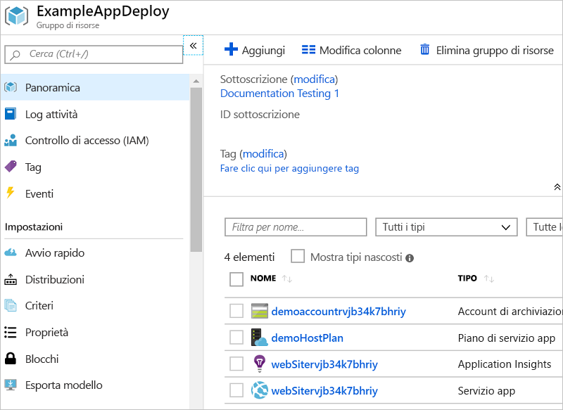
9. Se si apportano modifiche e si vuole ridistribuire il progetto, scegliere il gruppo di risorse esistente direttamente dal menu di scelta rapida del progetto Gruppo di risorse di Azure. Dal menu di scelta rapida scegliere **Distribuisci**e quindi il gruppo di risorse distribuito.
   
    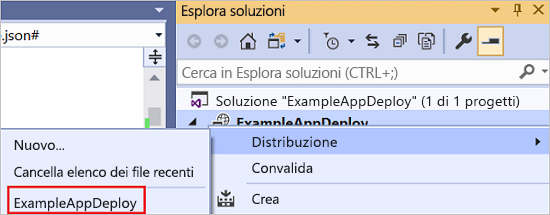

## <a name="deploy-code-with-your-infrastructure"></a>Distribuire codice con l'infrastruttura
A questo punto è stata distribuita l'infrastruttura per l'app, ma non è stato ancora distribuito il codice effettivo con il progetto. Questo articolo illustra come distribuire un'app Web e tabelle del database SQL durante la distribuzione. Se si sta distribuendo una macchina virtuale invece di un'app Web, è consigliabile eseguire il codice nella macchina virtuale come parte della distribuzione. Il processo di distribuzione di codice per un'app Web o per la configurazione di una macchina virtuale è quasi uguale.

1. Aggiungere un progetto alla soluzione Visual Studio. Fare clic con il pulsante destro del mouse sulla soluzione e scegliere **Aggiungi** > **Nuovo progetto**.
   
    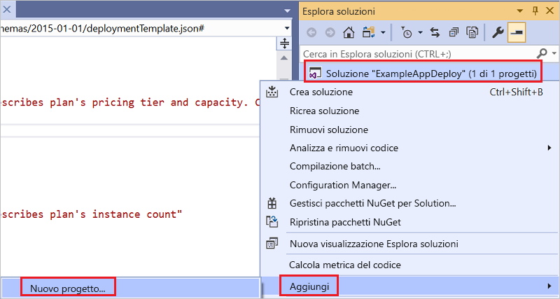
2. Aggiungere un' **Applicazione Web ASP.NET**. 
   
    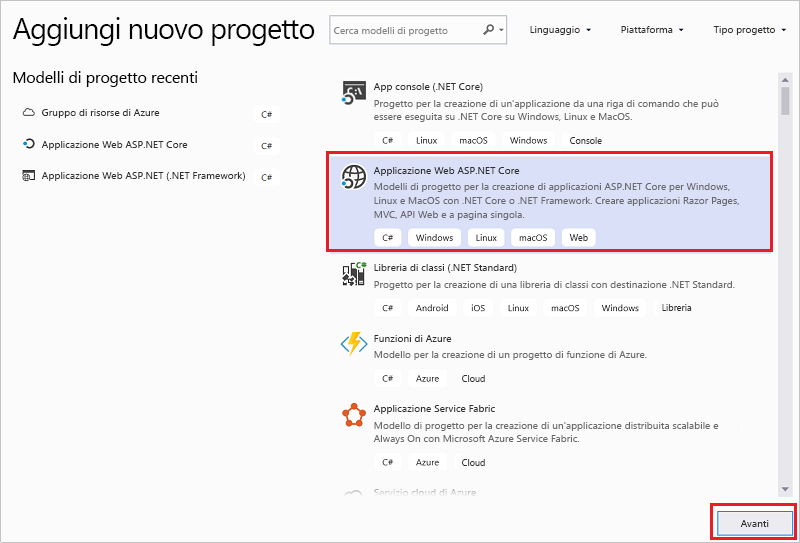
3. Selezionare **MVC**.
   
    
4. Dopo che Visual Studio ha creato l'app Web, vengono visualizzati entrambi i progetti nella soluzione.
   
    
5. Ora è necessario verificare che il progetto del gruppo di risorse sia a conoscenza del nuovo progetto. Tornare al progetto del gruppo di risorse (AzureResourceGroup1). Fare clic con il pulsante destro del mouse su **Riferimenti** e scegliere **Aggiungi riferimento**.
   
    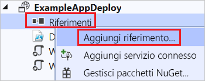
6. Selezionare il progetto dell'app Web creato.
   
    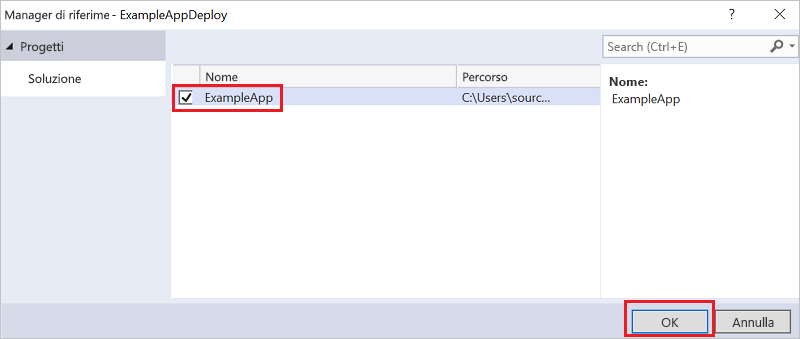
   
    Aggiungendo un riferimento si collega il progetto di app Web al progetto di gruppo di risorse e si impostano automaticamente tre proprietà chiave. Queste proprietà vengono visualizzate nella finestra **Proprietà** del riferimento.
   
      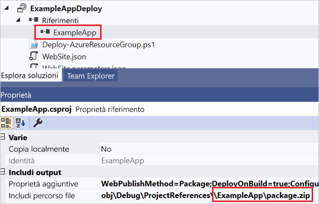
   
    Le proprietà sono:
   
   * In **Additional Properties** è disponibile il percorso di gestione temporanea del pacchetto di distribuzione Web di cui viene effettuato il push in Archiviazione di Azure. Prendere nota della cartella (ExampleApp) e del file (package.zip). È necessario conoscere questi valori perché vengono specificati come parametri durante la distribuzioni dell'app. 
   * In **Include File Path** è disponibile il percorso in cui viene creato il pacchetto. In **Include Targets** è disponibile il comando che viene eseguito dalla distribuzione. 
   * Il valore predefinito di **Build;Package** consente alla distribuzione di sviluppare e creare un pacchetto di distribuzione Web (package.zip).  
     
     Il profilo di pubblicazione non è necessario, perché la distribuzione ottiene le informazioni necessarie dalle proprietà per creare il pacchetto.
7. Tornare a WebSiteSQLDatabase.json e aggiungere una risorsa al modello.
   
    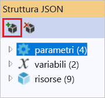
8. Questa volta selezionare **Distribuzione Web per app Web**. 
   
    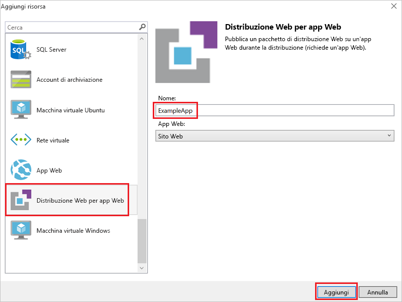
9. Ridistribuire il progetto Gruppo di risorse nel gruppo di risorse. Questa volta sono disponibili alcuni nuovi parametri. Non è necessario specificare valori per **_artifactsLocation** o **_artifactsLocationSasToken**, perché vengono generati automaticamente da Visual Studio. È tuttavia necessario impostare la cartella e il nome file sul percorso contenente il pacchetto di distribuzione (**ExampleAppPackageFolder** ed **ExampleAppPackageFileName** nell'immagine seguente). Specificare i valori visualizzati prima nelle proprietà di riferimento (**ExampleApp** e **package.zip**).
   
    
   
    Per **Account di archiviazione elementi**selezionare l'account distribuito con questo gruppo di risorse.
10. Al termine della distribuzione, selezionare l'app Web nel portale. Selezionare l'URL per passare al sito.
    
     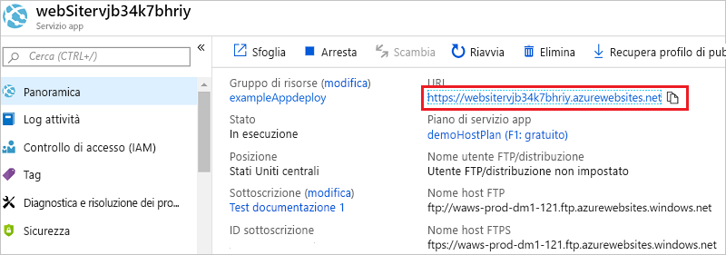
11. Si noti che l'app ASP.NET predefinita è stata distribuita correttamente.
    
     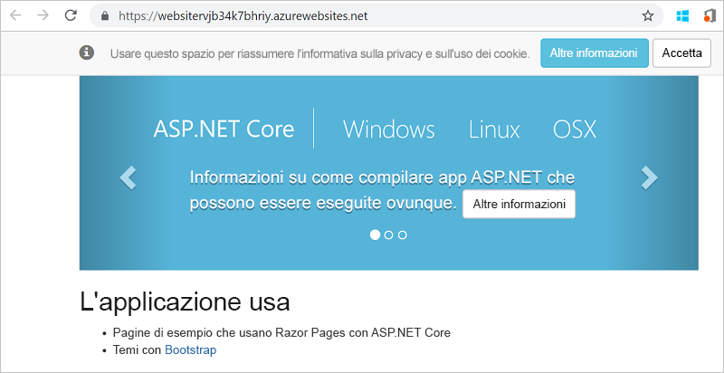

## <a name="add-an-operations-dashboard-to-your-deployment"></a>Aggiungere un dashboard operazioni alla distribuzione
Non si è limitati solo alle risorse disponibili tramite l'interfaccia di Visual Studio. È possibile personalizzare la distribuzione mediante l'aggiunta di una risorsa personalizzata al modello. Per visualizzare l'aggiunta di una risorsa, aggiungere un dashboard operativo per gestire la risorsa che è stata distribuita.

1. Aprire il file WebsiteSqlDeploy.json e aggiungere il codice JSON seguente dopo la risorsa dell'account di archiviazione ma prima della parentesi `]` di chiusura della sezione relativa alle risorse.

   ```json
    ,{
      "properties": {
        "lenses": {
          "0": {
            "order": 0,
            "parts": {
              "0": {
                "position": {
                  "x": 0,
                  "y": 0,
                  "colSpan": 4,
                  "rowSpan": 6
                },
                "metadata": {
                  "inputs": [
                    {
                      "name": "resourceGroup",
                      "isOptional": true
                    },
                    {
                      "name": "id",
                      "value": "[resourceGroup().id]",
                      "isOptional": true
                    }
                  ],
                  "type": "Extension/HubsExtension/PartType/ResourceGroupMapPinnedPart"
                }
              },
              "1": {
                "position": {
                  "x": 4,
                  "y": 0,
                  "rowSpan": 3,
                  "colSpan": 4
                },
                "metadata": {
                  "inputs": [],
                  "type": "Extension[azure]/HubsExtension/PartType/MarkdownPart",
                  "settings": {
                    "content": {
                      "settings": {
                        "content": "__Customizations__\n\nUse this dashboard to create and share the operational views of services critical to the application performing. To customize simply pin components to the dashboard and then publish when you're done. Others will see your changes when you publish and share the dashboard.\n\nYou can customize this text too. It supports plain text, __Markdown__, and even limited HTML like images  and <a href='https://azure.microsoft.com' target='_blank'>links</a> that open in a new tab.\n",
                        "title": "Operations",
                        "subtitle": "[resourceGroup().name]"
                      }
                    }
                  }
                }
              }
            }
          }
        },
        "metadata": {
          "model": {
            "timeRange": {
              "value": {
                "relative": {
                  "duration": 24,
                  "timeUnit": 1
                }
              },
              "type": "MsPortalFx.Composition.Configuration.ValueTypes.TimeRange"
            }
          }
        }
      },
      "apiVersion": "2015-08-01-preview",
      "name": "[concat('ARM-',resourceGroup().name)]",
      "type": "Microsoft.Portal/dashboards",
      "location": "[resourceGroup().location]",
      "tags": {
        "hidden-title": "[concat('OPS-',resourceGroup().name)]"
      }
    }
   ```

2. Ridistribuire il gruppo di risorse. Esaminando il dashboard nel portale di Azure,si noti che il dashboard condiviso è stata aggiunto al proprio elenco di scelte.

   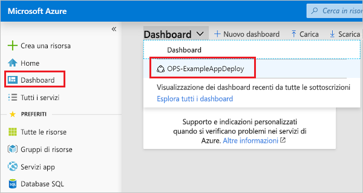

3. Selezionare il dashboard.

   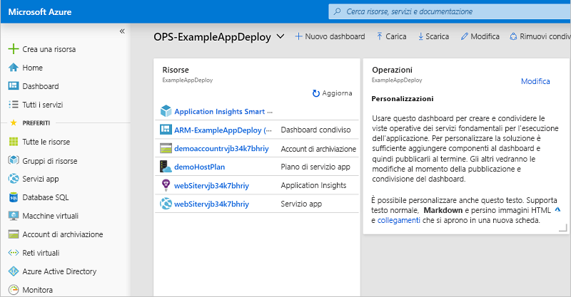

È possibile gestire l'accesso al dashboard usando i gruppi RBAC. È anche possibile personalizzare l'aspetto del dashboard dopo la distribuzione. Tuttavia, se si ridistribuisce il gruppo di risorse, il dashboard viene ripristinato allo stato predefinito nel modello. Per altre informazioni sulla creazione di dashboard, vedere [Creazione di dashboard di Azure a livello di codice](../azure-portal/azure-portal-dashboards-create-programmatically.md).

## <a name="next-steps"></a>Passaggi successivi

In questa guida introduttiva si è appreso come creare e distribuire modelli con Visual Studio. L'esercitazione successiva illustra come trovare le informazioni di riferimento sul modello per poter creare un account di archiviazione di Azure crittografato.

> [!div class="nextstepaction"]
> [Creare un account di archiviazione crittografato](./resource-manager-tutorial-create-encrypted-storage-accounts.md)
