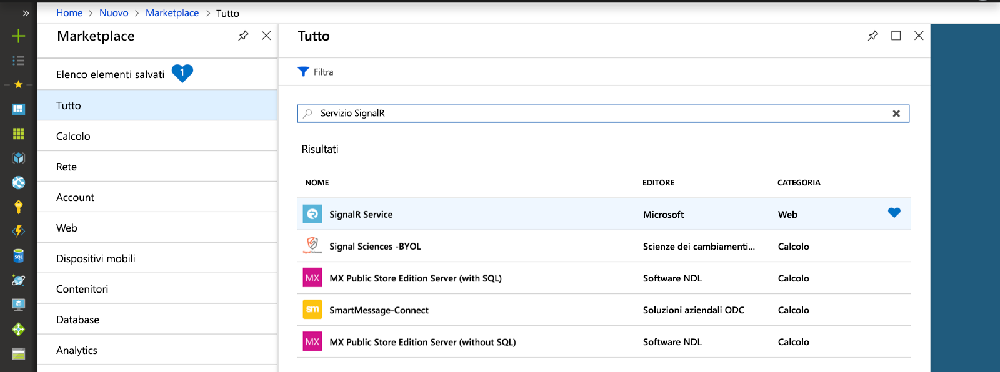
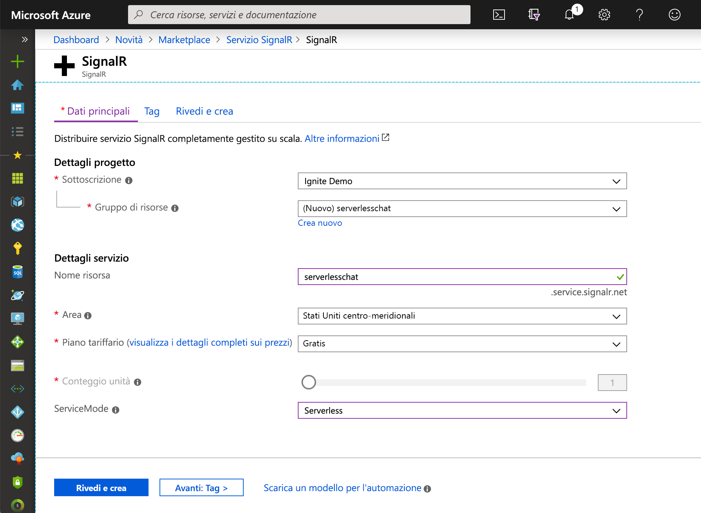

## Creare un'istanza del servizio Azure SignalR

L'applicazione si connette a un'istanza del servizio SignalR in Azure.

1. Selezionare il pulsante Nuovo nell'angolo superiore sinistro del portale di Azure. Nella nuova schermata digitare *Servizio SignalR* nella casella di ricerca e premere Invio.

    

1. Selezionare **Servizio SignalR** dai risultati della ricerca, quindi selezionare **Crea**.

1. Immettere le impostazioni seguenti.

    | Impostazione      | Valore consigliato  | DESCRIZIONE                                        |
    | ------------ |  ------- | -------------------------------------------------- |
    | **Nome risorsa** | Nome globalmente univoco | Nome che identifica la nuova istanza del servizio SignalR. I caratteri validi sono `a-z`, `0-9` e `-`.  | 
    | **Sottoscrizione** | Sottoscrizione in uso | La sottoscrizione in cui verrà creata questa nuova istanza del servizio SignalR. | 
    | **[Gruppo di risorse](../../azure-resource-manager/resource-group-overview.md)** |  myResourceGroup | Nome del nuovo gruppo di risorse in cui creare l'istanza del servizio SignalR. | 
    | **Posizione** | Stati Uniti occidentali | Scegliere [un'area](https://azure.microsoft.com/regions/) nelle vicinanze. |
    | **Piano tariffario** | Gratuito | Provare il servizio Azure SignalR gratuitamente. |
    | **Unità: conteggio** |  Non applicabile | Numero di unità specifica il numero di connessioni che può accettare l'istanza del servizio SignalR. È configurabili solo nel livello Standard. |

    

1. Selezionare **Crea** per iniziare la distribuzione dell'istanza del servizio SignalR.

1. Una volta distribuita l’istanza, aprirla nel portale e individuare la relativa pagina Impostazioni. Modificare l'impostazione della modalità Servizio su *Serverless*.

    