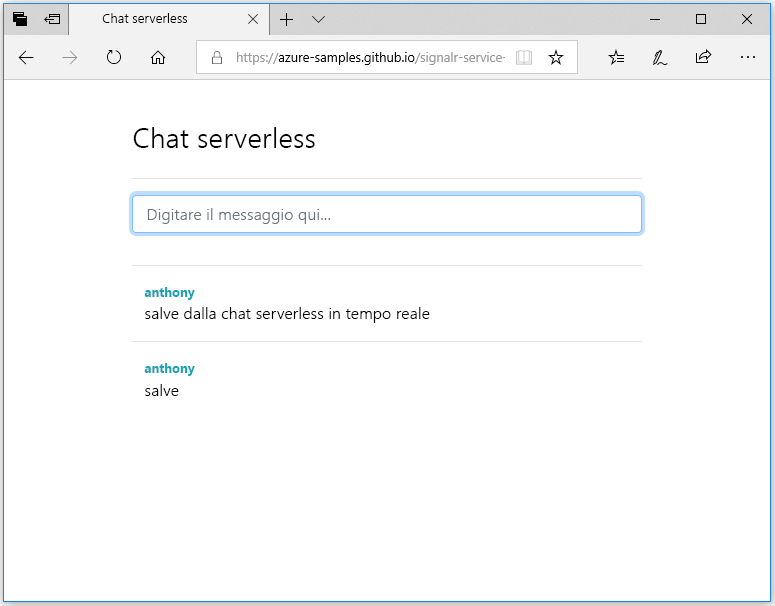

## Eseguire l'applicazione Web

1. È disponibile un'applicazione Web a singola pagina di esempio ospitata in GitHub per comodità. Aprire il browser per [https://azure-samples.github.io/signalr-service-quickstart-serverless-chat/demo/chat-v2/](https://azure-samples.github.io/signalr-service-quickstart-serverless-chat/demo/chat-v2/).

    > [!NOTE]
    > Il codice sorgente del file HTML è disponibile all'indirizzo [/docs/demo/chat-v2/index.html](https://github.com/Azure-Samples/signalr-service-quickstart-serverless-chat/blob/master/docs/demo/chat-v2/index.html).

1. Quando viene richiesto l'URL di base dell'app per le funzioni, immettere `http://localhost:7071`.

1. Immettere un nome utente quando richiesto.

1. L'applicazione Web chiama la funzione *GetSignalRInfo* nell'app per le funzioni per recuperare le informazioni di connessione per connettersi al servizio Azure SignalR. Dopo aver completato la connessione, viene visualizzata la finestra di input dei messaggi chat.

1. Digitare un messaggio e premere invio. L'applicazione invia il messaggio alla funzione *SendMessage* nell'app per le funzioni di Azure, che usa quindi l'associazione di output di SignalR per trasmettere il messaggi a tutti i client connessi. Se tutto funziona correttamente, verrà visualizzato il messaggio nell'applicazione.

    

1. Aprire un'altra istanza dell'applicazione Web in un'altra finestra del browser. Si noterà che tutti i messaggi inviati verranno visualizzati in tutte le istanze dell'applicazione.

> [!IMPORTANT]
> Dato che la pagina HTML è disponibile tramite HTTPS, ma il runtime locale di Funzioni di Azure usa HTTP per impostazione predefinita, il browser (ad esempio Firefox) potrebbe applicare un criterio di contenuto misto che blocca le richieste della pagina Web alle funzioni dell'utente. Per risolvere questo problema, usare un browser che non ha questa restrizione oppure avviare un server HTTP locale come [http-server](https://www.npmjs.com/package/http-server) nella directory */docs/demo/chat-v2*. Assicurarsi che l'origine venga aggiunta all'impostazione `CORS` in *local.settings.json*.