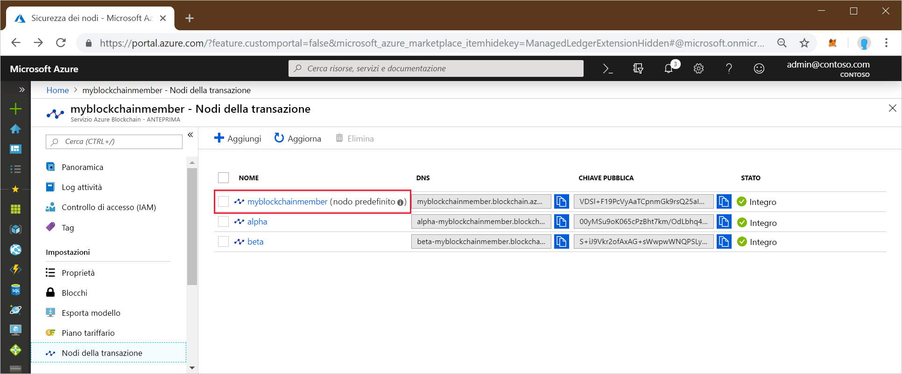
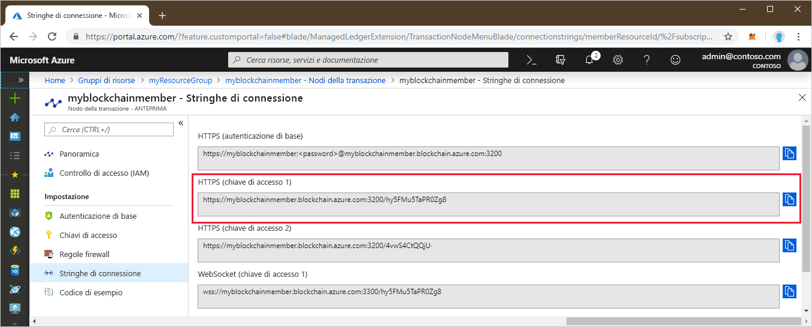

# <a name="quickstart-use-geth-to-connect-to-a-transaction-node"></a>Avvio rapido: Usare Geth per connettersi a un nodo della transazione

Geth è un client Go Ethereum che è possibile usare per connettersi a un'istanza di Geth in un nodo della transazione del servizio Azure Blockchain.

[!INCLUDE [quickstarts-free-trial-note](../../../includes/quickstarts-free-trial-note.md)]

## <a name="prerequisites"></a>Prerequisiti

* Installare [Geth](https://github.com/ethereum/go-ethereum/wiki/geth)
* [Creare un membro di Azure Blockchain](create-member.md)

## <a name="get-the-geth-connection-string"></a>Ottenere la stringa di connessione di Geth

È possibile trovare la stringa di connessione di Geth nel portale di Azure.

1. Accedere al [portale di Azure](https://portal.azure.com).
1. Passare al membro del servizio Azure Blockchain. Selezionare **Transaction nodes** (Nodi transazione) e il collegamento al nodo della transazione predefinito.

    

1. Selezionare **Connection strings** (Stringhe di connessione).
1. Copiare la stringa di connessione da **HTTPS (Access key 1)** (HTTPS - chiave di accesso 1). Il comando è necessario per la sezione successiva.

    

## <a name="connect-to-geth"></a>Connettersi a Geth

1. Aprire una shell o un prompt dei comandi.
1. Usare il comando secondario attach di Geth per collegarsi all'istanza di Geth in esecuzione nel nodo della transazione. Incollare la stringa di connessione come argomento del comando secondario attach. Ad esempio,

    ```
    geth attach <connection string>
    ```

1. Dopo la connessione alla console Ethereum del nodo della transazione, è possibile chiamare l'API di Dapp JavaScript web3 o l'API di amministrazione.

    Ad esempio, usare l'API seguente per individuare il valore di chainId.

    ```bash
    admin.nodeInfo.protocols.istanbul.config.chainId
    ```

    In questo esempio, il valore di chainId è 297.

    

1. Per disconnettersi dalla console, digitare `exit`.

## <a name="next-steps"></a>Passaggi successivi

In questa guida di avvio rapido è stato usato il client Geth per connettersi a un'istanza di Geth in un nodo della transazione del servizio Azure Blockchain. Provare l'esercitazione successiva per distribuire e inviare una transazione che usa Truffle.

> [!div class="nextstepaction"]
> [Inviare una transazione](send-transaction.md)