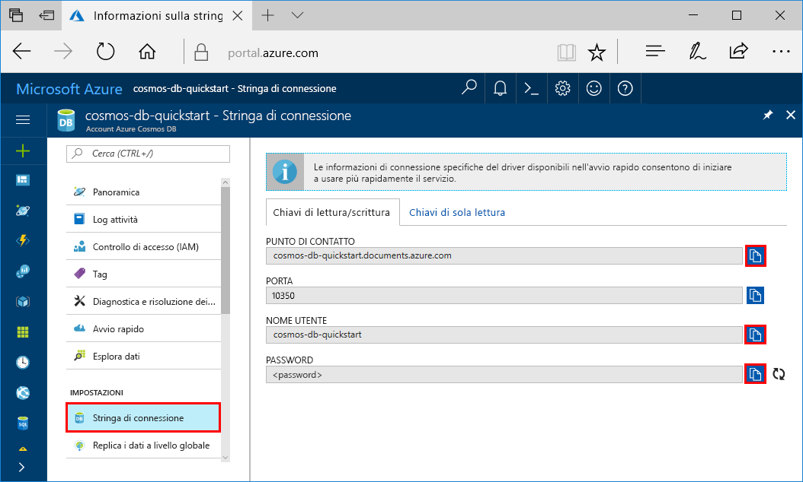
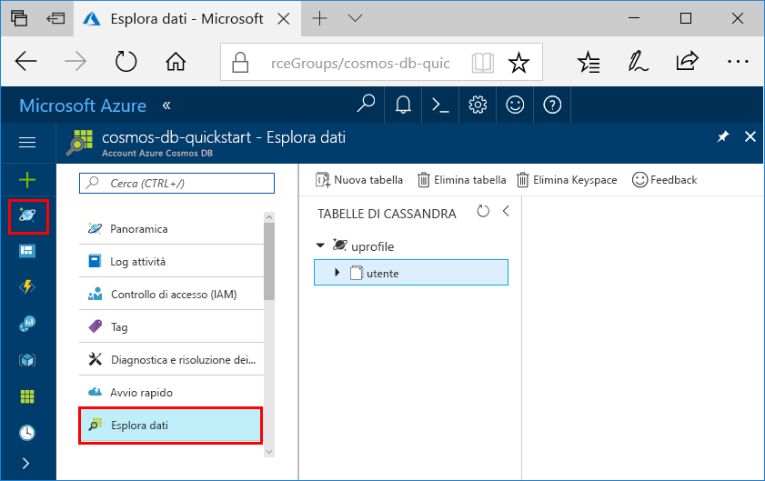

# <a name="quickstart-build-a-cassandra-app-with-python-and-azure-cosmos-db"></a>Guida introduttiva: Creare un'app Cassandra con Python e Azure Cosmos DB

Questa guida introduttiva mostra come usare Python e l'[API Cassandra](cassandra-introduction.md) di Azure Cosmos DB per creare un'app di profilo clonando un esempio di GitHub. Questa guida introduttiva illustra anche come creare un account Azure Cosmos DB usando il portale di Azure basato sul Web.

Azure Cosmos DB è il servizio di database di Microsoft multimodello distribuito a livello globale. È possibile creare ed eseguire rapidamente query su database di documenti, tabelle, valori chiave e grafi, sfruttando in ognuno dei casi i vantaggi offerti dalle funzionalità di scalabilità orizzontale e distribuzione globale alla base di Azure Cosmos DB.   

## <a name="prerequisites"></a>prerequisiti

[!INCLUDE [quickstarts-free-trial-note](../../includes/quickstarts-free-trial-note.md)]In alternativa, è possibile [provare gratuitamente Microsoft Azure Cosmos DB](https://azure.microsoft.com/try/cosmosdb/) senza una sottoscrizione di Azure e senza impegno.

Accesso al programma di anteprima dell'API Cassandra di Azure Cosmos DB. Se non è ancora stato richiesto l'accesso, [iscriversi adesso](cassandra-introduction.md#sign-up-now).

Eseguire anche queste operazioni:
* [Python](https://www.python.org/downloads/) versione 2.7.14
* [Git](http://git-scm.com/)
* [Driver Python per Apache Cassandra](https://github.com/datastax/python-driver)

## <a name="create-a-database-account"></a>Creare un account di database

Prima di poter creare un database di documenti, è necessario creare un account di Cassandra con Azure Cosmos DB.

[!INCLUDE [cosmos-db-create-dbaccount-cassandra](../../includes/cosmos-db-create-dbaccount-cassandra.md)]

## <a name="clone-the-sample-application"></a>Clonare l'applicazione di esempio

Clonare ora un'app per le API Cassandra da GitHub, impostare la stringa di connessione ed eseguirla. Come si noterà, è facile usare i dati a livello di codice. 

1. Aprire un prompt dei comandi, creare una nuova cartella denominata git-samples e quindi chiudere il prompt dei comandi.

    ```bash
    md "C:\git-samples"
    ```

2. Aprire una finestra del terminale Git, ad esempio Git Bash, ed eseguire il comando `cd` per passare a una nuova cartella in cui installare l'app di esempio.

    ```bash
    cd "C:\git-samples"
    ```

3. Eseguire il comando seguente per clonare l'archivio di esempio. Questo comando crea una copia dell'app di esempio nel computer in uso.

    ```bash
    git clone https://github.com/Azure-Samples/azure-cosmos-db-cassandra-python-getting-started.git
    ```

## <a name="review-the-code"></a>Esaminare il codice

Questo passaggio è facoltativo. Per scoprire in che modo le risorse del database vengono create nel codice, è possibile esaminare i frammenti di codice seguenti. I frammenti di codice provengono tutti dal file pyquickstart.py. In alternativa, è possibile passare ad [Aggiornare la stringa di connessione](#update-your-connection-string). 

* Il nome utente e la password vengono impostati nella pagina della stringa di connessione nel portale di Azure. Sostituire path\to\cert con il percorso del certificato X509.

   ```python
    ssl_opts = {
            'ca_certs': 'path\to\cert',
            'ssl_version': ssl.PROTOCOL_TLSv1_2
            }
    auth_provider = PlainTextAuthProvider( username=cfg.config['username'], password=cfg.config['password'])
    cluster = Cluster([cfg.config['contactPoint']], port = cfg.config['port'], auth_provider=auth_provider, ssl_options=ssl_opts)
    session = cluster.connect()
   
   ```

* `cluster` viene inizializzato con le informazioni di contactPoint. Il valore di contactPoint viene recuperato dal portale di Azure.

    ```python
   cluster = Cluster([cfg.config['contactPoint']], port = cfg.config['port'], auth_provider=auth_provider)
    ```

* `cluster` si connette all'API Cassandra di Azure Cosmos DB.

    ```python
    session = cluster.connect()
    ```

* Viene creato un nuovo keyspace.

    ```python
   session.execute('CREATE KEYSPACE IF NOT EXISTS uprofile WITH replication = {\'class\': \'NetworkTopologyStrategy\', \'datacenter1\' : \'1\' }')
    ```

* Viene creata una nuova tabella.

   ```
   session.execute('CREATE TABLE IF NOT EXISTS uprofile.user (user_id int PRIMARY KEY, user_name text, user_bcity text)');
   ```

* Le entità chiave/valore vengono inserite.

    ```Python
    insert_data = session.prepare("INSERT INTO  uprofile.user  (user_id, user_name , user_bcity) VALUES (?,?,?)")
    batch = BatchStatement()
    batch.add(insert_data, (1, 'LyubovK', 'Dubai'))
    batch.add(insert_data, (2, 'JiriK', 'Toronto'))
    batch.add(insert_data, (3, 'IvanH', 'Mumbai'))
    batch.add(insert_data, (4, 'YuliaT', 'Seattle'))
    ....
    session.execute(batch)
    ```

* Eseguire una query per ottenere tutti i valori di chiave.

    ```Python
    rows = session.execute('SELECT * FROM uprofile.user')
    ```  
    
* Eseguire una query per ottenere un valore di chiave.

    ```Python
    
    rows = session.execute('SELECT * FROM uprofile.user where user_id=1')
    ```  

## <a name="update-your-connection-string"></a>Aggiornare la stringa di connessione

Tornare ora al portale di Azure per recuperare le informazioni sulla stringa di connessione e copiarle nell'app. Questo consente all'app di comunicare con il database ospitato.

1. Nel [portale di Azure](http://portal.azure.com/) fare clic su **Stringa di connessione**. 

    Usare il  pulsante sul lato destro della schermata per copiare il primo valore, PUNTO DI CONTATTO.

    

2. Aprire il file `config.py` . 

3. Incollare il valore di PUNTO DI CONTATTO dal portale su `<FILLME>` nella riga 10.

    La riga 10 è ora simile alla seguente: 

    `'contactPoint': 'cosmos-db-quickstarts.cassandra.cosmosdb.azure.com:10350'`

4. Copiare il valore di NOME UTENTE dal portale e incollarlo su `<FILLME>` nella riga 6.

    La riga 6 è ora simile alla seguente: 

    `'username': 'cosmos-db-quickstart',`
    
5. Copiare il valore di PASSWORD dal portale e incollarlo su `<FILLME>` nella riga 8.

    La riga 8 è ora simile alla seguente:

    `'password' = '2Ggkr662ifxz2Mg==`';`

6. Salvare il file config.py.
    
## <a name="use-the-x509-certificate"></a>Usare il certificato X509

1. Se è necessario aggiungere Baltimore CyberTrust Root, il numero di serie è 02:00:00:b9 e l'impronta digitale SHA1 è d4🇩🇪20:d0:5e:66:fc:53:fe:1a:50:88:2c:78:db:28:52:ca:e4:74. Può essere scaricato da https://cacert.omniroot.com/bc2025.crt e salvato in un file locale con estensione cer

2. Aprire pyquickstart.py e modificare 'path\to\cert' in modo che punti al nuovo certificato.

3. Salvare pyquickstart.py.

## <a name="run-the-app"></a>Esecuzione dell'app

1. Usare il comando cd nel terminale git per passare alla cartella azure-cosmos-db-cassandra-python-getting-started. 

2. Per installare i moduli richiesti, eseguire i comandi seguenti:

    ```python
    python -m pip install cassandra-driver
    python -m pip install prettytable
    python -m pip install requests
    python -m pip install pyopenssl
    ```

2. Usare il comando seguente per avviare l'applicazione Node.js:

    ```
    python pyquickstart.py
    ```

3. Verificare i risultati previsti dalla riga di comando.

    Premere CTRL+C per arrestare l'esecuzione del programma e chiudere la finestra della console. 

    
    
    È ora possibile aprire Esplora dati nel portale di Azure per visualizzare, modificare e usare questi nuovi dati, nonché eseguire query su di essi. 

    

## <a name="review-slas-in-the-azure-portal"></a>Esaminare i contratti di servizio nel portale di Azure

[!INCLUDE [cosmosdb-tutorial-review-slas](../../includes/cosmos-db-tutorial-review-slas.md)]

## <a name="clean-up-resources"></a>Pulire le risorse

[!INCLUDE [cosmosdb-delete-resource-group](../../includes/cosmos-db-delete-resource-group.md)]

## <a name="next-steps"></a>Passaggi successivi

In questa guida introduttiva si è appreso come creare un account Azure Cosmos DB, come creare un contenitore con Esplora dati e come eseguire un'app. È ora possibile importare dati aggiuntivi nell'account Cosmos DB. 

> [!div class="nextstepaction"]
> [Importare i dati di Cassandra in Azure Cosmos DB](cassandra-import-data.md)

