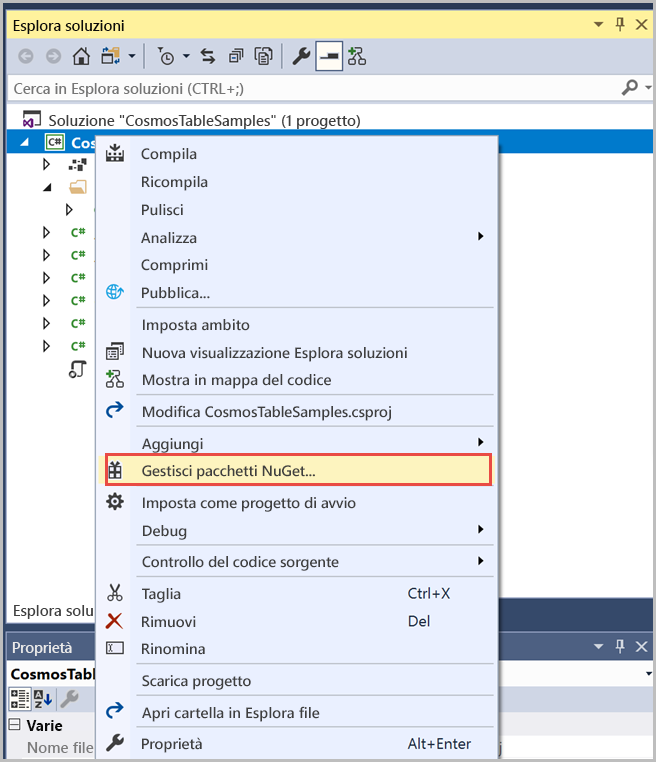
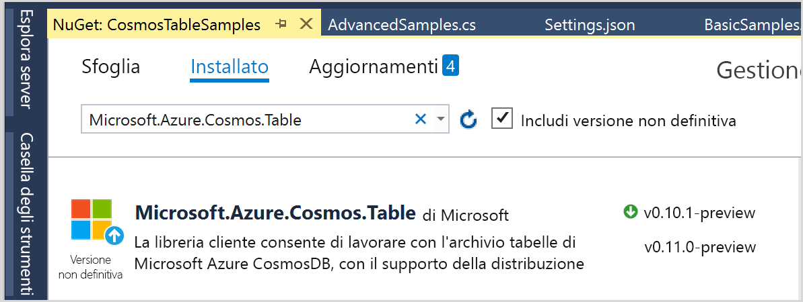

# <a name="quickstart-build-a-table-api-app-with-net-and-azure-cosmos-db"></a>Guida introduttiva: Creare un'app dell'API Tabelle con .NET e Azure Cosmos DB 

> [!div class="op_single_selector"]
> * [.NET](create-table-dotnet.md)
> * [Java](create-table-java.md)
> * [Node.js](create-table-nodejs.md)
> * [Python](create-table-python.md)
>  

Questa guida introduttiva descrive come usare .NET e l'[API Tabelle](table-introduction.md) di Azure Cosmos DB per creare un'app clonando un esempio di GitHub. La guida introduttiva illustra anche come creare un account Azure Cosmos DB e come usare Esplora dati per creare tabelle e entità nel portale di Azure basato sul Web.

Azure Cosmos DB è il servizio di database di Microsoft multimodello distribuito a livello globale. È possibile creare ed eseguire rapidamente query su database di documenti, coppie chiave-valore e grafi, sfruttando in ognuno dei casi i vantaggi offerti dalle funzionalità di scalabilità orizzontale e distribuzione globale alla base di Azure Cosmos DB. 

## <a name="prerequisites"></a>Prerequisiti

Se Visual Studio 2017 non è ancora installato, è possibile scaricare e usare la versione **gratuita** [Visual Studio 2017 Community Edition](https://www.visualstudio.com/downloads/). Durante l'installazione di Visual Studio abilitare **Sviluppo di Azure**.

[!INCLUDE [quickstarts-free-trial-note](../../includes/quickstarts-free-trial-note.md)]

## <a name="create-a-database-account"></a>Creare un account di database

> [!IMPORTANT] 
> Per lavorare con gli SDK dell'API Tabelle disponibili a livello generale, è necessario creare un nuovo account dell'API Tabelle. Gli account dell'API di tabella creati durante l'anteprima non sono supportati dagli SDK disponibili a livello generale.
>

[!INCLUDE [cosmos-db-create-dbaccount-table](../../includes/cosmos-db-create-dbaccount-table.md)]

## <a name="add-a-table"></a>Aggiungere una tabella

[!INCLUDE [cosmos-db-create-table](../../includes/cosmos-db-create-table.md)]

## <a name="add-sample-data"></a>Aggiungere dati di esempio

[!INCLUDE [cosmos-db-create-table-add-sample-data](../../includes/cosmos-db-create-table-add-sample-data.md)]

## <a name="clone-the-sample-application"></a>Clonare l'applicazione di esempio

A questo punto è possibile clonare un'app Table da GitHub, impostare la stringa di connessione ed eseguirla. Come si noterà, è facile usare i dati a livello di codice. 

1. Aprire un prompt dei comandi, creare una nuova cartella denominata git-samples e quindi chiudere il prompt dei comandi.

    ```bash
    md "C:\git-samples"
    ```

2. Aprire una finestra del terminale Git, ad esempio Git Bash, ed eseguire il comando `cd` per passare a una nuova cartella in cui installare l'app di esempio.

    ```bash
    cd "C:\git-samples"
    ```

3. Eseguire il comando seguente per clonare l'archivio di esempio. Questo comando crea una copia dell'app di esempio nel computer in uso.

    ```bash
    git clone https://github.com/Azure-Samples/storage-table-dotnet-getting-started.git
    ```
## <a name="open-the-sample-application-in-visual-studio"></a>Aprire l'applicazione di esempio in Visual Studio

1. In Visual Studio scegliere **Apri** dal menu **File**, quindi scegliere **Progetto/Soluzione**. 

    

2. Passare alla cartella in cui è stata clonata l'applicazione di esempio e aprire il file TableStorage.sln.

    

## <a name="update-your-connection-string"></a>Aggiornare la stringa di connessione

Tornare ora al portale di Azure per recuperare le informazioni sulla stringa di connessione e copiarle nell'app. Questo consente all'app di comunicare con il database ospitato. 

1. Nel [portale di Azure](http://portal.azure.com/) fare clic su **Stringa di connessione**. 

    Usare il pulsante di copia sul lato destro della finestra per copiare la **STRINGA DI CONNESSIONE PRIMARIA**.

    

2. In Visual Studio aprire il file App.config. 

3. Rimuovere il commento di StorageConnectionString alla riga 8 e impostare come commento StorageConnectionString alla riga 7, perché questa esercitazione non usa l'emulatore di archiviazione di Azure SDK. Ora le righe 7 e 8 dovrebbero essere simili a quanto segue:

    ```
    <!--key="StorageConnectionString" value="UseDevelopmentStorage=true;" />-->
    <add key="StorageConnectionString" value="DefaultEndpointsProtocol=https;AccountName=[AccountName];AccountKey=[AccountKey]" />
    ```

4. Incollare la **STRINGA DI CONNESSIONE PRIMARIA** dal portale nel valore StorageConnectionString alla riga 8. Incollare la stringa tra virgolette. 

    > [!IMPORTANT]
    > Se l'endpoint usa documents.azure.com, ovvero si ha un account di anteprima, è necessario creare un [nuovo account dell'API Tabelle](#create-a-database-account) per lavorare con l'SDK per l'API Tabelle disponibile a livello generale. 
    > 

    Ora la riga 8 dovrebbe essere simile a quanto segue:

    ```
    <add key="StorageConnectionString" value="DefaultEndpointsProtocol=https;AccountName=<account name>;AccountKey=<account-key>;TableEndpoint=https://<account name>.table.cosmosdb.azure.com;" />
    ```

5. Premere CTRL+S per salvare il file App.config.

L'app è stata aggiornata con tutte le informazioni necessarie per comunicare con Azure Cosmos DB. 

## <a name="build-and-deploy-the-app"></a>Compilare e distribuire l'app

1. In Visual Studio fare clic con il pulsante destro del mouse sul progetto **TableStorage** in **Esplora soluzioni** e quindi scegliere **Gestisci pacchetti NuGet**. 

   
2. Nella casella **Sfoglia** di NuGet digitare *Microsoft.Azure.CosmosDB.Table*. Verrà trovata la libreria client per l'API Tabelle di Cosmos DB. Si noti che questa libreria è attualmente disponibile solo per .NET Standard. Non è ancora disponibile per .NET Core.
   
   

3. Fare clic su **Installa** per installare la libreria **Microsoft.Azure.CosmosDB.Table**. Vengono installati il pacchetto dell'API Tabelle di Azure Cosmos DB e tutte le dipendenze.

    

4. Aprire BasicSamples.cs. Fare clic con il pulsante destro del mouse sulla riga 52, scegliere **Punto di interruzione**, quindi selezionare **Inserisci punto di interruzione**. Inserire un altro punto di interruzione alla riga 55.

    

5. Premere F5 per eseguire l'applicazione.

    La finestra della console mostra il nome del nuovo database della tabella (in questo caso, demo91ab4) in Azure Cosmos DB. 
    
    

    Se si ottiene un errore di dipendenze, vedere [Risoluzione dei problemi](table-sdk-dotnet.md#troubleshooting).

    Quando si raggiunge il primo punto di interruzione, tornare a Esplora dati nel portale di Azure. Fare clic sul pulsante **Aggiorna**, espandere la tabella demo* e fare clic su **Entità**. La scheda **Entità** a destra illustra la nuova entità che è stata aggiunta per Walter Harp. Si noti che il numero di telefono per la nuova entità è 425-555-0101.

    
    
6. Chiudere la scheda **Entità** in Esplora dati.
    
7. Premere F5 per eseguire l'app fino al punto di interruzione successivo. 

    Quando si raggiunge il punto di interruzione, passare al portale di Azure, fare clic di nuovo su **Entità** per aprire la scheda **Entità** e notare che il numero di telefono è stato aggiornato a 425-555-0105.

8. Premere F5 per eseguire l'app. 
 
   L'app aggiunge le entità da usare in un'app di esempio avanzata attualmente non supportata dall'API Tabelle. L'app elimina quindi la tabella creata dall'app di esempio.

9. Nella finestra della console premere INVIO per terminare l'esecuzione dell'app. 
  

## <a name="review-slas-in-the-azure-portal"></a>Esaminare i contratti di servizio nel portale di Azure

[!INCLUDE [cosmosdb-tutorial-review-slas](../../includes/cosmos-db-tutorial-review-slas.md)]

## <a name="clean-up-resources"></a>Pulire le risorse

[!INCLUDE [cosmosdb-delete-resource-group](../../includes/cosmos-db-delete-resource-group.md)]

## <a name="next-steps"></a>Passaggi successivi

In questa guida di avvio rapido si è appreso come creare un account Azure Cosmos DB, come creare una tabella con Esplora dati e come eseguire un'app.  È ora possibile eseguire query sui dati tramite l'API di tabella.  

> [!div class="nextstepaction"]
> [Importare i dati delle tabelle nell'API Tabelle](table-import.md)

