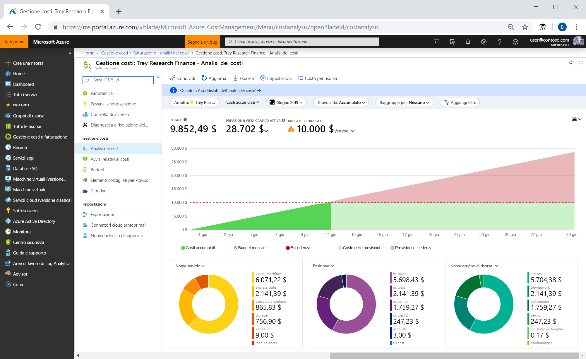
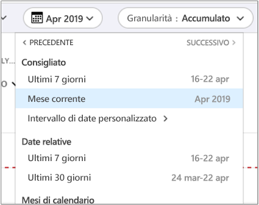
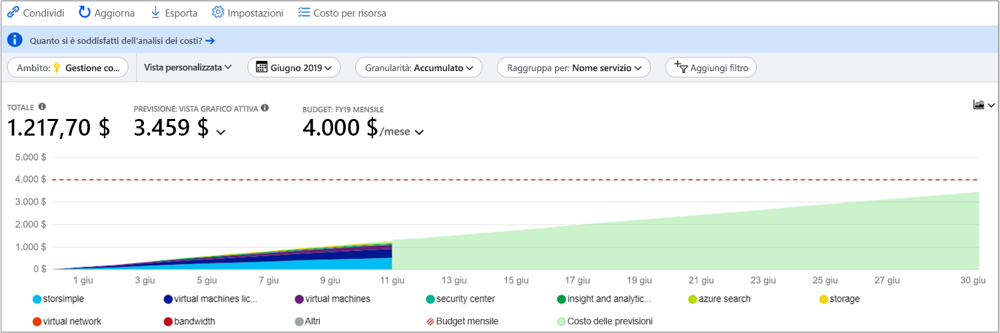
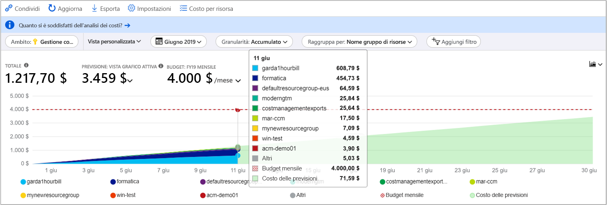

# Guida introduttiva - Esplorare e analizzare i costi di Azure con l'analisi dei costi

Per poter controllare al meglio e ottimizzare i costi di Azure, è necessario conoscere l'origine dei costi all'interno dell'organizzazione. È anche utile sapere quanto costano i servizi e quali ambienti e sistemi supportano. È fondamentale avere visibilità sul dettaglio dei costi per comprendere in modo approfondito i modelli di spesa aziendali, che possono essere usati per applicare meccanismi di controllo dei costi, ad esempio i budget.

In questa guida introduttiva si usa l'analisi dei costi per esplorare e analizzare i costi aziendali. È possibile visualizzare i costi aggregati per l'organizzazione per capire dove si accumulano i costi nel tempo e identificare le tendenze di spesa. È possibile visualizzare i costi accumulati nel corso del tempo per stimare le tendenze dei costi mensili, trimestrali o addirittura annuali rispetto a un budget. Un budget è utile per rispettare eventuali vincoli finanziari oppure per visualizzare i costi giornalieri o mensili per isolare le irregolarità di spesa. È anche possibile scaricare i dati del report corrente per un'ulteriore analisi o per usarli in un sistema esterno.

In questa guida introduttiva si apprende come:

- Esaminare i costi nell'analisi dei costi
- Personalizzare le visualizzazioni dei costi
- Scaricare i dati dell'analisi dei costi

## Prerequisiti

L'analisi dei costi è disponibile per tutti i clienti con [Contratto Enterprise](https://azure.microsoft.com/pricing/enterprise-agreement/). È necessario avere l'accesso in lettura ad almeno uno degli ambiti seguenti per visualizzare i dati dei costi. Per altre informazioni sull'assegnazione dell'accesso ai dati di Gestione costi, vedere [Assign access to data](assign-access-acm-data.md) (Assegnare l'accesso ai dati).

- Account di fatturazione
- department
- Account di registrazione
- Gruppo di gestione
- Sottoscrizione
- Gruppo di risorse

## Accedere ad Azure

- Accedere al portale di Azure all'indirizzo http://portal.azure.com.

## Esaminare i costi nell'analisi dei costi

Per esaminare i costi con analisi dei costi, nel portale di Azure, passare a **Gestione costi + Fatturazione** &gt; **Gestione costi** &gt; **Cambia ambito**, scegliere un ambito e quindi fare clic su **Selezionare**.

L'ambito selezionato viene usato attraverso Gestione costi per fornire il consolidamento dati e per controllare l'accesso alle informazioni sui costi. Quando si usano gli ambiti non vengono multi-selezionati. Invece, si seleziona un ambito più ampio a cui altri utenti si avvicinano e quindi si filtra in basso ciò che si desidera. È importante comprendere questo perché alcuni utenti non devono avere accesso a un ambito padre a cui si avvicinano gli ambiti figlio.

Aprire **Apri Analisi dei costi**.

La visualizzazione dell'analisi dei costi iniziale include le aree seguenti:

**Totale**: visualizza i costi totali per il mese corrente.

**Budget**: visualizza il limite di spesa per l'ambito selezionato, se disponibile.

**Costo accumulato**: visualizza le spese giornaliere accumulate totali, a partire dall'inizio del mese. Dopo aver [creato un budget](tutorial-acm-create-budgets.md) per l'account di fatturazione o la sottoscrizione, è possibile visualizzare rapidamente la tendenza di spesa rispetto al budget. Passare il puntatore del mouse su una data per visualizzare il costo accumulato per quel giorno.

**Grafici pivot (ad anello)** - Offrono pivot dinamici, suddividendo il costo totale in base a un set comune di proprietà standard. Mostrano i costi accumulati per il mese corrente, in ordine decrescente. È possibile cambiare i grafici pivot in qualsiasi momento selezionando un pivot diverso. I costi vengono classificati in base a servizio (categoria del contatore), località (area) e ambito figlio per impostazione predefinita. Ad esempio, gli account di registrazione sotto gli account di fatturazione, i gruppi di risorse sotto le sottoscrizioni e le risorse sotto i gruppi di risorse.

## Personalizzare le visualizzazioni dei costi

La visualizzazione predefinita fornisce risposte rapide alle domande più comuni, ad esempio:

- Quanto è stato speso?
- Il budget verrà rispettato?

Esistono tuttavia molti i casi in cui è necessaria un'analisi più approfondita. La personalizzazione inizia nella parte superiore della pagina, con la selezione della data.

Per impostazione predefinita, l'analisi dei costi mostra i dati per il mese corrente. Usare il selettore di data per passare rapidamente all'ultimo mese, al mese corrente, al trimestre di calendario corrente, all'anno di calendario corrente o a un intervallo di date personalizzato di propria scelta. Selezionare l'ultimo mese è il modo più rapido per analizzare la fattura di Azure più recente e riconciliare facilmente le spese. Le opzioni relative a trimestre e anno corrente consentono di tenere traccia dei costi rispetto ai budget a lungo termine. È anche possibile selezionare un intervallo di date diverso, ad esempio, un singolo giorno, gli ultimi sette giorni o un altro periodo fino a un anno prima del mese corrente.

Per impostazione predefinita, l'analisi dei costi mostra i costi **accumulati**. I costi accumulati includono tutti i costi per ogni singolo giorno oltre a quelli dei giorni precedenti, con una visualizzazione in continua crescita dei costi giornalieri accumulati. Questa visualizzazione è ottimizzata per mostrare la tendenza rispetto a un budget per l'intervallo di tempo selezionato.

È disponibile anche una visualizzazione **giornaliera** che mostra i costi sostenuti ogni giorno. La visualizzazione giornaliera non visualizza una tendenza di incremento. La visualizzazione è progettata per mostrare eventuali irregolarità, ad esempio impennate o flessioni dei costi da un giorno all'altro. Se si seleziona un budget, la visualizzazione giornaliera mostra anche una stima del budget giornaliero. Quando i costi giornalieri sono costantemente al di sopra del budget giornaliero stimato, è probabile che il budget mensile venga superato. Il budget stimato giornaliero è semplicemente un mezzo per poter visualizzare il budget a un livello più basilare. Quando si verificano fluttuazioni nei costi giornalieri, il confronto tra il budget giornaliero stimato e il budget mensile è meno preciso.

È possibile usare l'opzione **Raggruppa per** per selezionare una categoria di gruppi e cambiare i dati visualizzati nel grafico ad area del totale nella parte superiore. Il raggruppamento consente di visualizzare rapidamente come la spesa viene organizzata in base alle proprietà di risorse e utilizzo comuni, come un gruppo di risorse o i tag delle risorse. Per raggruppare in base ai tag, selezionare la chiave del tag in base alla quale si vuole raggruppare: i costi verranno suddivisi in base al rispettivo valore per tale tag, con un segmento extra per le risorse a cui non è applicato quel tag. Nota: Gestione costi supporta solo i tag delle risorse a partire dalla data in cui i tag vengono applicati direttamente alla risorsa. I tag del gruppo di risorse non sono ancora supportati. Ecco una visualizzazione dei costi dei servizi di Azure nell'ultimo mese.

I grafici pivot nel grafico principale mostrano diversi raggruppamenti per offrire un quadro più ampio dei costi complessivi per il periodo di tempi e i filtri selezionati. Selezionare una proprietà o un tag per visualizzare i costi aggregati per qualsiasi dimensione. Il set completo di dati per la visualizzazione totale è visibile nella parte inferiore della schermata, espandendo il menu **Dati** o selezionando **Esporta > Scarica CSV** nella parte superiore della schermata. Di seguito è riportato un esempio del menu dati per i gruppi di risorse.

L'immagine precedente mostra i nomi dei gruppi di risorse. Anche se è possibile raggruppare in base a tag per visualizzare i costi totali per ogni tag, la visualizzazione di tutti i tag per risorsa o gruppo di risorse non è disponibile in nessuna delle visualizzazioni di analisi dei costi.

Quando si raggruppano i costi in base a un attributo specifico, vengono visualizzati in ordine decrescente i primi 10 gruppi di risorse che hanno contribuito maggiormente ai costi. Se sono presenti più di 10 gruppi, vengono visualizzati i primi nove gruppi, oltre a un gruppo **Others** (Altri), che riunisce tutti gli altri gruppi. Quando si raggruppa in base ai tag, è anche possibile visualizzare un gruppo **Senza tag** a cui non è applicata la chiave del tag. **Senza tag** è sempre ultimo, anche se esistono più costi senza tag che costi con tag. Se sono presenti 10 o più valori di tag, i costi senza tag faranno parte del gruppo **Altri**.

Le macchine virtuali, le risorse di rete e le risorse di archiviazione *classiche* (Gestione dei servizi di Azure o ASM) non condividono dati di fatturazione dettagliati. Tali risorse vengono unite nel gruppo **Classic services** (Servizi classici) quando si raggruppano i costi.

## Scaricare i dati dell'analisi dei costi

È possibile **scaricare** informazioni dall'analisi dei costi per generare un file CSV per tutti i dati attualmente visualizzati nel portale di Azure. Eventuali filtri o raggruppamenti applicati vengono inclusi nel file. Nel file CSV vengono inclusi anche i dati sottostanti per il grafico del totale della parte superiore, che non sono visualizzati attivamente.

## Passaggi successivi

Passare alla prima esercitazione per apprendere come creare e gestire i budget.

> [!div class="nextstepaction"]
> [Creare e gestire i budget](tutorial-acm-create-budgets.md)
