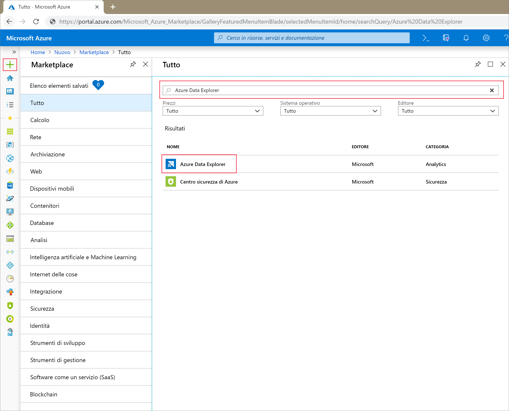
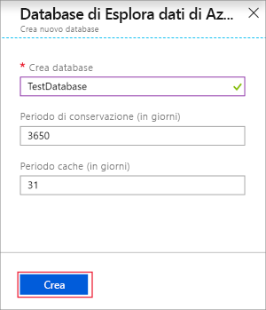

# Guida introduttiva: Creare un database e un cluster di Esplora dati di Azure

> [!div class="op_single_selector"]
> * [Portale](create-cluster-database-portal.md)
> * [CLI](create-cluster-database-cli.md)
> * [PowerShell](create-cluster-database-powershell.md)
> * [C#](create-cluster-database-csharp.md)
> * [Python](create-cluster-database-python.md)
>  

Esplora dati di Azure è un servizio di esplorazione dati rapido e a scalabilità elevata per dati di log e di telemetria. Per usare Esplora dati di Azure, è necessario prima creare un cluster e quindi uno o più database al suo interno. Quindi si inseriscono (caricano) i dati in un database per poter eseguire query. In questa guida introduttiva vengono creati un cluster e un database.

Se non si ha una sottoscrizione di Azure, creare un [account Azure gratuito](https://azure.microsoft.com/free/) prima di iniziare.

## Accedere al portale di Azure

Accedere al [portale di Azure](https://portal.azure.com/).

## Creare un cluster

Creare un cluster di Esplora dati di Azure in un gruppo di risorse di Azure con un set definito di risorse di calcolo e archiviazione.

1. Selezionare il pulsante **Crea una risorsa** (+) nell'angolo superiore sinistro del portale.

1. Cercare *Esplora dati di Azure*.

   

1. In **Esplora dati di Azure** selezionare **Crea** nella parte inferiore della schermata.

1. Compilare il modulo dei dettagli del cluster di base con le informazioni seguenti.

   

    **Impostazione** | **Valore consigliato** | **Descrizione campo**
    |---|---|---|
    | Sottoscrizione | Sottoscrizione in uso | Selezionare la sottoscrizione di Azure da usare per il cluster.|
    | Gruppo di risorse | *test-resource-group* | Usare un gruppo di risorse esistente oppure crearne uno nuovo. |
    | Nome cluster | Nome univoco del cluster | Scegliere un nome univoco che identifica il cluster. Ad esempio *mydataexplorercluster*. Il nome di dominio *[area].kusto.windows.net* viene accodato al nome del cluster specificato. Il nome può contenere solo lettere minuscole e numeri. Deve avere una lunghezza compresa tra 3 e 22 caratteri.
    | Località | *Stati Uniti occidentali* | Per questa guida introduttiva selezionare *Stati Uniti occidentali*. Per un sistema di produzione, selezionare l'area più appropriata in base alle esigenze.
    | Specifiche dell'ambiente di calcolo | *D13_v2* | Per questa guida introduttiva, selezionare la specifica con il prezzo più basso. Per un sistema di produzione, selezionare la specifica più appropriata in base alle esigenze.
    | | |

1. Selezionare **Rivedi e crea** per rivedere i dettagli del cluster e **Crea** per effettuarne il provisioning. Per il provisioning sono in genere necessari circa 10 minuti.

1. Una volta completata la distribuzione, selezionare **Vai alla risorsa**.

    

## Creare un database

A questo punto si è pronti per il secondo passaggio del processo: la creazione del database.

1. Nella scheda **Panoramica** selezionare **Crea database**.

    

1. Compilare il modulo con le informazioni seguenti.

    

    **Impostazione** | **Valore consigliato** | **Descrizione campo**
    |---|---|---|
    | Nome database | *TestDatabase* | Il nome del database deve essere univoco all'interno del cluster.
    | Periodo di conservazione | *3650* | Intervallo di tempo (in giorni) per cui è garantito che i dati rimangano disponibili per le query. L'intervallo di tempo viene misurato dal momento in cui i dati vengono inseriti.
    | Cache period (Periodo cache) | *31* | L'intervallo di tempo (in giorni) per cui mantenere i dati sottoposti frequentemente a query disponibili nell'archiviazione su unità SSD o nella RAM, invece che nell'archiviazione a lungo termine.
    | | | |

1. Selezionare **Crea** per creare il database. Per la creazione è in genere necessario meno di un minuto. Una volta completato il processo, si torna alla scheda **Panoramica** del cluster.

## Eseguire i comandi di base nel database

Dopo aver creato un cluster e un database, è possibile eseguire query e comandi. Nel database non sono ancora presenti dati, ma è comunque possibile vedere come funzionano gli strumenti.

1. Nel cluster selezionare **Query**. Incollare il comando `.show databases` nella finestra di query e quindi selezionare **Esegui**.

    

    Nel set di risultati è presente **TestDatabase**, l'unico database nel cluster.

1. Incollare il comando `.show tables` nella finestra di query e selezionare **Esegui**.

    Questo comando restituisce un set di risultati vuoto perché ancora non sono presenti tabelle. Verrà aggiunta una tabella nel prossimo articolo di questa serie.

## Arrestare e riavviare il cluster

È possibile arrestare e riavviare un cluster in base alle esigenze aziendali.

1. Per arrestare il cluster, nella parte superiore della scheda **Panoramica** selezionare **Arresta**.

    Quando il cluster viene arrestato, i dati non sono disponibili per le query e non è possibile inserire nuovi dati.

1. Per riavviare il cluster, nella parte superiore della scheda **Panoramica** selezionare **Avvia**.

    Quando il cluster viene riavviato, sono necessari circa 10 minuti prima che diventi disponibile, come quando ne è stato effettuato il provisioning per la prima volta. È necessario altro tempo per caricare i dati nella cache ad accesso frequente.  

## Pulire le risorse

Se si prevede di seguire altre guide introduttive ed esercitazioni, non eliminare le risorse create. In caso contrario, pulire il gruppo di risorse per evitare l'addebito di costi.

1. Nel portale di Azure selezionare **Gruppi di risorse** all'estrema sinistra e quindi selezionare il gruppo di risorse che contiene il cluster di Esplora dati.  

1. Selezionare **Elimina gruppo di risorse** per eliminare l'intero gruppo di risorse. Se si usa un gruppo di risorse esistente, è possibile scegliere di eliminare solo il cluster di Esplora dati.

## Passaggi successivi

> [!div class="nextstepaction"]
> [Guida introduttiva: Inserire dati dall'hub eventi in Esplora dati di Azure](ingest-data-event-hub.md)

