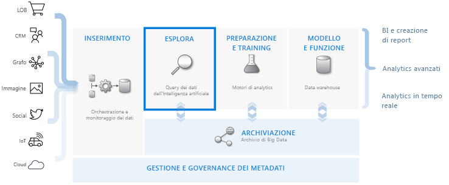
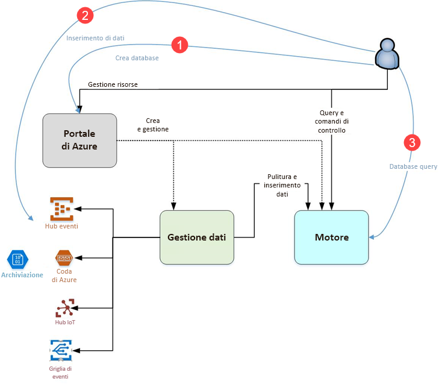

# Informazioni su Esplora dati di Azure

Esplora dati di Azure è un servizio di esplorazione dei dati rapido e a scalabilità elevata per dati di log e di telemetria. Consente di gestire i numerosi flussi di dati generati dal software moderno, in modo da poter raccogliere, archiviare e analizzare i dati. Esplora dati di Azure è ideale per l'analisi di grandi volumi di dati eterogenei da qualsiasi origine dati, ad esempio siti Web, applicazioni, dispositivi IoT e altro ancora. Questi dati vengono usati per la diagnostica, il monitoraggio, la creazione di report, l'apprendimento automatico e altre funzionalità di analisi. Esplora dati di Azure semplifica l'inserimento dei dati e consente di eseguire complesse query ad hoc sui dati in pochi secondi.

## Caratteristiche di Esplora dati di Azure

- Scala rapidamente fino a terabyte di dati, in pochi minuti, consentendo veloci iterazioni dell'esplorazione dei dati per individuare le informazioni pertinenti.

- Offre un linguaggio di query innovativo, ottimizzato per l'analisi dei dati a prestazioni elevate.

- Supporta l'analisi di volumi elevati di dati eterogenei (strutturati e non strutturati).

- Consente di creare e distribuire esattamente ciò che serve integrandosi con altri servizi per fornire una soluzione di analisi dei dati completa, potente e interattiva.

## Flusso di lavoro di data warehousing

Esplora dati di Azure si integra con altri importanti servizi per offrire una soluzione end-to-end che include raccolta, inserimento, archiviazione, indicizzazione, query e visualizzazione dei dati. Svolge un ruolo fondamentale nel flusso di data warehousing, dove esegue il passaggio di **ESPLORAZIONE** su terabyte di dati non elaborati diversi.

Esplora dati di Azure supporta diversi metodi di inserimento, tra cui i connettori per servizi comuni come l'hub eventi, l'inserimento a livello di codice tramite SDK, ad esempio .NET e Python, e l'accesso diretto al motore per scopi di esplorazione. Esplora dati di Azure si integra con servizi di analisi e modellazione per un'ulteriore analisi e visualizzazione dei dati.

## Flusso di Esplora dati di Azure

Il diagramma seguente illustra i diversi aspetti dell'uso di Esplora dati di Azure.

L'uso di Esplora dati di Azure in genere segue questo modello:

1. **Creare il database:** creare un *cluster* e quindi creare uno o più *database* al suo interno. [Guida introduttiva: Creare un database e un cluster di Esplora dati di Azure](create-cluster-database-portal.md)

1. **Inserire dati:** caricare i dati nelle tabelle del database per poter eseguire query. [Guida introduttiva: Inserire dati dall'hub eventi in Esplora dati di Azure](ingest-data-event-hub.md)

1. **Eseguire query sul database:** usare l'applicazione Web per eseguire, esaminare e condividere le query e i risultati. È disponibile nel portale di Azure e come applicazione autonoma. È anche possibile inviare le query a livello di codice (con un SDK) o a un endpoint dell'API REST. [Guida introduttiva: Eseguire query sui dati in Esplora dati di Azure](web-query-data.md)

## Esperienza di query

Una query in Esplora dati di Azure è una richiesta di sola lettura per elaborare i dati e restituire i risultati di questa elaborazione, senza modificare i dati o i metadati. Si continuano a perfezionare le query fino a quando non si completa l'analisi. Esplora dati di Azure semplifica questo processo grazie all'esperienza di query ad hoc molto veloce.

Esplora dati di Azure gestisce in modo ugualmente efficiente grandi quantità di dati strutturati, semi-strutturati (tipi annidati simili a JSON) e non strutturati (con testo libero). Consente di cercare termini di testo specifici, individuare determinati eventi ed eseguire calcoli basati su metriche sui dati strutturati. Esplora dati di Azure integra i log di testo non strutturati con numeri e dimensioni strutturati estraendo i valori in fase di esecuzione dai campi di testo in formato libero. L'esplorazione dei dati è semplificata grazie alla combinazione di operazioni di indicizzazione del testo, archivio colonne e serie temporali veloci.

Le funzionalità di Esplora dati di Azure vengono estese da altri servizi basati su un linguaggio di query avanzato, tra cui i [log di Monitoraggio di Azure](/azure/log-analytics/), [Application Insights](/azure/application-insights/), [Time Series Insights](/azure/time-series-insights/) e [Windows Defender Advanced Threat Protection](/windows/security/threat-protection/windows-defender-atp/windows-defender-advanced-threat-protection/).

## Commenti e suggerimenti

Tutti i commenti e suggerimenti su Esplora dati di Azure e sul relativo linguaggio di query sono bene accetti ed è possibile inviarli nei modi seguenti:

- Domande
  - [Stack Overflow](https://stackoverflow.com/questions/tagged/azure-data-explorer)
  - [Microsoft Tech Community](https://techcommunity.microsoft.com/t5/Azure-Data-Explorer/bd-p/Kusto)
  - [MSDN](https://social.msdn.microsoft.com/Forums/en-US/home?forum=AzureKusto)
- [Condividere suggerimenti per il prodotto in User Voice](https://aka.ms/AzureDataExplorer.UserVoice)

## Passaggi successivi

[Guida introduttiva: Creare un database e un cluster di Esplora dati di Azure](create-cluster-database-portal.md)

[Guida introduttiva: Inserire dati dall'hub eventi in Esplora dati di Azure](ingest-data-event-hub.md)

[Guida introduttiva: Eseguire query sui dati in Esplora dati di Azure](web-query-data.md)
