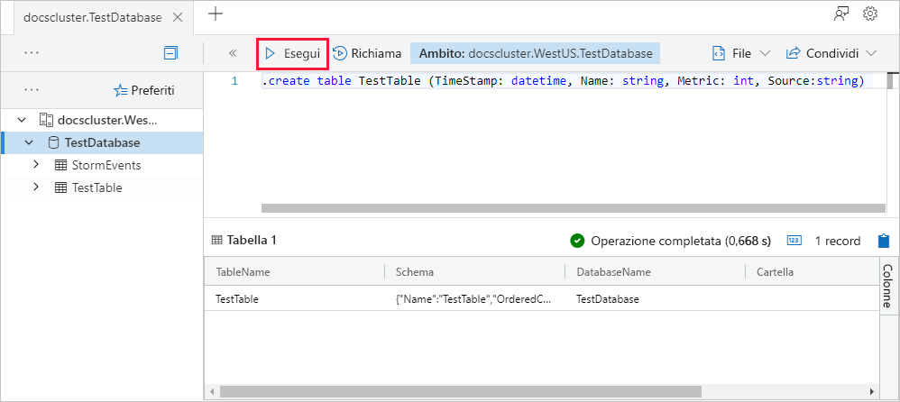
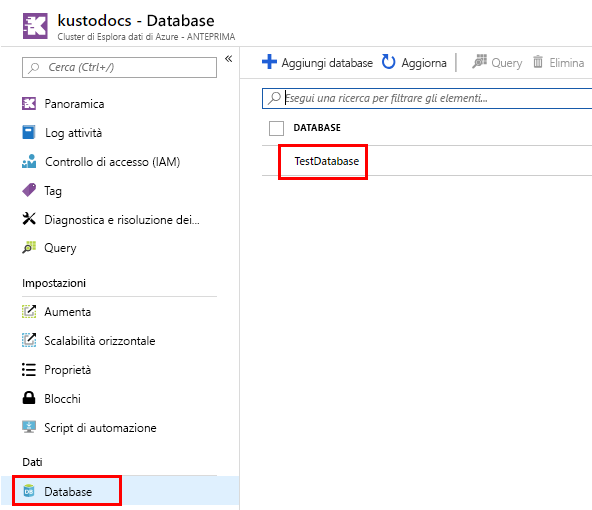
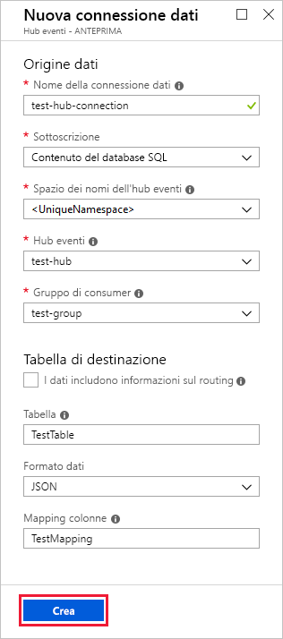
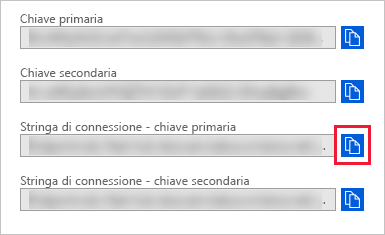
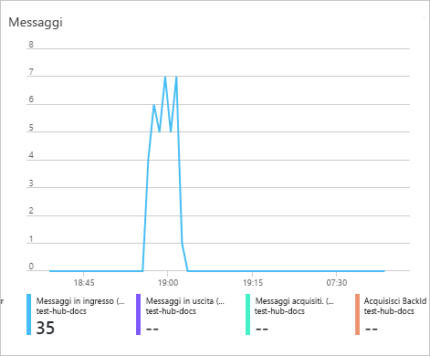

# <a name="quickstart-ingest-data-from-event-hub-into-azure-data-explorer"></a>Guida introduttiva: Inserire dati dall'hub eventi in Esplora dati di Azure

Esplora dati di Azure è un servizio di esplorazione dati rapido e a scalabilità elevata per dati di log e di telemetria. Esplora dati di Azure consente l'inserimento (caricamento dei dati) da Hub eventi, una piattaforma di Big Data streaming e un servizio di inserimento di eventi. Hub eventi è in grado di elaborare milioni di eventi al secondo quasi in tempo reale. In questa guida introduttiva verrà creato un hub eventi, a cui ci si connetterà da Esplora dati di Azure per visualizzare il flusso di dati attraverso il sistema.

Se non si ha una sottoscrizione di Azure, creare un [account Azure gratuito](https://azure.microsoft.com/free/) prima di iniziare.

## <a name="prerequisites"></a>Prerequisiti

Oltre a una sottoscrizione di Azure, è necessario quanto segue per completare questa guida introduttiva:

* [Un cluster e un database di test](create-cluster-database-portal.md)

* [Un'app di esempio](https://github.com/Azure-Samples/event-hubs-dotnet-ingest) che genera i dati

* [Visual Studio 2017 versione 15.3.2 o successiva](https://www.visualstudio.com/vs/) per eseguire l'app di esempio

## <a name="sign-in-to-the-azure-portal"></a>Accedere al portale di Azure

Accedere al [portale di Azure](https://portal.azure.com/).

## <a name="create-an-event-hub"></a>Creare un hub eventi

In questa guida introduttiva vengono generati dati di esempio che sono inviati a un hub eventi. Il primo passaggio consiste nel creare un hub eventi. A tale scopo, usare un modello di Azure Resource Manager nel portale di Azure.

1. Selezionare il pulsante seguente per avviare la distribuzione.

    [](https://portal.azure.com/#create/Microsoft.Template/uri/https%3A%2F%2Fraw.githubusercontent.com%2FAzure%2Fazure-quickstart-templates%2Fmaster%2F201-event-hubs-create-event-hub-and-consumer-group%2Fazuredeploy.json)

    Il pulsante **Distribuzione in Azure** consente di passare al portale di Azure per compilare un modulo di distribuzione.

    

1. Selezionare la sottoscrizione in cui si vuole creare l'hub eventi e creare un gruppo di risorse denominato *test-hub-rg*.

    

1. Compilare il modulo con le informazioni seguenti.

    

    Usare i valori predefiniti per tutte le impostazioni non elencate nella tabella seguente.

    **Impostazione** | **Valore consigliato** | **Descrizione campo**
    |---|---|---|
    | Sottoscrizione | Sottoscrizione in uso | Selezionare la sottoscrizione di Azure da usare per l'hub eventi.|
    | Gruppo di risorse | *test-hub-rg* | Creare un nuovo gruppo di risorse. |
    | Località | *Stati Uniti occidentali* | Per questa guida introduttiva selezionare *Stati Uniti occidentali*. Per un sistema di produzione, selezionare l'area più appropriata in base alle esigenze.
    | Nome spazio dei nomi | Nome dello spazio dei nomi univoco | Scegliere un nome univoco per identificare lo spazio dei nomi. Ad esempio, *spazionomitest*. Il nome di dominio *servicebus.windows.net* viene accodato al nome specificato. Il nome può contenere solo lettere, numeri e trattini. Il nome deve iniziare con una lettera e deve terminare con una lettera o un numero. La lunghezza del valore deve essere compresa tra 6 e 50 caratteri.
    | Nome hub eventi | *test-hub* | L'hub eventi si trova nello spazio dei nomi, che fornisce un contenitore di ambito univoco. Il nome dell'hub eventi deve essere univoco all'interno dello spazio dei nomi. |
    | Consumer group name (Nome gruppo di consumer) | *test-group* | I gruppi di consumer consentono a più applicazioni di avere ognuna una visualizzazione distinta del flusso di eventi. |
    | | |

1. Selezionare **Acquisto** per indicare che si stanno creando risorse nella sottoscrizione.

1. Selezionare **Notifiche** sulla barra degli strumenti (icona a forma di campana) per monitorare il processo di provisioning. Il completamento della distribuzione potrebbe richiedere diversi minuti. Al termine, è possibile procedere con il passaggio successivo.

## <a name="create-a-target-table-in-azure-data-explorer"></a>Creare una tabella di destinazione in Esplora dati di Azure

Verrà ora creata una tabella in Esplora dati di Azure a cui saranno inviati i dati da Hub eventi. La tabella viene creata nel cluster e nel database di cui è stato effettuato il provisioning in **Prerequisiti**.

1. Nel portale di Azure, in corrispondenza del cluster selezionare **Query**.

    

1. Copiare il comando seguente nella finestra e selezionare **Esegui**.

    ```Kusto
    .create table TestTable (TimeStamp: datetime, Name: string, Metric: int, Source:string)
    ```

    

1. Copiare il comando seguente nella finestra e selezionare **Esegui**.

    ```Kusto
    .create table TestTable ingestion json mapping 'TestMapping' '[{"column":"TimeStamp","path":"$.timeStamp","datatype":"datetime"},{"column":"Name","path":"$.name","datatype":"string"},{"column":"Metric","path":"$.metric","datatype":"int"},{"column":"Source","path":"$.source","datatype":"string"}]'
    ```
    Questo comando esegue il mapping dei dati JSON in ingresso ai nomi di colonna e ai tipi di dati usati durante la creazione della tabella.

## <a name="connect-to-the-event-hub"></a>Connettersi all'hub eventi

A questo punto è possibile connettersi all'hub eventi da Esplora dati di Azure per consentire lo streaming del flusso di dati dall'hub eventi alla tabella di test.

1. Selezionare **Notifiche** sulla barra degli strumenti per verificare che la distribuzione dell'hub eventi abbia avuto esito positivo.

1. Nel cluster creato selezionare **Database** e quindi **TestDatabase**.

    

1. Selezionare **Inserimento dati** e quindi **Aggiungi connessione dati**.

    

1. Compilare il modulo con le informazioni seguenti e quindi selezionare **Crea**.

    

    **Impostazione** | **Valore consigliato** | **Descrizione campo**
    |---|---|---|
    | Data connection name (Nome connessione dati) | *test-hub-connection* | Nome della connessione da creare in Esplora dati di Azure.|
    | Spazio dei nomi dell'hub eventi | Nome dello spazio dei nomi univoco | Nome scelto in precedenza che identifica lo spazio dei nomi. |
    | Hub eventi | *test-hub* | Hub eventi creato. |
    | Gruppo di consumer | *test-group* | Gruppo di consumer definito nell'hub eventi creato. |
    | Tabella | *TestTable* | Tabella creata in **TestDatabase**. |
    | Formato dati | *JSON* | Sono supportati i formati JSON e CSV. |
    | Mapping di colonne | *TestMapping* | Mapping creato in **TestDatabase**. |

    Per questa guida introduttiva viene usato il *routing statico* dall'hub eventi, in cui vengono specificati il nome della tabella, il formato di file e il mapping. È anche possibile usare il routing dinamico, in cui l'applicazione imposta queste proprietà.

## <a name="copy-the-connection-string"></a>Copia della stringa di connessione

Quando si esegue l'app per generare dati di esempio, è necessaria la stringa di connessione per lo spazio dei nomi dell'hub eventi.

1. Nello spazio dei nomi dell'hub eventi creato selezionare **Criteri di accesso condiviso** e quindi **RootManageSharedAccessKey**.

    

1. Copiare **Stringa di connessione - Chiave primaria**.

    

## <a name="generate-sample-data"></a>Generare i dati di esempio

Ora che Esplora dati di Azure e l'hub eventi sono connessi, verrà usata l'app di esempio scaricata per generare i dati.

1. Aprire la soluzione dell'app di esempio in Visual Studio.

1. Nel file *program.cs* aggiornare la costante `connectionString` con la stringa di connessione copiata dallo spazio dei nomi dell'hub eventi.

    ```csharp
    const string eventHubName = "test-hub";
    // Copy the connection string ("Connection string-primary key") from your Event Hub namespace.
    const string connectionString = @"<YourConnectionString>";
    ```

1. Compilare ed eseguire l'app. L'app invia messaggi all'hub eventi e visualizza lo stato ogni dieci secondi.

1. Dopo che l'app ha inviato alcuni messaggi, andare al passaggio successivo: esaminare il flusso di dati nell'hub eventi e nella tabella di test.

## <a name="review-the-data-flow"></a>Esaminare il flusso di dati

1. Nel portale di Azure, in corrispondenza dell'hub eventi si noterà un picco nell'attività durante l'esecuzione dell'app.

    

1. Tornare all'app e arrestarla dopo che ha raggiunto il messaggio 99.

1. Eseguire la query seguente nel database di test per verificare il numero di messaggi arrivati al database fino a questo momento.

    ```Kusto
    TestTable
    | count
    ```

1. Eseguire la query seguente per visualizzare il contenuto dei messaggi.

    ```Kusto
    TestTable
    ```

    Il set di risultati dovrebbe essere simile al seguente.

    

## <a name="clean-up-resources"></a>Pulire le risorse

Se non si prevede di usare nuovamente l'hub eventi, eliminare **test-hub-rg**, per evitare l'addebito di costi.

1. Nel portale di Azure selezionare **Gruppi di risorse** all'estrema sinistra e quindi selezionare il gruppo di risorse creato.  

    Se il menu a sinistra è compresso, selezionare  per espanderlo.

   

1. In **test-resource-group** selezionare **Elimina gruppo di risorse**.

1. Nella nuova finestra digitare il nome del gruppo di risorse da eliminare (*test-hub-rg*) e quindi selezionare **Elimina**.

## <a name="next-steps"></a>Passaggi successivi

> [!div class="nextstepaction"]
> [Guida introduttiva: Eseguire query sui dati in Esplora dati di Azure](web-query-data.md)
