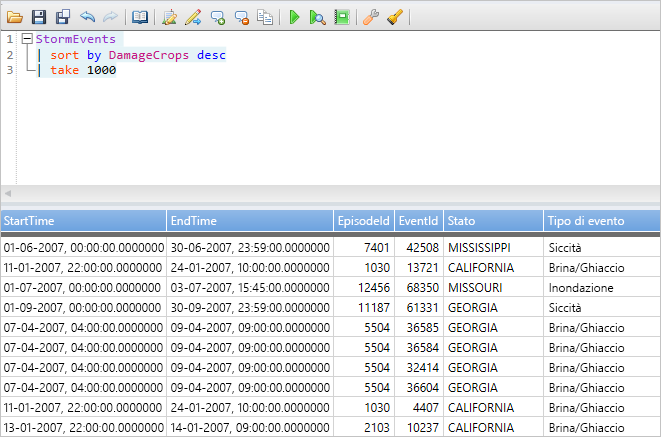
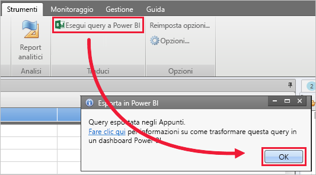
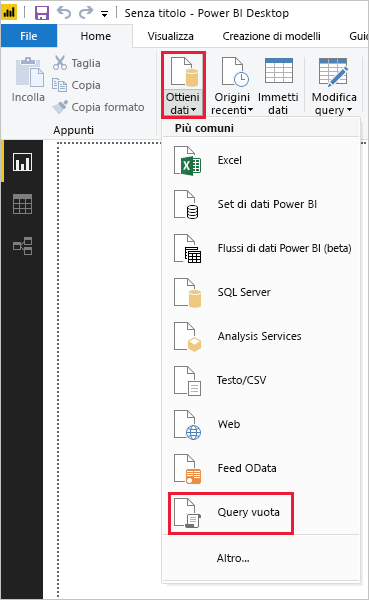
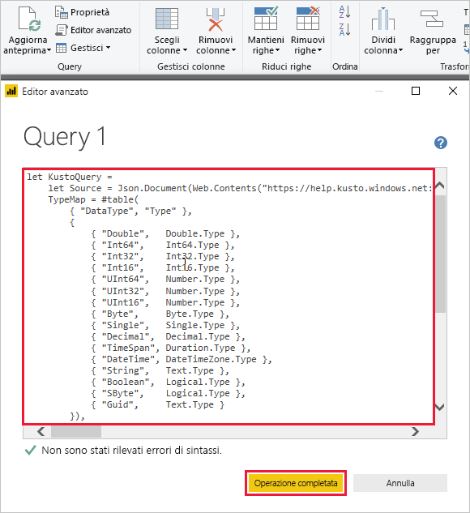
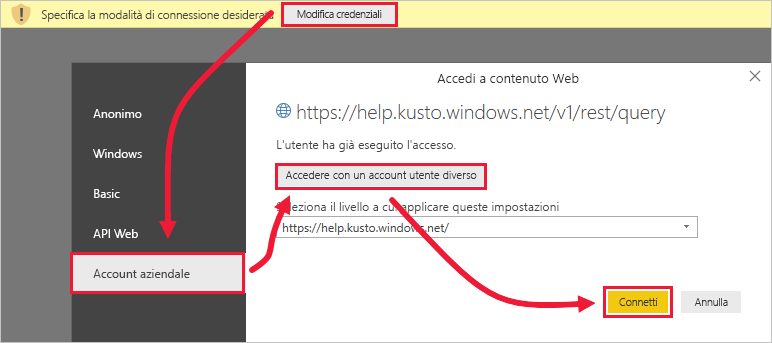
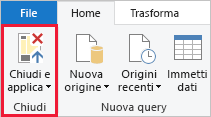

# <a name="visualize-data-using-a-query-imported-into-power-bi"></a>Visualizzare i dati tramite una query importata in Power BI

Esplora dati di Azure è un servizio di esplorazione dati rapido e a scalabilità elevata per dati di log e di telemetria. Power BI è una soluzione di analisi aziendale che consente di visualizzare i dati e condividere i risultati all'interno dell'organizzazione.

Esplora dati di Azure fornisce tre opzioni per la connessione ai dati in Power BI: usare il connettore predefinito, importare una query da Esplora dati di Azure o usare una query SQL. Questo articolo illustra come importare una query in modo che è possibile ottenere i dati e visualizzarli in un report di Power BI.

Se non si ha una sottoscrizione di Azure, creare un [account Azure gratuito](https://azure.microsoft.com/free/) prima di iniziare.

## <a name="prerequisites"></a>Prerequisiti

È necessario quanto segue per completare questo articolo:

* Un account di posta elettronica dell'organizzazione membro di Azure Active Directory, in modo da potersi connettere al [cluster della guida di Esplora dati di Azure](https://dataexplorer.azure.com/clusters/help/databases/samples).

* [Power BI Desktop](https://powerbi.microsoft.com/get-started/) (selezionare **SCARICA GRATUITAMENTE**)

* [App desktop di Esplora dati di Azure](/azure/kusto/tools/kusto-explorer)

## <a name="get-data-from-azure-data-explorer"></a>Ottenere dati da Esplora dati di Azure

In primo luogo, si crea una query nell'app desktop di Esplora dati di Azure e la si esporta per usarla in Power BI. Quindi si effettua la connessione al cluster della guida di Esplora dati di Azure e si importa un subset dei dati dalla tabella *StormEvents*. [!INCLUDE [data-explorer-storm-events](../../includes/data-explorer-storm-events.md)]

1. In un browser passare a [https://help.kusto.windows.net/](https://help.kusto.windows.net/) per avviare l'app desktop di Esplora dati di Azure.

1. Nell'app desktop copiare la query seguente nella finestra di query alto a destra quindi eseguirla.

    ```Kusto
    StormEvents
    | sort by DamageCrops desc
    | take 1000
    ```

    Le prime righe del set di risultati dovrebbero essere simili all'immagine seguente.

    

1. Nella scheda **Strumenti** selezionare **Query to Power BI** (Query a Power BI) e quindi **OK**.

    

1. Nella scheda **Home** di Power BI Desktop selezionare **Recupera dati** e quindi **Query vuota**.

    

1. Nell'Editor di Power Query nella scheda **Home**, selezionare **Editor avanzato**.

1. Nella finestra **Editor avanzato** incollare la query esportata e selezionare **Chiudi**.

    

1. Nella finestra principale dell'Editor di Power Query selezionare **Modifica credenziali**. Selezionare **Account aziendale**, accedere e quindi selezionare **Connetti**.

    

1. Nella scheda **Home** selezionare **Chiudi e applica**.

    

## <a name="visualize-data-in-a-report"></a>Visualizzare i dati in un report

[!INCLUDE [data-explorer-power-bi-visualize-basic](../../includes/data-explorer-power-bi-visualize-basic.md)]

## <a name="clean-up-resources"></a>Pulire le risorse

Se non è più necessario il report creato per questo articolo, eliminare il file di Power BI Desktop (pbix).

## <a name="next-steps"></a>Passaggi successivi

[Visualizzare i dati tramite una query importata in Power BI](power-bi-sql-query.md)