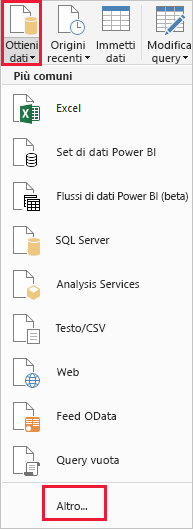
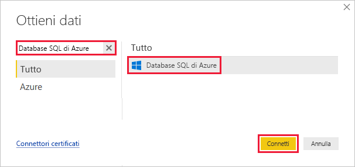
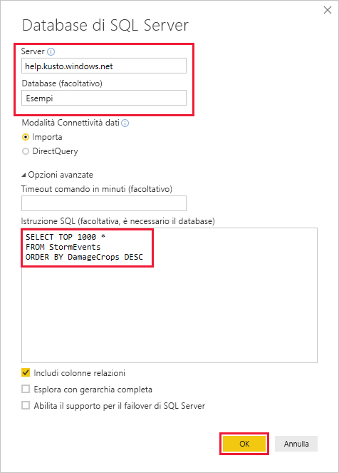
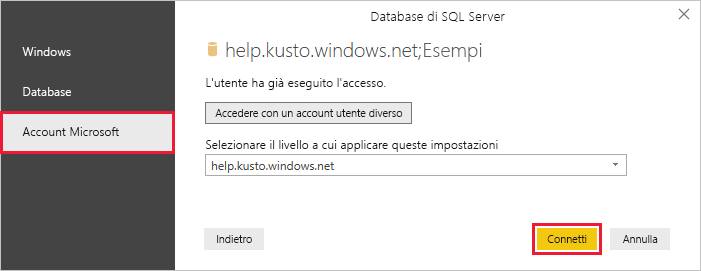
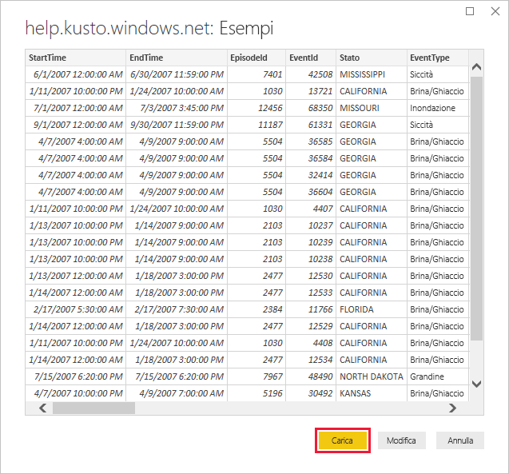

# <a name="quickstart-visualize-data-using-the-azure-data-explorer-connector-for-power-bi"></a>Guida introduttiva: Visualizzare i dati con il connettore Esplora dati di Azure per Power BI

Esplora dati di Azure è un servizio di esplorazione dati rapido e a scalabilità elevata per dati di log e di telemetria. Power BI è una soluzione di analisi aziendale che consente di visualizzare i dati e condividere i risultati all'interno dell'organizzazione.

Esplora dati di Azure fornisce tre opzioni per la connessione ai dati in Power BI: usare il connettore predefinito, importare una query da Esplora dati di Azure o usare una query SQL. Questa Guida introduttiva illustra come usare una query SQL per ottenere dati e visualizzarli in un report di Power BI.

Se non si ha una sottoscrizione di Azure, creare un [account Azure gratuito](https://azure.microsoft.com/free/) prima di iniziare.

## <a name="prerequisites"></a>Prerequisiti

Per completare questa guida introduttiva è necessario quanto segue:

* Un account di posta elettronica dell'organizzazione membro di Azure Active Directory, in modo da potersi connettere al [cluster della guida di Esplora dati di Azure](https://dataexplorer.azure.com/clusters/help/databases/samples).

* [Power BI Desktop](https://powerbi.microsoft.com/get-started/) (selezionare **SCARICA GRATUITAMENTE**)

## <a name="get-data-from-azure-data-explorer"></a>Ottenere dati da Esplora dati di Azure

In primo luogo si effettua la connessione al cluster della guida di Esplora dati di Azure e quindi si importa un subset dei dati dalla tabella *StormEvents*. [!INCLUDE [data-explorer-storm-events](../../includes/data-explorer-storm-events.md)]

Con Esplora dati di Azure si usa in genere il linguaggio di query nativo, ma è disponibile anche il supporto delle query SQL, che si useranno qui. Esplora dati di Azure traduce automaticamente la query SQL in una query nativa.

1. Nella scheda **Home** di Power BI Desktop selezionare **Recupera dati** e quindi **Altro**.

    

1. Cercare *Database SQL di Azure*, selezionare **Database SQL di Azure** e quindi **Connetti**.

    

1. Nella schermata **Database SQL Server** compilare il modulo con le informazioni seguenti.

    

    **Impostazione** | **Valore** | **Descrizione campo**
    |---|---|---|
    | Server | *help.kusto.windows.net* | L'URL del cluster della guida (senza *https://*). Per altri cluster, l'URL è nel formato *\<ClusterName\>.\<Area\>.kusto.windows.net*. |
    | Database | *Esempi* | Il database di esempio ospitato nel cluster con cui si effettua la connessione. |
    | Modalità connettività dati | *Import (Importa) (Import (Importa)a)* | Determina se Power BI Importa i dati o si connette direttamente all'origine dati. È possibile usare l'una o l'altra opzione con questo connettore. |
    | Timeout comando | Lasciare vuoto | Per quanto tempo viene eseguita la query prima che generi un errore di timeout. |
    | Istruzione SQL | Copiare la query sotto questa tabella | L'istruzione SQL che Esplora dati di Azure traduce in una query nativa. |
    | Altre opzioni | Lasciare i valori predefiniti | Queste opzioni non sono applicabili ai cluster di Esplora dati di Azure. |
    | | | |

    ```SQL
    SELECT TOP 1000 *
    FROM StormEvents
    ORDER BY DamageCrops DESC
    ```

1. Se non si ha già una connessione al cluster della guida, accedere. Accedere con un account Microsoft e quindi selezionare **Connetti**.

    

1. Nella schermata **help.kusto.windows.net: Samples** selezionare **Carica**.

    

    La tabella verrà aperta nella finestra principale di Power BI, nella visualizzazione report, in cui è possibile creare report basati sui dati di esempio.

## <a name="visualize-data-in-a-report"></a>Visualizzare i dati in un report

[!INCLUDE [data-explorer-power-bi-visualize-basic](../../includes/data-explorer-power-bi-visualize-basic.md)]

## <a name="clean-up-resources"></a>Pulire le risorse

Se il report creato per questa Guida introduttiva non è più necessario, eliminare il file di Power BI Desktop (pbix).

## <a name="next-steps"></a>Passaggi successivi

> [!div class="nextstepaction"]
> [Guida introduttiva: Visualizzare i dati tramite una query importata in Power BI](power-bi-connector.md)