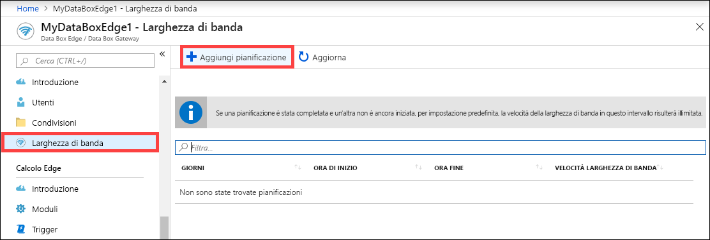
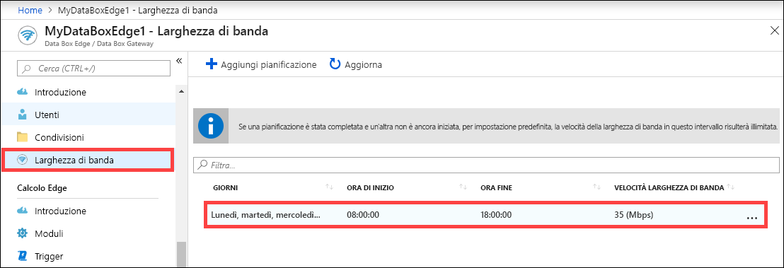
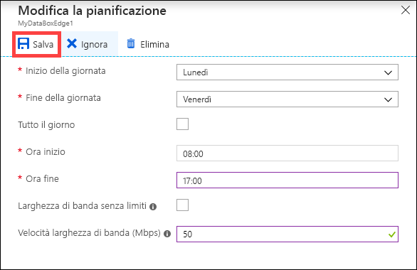
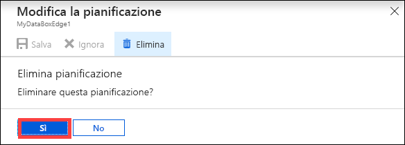

# Usare il portale di Azure per gestire le pianificazioni della larghezza di banda in Azure Data Box Edge  

Questo articolo descrive come gestire gli utenti in Azure Data Box Edge. Le pianificazioni della larghezza di banda consentono di configurare l'uso della larghezza di banda della rete in più pianificazioni orarie. Queste pianificazioni possono essere applicate alle operazioni di caricamento e download dal dispositivo al cloud.

È possibile aggiungere, modificare o eliminare le pianificazioni della larghezza di banda per Data Box Edge dal portale di Azure.

> [!IMPORTANT]
> Data Box Edge è disponibile in anteprima. Rivedere le [condizioni del servizio per l'anteprima di Azure](https://azure.microsoft.com/support/legal/preview-supplemental-terms/) prima di ordinare e distribuire la soluzione.

In questo articolo viene spiegato come:

> [!div class="checklist"]
> * Aggiungere una pianificazione
> * Modificare una pianificazione
> * Eliminare una pianificazione

## Aggiungere una pianificazione

Seguire questa procedura nel portale di Azure per aggiungere una pianificazione.

1. Nel portale di Azure della risorsa Data Box Edge passare a **Larghezza di banda**.
2. Nel riquadro di destra fare clic su **+ Aggiungi pianificazione**.

    

3. In **Aggiungi pianificazione**: 

   1. Indicare il **giorno di inizio**, il **giorno di fine**, l'**orario di inizio** e l'**orario di fine** della pianificazione.
   2. Se la pianificazione deve essere eseguita per l'intera giornata, selezionare **Tutto il giorno**.
   3. Per **Velocità larghezza di banda** si intende la larghezza di banda espressa in megabit al secondo (Mbps) usata dal dispositivo nelle operazioni che coinvolgono il cloud (sia caricamento sia download). Specificare un numero compreso tra 20 e 1.000.000.007 per questo campo.
   4. Selezionare una larghezza di banda **Senza limiti** se non si vuole limitare la data di caricamento e download.
   5. Selezionare **Aggiungi**.

      

3. Verrà creata una pianificazione con i parametri specificati. Questa pianificazione viene quindi visualizzata nell'elenco delle pianificazioni della larghezza di banda nel portale.

    

## Modificare la pianificazione

Eseguire la procedura seguente per modificare una pianificazione della larghezza di banda.

1. Nel portale di Azure passare alla risorsa Data Box Edge e quindi a **Larghezza di banda**. 
2. Nell'elenco delle pianificazioni della larghezza di banda selezionare una pianificazione da modificare.
    

3. Apportare le modifiche desiderate e salvarle.

    

4. Dopo aver modificato la pianificazione, l'elenco di pianificazioni viene aggiornato per riflettere la pianificazione modificata.

    

## Eliminare una pianificazione

Eseguire la procedura seguente per eliminare una pianificazione della larghezza di banda associata a un dispositivo Data Box Edge.

1. Nel portale di Azure passare alla risorsa Data Box Edge e quindi a **Larghezza di banda**.  

2. Nell'elenco delle pianificazioni della larghezza di banda, selezionare una pianificazione da eliminare. In **Modifica la pianificazione** selezionare **Elimina**. Alla richiesta di conferma selezionare **Sì**.

   

3. Dopo aver eliminato la pianificazione, l'elenco di pianificazioni viene aggiornato.

## Passaggi successivi

- Vedere le informazioni su come [gestire le condivisioni](data-box-edge-manage-shares.md).
