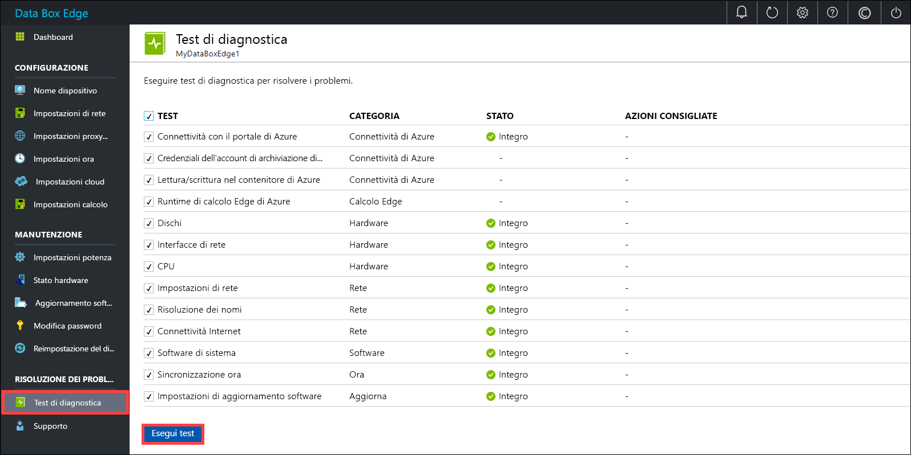
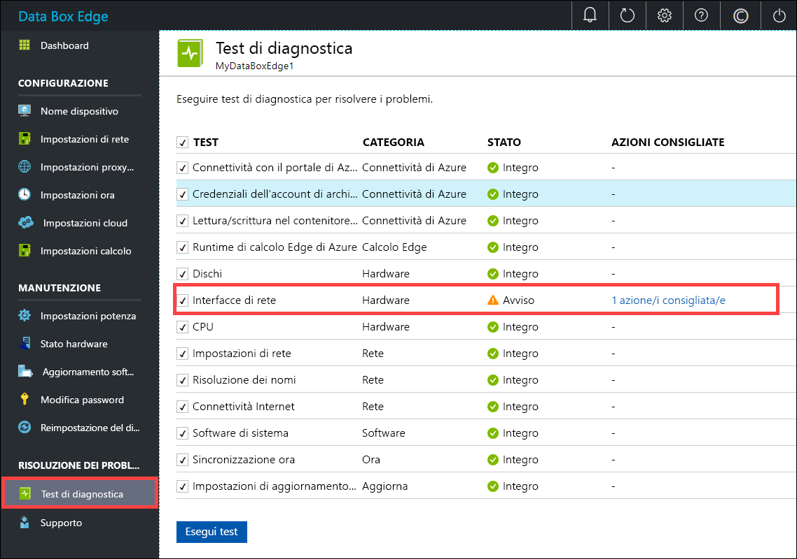
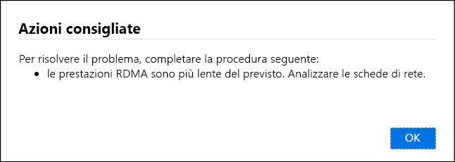
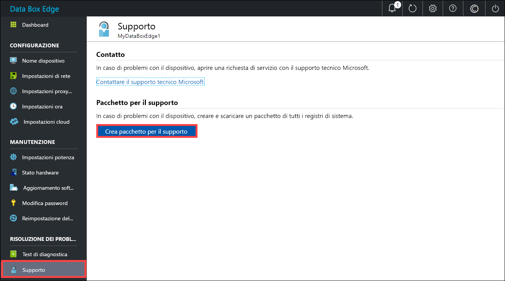
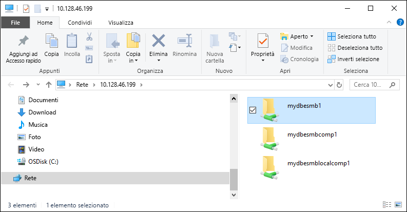

# <a name="troubleshoot-your-azure-data-box-edge-issues"></a>Risolvere i problemi di Azure Data Box Edge 

Questo articolo descrive come risolvere i problemi in Azure Data Box Edge. 

In questo articolo viene spiegato come:

> [!div class="checklist"]
> * Eseguire la diagnostica
> * Ottenere il pacchetto per il supporto
> * Usare i log per risolvere i problemi


## <a name="run-diagnostics"></a>Eseguire la diagnostica

Per diagnosticare e risolvere gli errori di qualsiasi dispositivo, è possibile eseguire i test di diagnostica. Per eseguire i test di diagnostica, usare la procedura seguente nell'interfaccia utente Web locale.

1. Nell'interfaccia utente Web locale passare a **Risoluzione dei problemi > Test diagnostici**. Selezionare il test che si vuole eseguire e fare clic su **Esegui test**. Vengono eseguiti i test per diagnosticare eventuali problemi con la rete, il dispositivo, il proxy Web, l'ora o le impostazioni cloud. Si riceve una notifica in cui si comunica che il dispositivo sta eseguendo dei test.

    
 
2. Al termine dei test, vengono visualizzati i risultati. 

    

    Se un test non riesce, viene visualizzato un URL per l'azione consigliata. Fare clic sull'URL per visualizzare l'azione consigliata.
 
    


## <a name="collect-support-package"></a>Ottenere il pacchetto per il supporto

Un pacchetto di log è costituito da tutti i log rilevanti utili al supporto tecnico Microsoft nella risoluzione dei problemi del dispositivo. Un pacchetto di log può essere generato con l'interfaccia utente Web locale.

Per ottenere un pacchetto di supporto, usare la procedura seguente. 

1. Nell'interfaccia utente Web locale passare a **Risoluzione dei problemi > Supporto**. Fare clic su **Crea pacchetto per il supporto**. Il sistema inizia a ottenere il pacchetto per il supporto. Questa operazione potrebbe richiedere alcuni minuti.

    
 
2. Una volta completata la creazione del pacchetto di supporto, fare clic su **Scarica pacchetto per il supporto**. Un pacchetto compresso viene scaricato nel percorso selezionato. È possibile decomprimere il pacchetto e visualizzare i file di log del registro di sistema.

    

## <a name="use-logs-to-troubleshoot"></a>Usare i log per risolvere i problemi

Gli eventuali errori riscontrati durante i processi di caricamento e aggiornamento vengono inclusi nei file di log degli errori corrispondenti.

1. Per visualizzare i file di log degli errori, fare clic sulla condivisione per visualizzarne il contenuto. 

      

2. Fare clic sulla cartella _Microsoft Data Box Edge_. Questa cartella contiene due sottocartelle:

    - Una cartella di caricamento contenente i file di log per gli errori di caricamento
    - Una cartella di aggiornamento per gli errori durante l'aggiornamento

    Ecco come appare un file di log per l'aggiornamento:

    ```
    <root container="test1" machine="VM15BS020663" timestamp="03/18/2019 00:11:10" />
    <file item="test.txt" local="False" remote="True" error="16001" />
    <summary runtime="00:00:00.0945320" errors="1" creates="2" deletes="0" insync="3" replaces="0" pending="9" />
    ``` 

3. Quando viene visualizzato un errore in questo file (evidenziato nell'esempio), annotare il codice di errore, che in questo caso è 16001. Cercare la descrizione di questo codice di errore con il riferimento di errore seguente.

    [!INCLUDE [data-box-edge-edge-upload-error-reference](../../includes/data-box-edge-gateway-upload-error-reference.md)]


## <a name="next-steps"></a>Passaggi successivi

- Altre informazioni sui [problemi noti in questa versione](data-box-gateway-release-notes.md).
