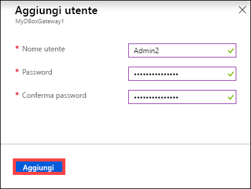
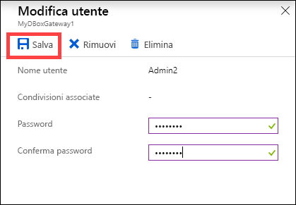
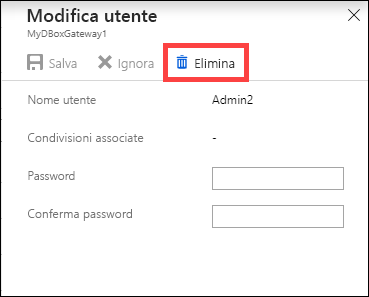
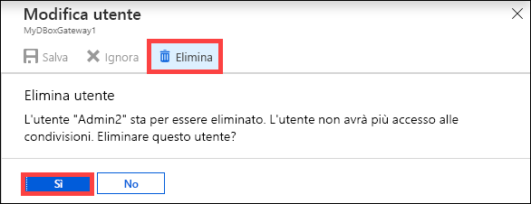
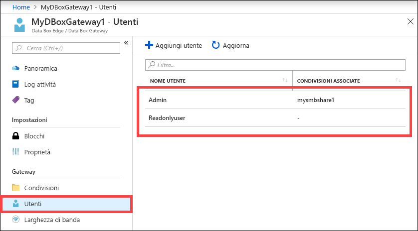

# Usare il portale di Azure per gestire gli utenti in Azure Data Box Gateway 

Questo articolo descrive come gestire gli utenti in Azure Data Box Gateway. È possibile gestire Azure Data Box Gateway dal portale di Azure o dall'interfaccia utente Web locale. Usare il portale di Azure per aggiungere, modificare o eliminare utenti.

> [!IMPORTANT]
> - Data Box Gateway è in anteprima. Rivedere le [condizioni del servizio per l'anteprima di Azure](https://azure.microsoft.com/support/legal/preview-supplemental-terms/) prima di ordinare e distribuire la soluzione.

In questo articolo viene spiegato come:

> [!div class="checklist"]
> * Aggiungere un utente
> * Modificare un utente
> * Eliminare un utente 

## Informazioni sugli utenti

Gli utenti possono accedere in sola lettura o con privilegi completi. Come indicano i nomi, gli utenti di sola lettura possono visualizzare solo i dati della condivisione. Gli utenti con privilegi completi possono leggere, modificare o eliminare i dati della condivisione e scrivere in tali condivisioni. 

 - **Utente con privilegi completi**: un utente locale con accesso completo. 
 - **Utente di sola lettura**. un utente locale con accesso di sola lettura. Questi utenti sono associati alle condivisioni che consentono operazioni di sola lettura.

Le autorizzazioni dell'utente vengono prima di tutto definite durante la creazione contemporanea di utente e condivisione. Dopo aver definito le autorizzazioni associate a un utente, è possibile modificarle con Esplora file. 

## Aggiungere un utente

Seguire questa procedura nel portale di Azure per aggiungere un utente.

1. Nel portale di Azure, selezionare la risorsa Data Box Gateway e quindi passare a **Panoramica**. Fare clic su **+ Aggiungi utente** sulla barra dei comandi.

    

2. Specificare nome utente e password per l'utente da aggiungere. Confermare la password e fare clic su **Aggiungi**.

    

    > [!IMPORTANT] 
    > Questi utenti sono riservati dal sistema e non deve essere usati: Administrator, EdgeUser, EdgeSupport, HcsSetupUser, WDAGUtilityAccount, CLIUSR, DefaultAccount, Guest.  

3. Dopo l'avvio e il completamento della creazione degli utenti si riceve una notifica. Dopo aver creato l'utente, dalla barra dei comandi, fare clic su **Aggiorna** per visualizzare l'elenco aggiornato degli utenti.

## Modificare un utente

È possibile cambiare la password associata a un utente dopo averlo creato. Selezionare e fare clic nell'elenco di utenti. Indicare e confermare la nuova password. Salvare le modifiche.
 

## Eliminare un utente

Eseguire i passaggi seguenti nel portale di Azure per eliminare un utente.

1. Selezionare e fare clic su un utente dall'elenco, quindi fare clic su **Elimina**.  

   

2. Quando richiesto, confermare l'eliminazione. 

   

L'elenco di utenti viene aggiornato per riflettere l'utente eliminato.

## Passaggi successivi

- Informazioni su come [gestire la larghezza di banda](data-box-gateway-manage-bandwidth-schedules.md).
