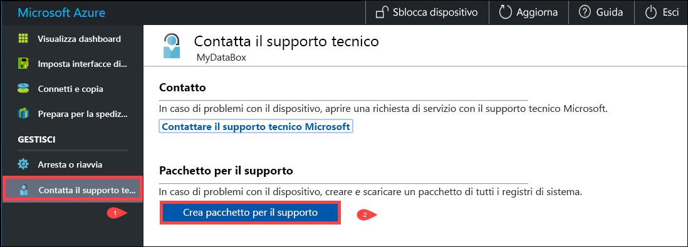
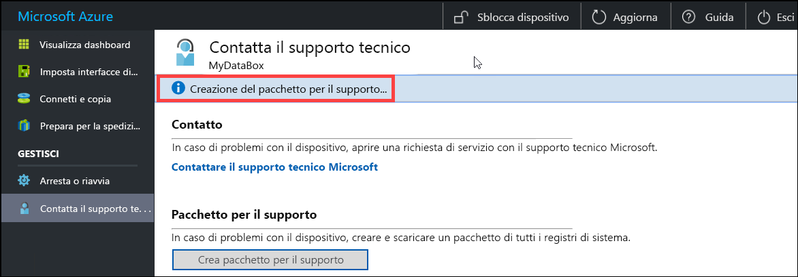
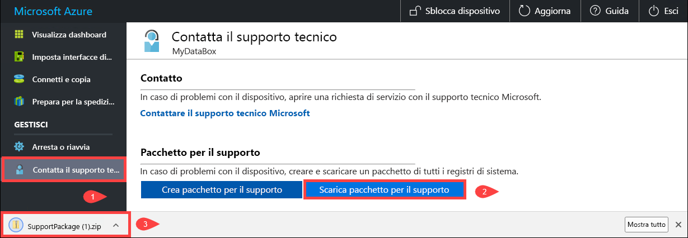
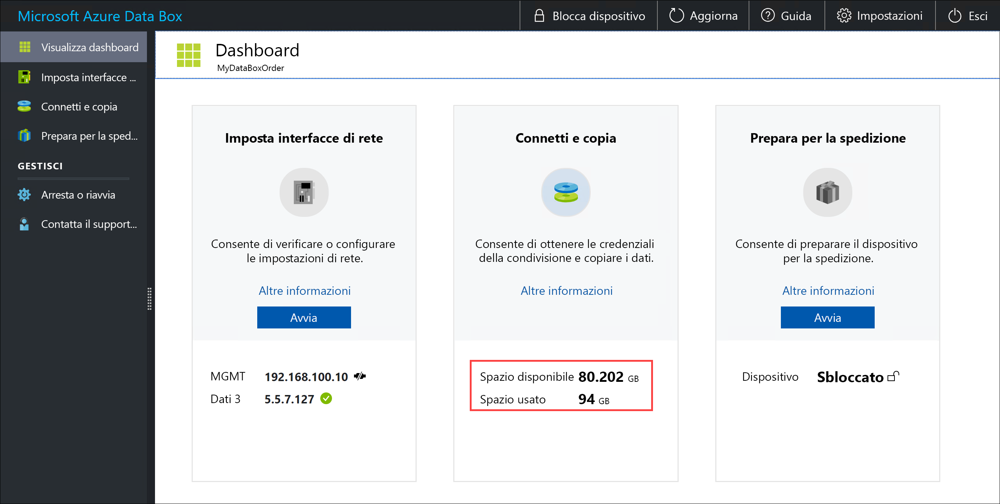
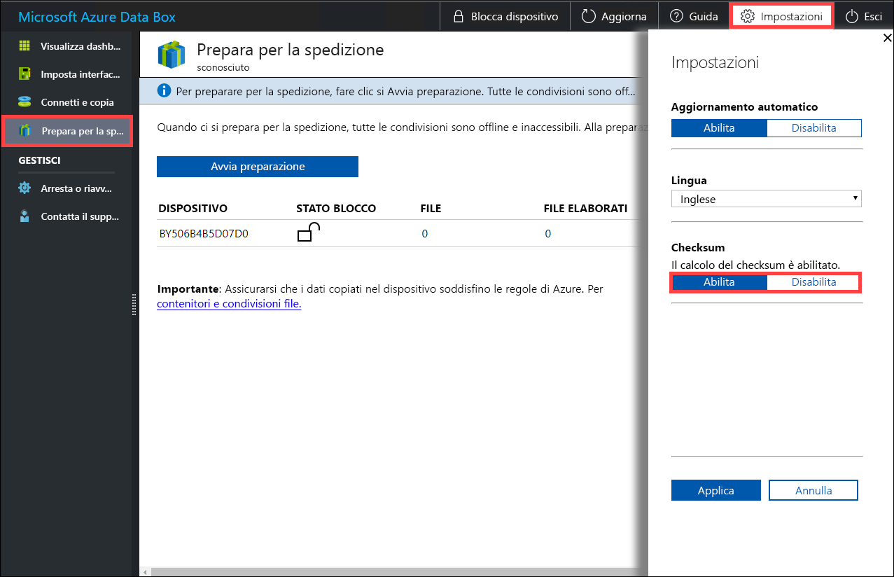

# Usare l'interfaccia utente Web locale per amministrare Data Box

Questo articolo illustra alcune delle attività di gestione e configurazione che è possibile eseguire in Data Box. È possibile gestire Data Box tramite l'interfaccia utente del portale di Azure e l'interfaccia utente Web locale del dispositivo. Questo articolo è incentrato sulle attività che è possibile eseguire con l'interfaccia utente Web locale.

L'interfaccia utente Web locale per Data Box viene usata nella configurazione iniziale del dispositivo. È anche possibile usare l'interfaccia utente Web locale per arrestare o riavviare Data Box, eseguire i test diagnostici, aggiornare il software, visualizzare i log di copia e generare un pacchetto di log per il supporto tecnico Microsoft.

L'articolo include le esercitazioni seguenti:

- Creare un pacchetto di supporto
- Arrestare o riavviare il dispositivo
- Cancellare in modo sicuro i dati del dispositivo
- Monitorare la capacità disponibile del dispositivo
- Ignorare la convalida di checksum 

## Creare un pacchetto per il supporto

Se si verificano problemi al dispositivo, è possibile creare un pacchetto di supporto dai registri di sistema. Il supporto tecnico Microsoft usa questo pacchetto per risolvere il problema. Per creare un pacchetto di supporto, attenersi alla procedura seguente:

1. Nell'interfaccia utente Web locale passare a **Contatta il supporto tecnico** e fare clic su **Crea pacchetto per il supporto**.

    

2. Viene raccolto un pacchetto di supporto. Il completamento dell'operazione richiede alcuni minuti.

    

3. Una volta completata la creazione del pacchetto di supporto, fare clic su **Scarica pacchetto per il supporto**. 

    

4. Individuare e scegliere il percorso di download. Aprire la cartella per visualizzarne il contenuto.

    

## Arrestare o riavviare il dispositivo

È possibile arrestare o riavviare Data Box tramite l'interfaccia utente Web locale. Prima di riavviare, si consiglia di portare offline le condivisioni sull'host e quindi il dispositivo. Questa operazione consente di eliminare qualsiasi rischio di danneggiamento dei dati. Assicurarsi che al momento dell'arresto del dispositivo non sia in corso la copia dei dati.

Per arrestare Data Box seguire questa procedura.

1. Nell'interfaccia utente Web locale passare a **Arresta o riavvia**.
2. Fare clic su **Spegni**.

    

3. Alla richiesta di conferma fare clic su **OK** per continuare.

    

Una volta arrestato il dispositivo, usare il pulsante di alimentazione sul pannello anteriore per accendere il dispositivo.

Per riavviare Data Box seguire questa procedura.

1. Nell'interfaccia utente Web locale passare a **Arresta o riavvia**.
2. Fare clic su **Restart**.

    

3. Alla richiesta di conferma fare clic su **OK** per continuare.

   Il dispositivo si arresta e quindi si riavvia.

## Visualizzare la capacità disponibile del dispositivo

È possibile usare il dashboard del dispositivo per visualizzare la capacità disponibile e usata nel dispositivo. 

1. Nell'interfaccia utente Web locale passare a **Visualizza dashboard**.
2. Sotto **Connetti e copia** viene visualizzato lo spazio libero e occupato sul dispositivo.

    

## Ignorare la convalida di checksum

I checksum vengono generati per i dati per impostazione predefinita quando si prepara la spedizione. In alcuni casi rari, a seconda del tipo di dati (file di piccole dimensioni), le prestazioni potrebbero essere molto lente. In questi casi, è possibile ignorare i checksum. 

È consigliabile non disabilitare i checksum, a meno che le prestazioni non subiscano un notevole peggioramento.

1. Nell'angolo superiore destro dell'interfaccia utente Web locale del dispositivo passare a Impostazioni.

    

2. **Disabilitare** la convalida dei checksum
3. Fare clic su **Apply**.

## Passaggi successivi

- Informazioni su come [gestire Data Box tramite il portale di Azure](data-box-portal-admin.md).

