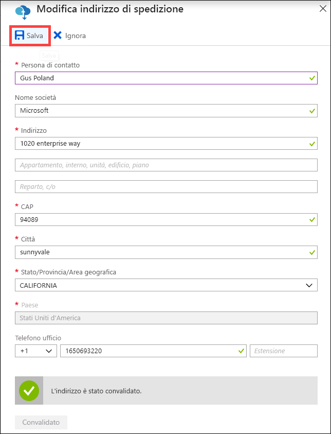
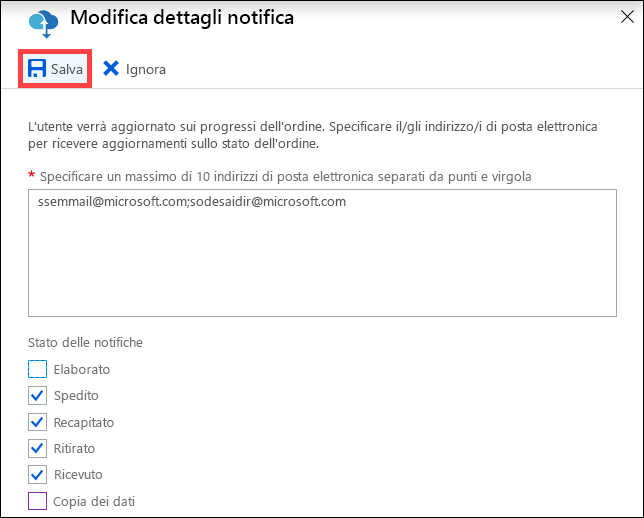
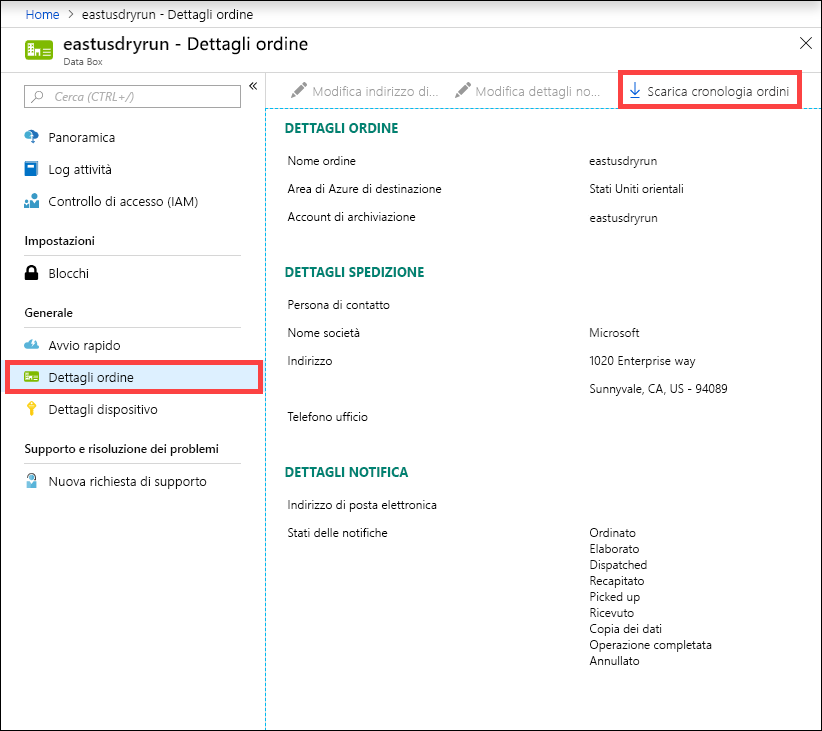
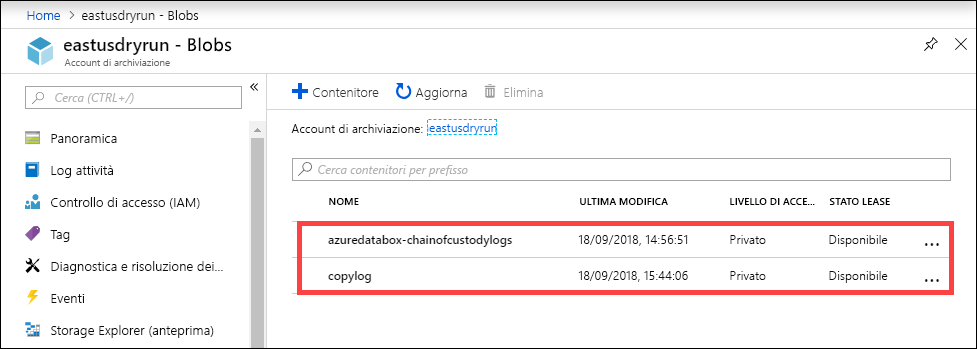

# <a name="use-the-azure-portal-to-administer-your-data-box"></a>Usare il portale di Azure per amministrare Data Box

Questo articolo illustra alcuni flussi di lavoro e attività di gestione complessi che è possibile eseguire in Data Box. È possibile gestire Data Box tramite il portale di Azure o l'interfaccia utente Web locale. 

Questo articolo è incentrato sulle attività che è possibile eseguire con il portale di Azure. Usare il portale di Azure per gestire gli ordini, gestire Data Box e monitorare lo stato dell'ordine man mano che procede verso il completamento.


## <a name="cancel-an-order"></a>Annullare un ordine

Per vari motivi potrebbe essere necessario annullare un ordine effettuato. È possibile annullare l'ordine solo prima dell'elaborazione. Una volta che l'ordine è stato elaborato e che Data Box è stato preparato non è possibile annullare l'ordine. 

Seguire questa procedura per annullare un ordine.

1.  Passare a **Panoramica > Annulla**. 

    

2.  Immettere un motivo per l'annullamento dell'ordine.  

    

3.  Dopo l'annullamento dell'ordine il portale ne aggiorna lo stato e lo visualizza come **Annullato**. 

## <a name="clone-an-order"></a>Clonare un ordine

La clonazione è utile in determinate situazioni. Ad esempio, un utente ha usato Data Box per trasferire alcuni dati. Man mano che vengono generati altri dati, è necessario un altro Data Box per trasferire i dati in Azure. In questo caso è possibile semplicemente clonare lo stesso ordine.

Eseguire la procedura seguente per clonare un ordine.

1.  Passare a **Panoramica > Clona**. 

    

2.  Tutti i dettagli dell'ordine rimangono invariati. Il nome dell'ordine è quello dell'ordine originale con l'aggiunta di *-Clone*. Selezionare la casella di controllo per confermare di avere esaminato le informazioni sulla privacy. Fare clic su **Crea**.

Il clone viene creato in pochi minuti e il portale viene aggiornato per mostrare il nuovo ordine.


## <a name="delete-order"></a>Eliminare un ordine

È possibile eliminare un ordine quando l'ordine è stato completato. L'ordine contiene informazioni personali, ad esempio nome e cognome, indirizzo e informazioni di contatto. Queste informazioni personali vengono eliminate quando l'ordine viene eliminato.

È possibile eliminare solo gli ordini completati o annullati. Eseguire la procedura seguente per eliminare un ordine.

1. Passare a **Tutte le risorse**. Cercare l'ordine.

2. Fare clic sull'ordine da eliminare e passare a **Panoramica**. Sulla barra dei comandi fare clic su **Elimina**.

    

3. Immettere il nome dell'ordine quando viene richiesto di confermare l'eliminazione dell'ordine. Fare clic su **Elimina**.

## <a name="download-shipping-label"></a>Scaricare l'etichetta di spedizione

Potrebbe essere necessario scaricare l'etichetta indirizzo se la visualizzazione elettronica dell'etichetta del Data Box non funziona e non viene visualizzata l'etichetta indirizzo di restituzione. 

Eseguire la procedura seguente per scaricare un'etichetta di spedizione.

1.  Passare a **Panoramica > Scarica etichetta di spedizione**. Questa opzione è disponibile solo dopo la spedizione del dispositivo. 

    

2.  Questa azione scarica la seguente etichetta per la spedizione di ritorno. Salvare l'etichetta e stamparla. Piegare e inserire l'etichetta nella custodia trasparente sul dispositivo. Assicurarsi che l'etichetta sia visibile. Rimuovere tutti gli adesivi sul dispositivo relativi alla spedizione precedente.

    

## <a name="edit-shipping-address"></a>Modificare l'indirizzo di spedizione

Potrebbe essere necessario modificare l'indirizzo di spedizione dopo che è stato effettuato l'ordine. Questa opzione è disponibile solo fino alla spedizione del dispositivo. Dopo la spedizione del dispositivo, questa opzione non sarà più disponibile.

Eseguire la procedura seguente per modificare l'ordine.

1. Passare a **Dettagli ordine > Modifica indirizzo di spedizione**.

    

2. Modificare e convalidare l'indirizzo di spedizione e quindi salvare le modifiche.

    

## <a name="edit-notification-details"></a>Modificare i dettagli della notifica

Potrebbe essere necessario cambiare gli utenti che riceveranno i messaggi di posta elettronica sullo stato dell'ordine. Ad esempio, un utente deve essere informato quando il dispositivo viene recapitato o ritirato. Potrebbe essere necessario informare un altro utente quando la copia dei dati è completa, in modo che possa verificare che i dati siano nell'account di archiviazione di Azure prima di eliminarli dall'origine. In questi casi è possibile modificare i dettagli di notifica.

Eseguire la procedura seguente per modificare i dettagli di notifica.

1. Passare a **Dettagli ordine > Modifica dettagli notifica**.

    

2. È possibile ora modificare i dettagli di notifica e quindi salvare le modifiche.
 
    


## <a name="download-order-history"></a>Scaricare la cronologia ordini

Dopo il completamento dell'ordine per Data Box, i dati nei dischi del dispositivo vengono cancellati. Quando la pulizia del dispositivo è stata completata, è possibile scaricare la cronologia ordini nel portale di Azure.

Eseguire i passaggi seguenti per scaricare la cronologia ordini.

1. Nell'ordine per Data Box passare a **Panoramica**. Assicurarsi che l'ordine sia completo. Se l'ordine è completo e la pulizia del dispositivo è stata completata, passare a **Dettagli ordine**. L'opzione **Scarica cronologia ordini** è disponibile.

    

2. Fare clic su **Scarica cronologia ordini**. Nella cronologia scaricata sono registrati i documenti di accompagnamento del corriere. Se si scorre fino alla fine di questo log, sono visualizzati i collegamenti a:
    
    - **Log di copia**: viene visualizzato l'elenco dei file per cui si sono verificati errori durante la copia dei dati da Data Box all'account di archiviazione di Azure.
    - **Log di controllo**: contengono informazioni su accensione e accesso alla condivisione nel Data Box quando è esterno al data center di Azure.
    - **File della distinta base**: viene visualizzato l'elenco dei file, noto anche come manifesto file, che è possibile scaricare durante **Prepara per la spedizione** e che include nomi, dimensioni e checksum dei file.

        ```
        -------------------------------
        Microsoft Data Box Order Report
        -------------------------------
        
        Name                                               : eastusdryrun                                      
        StartTime(UTC)                                     : 9/6/2018 12:54:47 PM +00:00                       
        DeviceType                                         : ImolaPod                                          
        
        -------------------
        Data Box Activities
        -------------------
        
        Time(UTC)             | Activity                       | Status          | Description                                                                                                                                           
        
        9/6/2018 12:54:51 PM  | OrderCreated         | Completed  |                                                                                                                              
        9/11/2018 8:57:38 PM  | DevicePrepared       | Completed  |                                                                                                                                                       
        9/12/2018 7:28:15 PM  | ShippingToCustomer   | InProgress | Pickup Scan. Local Time : 9/12/2018 2:52:31 PM at Chantilly                                                                                           
        9/13/2018 2:33:04 AM  | ShippingToCustomer   | InProgress | Departure Scan. Local Time : 9/12/2018 9:00:00 PM at Chantilly                                                                                                                                                                                                                                                              
        9/13/2018 12:40:31 PM | ShippingToCustomer   | InProgress | Arrival Scan. Local Time : 9/13/2018 5:00:00 AM at Oakland                                                                                            
        9/13/2018 2:42:10 PM  | ShippingToCustomer   | InProgress | Departure Scan. Local Time : 9/13/2018 6:08:00 AM at Oakland                                                                                          
        9/13/2018 3:42:12 PM  | ShippingToCustomer   | InProgress | Destination Scan. Local Time : 9/13/2018 8:14:08 AM at Sunnyvale                                                                                      
        9/13/2018 4:43:05 PM  | ShippingToCustomer   | InProgress | Destination Scan. Local Time : 9/13/2018 8:56:54 AM at Sunnyvale                                                                                      
        9/13/2018 4:43:05 PM  | ShippingToCustomer   | InProgress | Out For Delivery Today. Local Time : 9/13/2018 9:11:21 AM at Sunnyvale                                                                                
        9/13/2018 5:43:07 PM  | ShippingToCustomer   | Completed  | Delivered. Local Time : 9/13/2018 9:44:17 AM at SUNNYVALE                                                                                             
        9/14/2018 11:48:35 PM | ShippingToDataCenter | InProgress | Pickup Scan. Local Time : 9/14/2018 3:55:37 PM at Sunnyvale                                                                                                                                                                                 
        9/15/2018 1:52:35 AM  | ShippingToDataCenter | InProgress | Arrival Scan. Local Time : 9/14/2018 6:31:00 PM at San Jose                                                                                           
        9/15/2018 2:52:39 AM  | ShippingToDataCenter | InProgress | Departure Scan. Local Time : 9/14/2018 7:17:00 PM at San Jose                                                                                                                                                                             
        9/17/2018 8:23:31 AM  | ShippingToDataCenter | InProgress | Destination Scan. Local Time : 9/17/2018 4:14:37 AM at Chantilly                                                                                      
        9/17/2018 12:24:42 PM | ShippingToDataCenter | InProgress | Loaded on Delivery Vehicle. Local Time : 9/17/2018 7:45:36 AM at Chantilly                                                                            
        9/17/2018 1:25:11 PM  | ShippingToDataCenter | InProgress | Out For Delivery Today. Local Time : 9/17/2018 8:27:11 AM at Chantilly                                                                                
        9/17/2018 2:25:51 PM  | ShippingToDataCenter | Completed | Delivered. Local Time : 9/17/2018 9:56:32 AM at STERLING                                                                                              
        9/18/2018 9:55:41 PM  | DeviceBoot           | Completed | Appliance booted up successfully                                                                                                                      
        9/18/2018 11:00:25 PM | DataCopy             | Started   |                                                                                                                                                       
        9/18/2018 11:01:33 PM | DataCopy             | Completed | Copy Completed.                                                                                                                                       
        9/18/2018 11:20:58 PM | SecureErase          | Started   |                                                                                                                                                       
        9/18/2018 11:28:46 PM | SecureErase          | Completed | Azure Data Box:BY506B4B616700 has been sanitized according to NIST 800 -88 Rev 1.                                                                     
        
        ----------------------
        Data Box Job Log Links
        ----------------------
        
        Account Name         : eastusdryrun                                         
        Copy Logs Path       : copylog/copylogd695869a2a294396b7b903296c208388.xml                                                                                                                                                     
        Audit Logs Path      : azuredatabox-chainofcustodylogs\3b4cf163-f1af-475c-a391-f8afea3fa327\by506b4b616700                                                                                                                     
        BOM Files Path       : azuredatabox-chainofcustodylogs\3b4cf163-f1af-475c-a391-f8afea3fa327\by506b4b616700
        ```
È quindi possibile passare all'account di archiviazione e visualizzare i log di copia.



È anche possibile visualizzare la catena di log di custodia che includono i log di controllo e i file della distinta base.


## <a name="view-order-status"></a>Visualizzare lo stato dell'ordine

Quando viene modificato lo stato del dispositivo nel portale, si riceve una notifica tramite un messaggio di posta elettronica.

|Stato dell'ordine |Descrizione |
|---------|---------|
|Ordinato     | L'ordine è stato effettuato. <br>Se il dispositivo è disponibile, Microsoft identifica un dispositivo per la spedizione e ne prepara l'imballaggio. <br> Se il dispositivo non è immediatamente disponibile, l'ordine verrà elaborato quando il dispositivo risulterà nuovamente disponibile. L'ordine potrebbe richiedere da diversi giorni a due mesi per l'elaborazione. Se l'ordine non può essere soddisfatto entro 90 giorni, viene annullato e l'utente riceve una notifica.         |
|Elaborato     | L'elaborazione dell'ordine è stata completata. In base all'ordine, il dispositivo viene preparato per la spedizione nel data center.         |
|Spedito     | L'ordine è stato spedito. Usare l'ID di traccia visualizzato nell'ordine nel portale per tenere traccia della spedizione.        |
|Recapitato     | La spedizione è stata recapitata all'indirizzo specificato.        |
|Ritirato     |La spedizione di restituzione è stata prelevata e scansionata dal trasportatore.         |
|Ricevuto     | Il dispositivo viene ricevuto e scansionato nel data center di Azure. <br> Dopo il controllo della spedizione viene avviato il caricamento del dispositivo.      |
|Copia dati     | La copia dei dati è in corso. Tenere traccia dello stato della copia dell'ordine nel portale di Azure. <br> Attendere il completamento della copia dei dati. |
|Completed       |L'ordine è stato completato.<br> Verificare che i dati siano in Azure prima di eliminare i dati locali dai server.         |
|Operazione completata con errori| La copia dei dati è stata completata ma si sono verificati errori durante la copia. <br> Esaminare i log di copia usando il percorso specificato nel portale di Azure.   |
|Canceled            |L'ordine è stato annullato. <br> L'ordine è stato annullato o si è verificato un errore e il servizio ha annullato l'ordine. Se l'ordine non può essere soddisfatto entro 90 giorni, viene anche annullato e l'utente riceve una notifica.     |
|Eseguire la pulizia | I dati nei dischi del dispositivo vengono cancellati. La pulizia del dispositivo viene considerata completa quando la cronologia ordini è disponibile per il download nel portale di Azure.|


## <a name="next-steps"></a>Passaggi successivi

- Informazioni su come [risolvere i problemi relativi a Data Box](data-box-faq.md).
