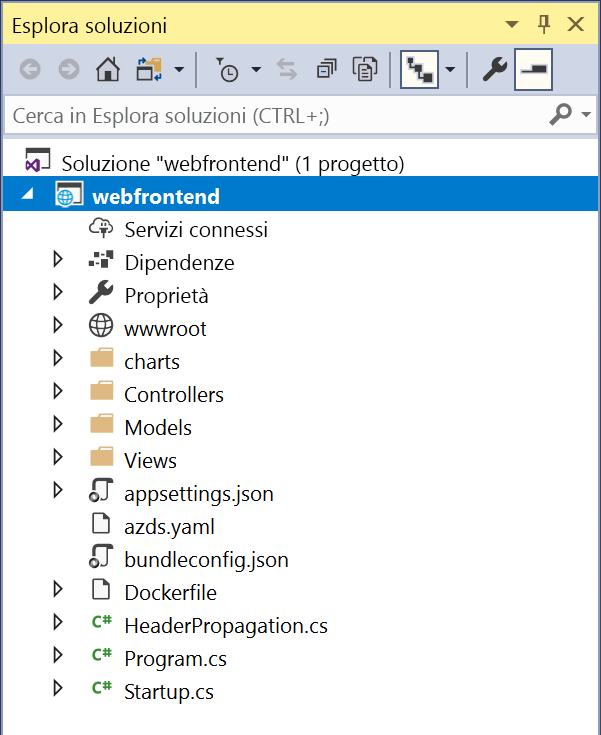

# Guida introduttiva: Creare un ambiente di sviluppo Kubernetes con Azure Dev Spaces (.NET Core e Visual Studio)

In questa guida si apprenderà come:

- Creare un ambiente basato su Kubernetes ottimizzato per lo sviluppo in Azure.
- Sviluppare codice in modo iterativo nei contenitori con Visual Studio.

[!INCLUDE]

[!INCLUDE]

## Ottenere gli strumenti di Visual Studio 
1. Installare l'ultima versione di [Visual Studio 2017](https://www.visualstudio.com/vs/)
1. Nel programma di installazione di Visual Studio assicurarsi che sia selezionato il carico di lavoro seguente:
    * Sviluppo Web e ASP.NET
1. Installare l'[estensione di Visual Studio per Azure Dev Spaces](https://aka.ms/get-azds-visualstudio)

È ora possibile creare un'app Web ASP.NET con Visual Studio.

## Creare un'app Web ASP.NET

In Visual Studio 2017 creare un nuovo progetto. Attualmente deve trattarsi di un progetto **Applicazione Web ASP.NET Core**. Assegnare al progetto il nome "**webfrontend**".

Selezionare il modello **Applicazione Web (MVC)** e assicurarsi che nei due elenchi a discesa nella parte superiore della finestra di dialogo siano selezionati **.NET Core** e **ASP.NET Core 2.0**. Fare clic su **OK** per creare il progetto.

## Creare un ambiente di sviluppo in Azure

Con Azure Dev Spaces è possibile creare ambienti di sviluppo basati su Kubernetes completamente gestiti da Azure e ottimizzati per lo sviluppo. Con il progetto appena creato aperto, selezionare **Azure Dev Spaces** nell'elenco a discesa delle impostazioni di avvio, come illustrato di seguito.

Nella finestra di dialogo che viene quindi visualizzata verificare di aver effettuato l'accesso con l'account appropriato e quindi selezionare un cluster esistente.

Per il momento, nell'elenco a discesa **Spazio** lasciare l'impostazione predefinita `default`. Questa opzione verrà approfondita in seguito. Selezionare la casella di controllo **Publicly Accessible** (Accessibile pubblicamente) affinché l'app Web sia accessibile tramite un endpoint pubblico. Questa impostazione non è obbligatoria, ma sarà utile per illustrare alcuni concetti più avanti in questa procedura dettagliata. In ogni caso sarà comunque possibile eseguire il debug del sito Web con Visual Studio.

Fare clic su **OK** per selezionare o creare il cluster.

Se si sceglie un cluster che non è stato configurato per l'uso di Azure Dev Spaces, verrà visualizzato un messaggio che chiede se si vuole eseguire la configurazione.

Scegliere **OK**. 

Verrà avviata un'attività in background a tale scopo. Il completamento dell'attività richiederà alcuni minuti. Per verificare se è ancora in corso la creazione, passare il puntatore sull'icona **Attività in background** nell'angolo inferiore sinistro della barra di stato, come illustrato nell'immagine seguente.

> [!Note]
Finché non viene completata la creazione dell'ambiente di sviluppo, non è possibile eseguire il debug dell'applicazione.

## Esaminare i file aggiunti al progetto
Mentre si attende che venga creato l'ambiente di sviluppo, esaminare i file che sono stati aggiunti al progetto quando si è scelto di usare un ambiente di sviluppo.

Per prima cosa, è possibile osservare che è stata aggiunta una cartella denominata `charts` e che in tale cartella è stato eseguito lo scaffolding di un [chart Helm](https://docs.helm.sh) per l'applicazione. Questi file vengono usati per distribuire l'applicazione nell'ambiente di sviluppo.

Si noterà che è stato aggiunto un file denominato `Dockerfile`, che contiene le informazioni necessarie per creare un pacchetto dell'applicazione nel formato Docker standard. Viene creato anche un file `HeaderPropagation.cs`, che verrà illustrato più avanti nella procedura dettagliata. 

Si noterà infine un file denominato `azds.yaml`, che contiene le informazioni di configurazione necessarie all'ambiente di sviluppo, ad esempio per determinare se l'applicazione dovrà essere accessibile tramite un endpoint pubblico.

## Eseguire il debug di un contenitore in Kubernetes
Al termine della creazione dell'ambiente di sviluppo, è possibile eseguire il debug dell'applicazione. Impostare un punto di interruzione nel codice, ad esempio alla riga 20 del file `HomeController.cs` in cui viene impostata la variabile `Message`. Premere **F5** per avviare il debug. 

Visual Studio comunicherà con l'ambiente di sviluppo per compilare e distribuire l'applicazione e quindi aprire un browser con l'app Web in esecuzione. Potrebbe sembrare che il contenitore sia in esecuzione in locale, ma in realtà viene eseguito nell'ambiente di sviluppo in Azure. L'indirizzo localhost viene usato perché Azure Dev Spaces crea un tunnel SSH temporaneo per il contenitore eseguito in Azure.

Fare clic sul collegamento **About** nella parte superiore della pagina per attivare il punto di interruzione. Le informazioni di debug, come stack di chiamate, variabili locali, informazioni sulle eccezioni e così via, sono completamente accessibili come in caso di esecuzione del codice in locale.

## Passaggi successivi

> [!div class="nextstepaction"]
> [Uso di più contenitori e sviluppo in team](get-started-netcore-visualstudio.md#call-another-container)