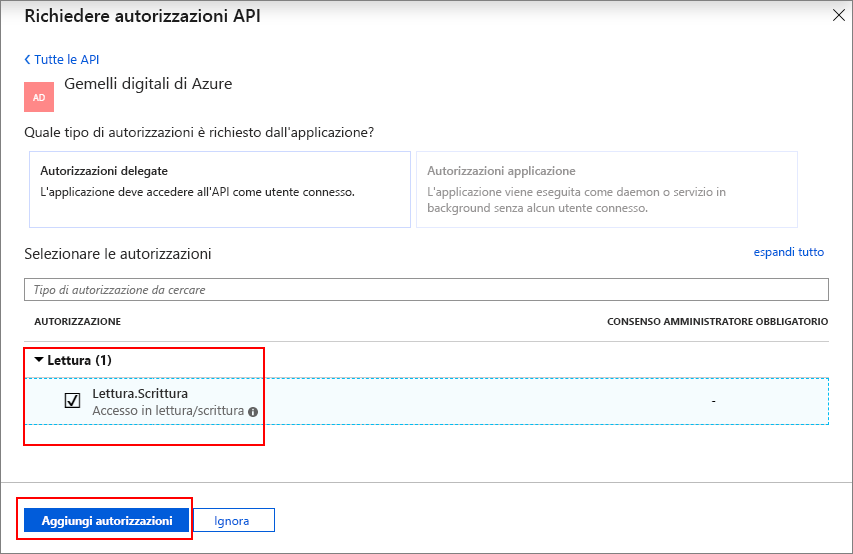

# <a name="azure-digital-twins-swagger-reference-documentation"></a>Documentazione di riferimento di Swagger per Gemelli digitali di Azure

Ogni istanza di Gemelli digitali di Azure di cui è stato effettuato il provisioning include la propria documentazione di riferimento Swagger generata automaticamente.

[Swagger](https://swagger.io/) (o [OpenAPI](https://www.openapis.org/)) raccoglie complesse informazioni sulle API in una risorsa di riferimento interattiva e indipendente dal linguaggio. Swagger fornisce materiale di riferimento di importanza critica sui payload JSON, i metodi HTTP e gli endpoint specifici da usare per eseguire operazioni su un'API.

## <a name="swagger-summary"></a>Riepilogo di Swagger

Swagger fornisce un riepilogo interattivo dell'API, che include:

* Informazioni sull'API e sul modello a oggetti.
* Endpoint API REST che specificano i payload delle richieste, le intestazioni, i parametri, i percorsi di contesto e i metodi HTTP necessari.
* Test delle funzionalità dell'API.
* Informazioni sulla risposta di esempio per la convalida e la conferma delle risposte HTTP.
* Informazioni sui codici di errore.

Swagger è un pratico strumento per semplificare lo sviluppo e i test delle chiamate effettuate all'API Gestione per Gemelli digitali di Azure.

[!INCLUDE [Digital Twins Swagger](../../includes/digital-twins-swagger.md)]

## <a name="reference-material"></a>Materiale di riferimento

Il materiale di riferimento di Swagger generato automaticamente offre una rapida panoramica di concetti importanti, endpoint disponibili dell'API Gestione e una descrizione di ogni modello a oggetti per facilitare sviluppo e test.

Un breve riepilogo descrive l'API.

[](media/how-to-use-swagger/swagger_management_top.PNG#lightbox)

Sono elencati anche i modelli a oggetti dell'API Gestione.

[](media/how-to-use-swagger/swagger_management_models.PNG#lightbox)

È possibile selezionare ogni modello a oggetti elencato per visualizzare un riepilogo più dettagliato degli attributi principali.

[](media/how-to-use-swagger/swagger_management_model.PNG#lightbox)

I modelli a oggetti di Swagger generati sono utili per visualizzare tutti gli oggetti e le API di [Gemelli digitali di Azure](./concepts-objectmodel-spatialgraph.md) disponibili. Gli sviluppatori possono usare questa risorsa quando compilano soluzioni in Gemelli digitali di Azure.

## <a name="endpoint-summary"></a>Riepilogo degli endpoint

Swagger fornisce anche una panoramica completa di tutti gli endpoint che compongono l'API Gestione.

Ogni endpoint elencato include anche le informazioni obbligatorie sulla richiesta, tra cui:

* I parametri obbligatori.
* I tipi di dati dei parametri obbligatori.
* Metodo HTTP per l'accesso alla risorsa.

[](media/how-to-use-swagger/swagger_management_endpoints.PNG#lightbox)

È possibile fare clic su ogni risorsa per visualizzare una panoramica più dettagliata.

## <a name="use-swagger-to-test-endpoints"></a>Usare Swagger per testare gli endpoint

Una delle funzionalità più potenti offerte da Swagger è la possibilità di testare un endpoint API direttamente dall'interfaccia utente della documentazione.

Dopo aver selezionato un endpoint specifico, verrà visualizzato **Prova**.

[](media/how-to-use-swagger/swagger_management_try.PNG#lightbox)

Espandere la sezione per visualizzare i campi di input per ogni parametro obbligatorio e facoltativo. Immettere i valori corretti, quindi selezionare **Esegui**.

[](media/how-to-use-swagger/swagger_management_tried.PNG#lightbox)

Dopo l'esecuzione del test, è possibile convalidare i dati della risposta.

## <a name="swagger-response-data"></a>Dati della risposta di Swagger

Ogni endpoint elencato include anche i dati del corpo della risposta per convalidare lo sviluppo e i test. Questi esempi includono il codice JSON e i codici di stato desiderati per le richieste HTTP riuscite.

[](media/how-to-use-swagger/swagger_management_response.PNG#lightbox)

Gli esempi includono anche i codici di errore per facilitare il debug o migliorare i test non superati.

## <a name="swagger-oauth-20-authorization"></a>Autorizzazione OAuth 2.0 di Swagger

Per altre informazioni sul test interattivo delle richieste protette tramite OAuth 2.0, vedere la [documentazione ufficiale](https://swagger.io/docs/specification/authentication/oauth2/).

> [!NOTE]
> L'entità utente che ha creato la risorsa di Azure digitale gemelli disporrà di un'assegnazione di ruolo di amministratore di spazio e sarà possibile creare assegnazioni di ruolo aggiuntive per gli altri utenti.

1. Seguire i passaggi descritti in [questa Guida introduttiva](https://docs.microsoft.com/azure/active-directory/develop/quickstart-v1-integrate-apps-with-azure-ad) per creare un'applicazione di Azure AD di tipo ***app Web / API***. Oppure è possibile riutilizzare una registrazione di app esistente.

2. Aggiungere il seguente url di risposta per la registrazione dell'app:

    ```plaintext
    https://YOUR_SWAGGER_URL/ui/oauth2-redirect-html
    ```
    | Name  | Sostituire con | Esempio |
    |---------|---------|---------|
    | YOUR_SWAGGER_URL | L'URL della documentazione API REST di gestione disponibili nel portale di  | `https://yourDigitalTwinsName.yourLocation.azuresmartspaces.net/management/swagger` |

3. Concedere le autorizzazioni per l'app accedere ai dispositivi gemelli digitale di Azure. In **Autorizzazioni necessarie** immettere `Azure Digital Twins` e selezionare **Autorizzazioni delegate**. Selezionare quindi **Grant Permissions** (Concedi autorizzazioni).

    

4. Configurare il manifesto dell'applicazione per Consenti flusso implicito OAuth 2.0. Selezionare **manifesto** per aprire il manifesto dell'applicazione per l'app. Impostare *oauth2AllowImplicitFlow* su `true`.

    

5. Copiare l'ID dell'app Azure AD.

Dopo aver completato la registrazione di Azure Active Directory:

6. Selezionare il **Authorize** su pulsante della pagina di swagger.

    [](media/how-to-use-swagger/swagger-select-authorize-btn.png#lightbox)

7. Incollare l'ID applicazione nella **client_id** campo.

    [](media/how-to-use-swagger/swagger-auth-form.png#lightbox)

8. Si verrà quindi reindirizzati al successo seguente modale.

    [](media/how-to-use-swagger/swagger_auth_redirect.PNG#lightbox)

## <a name="next-steps"></a>Passaggi successivi

- Per altre informazioni sui modelli a oggetti e il grafico di intelligence spaziale di Gemelli digitali di Azure, vedere [Informazioni sui modelli a oggetti di Gemelli digitali di Azure](./concepts-objectmodel-spatialgraph.md).

- Per informazioni su come eseguire l'autenticazione con l'API di gestione, vedere [Eseguire l'autenticazione con le API](./security-authenticating-apis.md).