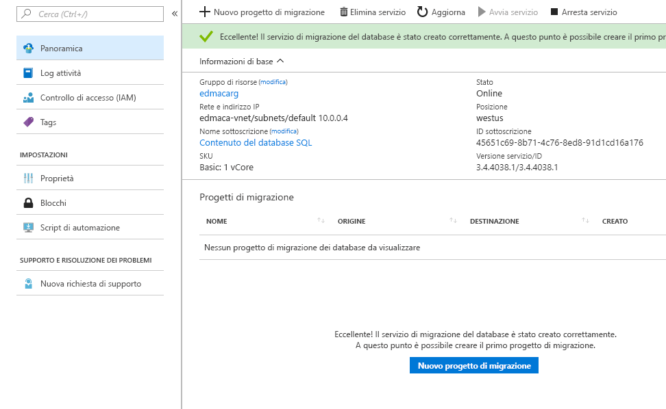

# Creare un'istanza del Servizio Migrazione del database di Azure usando il portale di Azure
In questa guida introduttiva usare il portale di Azure per creare un'istanza del servizio Migrazione del database di Azure.  Dopo aver creato il servizio, è possibile usarlo per eseguire la migrazione dei dati da SQL Server locale a un database SQL di Azure.

Se non si ha una sottoscrizione di Azure, creare un account [gratuito](https://azure.microsoft.com/free/) prima di iniziare.

## Accedere al Portale di Azure
Nel Web browser passare al [portale di Microsoft Azure](https://portal.azure.com/) e quindi immettere le credenziali per accedere al portale.

La visualizzazione predefinita è il dashboard del servizio.

## Registrare il provider di risorse
Prima di creare la prima istanza del servizio Migrazione del database, registrare il provider di risorse Microsoft.DataMigration.

1. Nel portale di Azure selezionare **Tutti i servizi** e quindi **Sottoscrizioni**.

2. Selezionare la sottoscrizione in cui si vuole creare l'istanza del Servizio Migrazione del database di Azure e quindi selezionare **Provider di risorse**.

3. Cercare la migrazione e quindi a destra di Microsoft.DataMigration selezionare **Registra**.

## Creare un'istanza del servizio
1. Fare clic su **+ Crea una risorsa** per creare un'istanza del Servizio Migrazione del database di Azure.

2. Cercare "migrazione" nel marketplace, selezionare **Servizio Migrazione del database di Azure** e quindi nella schermata **Servizio Migrazione del database di Azure** fare clic su **Crea**.

3. Nella schermata **Servizio Migrazione del database**: 

    - Scegliere un **nome servizio** facile da ricordare e univoco per identificare l'istanza del servizio Migrazione del database di Azure.
    - Selezionare la **sottoscrizione** di Azure in cui creare l'istanza.
    - Creare una nuova **Rete** con un nome univoco.
    - Scegliere la **Posizione** più vicina al server di origine o di destinazione.
    - Selezionare Basic: 1 vCore per il **Piano tariffario**.

    
4. Selezionare **Create**.

Dopo qualche istante, l'istanza del servizio Migrazione del database di Azure viene creata ed è pronta per l'uso. Il servizio Migrazione del database viene visualizzato come illustrato nell'immagine seguente:

## Pulire le risorse
È possibile pulire le risorse create in questa guida introduttiva eliminando il [gruppo di risorse di Azure](../azure-resource-manager/resource-group-overview.md).  Per eliminare il gruppo di risorse, passare all'istanza del servizio Migrazione del database di Azure creata. Selezionare il nome **Gruppo di risorse** e quindi selezionare **Elimina gruppo di risorse**.  Questa azione elimina tutti gli asset nel gruppo di risorse, nonché il gruppo stesso.

## Passaggi successivi
> [!div class="nextstepaction"]
> [Eseguire la migrazione di SQL Server locale nel database SQL di Azure](tutorial-sql-server-to-azure-sql.md)