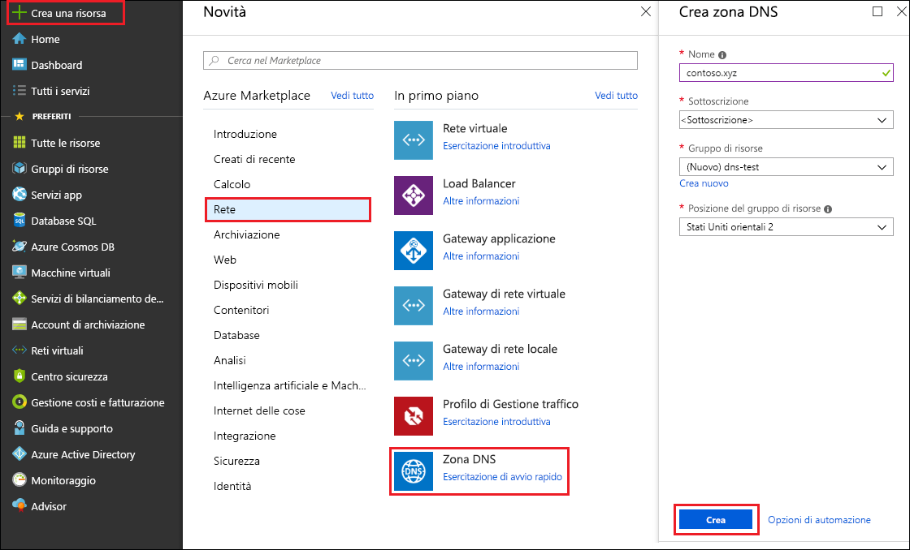
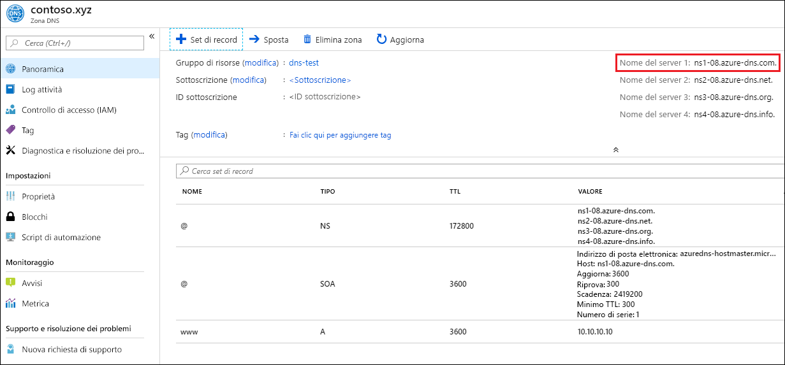

# <a name="quickstart-configure-azure-dns-for-name-resolution-using-the-azure-portal"></a>Guida introduttiva: Configurare DNS di Azure per la risoluzione dei nomi con il portale di Azure

 È possibile configurare DNS di Azure per la risoluzione dei nomi host nel dominio pubblico. Ad esempio, se è stato acquistato il nome di dominio contoso.com da un registrar di nomi di dominio, è possibile configurare DNS di Azure in modo da ospitare il dominio contoso.com e risolvere www.contoso.com all'indirizzo IP del server Web o dell'app Web.

In questa guida introduttiva verrà creato un dominio di test e quindi un record di indirizzo denominato "www" per risolvere l'indirizzo IP 10.10.10.10.

È importante tenere presente che tutti i nomi e gli indirizzi IP usati in questa guida introduttiva sono solo esempi e non intendono rappresentare uno scenario reale. Tuttavia, dove applicabile, sono anche descritti scenari reali.

<!---
You can also perform these steps using [Azure PowerShell](dns-getstarted-powershell.md) or the cross-platform [Azure CLI](dns-getstarted-cli.md).
--->

Una zona DNS viene usata per contenere le voci DNS per un particolare dominio. Per iniziare a ospitare il dominio in DNS di Azure, è necessario creare una zona DNS per il nome di dominio. Ogni voce (o record) DNS per il dominio viene quindi creata all'interno di questa zona DNS. I passaggi che seguono spiegano come eseguire questa operazione.

Se non si ha una sottoscrizione di Azure, creare un [account gratuito](https://azure.microsoft.com/free/?WT.mc_id=A261C142F) prima di iniziare.

## <a name="create-a-dns-zone"></a>Creare una zona DNS

1. Accedere al portale di Azure.
2. In alto a sinistra fare clic su **+ Crea una risorsa**, **Rete**, quindi **Zona DNS** per aprire la pagina **Crea zona DNS**.

    

4. Nella pagina **Crea zona DNS** immettere i valori seguenti e fare clic su **Crea**:


   | **Impostazione** | **Valore** | **Dettagli** |
   |---|---|---|
   |**Nome**|contoso.xyz|Il nome della zona DNS per questo esempio può essere qualsiasi valore per questa guida introduttiva, a condizione che non sia già configurato nei server DNS di Azure. Un valore reale sarebbe un dominio acquistato da un registrar di nomi di dominio.|
   |**Sottoscrizione**|[Sottoscrizione]|Selezionare una sottoscrizione in cui creare la zona DNS.|
   |**Gruppo di risorse**|**Crea nuovo:** dns-test|Creare un gruppo di risorse. Il nome del gruppo di risorse deve essere univoco all'interno della sottoscrizione selezionata. |
   |**Posizione**|Stati Uniti orientali||

La creazione della zona può richiedere alcuni minuti.

## <a name="create-a-dns-record"></a>Creare un record DNS

A questo punto creare un nuovo record di indirizzo (record "A"). I record "A" vengono usati per risolvere un nome host in un indirizzo IPv4.

1. Nel riquadro **Preferiti** del portale di Azure fare clic su **Tutte le risorse**. Fare clic sulla zona DNS **contoso.xyz** nella pagina Tutte le risorse. Se nella sottoscrizione selezionata sono già presenti delle risorse, è possibile immettere **contoso.xyz** nella casella **Filtra per nome** per accedere facilmente alla zona DNS.

1. Nella parte superiore della pagina **Zona DNS** selezionare **+ Set di record** per aprire la pagina **Aggiungi set di record**.

1. Nella pagina **Aggiungi set di record** immettere i valori seguenti e fare clic su **OK**. In questo esempio viene creato un record "A".

   |**Impostazione** | **Valore** | **Dettagli** |
   |---|---|---|
   |**Nome**|www|Nome del record. Si tratta del nome da usare per l'host da risolvere in un indirizzo IP.|
   |**Tipo**|Una | Tipo di record DNS da creare. I record "A" sono i più comuni, ma esistono altri tipi di record per server di posta elettronica (MX), indirizzi IPv6 (AAAA) e così via. |
   |**TTL**|1|Durata (TTL) della richiesta DNS. Specifica per quanto tempo i client e i server DNS possono memorizzare nella cache una risposta.|
   |**Unità TTL**|hours|Misura di tempo per il valore TTL.|
   |**Indirizzo IP**|10.10.10.10| Questo valore indica l'indirizzo IP in cui il record "A" esegue la risoluzione. Si tratta solo di un valore di test per questa guida introduttiva. Per un esempio reale, sarebbe necessario immettere l'indirizzo IP pubblico per il server Web.|


Poiché nell'ambito di questa guida introduttiva non si acquista effettivamente un nome di dominio reale, non è necessario configurare DNS di Azure come server dei nomi con il registrar. Tuttavia, in uno scenario reale, sarebbe preferibile consentire a qualsiasi utente su Internet di risolvere il nome host per connettersi al server o all'app Web. Per altre informazioni su questo scenario reale, vedere [Delegare un dominio al servizio DNS di Azure](dns-delegate-domain-azure-dns.md).


## <a name="test-the-name-resolution"></a>Testare la risoluzione dei nomi

Dopo aver creato una zona di test, con un record "A" di test al suo interno, è possibile testare la risoluzione dei nomi con uno strumento denominato *nslookup*. 

1. Innanzitutto, è necessario prendere nota dei server dei nomi di DNS di Azure da usare con nslookup. 

   I server dei nomi per la propria zona sono elencati nella pagina **Panoramica** delle zone DNS. Copiare il nome di uno dei server dei nomi:

   

2. Aprire un prompt dei comandi ed eseguire il comando seguente:

   ```
   nslookup <host name> <name server>
   
   For example:

   nslookup www.contoso.xyz ns1-08.azure-dns.com
   ```

Verranno visualizzati dei risultati simili a quello nello screenshot seguente:


Questo conferma il corretto funzionamento della risoluzione dei nomi. www.contoso.xyz viene risolto in 10.10.10.10, esattamente come è stato configurato.

## <a name="clean-up-resources"></a>Pulire le risorse

Quando non è più necessario, eliminare il gruppo di risorse **dns-test** per eliminare le risorse create in questa guida introduttiva. A tale scopo, fare clic sul gruppo di risorse **dns-test** e quindi su **Elimina gruppo di risorse**.


## <a name="next-steps"></a>Passaggi successivi

> [!div class="nextstepaction"]
> [Creare record DNS per un'app Web in un dominio personalizzato](./dns-web-sites-custom-domain.md)