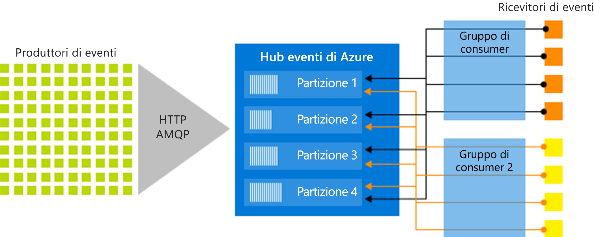

# Che cos'è l'hub di eventi di Azure?

Hub eventi di Azure è una piattaforma di Big Data streaming e un servizio di inserimento di eventi che consente di ricevere ed elaborare milioni di eventi al secondo. Hub eventi consente di elaborare e archiviare eventi, dati o dati di telemetria generati dal software distribuito e dai dispositivi. I dati inviati a un hub eventi possono essere trasformati e archiviati usando qualsiasi provider di analisi in tempo reale o adattatori di invio in batch/archiviazione. 

Hub eventi viene usato in alcuni dei seguenti scenari comuni:

- Rilevamento di anomalie (illecito/outlier)
- Registrazione di applicazioni
- Pipeline di analisi, ad esempio clickstream
- Creazione di dashboard in tempo reale
- Archiviazione di dati
- Elaborazione di transazioni
- Elaborazione di dati di telemetria dell'utente
- Streaming della telemetria dei dispositivi 

## Vantaggi dell'uso di Hub eventi

I dati sono utili solo quando esiste un modo semplice per elaborare e ottenere in modo tempestivo informazioni dettagliate da origini dati. Hub eventi offre una piattaforma di elaborazione di flusso distribuito con bassa latenza e facile integrazione, con servizi dati e di analisi all'interno e all'esterno di Azure per creare una pipeline di Big Data completa.

Hub eventi rappresenta la "porta principale" per una pipeline di eventi, spesso denominata *inseritore eventi* nelle architetture della soluzione. Un ingestor evento è un componente o servizio che si trova tra gli autori e i consumer di eventi per separare la produzione di un flusso di eventi dal consumo di tali eventi. Hub eventi offre una piattaforma di streaming unificata con buffer basato sul tempo di conservazione, separando i producer di eventi dai consumer di eventi. 

Le sezioni seguenti descrivono le funzionalità principali del servizio Hub eventi di Azure: 

## Soluzione PaaS completamente gestita 

Hub eventi è un servizio gestito che richiede configurazione o sovraccarico di gestione limitati, consentendo ai clienti di concentrare l'attenzione sulle soluzioni aziendali. [Hub eventi per ecosistemi Apache Kafka](event-hubs-for-kafka-ecosystem-overview.md) offre l'esperienza di PaaS Kafka senza necessità di dover gestire, configurare o eseguire i cluster.

## Supporto per elaborazione batch e in tempo reale

Inserimento, memorizzazione nel buffer, archiviazione ed elaborazione del flusso in tempo reale per ottenere informazioni dettagliate di utilità pratica. Hub eventi usa un [modello di consumer partizionato](event-hubs-features.md#partitions), consentendo a più applicazioni di elaborare contemporaneamente il flusso e all'utente di controllare la velocità di elaborazione.

È possibile[acquisire](event-hubs-capture-overview.md) i dati quasi in tempo reale in un [archivio BLOB di Azure](https://azure.microsoft.com/services/storage/blobs/) oppure in [Azure Data Lake Store](https://azure.microsoft.com/services/data-lake-store/) per l'elaborazione di micro batch o la conservazione a lungo termine. È possibile ottenere questo risultato sullo stesso flusso utilizzato per la derivazione di analisi in tempo reale. La configurazione di Acquisizione è rapida, non sono previsti costi amministrativi per l'esecuzione e viene ridimensionata automaticamente con le  [unità elaborate](event-hubs-features.md#throughput-units) in Hub eventi. Acquisizione di Hub eventi consente ai clienti di concentrarsi sull'elaborazione dei dati, invece che sull'acquisizione dei dati.

Hub eventi di Azure si integra inoltre con [Funzioni di Azure](/azure/azure-functions/) per un'architettura senza server.

## Scalabile 

Con Hub eventi, è possibile iniziare con i flussi di dati in MB, per poi aumentare ai GB o TB. La funzionalità [Aumento automatico](event-hubs-auto-inflate.md) è una delle numerose opzioni disponibili per ridimensionare il numero di unità elaborate in modo da soddisfare le esigenze di utilizzo. 

## Ecosistema avanzato

[Hub eventi per ecosistemi Apache Kafka](event-hubs-for-kafka-ecosystem-overview.md) consente ai clienti di[Apache Kafka (1.0 e versioni successive)](https://kafka.apache.org/) e alle applicazioni di comunicare con Hub eventi senza la necessità di gestire alcun cluster.
 
Con un ampio ecosistema disponibile in diversi [linguaggi (.NET, Java, Python, Go, Node. js)](https://github.com/Azure/azure-event-hubs), è possibile avviare facilmente l'elaborazione di flussi da Hub eventi. Tutte i linguaggi lato client supportati offrono un'integrazione di basso livello.

## Componenti principali dell'architettura

Hub eventi offre funzionalità di gestione del flusso di messaggi, ma presenta caratteristiche diverse da quelle dei servizi di messaggistica aziendale tradizionale. Le funzionalità di Hub eventi sono basate su scenari con velocità effettiva elevata ed elaborazione di eventi. Hub eventi contiene gli [elementi chiave](event-hubs-features.md) seguenti:

- **Producer di eventi**: qualsiasi entità che invia dati a un hub eventi. Gli autori di eventi possono pubblicare eventi usando HTTPS o AMQP 1.0 o Apache Kafka (1.0 e versioni successive)
- **Partizione**: ogni consumer legge solo un subset specifico, o partizione, del flusso di messaggi.
- **Gruppi di consumer**: una visualizzazione (stato, posizione o offset) di un intero hub eventi. I gruppi di consumer consentono a più applicazioni costose di avere una visualizzazione separata del flusso di eventi e di leggere il flusso in modo indipendente in base alle proprie esigenze e con i propri gli offset.
- **Unità di velocità effettiva**: unità di capacità pre-acquistate che controllano la capacità di velocità effettiva di Hub eventi.
- **Ricevitori di eventi**: qualsiasi entità che legge i dati dell'evento da un hub eventi. Tutti i consumer di Hub eventi si connettono tramite la sessione AMQP 1.0 e gli eventi vengono recapitati tramite la sessione appena disponibili. Tutti i consumer Kafka si connettono tramite il protocollo Kafka 1.0 e versioni successive.

La figura seguente illustra l'architettura di elaborazione del flusso di Hub eventi:

## Passaggi successivi

Per iniziare a usare Hub eventi, vedere i seguenti articoli:

* [Inserimento in Hub eventi](event-hubs-quickstart-portal.md)
* [Panoramica delle funzionalità di Hub eventi](event-hubs-features.md)
* [Domande frequenti](event-hubs-faq.md)

