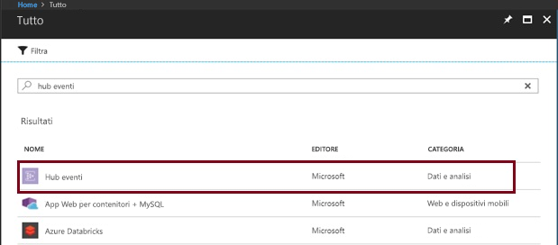
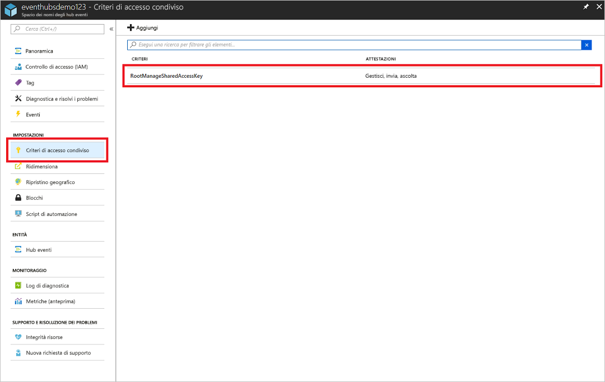

# <a name="stream-into-event-hubs-for-the-apache-kafka"></a>Eseguire lo streaming in Hub eventi per Apache Kafka
Questa guida introduttiva illustra come eseguire lo streaming in un'istanza di Hub eventi abilitata per Kafka senza modificare i client di protocollo o eseguire cluster personalizzati. Si apprenderà come usare i producer e i consumer per comunicare con un'istanza di Hub eventi abilitata per Kafka con solo una modifica della configurazione nelle applicazioni. Hub eventi di Azure supporta [Apache Kafka versione 1.0.](https://kafka.apache.org/10/documentation.html)

> [!NOTE]
> Questo esempio è disponibile su [GitHub](https://github.com/Azure/azure-event-hubs)

## <a name="prerequisites"></a>Prerequisiti

Per completare questa guida introduttiva, accertarsi di soddisfare i requisiti seguenti:

* Una sottoscrizione di Azure. Se non se ne ha una, creare un [account gratuito](https://azure.microsoft.com/free/?ref=microsoft.com&utm_source=microsoft.com&utm_medium=docs&utm_campaign=visualstudio) prima di iniziare.
* [Java Development Kit (JDK) 1.7+](http://www.oracle.com/technetwork/java/javase/downloads/index.html).
* [Scaricare](http://maven.apache.org/download.cgi) e [installare](http://maven.apache.org/install.html) un archivio binario Maven.
* [Git](https://www.git-scm.com/)
* [Uno spazio dei nomi di Hub eventi abilitato per Kafka](event-hubs-create.md)

## <a name="create-a-kafka-enabled-event-hubs-namespace"></a>Creare uno spazio dei nomi di Hub eventi con supporto per Kafka

1. Accedere al [portale di Azure][portale di Azure] e fare clic su **Crea una risorsa** nella parte superiore sinistra della schermata.

2. Eseguire la ricerca per gli Hub eventi e selezionare le opzioni illustrate di seguito:
    
    
 
3. Specificare un nome univoco e abilitare Kafka nello spazio dei nomi. Fare clic su **Create**(Crea).
    
    
 
4. Dopo aver creato lo spazio dei nomi, nella scheda **Impostazioni** fare clic su **Criteri di accesso condivisi** per ottenere la stringa di connessione.

    

5. È possibile scegliere il valore predefinito **RootManageSharedAccessKey**, oppure aggiungere un nuovo criterio. Fare clic sul nome del criterio e copiare la stringa di connessione. 
    
    
 
6. Aggiungere questa stringa di connessione alla configurazione dell'applicazione Kafka.

È ora possibile trasmettere gli eventi dalle applicazioni che usano il protocollo Kafka negli Hub eventi.

## <a name="send-and-receive-messages-with-kafka-in-event-hubs"></a>Inviare e ricevere messaggi con Kafka in Hub eventi

1. Clonare il [repository di Hub eventi di Azure](https://github.com/Azure/azure-event-hubs).

2. Accedere a `azure-event-hubs/samples/kafka/quickstart/producer`.

3. Aggiornare i dettagli di configurazione per il producer in `src/main/resources/producer.config` come indicato di seguito:

    ```xml
    bootstrap.servers={YOUR.EVENTHUBS.FQDN}:9093
    security.protocol=SASL_SSL
    sasl.mechanism=PLAIN
    sasl.jaas.config=org.apache.kafka.common.security.plain.PlainLoginModule required username="$ConnectionString" password="{YOUR.EVENTHUBS.CONNECTION.STRING}";
    ```
4. Eseguire il codice del producer ed eseguire lo streaming nell'istanza di Hub eventi abilitata per Kafka.
   
    ```shell
    mvn clean package
    mvn exec:java -Dexec.mainClass="TestProducer"                                    
    ```
5. Accedere a `azure-event-hubs/samples/kafka/quickstart/consumer`.

6. Aggiornare i dettagli di configurazione per il consumer in `src/main/resources/consumer.config` come indicato di seguito:
   
    ```xml
    bootstrap.servers={YOUR.EVENTHUBS.FQDN}:9093
    security.protocol=SASL_SSL
    sasl.mechanism=PLAIN
    sasl.jaas.config=org.apache.kafka.common.security.plain.PlainLoginModule required username="$ConnectionString" password="{YOUR.EVENTHUBS.CONNECTION.STRING}";
    ```

7. Eseguire il codice del consumer ed eseguire l'elaborazione dall'istanza di Hub eventi abilitata per Kafka usando i client Kafka:

    ```java
    mvn clean package
    mvn exec:java -Dexec.mainClass="TestConsumer"                                    
    ```

Se il cluster Kafka di Hub eventi include eventi, si dovrebbe ora iniziare a riceverli dal consumer.

## <a name="next-steps"></a>Passaggi successivi
In questo articolo è stato illustrato come eseguire lo streaming in un'istanza di Hub eventi abilitata per Kafka senza modificare i client di protocollo o eseguire cluster personalizzati. Per altre informazioni, passare all'esercitazione successiva:

> [!div class="nextstepaction"]
> [Usare Kafka MirrorMaker con Hub eventi](event-hubs-kafka-mirror-maker-tutorial.md)
