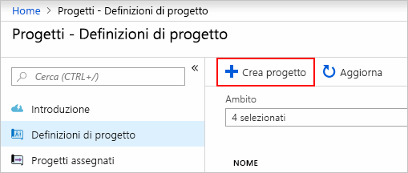
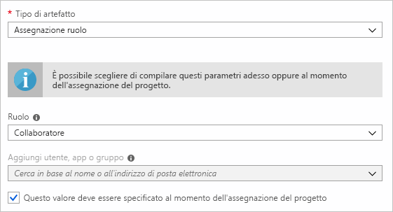
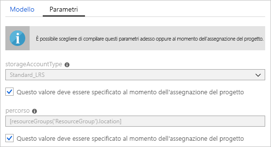
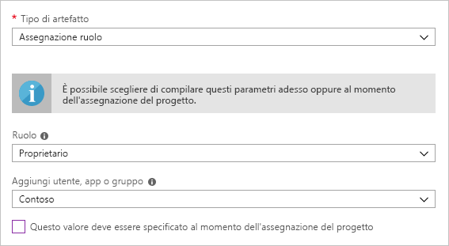
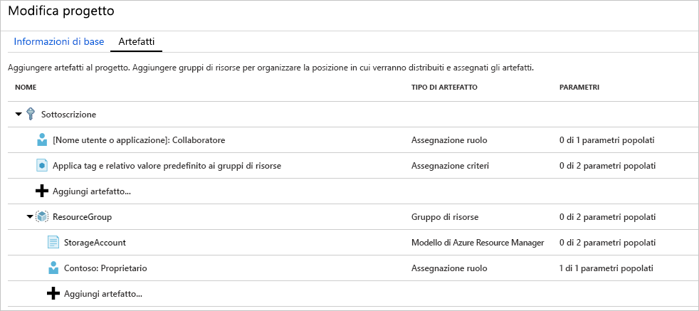
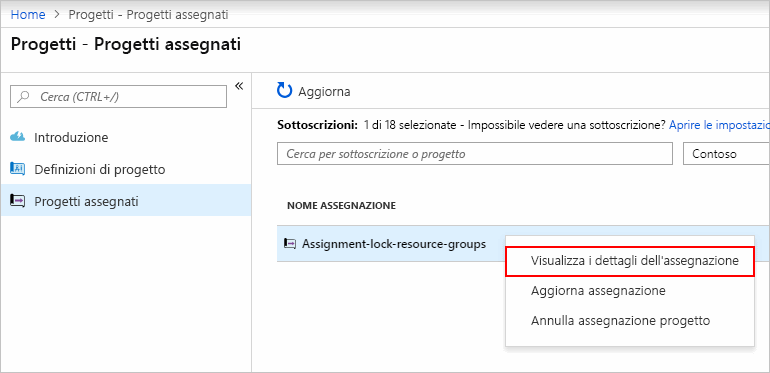

# <a name="define-and-assign-an-azure-blueprint-in-the-portal"></a>Definire e assegnare un progetto Azure Blueprint nel portale

Imparare a creare e assegnare progetti consente di definire modelli comuni per sviluppare configurazioni riutilizzabili e rapidamente distribuibili in base a modelli di Resource Manager, criteri, sicurezza e altro ancora. In questa esercitazione viene descritto come usare Azure Blueprint per eseguire alcune della attività comuni di creazione, pubblicazione e assegnazione di un progetto all'interno dell'organizzazione, ad esempio:

> [!div class="checklist"]
> - Creare un nuovo progetto e aggiungere diversi elementi supportati
> - Apportare modifiche a un progetto esistente ancora in fase di **bozza**
> - Contrassegnare un progetto come pronto per l'assegnazione con stato **Pubblicato**
> - Assegnare un progetto a una sottoscrizione esistente
> - Controllare lo stato e l'avanzamento di un progetto assegnato
> - Rimuovere un progetto assegnato a una sottoscrizione

Se non si ha una sottoscrizione di Azure, creare un [account gratuito](https://azure.microsoft.com/free) prima di iniziare.

## <a name="create-a-blueprint"></a>Creare un progetto

Il primo passaggio nella definizione di un modello standard per la conformità è la creazione di un progetto dalle risorse disponibili. In questo esempio si creerà un nuovo progetto denominato 'MyBlueprint' per configurare le assegnazioni di ruolo e di criteri per la sottoscrizione, aggiungere un nuovo gruppo di risorse e creare un modello di Resource Manager e un'assegnazione di ruolo nel nuovo gruppo di risorse.

1. Fare clic su **Tutti i servizi** e quindi cercare e selezionare **Criteri** nel riquadro sinistro. Nella pagina **Criteri** fare clic su **Progetti**.

1. Selezionare **Definizioni di progetto** nella pagina a sinistra e fare clic sul pulsante **+ Crea progetto** nella parte superiore della pagina.

   - In alternativa, fare clic su **Crea** nella pagina **Attività iniziali** per passare direttamente alla creazione di un progetto.

   

1. Specificare un nome in **Nome progetto**, ad esempio "MyBlueprint" (lettere e numeri, fino a 48 caratteri, ma senza spazi o caratteri speciali) per il progetto, ma per il momento lasciare vuoto il campo **Descrizione del progetto**.  Nella casella **Località della definizione** fare clic sui puntini di sospensione a destra, selezionare il [gruppo di gestione](../management-groups/overview.md) o la sottoscrizione in cui si vuole salvare il progetto e fare clic su **Seleziona**.

1. Verificare che le informazioni siano corrette (i campi **Nome progetto** e **Percorso della definizione** non potranno essere modificati successivamente) e fare clic su **Avanti: Artefatti** nella parte inferiore della pagina o nella scheda **Artefatti** nella parte superiore della pagina.

1. Aggiungere un'assegnazione di ruolo alla sottoscrizione: fare clic sulla riga **+ Aggiungi artefatto...** sotto la voce **Sottoscrizione**. Verrà visualizzata la finestra "Aggiungi elemento" sul lato destro del browser. Selezionare "Assegnazione ruolo" per _Tipo di elemento_. In _Ruolo_ selezionare "Collaboratore" e lasciare il campo _Add User, App or Group_ (Aggiungi utente, app o gruppo) con la casella di controllo che indica un **parametro dinamico**. Fare clic su **Aggiungi** per aggiungere questo elemento al progetto.

   

   > [!NOTE]
   > La maggior parte degli _elementi_ supporta parametri. Un parametro cui è assegnato un valore durante la creazione del progetto è un **parametro statico**. Se il parametro viene assegnato durante l'assegnazione del progetto, si tratta di un **parametro dinamico**. Per altre informazioni, vedere [Blueprint parameters](./concepts/parameters.md) (Parametri per i progetti).

1. Aggiungere un'assegnazione di criteri alla sottoscrizione: fare clic sulla riga **+ Aggiungi artefatto...** direttamente sotto **Sottoscrizione**. Selezionare "Assegnazione criteri" per _Tipo di elemento_. Modificare il valore di _Tipo_ in "Predefinito" e in _Cerca_ immettere "tag". Fare clic al di fuori di _Cerca_ per applicare il filtro. Selezionare "Applica tag e relativo valore predefinito ai gruppi di risorse". Fare clic su **Aggiungi** per aggiungere questo elemento al progetto.

1. Fare clic nella riga dell'assegnazione di criteri "Applica tag e relativo valore predefinito ai gruppi di risorse". Viene visualizzata la finestra per fornire i parametri per l'elemento come parte della definizione del progetto, in cui è possibile impostare i parametri per tutte le assegnazioni (**parametri statici**) in base a questo progetto anziché durante l'assegnazione (**parametri dinamici**). Poiché ai fini di questo esempio vengono usati **parametri dinamici** durante l'assegnazione del progetto, lasciare le impostazioni predefinite e fare clic su **Annulla**.

1. Aggiungere un gruppo di risorse alla sottoscrizione: fare clic sulla riga **+ Aggiungi artefatto...** sotto la voce **Sottoscrizione**. Selezionare "Gruppo di risorse" per _Tipo di elemento_. Lasciare vuoti i campi _Nome gruppo di risorse_ e _Località_, ma assicurarsi che sia selezionata la casella di controllo per ogni proprietà in modo che i parametri siano **parametri dinamici**. Fare clic su **Aggiungi** per aggiungere questo elemento al progetto.

1. Aggiungere un modello nel gruppo di risorse: fare clic su **+ Aggiungi artefatto...** direttamente sotto la voce **Gruppo di risorse**. Selezionare "Modello di Azure Resource Manager" per _Tipo di elemento_, impostare _Nome visualizzato dell'artefatto_ su "Account di archiviazione" e lasciare vuoto il campo _Descrizione_. Nella scheda **Modello** nella casella dell'editor incollare il modello di Resource Manager seguente. Dopo aver incollato il modello, fare clic sulla scheda **Parametri** e osservare che il parametro del modello **storageAccountType** e il valore predefinito **Standard_LRS** sono stati automaticamente rilevati e completati, ma sono configurati come **parametri dinamici**. Rimuovere il segno di spunta dalla casella di controllo e osservare come l'elenco a discesa contenga ora solo i valori inclusi nel modello di Resource Manager in **allowedValues**. Selezionare la casella per reimpostarla su un **parametro dinamico**. Fare clic su **Aggiungi** per aggiungere questo elemento al progetto.

   > [!IMPORTANT]
   > Se si importa il modello, assicurarsi che il file sia solo JSON e non includa codice HTML. Quando si fa riferimento a un URL in GitHub, assicurarsi di aver fatto clic su **RAW** per ottenere il file JSON puro e non quello che include HTML per la visualizzazione in GitHub. Se il modello importato non è un file JSON puro, si verificherà un errore.

   ```json
   {
       "$schema": "https://schema.management.azure.com/schemas/2015-01-01/deploymentTemplate.json#",
       "contentVersion": "1.0.0.0",
       "parameters": {
           "storageAccountType": {
               "type": "string",
               "defaultValue": "Standard_LRS",
               "allowedValues": [
                   "Standard_LRS",
                   "Standard_GRS",
                   "Standard_ZRS",
                   "Premium_LRS"
               ],
               "metadata": {
                   "description": "Storage Account type"
               }
           }
       },
       "variables": {
           "storageAccountName": "[concat(uniquestring(resourceGroup().id), 'standardsa')]"
       },
       "resources": [{
           "type": "Microsoft.Storage/storageAccounts",
           "name": "[variables('storageAccountName')]",
           "apiVersion": "2016-01-01",
           "location": "[resourceGroup().location]",
           "sku": {
               "name": "[parameters('storageAccountType')]"
           },
           "kind": "Storage",
           "properties": {}
       }],
       "outputs": {
           "storageAccountName": {
               "type": "string",
               "value": "[variables('storageAccountName')]"
           }
       }
   }
   ```

   

1. Il progetto completo sarà simile al seguente. Notare che ogni elemento ha _x_ parametri popolati su _y_ nella colonna _Parametri_. I **parametri dinamici** vengono impostati durante ogni assegnazione del progetto.

   

1. Ora che sono stati aggiunti tutti gli elementi pianificati, fare clic su **Salva bozza** nella parte inferiore della pagina.

## <a name="edit-a-blueprint"></a>Modificare un progetto

In [Creare un progetto](#create-a-blueprint) non è stata fornita alcuna descrizione né è stata aggiunta l'assegnazione di ruolo al nuovo gruppo di risorse. Questi due problemi possono essere corretti eseguendo le operazioni seguenti:

1. Selezionare **Definizioni di progetto** nella pagina a sinistra.

1. Nell'elenco di progetti fare clic con il pulsante destro del mouse su quello creato in precedenza e scegliere **Modifica progetto**.

1. In **Descrizione del progetto** fornire alcune informazioni sul progetto e sugli elementi che lo costituiscono.  In questo caso, immettere una descrizione simile a quella che segue: "Questo progetto imposta criteri di tag e un'assegnazione di ruolo nella sottoscrizione, crea un gruppo di risorse e distribuisce al suo interno un modello di risorsa e un'assegnazione di ruolo".

1. Fare clic su **Avanti: Artefatti** nella parte inferiore della pagina o nella scheda **Artefatti** nella parte superiore della pagina.

1. Aggiungere un'assegnazione di ruolo nel gruppo di risorse: fare clic sulla riga **+ Aggiungi artefatto...** direttamente sotto la voce **Gruppo di risorse**. Selezionare "Assegnazione ruolo" per _Tipo di elemento_. In _Ruolo_ selezionare "Proprietario", rimuovere il segno di spunta per il campo _Add User, App or Group_ (Aggiungi utente, app o gruppo) e quindi cercare e selezionare un utente, un'app o un gruppo da aggiungere. Questo elemento usa un **parametro statico** con la stessa impostazione in ogni assegnazione di questo progetto. Fare clic su **Aggiungi** per aggiungere questo elemento al progetto.

   

1. Il progetto completo sarà simile al seguente. Si noti che l'assegnazione di ruolo appena aggiunta indica **1 parametro popolato su 1** e questo significa che si tratta di un **parametro statico**.

   

1. Fare clic su **Salva bozza** ora che il progetto è stato aggiornato.

## <a name="publish-a-blueprint"></a>Pubblicare un progetto

Ora che tutti gli elementi pianificati sono stati aggiunti al progetto, è possibile pubblicare il progetto.
La pubblicazione rende disponibile il progetto per l'assegnazione a una sottoscrizione.

1. Selezionare **Definizioni di progetto** nella pagina a sinistra.

1. Nell'elenco di progetti fare clic con il pulsante destro del mouse su quello creato in precedenza e scegliere **Pubblica progetto**.

1. Nella finestra di dialogo visualizzata impostare i campi **Versione** (lettere, numeri e trattini con una lunghezza massima di 20 caratteri), ad esempio "v1", e **Modifica le note** (facoltativo), ad esempio "Prima pubblicazione".

1. Fare clic su **Pubblica** nella parte inferiore della pagina.

## <a name="assign-a-blueprint"></a>Assegnare un progetto

Una volta pubblicato, un progetto può essere assegnato a una sottoscrizione. Assegnare il progetto creato a una delle sottoscrizioni nella gerarchia dei gruppi di gestione. Se il progetto viene salvato in una sottoscrizione, può essere assegnato solo a tale sottoscrizione.

1. Selezionare **Definizioni di progetto** nella pagina a sinistra.

1. Nell'elenco di progetti fare clic con il pulsante destro del mouse su quello creato in precedenza (oppure fare clic sui puntini di sospensione) e scegliere **Assegna progetto**.

1. Nella pagina **Assegna progetto** selezionare le sottoscrizioni in cui si vuole distribuire questo progetto nell'elenco a discesa **Sottoscrizione**.

   > [!NOTE]
   > Viene creata un'assegnazione per ogni sottoscrizione selezionata, permettendo successive modifiche a un'assegnazione a una sottoscrizione singola senza forzare modifiche nelle altre sottoscrizioni selezionate.

1. Per **Assigned Name** (Nome assegnato) specificare un nome univoco per l'assegnazione.

1. In **Località** selezionare un'area per l'identità gestita in cui creare l'assegnazione. Azure Blueprint usa questa identità gestita per distribuire tutti gli elementi nel progetto assegnato. Per altre informazioni, vedere [Managed identities for Azure resources](../../active-directory/managed-identities-azure-resources/overview.md) (Identità gestite per risorse di Azure).

1. Lasciare l'elenco a discesa **Versione della definizione di progetto** per **Versioni pubblicate** sulla voce "v1" (voce predefinita per le versioni **pubblicate** più recenti).

1. Per **Blocca assegnazione**, lasciare il valore predefinito **Non bloccare**. Per altre informazioni, vedere [Blueprints resource locking](./concepts/resource-locking.md) (Blocco delle risorse del progetto).

1. Per l'assegnazione di ruolo a livello di sottoscrizione **[gruppo di utenti o nome applicazione]: Collaboratore**, cercare e selezionare un utente, un'app o un gruppo.

1. Per l'assegnazione di criteri a livello di sottoscrizione, impostare **Nome tag** su "Centro di costo" e **Valore del tag** su "ContosoIT".

1. Per "Gruppo di risorse" specificare il nome "Account di archiviazione" in **Nome** e selezionare "Stati Uniti orientali 2" nell'elenco a discesa **Località**.

   > [!NOTE]
   > A ogni elemento aggiunto nel gruppo di risorse durante la definizione del progetto viene applicato un rientro per allinearlo al gruppo di risorse o a un oggetto con cui viene distribuito. Gli elementi che non accettano parametri o per cui non devono essere definiti parametri in fase di assegnazione vengono elencati solo per fornire informazioni contestuali.

1. Nel modello di Azure Resource Manager "Account di archiviazione" selezionare "Standard_GRS" per il parametro **storageAccountType**.

1. Leggere la casella informativa nella parte inferiore della pagina e quindi fare clic su **Assegna**.

## <a name="track-deployment-of-a-blueprint"></a>Monitorare la distribuzione di un progetto

Quando un progetto è stato assegnato a una o più sottoscrizioni, vengono eseguite due operazioni:

- Il progetto viene aggiunto alla pagina **Progetti assegnati** per ogni sottoscrizione assegnata
- Viene avviato il processo di distribuzione di tutti gli elementi definiti in base al progetto

Ora che il progetto è stato assegnato a una sottoscrizione, verificare lo stato di avanzamento della distribuzione.

1. Selezionare **Progetti assegnati** nella pagina a sinistra.

1. Nell'elenco di progetti fare clic con il pulsante destro del mouse su quello assegnato in precedenza e scegliere **Visualizza i dettagli dell'assegnazione**.

   

1. Nella pagina **Dettagli della distribuzione** verificare che tutti gli elementi siano stati distribuiti correttamente e che non si siano verificati errori durante la distribuzione. In caso di errori, vedere [Troubleshooting blueprint](./troubleshoot/general.md) (Risoluzione dei problemi relativi a un progetto) per istruzioni su come determinare gli eventuali problemi.

## <a name="unassign-a-blueprint"></a>Annullare l'assegnazione di un progetto

Rimuovere un'assegnazione di progetto da una sottoscrizione se non è più necessaria. Il progetto potrebbe sono stato sostituito da un progetto più recente con modelli, progettazioni e criteri aggiornati. Quando un progetto viene rimosso, gli elementi assegnati nell'ambito del progetto vengono mantenuti. Per rimuovere l'assegnazione di un progetto, completare questi passaggi:

1. Selezionare **Progetti assegnati** nella pagina a sinistra.

1. Nell'elenco di progetti selezionare il progetto di cui si vuole annullare l'assegnazione e quindi fare clic sul pulsante **Annulla assegnazione progetto** nella parte superiore della pagina.

1. Leggere il messaggio di conferma e quindi fare clic su **OK**.

## <a name="delete-a-blueprint"></a>Eliminare un progetto

1. Selezionare **Definizioni di progetto** nella pagina a sinistra.

1. Fare clic con il pulsante destro del mouse sul progetto che si vuole eliminare, scegliere **Elimina progetto** e quindi fare clic su **Sì** nella finestra di dialogo di conferma.

> [!NOTE]
> L'eliminazione di un progetto in questo modo comporta l'eliminazione anche di tutte le **versioni pubblicate** del progetto selezionato. Per eliminare una singola versione, aprire il progetto, fare clic sulla scheda **Versioni pubblicate**, selezionare e fare clic sulla versione che si vuole eliminare e quindi fare clic su **Delete This Version** (Elimina questa versione). Inoltre, un progetto con assegnazioni non può essere eliminato finché non vengono eliminate tutte le assegnazioni del progetto.

## <a name="next-steps"></a>Passaggi successivi

- Informazioni sul [ciclo di vita del progetto](./concepts/lifecycle.md)
- Informazioni su come usare [parametri statici e dinamici](./concepts/parameters.md)
- Imparare a personalizzare l'[ordine in sequenza del progetto](./concepts/sequencing-order.md)
- Scoprire come usare in modo ottimale il [blocco delle risorse del progetto](./concepts/resource-locking.md)
- Informazioni su come [aggiornare assegnazioni esistenti](./how-to/update-existing-assignments.md)
- Risolvere i problemi durante l'assegnazione di un progetto con la [risoluzione generale dei problemi](./troubleshoot/general.md)
