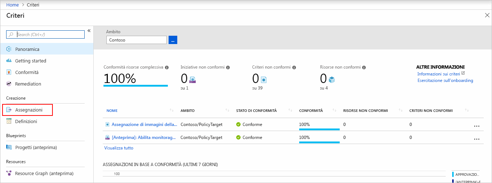
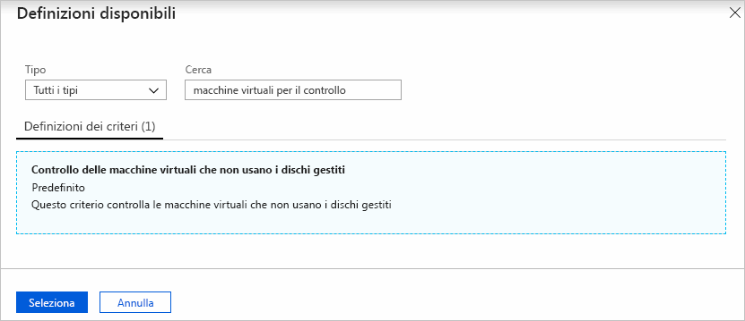
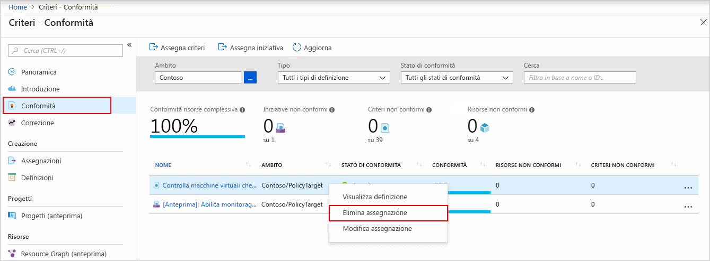

# Creare un'assegnazione di criteri per identificare le risorse non conformi nell'ambiente Azure

Il primo passaggio per comprendere la conformità in Azure consiste nell'identificare lo stato delle risorse.
Questa guida introduttiva illustra il processo di creazione di un'assegnazione criteri per identificare le macchine virtuali che non usano dischi gestiti.

Alla fine di questo processo, sarà possibile identificare le macchine virtuali che non usano Managed Disks. Tali macchine sono *non conformi* all'assegnazione dei criteri.

Se non si ha una sottoscrizione di Azure, creare un account [gratuito](https://azure.microsoft.com/free/) prima di iniziare.

## Creare un'assegnazione di criteri

In questa guida introduttiva si crea un'assegnazione dei criteri e si assegna la definizione dei criteri *Audit Virtual Machines without Managed Disks* (Controlla macchine virtuali senza Managed Disks).

1. Avviare il servizio Criteri di Azure nel portale di Azure facendo clic su **Tutti i servizi** e quindi cercando e selezionando **Criteri**.

   

1. Selezionare **Assegnazioni** a sinistra nella pagina Criteri di Azure. Un'assegnazione è un criterio che è stato assegnato per l'implementazione in un ambito specifico.

   

1. Selezionare **Assegna criterio** nella parte superiore della pagina **Criteri - Assegnazioni**.

   

1. Nella pagina **Assegna criterio** selezionare il valore di **Ambito** facendo clic sui puntini di sospensione e quindi selezionando un gruppo di gestione o una sottoscrizione. Facoltativamente, selezionare un gruppo di risorse. L'ambito determina le risorse o il raggruppamento di risorse a cui viene applicata l'assegnazione di criteri  Fare quindi clic su **Seleziona** nella parte inferiore della pagina **Ambito**.

   Questo esempio descrive come usare la sottoscrizione **Contoso**, ma le opzioni disponibili sono diverse.

1. Le risorse possono essere escluse in base all'**ambito**.  Le **esclusioni** iniziano a un livello inferiore rispetto al livello dell'**ambito**. Le **esclusioni** sono facoltative quindi per il momento è possibile lasciare vuoto il campo.

1. Selezionare i puntini di sospensione per **Definizione criteri** per aprire l'elenco delle definizioni disponibili. Criteri di Azure include definizioni di criteri predefinite che è possibile usare. Sono disponibili molte definizioni, ad esempio:

   - Imporre un tag e il relativo valore
   - Applicare un tag e il relativo valore
   - Richiedere SQL Server versione 12.0

   Per un elenco completo di tutti i criteri predefiniti disponibili, vedere [Esempi di criteri](./samples/index.md).

1. Cercare nell'elenco di definizioni per trovare la definizione *Audit VMs that do not use managed disks* (Controllare le macchine virtuali che non usano Managed Disks). Fare clic su tale criterio e fare clic su **Select** (Seleziona).

   

1. Il valore di **Nome dell'assegnazione** viene popolato automaticamente con il nome dei criteri selezionato, che è possibile modificare. In questo caso, lasciare *Audit VMs that do not use managed disks* (Controllare le macchine virtuali che non usano Managed Disks). È anche possibile aggiungere una **descrizione** facoltativa. La descrizione fornisce informazioni dettagliate su questa assegnazione dei criteri. Il campo **Assegnato da** verrà compilato automaticamente in base all'utente che ha eseguito l'accesso. Questo campo è facoltativo, quindi è possibile inserire valori personalizzati.

1. Lasciare l'opzione **Crea un'identità gestita** deselezionata. Questa opzione _deve_ essere selezionata quando il criterio o l'iniziativa assegnati includono un criterio con l'effetto [deployIfNotExists](./concepts/effects.md#deployifnotexists). Dato che il criterio usato per questa guida introduttiva non lo include, lasciare il campo vuoto. Per altre informazioni, vedere le [identità gestite](../../active-directory/managed-identities-azure-resources/overview.md) e il [funzionamento della sicurezza di monitoraggio e aggiornamento](./how-to/remediate-resources.md#how-remediation-security-works).

1. Fare clic su **Assegna**.

A questo punto si è pronti per identificare le risorse non conformi per comprendere lo stato di conformità dell'ambiente.

## Identificare le risorse non conformi

Selezionare **Conformità** a sinistra della pagina e individuare l'assegnazione dei criteri **Audit VMs that do not use managed disks** (Controllare le macchine virtuali che non usano Managed Disks) creata.

Le eventuali risorse esistenti non conformi a questa nuova assegnazione verranno visualizzate nella scheda **Non-compliant resources** (Risorse non conformi).

Quando viene valutata una condizione per le risorse esistenti e tale condizione risulta soddisfatta, le risorse vengono contrassegnate come non conformi ai criteri. La tabella seguente illustra il funzionamento dei diversi effetti dei criteri in base alla valutazione della condizione per lo stato di conformità risultante. Anche se nel portale di Azure non viene visualizzata la logica di valutazione, sono visualizzati i risultati relativi allo stato di conformità. Lo stato di conformità può risultare conforme o non conforme.

| **Stato della risorsa** | **Effetto** | **Valutazione dei criteri** | **Stato di conformità** |
| --- | --- | --- | --- |
| Exists | Deny, Audit, Append\*, DeployIfNotExist\*, AuditIfNotExist\* | True  | Non conforme |
| Exists | Deny, Audit, Append\*, DeployIfNotExist\*, AuditIfNotExist\* | False | Conforme |
| Nuovo | Audit, AuditIfNotExist\* | True  | Non conforme |
| Nuovo | Audit, AuditIfNotExist\* | False | Conforme |

\* Gli effetti Append, DeployIfNotExist e AuditIfNotExist richiedono che l'istruzione IF sia TRUE. Richiedono inoltre che la condizione di esistenza sia FALSE per lo stato non conforme. Se è TRUE, la condizione IF attiva la valutazione della condizione di esistenza per le risorse correlate.

## Pulire le risorse

Altre guide in questa raccolta si basano su questa guida introduttiva. Se si prevede di continuare a usare le esercitazioni successive, non eliminare le risorse create in questa guida introduttiva. Se non si prevede di continuare, seguire questa procedura per eliminare tutte le risorse create da questa guida di avvio rapido nel portale di Azure.

1. Selezionare **Conformità** (o **Assegnazioni**) a sinistra della pagina Criteri di Azure e individuare l'assegnazione dei criteri **Audit VMs that do not use managed disks** (Controllare le macchine virtuali che non usano Managed Disks) creata.

1. Fare clic con il pulsante destro del mouse sull'assegnazione dei criteri **Audit VMs that do not use managed disks** (Controllare le macchine virtuali che non usano Managed Disks) e scegliere **Elimina assegnazione**

   

## Passaggi successivi

In questa guida introduttiva è stata assegnata una definizione dei criteri a un ambito ed è stato valutato il report di conformità. La definizione dei criteri garantisce che tutte le risorse nell'ambito siano conformi e identifica quelle che non lo sono.

Per altre informazioni sull'assegnazione di criteri per assicurarsi che le risorse **future** create siano conformi, continuare con l'esercitazione seguente:

> [!div class="nextstepaction"]
> [Creazione e gestione dei criteri](./tutorials/create-and-manage.md)