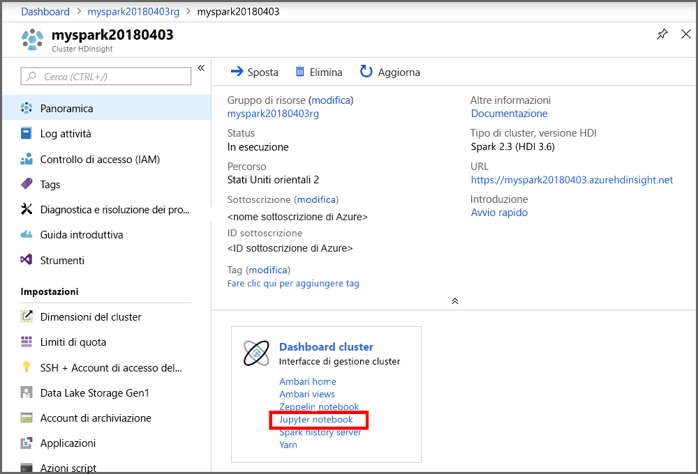
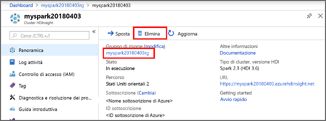

# <a name="quickstart-create-an-apache-spark-cluster-in-hdinsight-using-powershell"></a>Guida introduttiva: Creare un cluster Apache Spark in HDInsight usando PowerShell
Informazioni su come creare un cluster [Apache Spark](https://spark.apache.org/) in Azure HDInsight ed eseguire query Spark SQL sulle tabelle [Apache Hive](https://hive.apache.org/). Apache Spark consente cluster computing e analisi dei dati veloci grazie all'elaborazione in memoria. Per informazioni su Spark in HDInsight, vedere [Panoramica: Apache Spark in Azure HDInsight](apache-spark-overview.md).

In questa guida di avvio rapido si userà Azure PowerShell per creare un cluster Spark in HDInsight. Il cluster usa i BLOB del servizio di archiviazione di Azure come archiviazione cluster. Per altre informazioni sull'uso di Data Lake Storage Gen2, vedi [Avvio rapido: Impostazione dei cluster in HDInsight](../../storage/data-lake-storage/quickstart-create-connect-hdi-cluster.md)

> [!IMPORTANT]  
> La fatturazione dei cluster HDInsight viene calcolata al minuto, indipendentemente dal fatto che siano in uso o meno. Assicurarsi di eliminare il cluster dopo aver finito di usarlo. Per altre informazioni, vedere la sezione [Pulire le risorse](#clean-up-resources) di questo articolo.

Se non si ha una sottoscrizione di Azure, [creare un account gratuito](https://azure.microsoft.com/free/) prima di iniziare.

[!INCLUDE [updated-for-az](../../../includes/updated-for-az.md)]

## <a name="create-an-hdinsight-spark-cluster"></a>Creare un cluster HDInsight Spark

La creazione di un cluster HDInsight include la creazione dei seguenti oggetti e risorse di Azure:

- Un gruppo di risorse di Azure. Un gruppo di risorse di Azure è un contenitore per le risorse di Azure. 
- Un account di archiviazione di Azure o Azure Data Lake Storage.  Ogni cluster HDInsight richiede una risorsa di archiviazione per i dati dipendenti. In questa guida di avvio rapido si crea un account di archiviazione.
- Un cluster HDInsight di tipi di cluster diversi.  In questa guida introduttiva verrà creato un cluster Spark 2.3.

Per creare le risorse si usa uno script di PowerShell.  Quando si esegue lo script, viene chiesto di immettere i valori seguenti:

|Parametro|Valore|
|------|------|
|Nome del gruppo di risorse di Azure | Immettere un nome univoco per il gruppo di risorse.|
|Località| Specificare l'area di Azure, ad esempio "Stati Uniti centrali". |
|Nome dell'account di archiviazione predefinito | Fornire un nome univoco per l'account di archiviazione. |
|Nome del cluster | Immettere un nome univoco per il cluster Spark in HDInsight.|
|Credenziali di accesso del cluster | Questo account viene usato più avanti in questa guida di avvio rapido per connettersi al dashboard del cluster.|
|Credenziali dell'utente SSH | I client SSH possono essere usati per creare una sessione remota della riga di comando con i cluster HDInsight.|


1. Fare clic su **Prova** nell'angolo superiore destro per il blocco di codice seguente per aprire [Azure Cloud Shell](../../cloud-shell/overview.md)e seguire le istruzioni per la connessione ad Azure.
2. Copiare e incollare lo script PowerShell seguente in Cloud Shell. 

    ```azurepowershell-interactive
    ### Create a Spark 2.3 cluster in Azure HDInsight
        
    # Create the resource group
    $resourceGroupName = Read-Host -Prompt "Enter the resource group name"
    $location = Read-Host -Prompt "Enter the Azure region to create resources in, such as 'Central US'"
    New-AzResourceGroup -Name $resourceGroupName -Location $location
    
    $defaultStorageAccountName = Read-Host -Prompt "Enter the default storage account name"
    
    # Create an Azure storae account and container
    New-AzStorageAccount `
        -ResourceGroupName $resourceGroupName `
        -Name $defaultStorageAccountName `
        -Type Standard_LRS `
        -Location $location
    $defaultStorageAccountKey = (Get-AzStorageAccountKey `
                                    -ResourceGroupName $resourceGroupName `
                                    -Name $defaultStorageAccountName)[0].Value
    $defaultStorageContext = New-AzStorageContext `
                                    -StorageAccountName $defaultStorageAccountName `
                                    -StorageAccountKey $defaultStorageAccountKey
    
    # Create a Spark 2.3 cluster
    $clusterName = Read-Host -Prompt "Enter the name of the HDInsight cluster"
    # Cluster login is used to secure HTTPS services hosted on the cluster
    $httpCredential = Get-Credential -Message "Enter Cluster login credentials" -UserName "admin"
    # SSH user is used to remotely connect to the cluster using SSH clients
    $sshCredentials = Get-Credential -Message "Enter SSH user credentials"
    
    # Default cluster size (# of worker nodes), version, type, and OS
    $clusterSizeInNodes = "1"
    $clusterVersion = "3.6"
    $clusterType = "Spark"
    $clusterOS = "Linux"
    
    # Set the storage container name to the cluster name
    $defaultBlobContainerName = $clusterName
    
    # Create a blob container. This holds the default data store for the cluster.
    New-AzStorageContainer `
        -Name $clusterName -Context $defaultStorageContext 
    
    $sparkConfig = New-Object "System.Collections.Generic.Dictionary``2[System.String,System.String]"
    $sparkConfig.Add("spark", "2.3")
    
    # Create the HDInsight cluster
    New-AzHDInsightCluster `
        -ResourceGroupName $resourceGroupName `
        -ClusterName $clusterName `
        -Location $location `
        -ClusterSizeInNodes $clusterSizeInNodes `
        -ClusterType $clusterType `
        -OSType $clusterOS `
        -Version $clusterVersion `
        -ComponentVersion $sparkConfig `
        -HttpCredential $httpCredential `
        -DefaultStorageAccountName "$defaultStorageAccountName.blob.core.windows.net" `
        -DefaultStorageAccountKey $defaultStorageAccountKey `
        -DefaultStorageContainer $clusterName `
        -SshCredential $sshCredentials 
    
    Get-AzHDInsightCluster -ResourceGroupName $resourceGroupName -ClusterName $clusterName
    ```
   La creazione del cluster richiede circa 20 minuti. Prima di procedere con la sessione successiva, è necessario creare il cluster.

Se si verifica un problema con la creazione di cluster HDInsight, è possibile che non si abbiano le autorizzazioni necessarie per questa operazione. Per altre informazioni, vedere [Requisiti di controllo di accesso](../hdinsight-hadoop-create-linux-clusters-portal.md).

## <a name="create-a-jupyter-notebook"></a>Creare un notebook Jupyter

[Jupyter Notebook](https://jupyter.org/) è un ambiente notebook interattivo che supporta diversi linguaggi di programmazione. Il notebook consente di interagire con i dati, combinare codice e testo Markdown ed eseguire visualizzazioni semplici. 

1. Aprire il [portale di Azure](https://portal.azure.com).
2. Selezionare **cluster HDInsight** e quindi selezionare il cluster creato.

    

3. Nel portale fare clic su **Dashboard cluster** e quindi su **Jupyter Notebook**. Se richiesto, immettere le credenziali di accesso del cluster.

   

4. Per creare un notebook selezionare **Nuovo** > **PySpark**. 

   

   Un nuovo notebook verrà creato e aperto con il nome Untitled (Untitled.pynb).


## <a name="run-spark-sql-statements"></a>Eseguire le istruzioni Spark SQL

SQL (Structured Query Language) è il linguaggio più diffuso e più usato per l'esecuzione di query e la definizione dei dati. Spark SQL funziona come estensione di Apache Spark per l'elaborazione dei dati strutturati, usando la nota sintassi SQL.

1. Verificare che il kernel sia pronto. Il kernel è pronto quando accanto al relativo nome nel notebook viene visualizzato un cerchio vuoto. Un cerchio pieno indica che il kernel è occupato.

    

    Quando si avvia il notebook per la prima volta, il kernel esegue alcune attività in background. Attendere che il kernel sia pronto. 
2. Incollare il codice seguente in una cella vuota e quindi premere **MAIUSC + INVIO** per eseguire il codice. Il comando elenca le tabelle Hive sul cluster:

    ```PySpark
    %%sql
    SHOW TABLES
    ```
    Quando si usa un oggetto Jupyter Notebook con il cluster HDInsight Spark, si ottiene un elemento `sqlContext` predefinito che può essere usato per eseguire query Hive con Spark SQL. `%%sql` indica a Jupyter Notebook di usare l'elemento `sqlContext` predefinito per eseguire la query Hive. La query recupera le prime 10 righe di una tabella Hive (**hivesampletable**) disponibile per impostazione predefinita in tutti i cluster HDInsight. Per ottenere i risultati sono necessari circa 30 secondi. L'output è simile al seguente: 

    

    Ogni volta che si esegue una query in Jupyter, il titolo della finestra del Web browser visualizza lo stato **(Occupato)** accanto al titolo del notebook. È anche visibile un cerchio pieno accanto al testo **PySpark** nell'angolo in alto a destra.
    
2. Eseguire un'altra query per visualizzare i dati in `hivesampletable`.

    ```PySpark
    %%sql
    SELECT * FROM hivesampletable LIMIT 10
    ```
    
    La schermata si aggiornerà per visualizzare l'output della query.

    

2. Nel menu **File** del notebook fare clic su **Close and Halt** (Chiudi e interrompi). Quando il notebook viene arrestato, le risorse del cluster vengono rilasciate.

## <a name="clean-up-resources"></a>Pulire le risorse
HDInsight salva i dati in Archiviazione di Azure o in Azure Data Lake Storage in modo che sia possibile eliminare senza problemi un cluster quando non viene usato. Vengono addebitati i costi anche per i cluster HDInsight che non sono in uso. Poiché i costi per il cluster sono decisamente superiori a quelli per l'archiviazione, economicamente ha senso eliminare i cluster quando non vengono usati. Se si prevede di svolgere subito l'esercitazione elencata nei [passaggi successivi](#next-steps), si può mantenere il cluster.

Tornare al portale di Azure e selezionare **Elimina**.



È anche possibile selezionare il nome del gruppo di risorse per aprire la pagina del gruppo di risorse e quindi selezionare **Elimina gruppo di risorse**. Eliminando il gruppo di risorse, si elimina sia il cluster HDInsight Spark che l'account di archiviazione predefinito.

## <a name="next-steps"></a>Passaggi successivi 

In questa guida introduttiva si è appreso come creare un cluster HDInsight Spark ed eseguire una query Spark SQL di base. Passare all'esercitazione successiva per imparare come usare un cluster HDInsight Spark per eseguire query interattive su dati di esempio.

> [!div class="nextstepaction"]
>[Eseguire query interattive su Apache Spark](./apache-spark-load-data-run-query.md)
