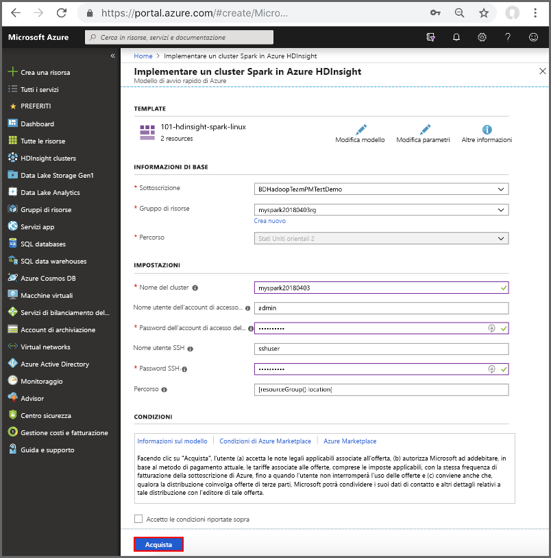
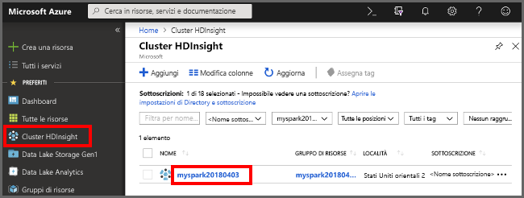

# <a name="quickstart-create-an-apache-spark-cluster-in-hdinsight-using-template"></a>Guida introduttiva: Creare un cluster Apache Spark HDInsight usando un modello

Informazioni su come creare un cluster [Apache Spark](https://spark.apache.org/) in Azure HDInsight ed eseguire query Spark SQL sulle tabelle [Apache Hive](https://hive.apache.org/). Apache Spark consente cluster computing e analisi dei dati veloci grazie all'elaborazione in memoria. Per informazioni su Spark in HDInsight, vedere [Panoramica: Apache Spark in Azure HDInsight](apache-spark-overview.md).

In questa guida introduttiva si userà un modello di Resource Manager per creare un cluster Spark HDInsight. Modelli simili sono disponibili in [Modelli di avvio rapido di Azure](https://azure.microsoft.com/resources/templates/?resourceType=Microsoft.Hdinsight&pageNumber=1&sort=Popular). Le informazioni di riferimento per il modello sono disponibili [qui](https://docs.microsoft.com/azure/templates/microsoft.hdinsight/allversions).

Il cluster usa i BLOB del servizio di archiviazione di Azure come archiviazione cluster. Per altre informazioni sull'uso di Data Lake Storage Gen2, vedi [Avvio rapido: Impostazione dei cluster in HDInsight](../../storage/data-lake-storage/quickstart-create-connect-hdi-cluster.md)

> [!IMPORTANT]  
> La fatturazione dei cluster HDInsight viene calcolata al minuto, indipendentemente dal fatto che siano in uso o meno. Assicurarsi di eliminare il cluster dopo aver finito di usarlo. Per altre informazioni, vedere la sezione [Pulire le risorse](#clean-up-resources) di questo articolo.

Se non si ha una sottoscrizione di Azure, [creare un account gratuito](https://azure.microsoft.com/free/) prima di iniziare.

## <a name="create-an-hdinsight-spark-cluster"></a>Creare un cluster HDInsight Spark

Creare un cluster HDInsight Spark usando un modello di Azure Resource Manager. Il modello è disponibile in [GitHub](https://azure.microsoft.com/resources/templates/101-hdinsight-spark-linux/). Per informazioni sulla sintassi e sulle proprietà JSON del cluster, vedere [Microsoft.HDInsight/clusters](/azure/templates/microsoft.hdinsight/clusters).

1. Selezionare il collegamento seguente per aprire il modello nel portale di Azure in una nuova scheda del browser:

    <a href="https://portal.azure.com/#create/Microsoft.Template/uri/https%3A%2F%2Fraw.githubusercontent.com%2FAzure%2Fazure-quickstart-templates%2Fmaster%2F101-hdinsight-spark-linux%2Fazuredeploy.json" target="_blank">Distribuzione in Azure</a>

2. Immettere i valori seguenti:

    | Proprietà | Valore |
    |---|---|
    |**Sottoscrizione**|Selezionare la sottoscrizione di Azure usata per creare il cluster. La sottoscrizione di Azure usata in questa guida introduttiva è **&lt;Azure subscription name>**. |
    | **Gruppo di risorse**|Creare un gruppo di risorse o selezionarne uno esistente. Il gruppo di risorse viene usato per gestire le risorse di Azure per i progetti. Il nuovo nome del gruppo di risorse usato per questa guida introduttiva è **myspark20180403rg**.|
    | **Posizione**|Selezionare una posizione per il gruppo di risorse. Il modello usa questa posizione per la creazione del cluster e per l'archiviazione del cluster predefinita. La posizione usata in questa guida introduttiva è **Stati Uniti orientali 2**.|
    | **ClusterName**|Immettere un nome per il cluster HDInsight che si vuole creare. Il nuovo nome del cluster usato per questa guida introduttiva è **myspark20180403**.|
    | **Nome di accesso e password del cluster**|Il nome di accesso predefinito è admin. Scegliere una password per l'accesso al cluster. Il nome di accesso usato per questa guida introduttiva è **admin**.|
    | **Nome utente e password SSH**|Scegliere una password per l'utente SSH. Il nome utente SSH usato per questa guida introduttiva è **sshuser**.|

    

3. Selezionare **Accetto le condizioni riportate sopra**, selezionare **Aggiungi al dashboard** e quindi fare clic su **Acquisto**. Verrà visualizzato un nuovo riquadro denominato **Distribuzione dell'entità Distribuzione modello in corso**. La creazione del cluster richiede circa 20 minuti. Prima di procedere con la sessione successiva, è necessario creare il cluster.

Se si verifica un problema con la creazione di cluster HDInsight, è possibile che non si abbiano le autorizzazioni necessarie per questa operazione. Per altre informazioni, vedere [Requisiti di controllo di accesso](../hdinsight-hadoop-create-linux-clusters-portal.md).

## <a name="install-intellijeclipse-for-spark-application"></a>Installare IntelliJ/Eclipse per l'applicazione Spark
Usare il plug-in Azure Toolkit for IntelliJ/Eclipse per sviluppare applicazioni Spark scritte in [Scala](https://www.scala-lang.org/) e quindi inviarle a un cluster Azure HDInsight Spark direttamente dall'ambiente di sviluppo integrato (IDE) IntelliJ/Eclipse. Per altre informazioni, vedere [Usare Azure Toolkit for IntelliJ per creare applicazioni Spark per un cluster HDInsight](./apache-spark-intellij-tool-plugin.md) e [Usare Azure Toolkit for Eclipse per creare applicazioni Spark per un cluster HDInsight](./apache-spark-eclipse-tool-plugin.md).

## <a name="install-vscode-for-pysparkhive-applications"></a>Installare VS Code per applicazioni PySpark/Hive
Informazioni su come usare gli strumenti di Azure HDInsight per Visual Studio Code (VS Code) per creare e inviare processi batch Hive, query Interactive Hive, batch pySpark e script pySpark interattivi. Gli strumenti di Azure HDInsight possono essere installati sulle piattaforme supportate da VS Code, tra cui Windows, Linux e macOS. Per altre informazioni, vedere [Usare gli strumenti di Azure HDInsight per Visual Studio Code](../hdinsight-for-vscode.md).

## <a name="create-a-jupyter-notebook"></a>Creare un notebook Jupyter

[Jupyter Notebook](https://jupyter.org/) è un ambiente notebook interattivo che supporta diversi linguaggi di programmazione. Il notebook consente di interagire con i dati, combinare codice e testo Markdown ed eseguire visualizzazioni semplici.

1. Aprire il [portale di Azure](https://portal.azure.com).
2. Selezionare **cluster HDInsight** e quindi selezionare il cluster creato.

    

3. Nella sezione **Dashboard cluster** del portale fare clic su **Jupyter Notebook**. Se richiesto, immettere le credenziali di accesso del cluster.

   

4. Per creare un notebook selezionare **Nuovo** > **PySpark**.

   

   Un nuovo notebook verrà creato e aperto con il nome Untitled (Untitled.pynb).


## <a name="run-spark-sql-statements"></a>Eseguire le istruzioni Spark SQL

SQL (Structured Query Language) è il linguaggio più diffuso e più usato per l'esecuzione di query e la trasformazione dei dati. Spark SQL funziona come estensione di Apache Spark per l'elaborazione dei dati strutturati, usando la nota sintassi SQL.

1. Verificare che il kernel sia pronto. Il kernel è pronto quando accanto al relativo nome nel notebook viene visualizzato un cerchio vuoto. Un cerchio pieno indica che il kernel è occupato.

    

    Quando si avvia il notebook per la prima volta, il kernel esegue alcune attività in background. Attendere che il kernel sia pronto.
2. Incollare il codice seguente in una cella vuota e quindi premere **MAIUSC + INVIO** per eseguire il codice. Il comando elenca le tabelle Hive sul cluster:

    ```sql
    %%sql
    SHOW TABLES
    ```
    Quando si usa un oggetto Jupyter Notebook con il cluster HDInsight Spark, si ottiene una sessione `spark` predefinita che può essere usata per eseguire query Hive con Spark SQL. `%%sql` indica a Jupyter Notebook di usare la sessione `spark` predefinita per eseguire la query Hive. La query recupera le prime 10 righe di una tabella Hive (**hivesampletable**) disponibile per impostazione predefinita in tutti i cluster HDInsight. La prima volta che si invia che la query, Jupyter creerà l'applicazione Spark per il notebook. Questa operazione viene completata in 30 secondi circa. Quando l'applicazione Spark è pronta, la query viene eseguita in un secondo e genera i risultati. L'output è simile al seguente:

    

    Ogni volta che si esegue una query in Jupyter, il titolo della finestra del Web browser visualizza lo stato **(Occupato)** accanto al titolo del notebook. È anche visibile un cerchio pieno accanto al testo **PySpark** nell'angolo in alto a destra.

2. Eseguire un'altra query per visualizzare i dati in `hivesampletable`.

    ```sql
    %%sql
    SELECT * FROM hivesampletable LIMIT 10
    ```
    
    La schermata si aggiornerà per visualizzare l'output della query.

    

2. Nel menu **File** del notebook fare clic su **Close and Halt** (Chiudi e interrompi). Quando il notebook viene arrestato, le risorse del cluster vengono rilasciate, inclusa l'applicazione Spark.

## <a name="clean-up-resources"></a>Pulire le risorse
HDInsight salva i dati e i notebook Jupyter in Archiviazione di Azure o Azure Data Lake Store, in modo che sia possibile eliminare tranquillamente un cluster quando non viene usato. Vengono addebitati i costi anche per i cluster HDInsight che non sono in uso. Poiché i costi per il cluster sono decisamente superiori a quelli per l'archiviazione, economicamente ha senso eliminare i cluster quando non vengono usati. Se si prevede di svolgere subito l'esercitazione elencata nei [passaggi successivi](#next-steps), si può mantenere il cluster.

Tornare al portale di Azure e selezionare **Elimina**.


È anche possibile selezionare il nome del gruppo di risorse per aprire la pagina del gruppo di risorse e quindi selezionare **Elimina gruppo di risorse**. Eliminando il gruppo di risorse, si elimina sia il cluster HDInsight Spark che l'account di archiviazione predefinito.

## <a name="next-steps"></a>Passaggi successivi

In questa guida introduttiva si è appreso come creare un cluster HDInsight Spark ed eseguire una query Spark SQL di base. Passare all'esercitazione successiva per imparare come usare un cluster HDInsight Spark per eseguire query interattive su dati di esempio.

> [!div class="nextstepaction"]
>[Eseguire query interattive su Apache Spark](./apache-spark-load-data-run-query.md)


