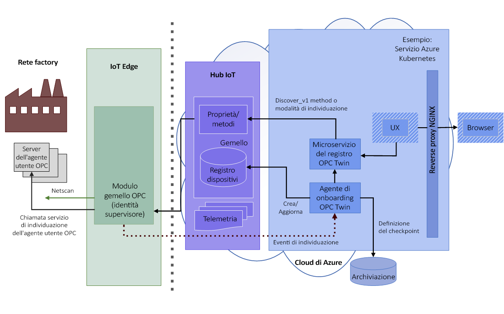
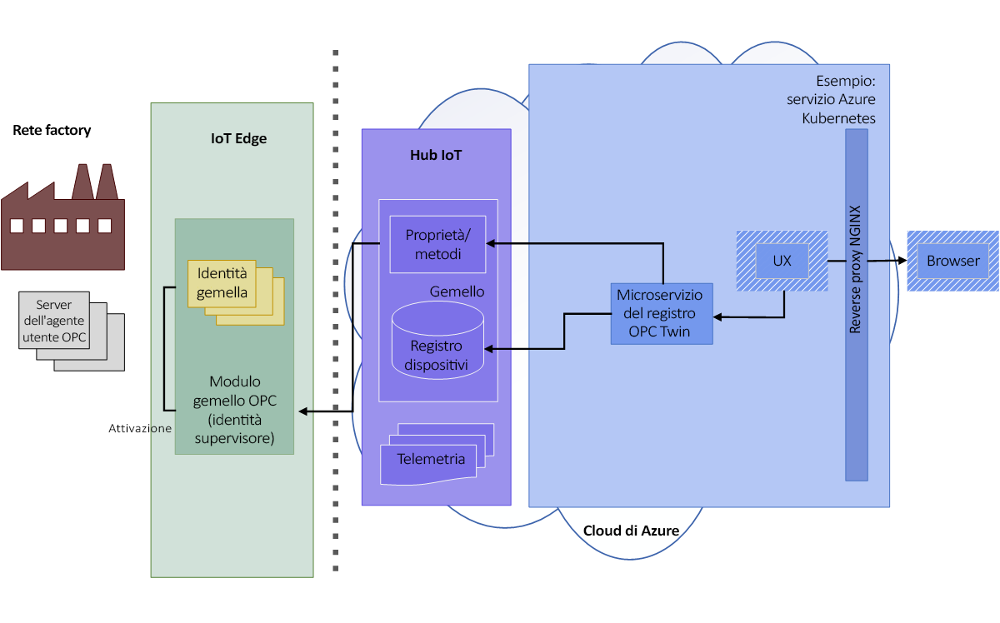
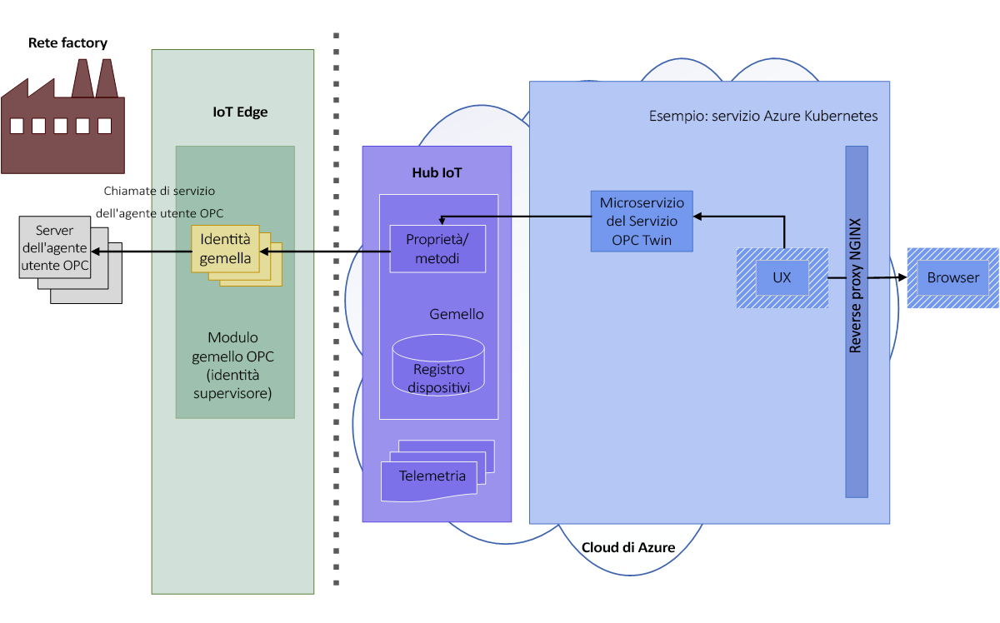
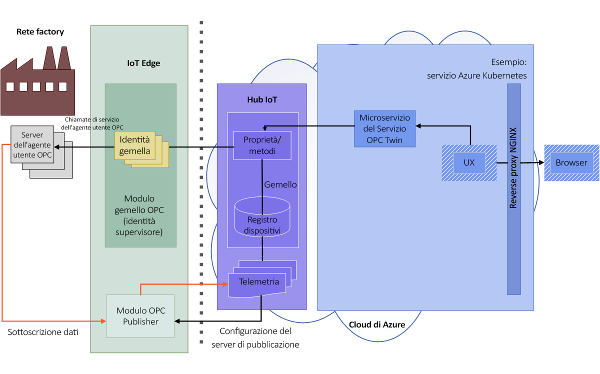

# Architettura di OPC Twin

I diagrammi seguenti illustrano l'architettura di OPC Twin.

## Individuare e attivare

1. L'operatore abilita l'analisi della rete sul modulo oppure esegue un'individuazione una tantum con un URL di individuazione. Le informazioni individuate su endpoint e applicazioni vengono inviate tramite telemetria all'agente di onboarding per l'elaborazione.  L'agente di onboarding dei dispositivi OPC UA elabora gli eventi di individuazione del server OPC UA inviati dal modulo IoT Edge OPC Twin impostato in modalità di individuazione o analisi. Gli eventi di individuazione generano la registrazione e gli aggiornamenti delle applicazioni nel registro dispositivi OPC UA.

   

1. L'operatore esamina il certificato dell'endpoint individuato e attiva l'endpoint gemello registrato per l'accesso. 

   

## Esplorare e monitorare

1. Dopo l'attivazione, l'operatore usa l'API REST del servizio Twin per esplorare o esaminare il modello informativo del server, leggere/scrivere nelle variabili oggetto e chiamare metodi.  L'utente usa un'API OPC UA semplificata espressa interamente in HTTP e JSON.

   

1. È anche possibile usare l'interfaccia REST del servizio Twin per creare elementi e sottoscrizioni monitorati nel server di pubblicazione OPC. Il server di pubblicazione OPC consente l'invio dei dati di telemetria dai sistemi server OPC UA all'hub IoT. Per altre informazioni sul server di pubblicazione OPC, vedere [Informazioni su OPC Publisher](overview-opc-publisher.md).

   
