# Guida introduttiva: Provare una soluzione basata sul cloud per gestire dispositivi IoT industriali

Questa guida introduttiva illustra come distribuire l'acceleratore di soluzione Connected Factory di Azure IoT per l'esecuzione di una simulazione del monitoraggio e della gestione basati sul cloud per dispositivi IoT industriali. Nel momento in cui viene distribuito, l'acceleratore di soluzione Connected Factory viene prepopolato con risorse simulate che consentono di esaminare uno scenario IoT industriale comune. Diversi stabilimenti simulati connessi alla soluzione generano report con i valori dei dati necessari per calcolare l'efficienza complessiva delle attrezzature e gli indicatori di prestazioni chiave (KPI). Questa guida introduttiva illustra come usare il dashboard della soluzione per:

* Monitorare stabilimenti, linee di produzione, efficienza complessiva delle attrezzature e valori KPI.
* Analizzare i dati di telemetria generati da questi dispositivi.
* Rispondere agli avvisi.

Per completare questa guida introduttiva, è necessaria una sottoscrizione di Azure attiva.

Se non si ha una sottoscrizione di Azure, creare un [account gratuito](https://azure.microsoft.com/free/?WT.mc_id=A261C142F) prima di iniziare.

## Distribuire la soluzione

Prima di distribuire l'acceleratore della soluzione nella sottoscrizione di Azure, è necessario impostare alcune opzioni di configurazione.

Passare ad [Acceleratori di soluzioni Microsoft Azure IoT](https://www.azureiotsolutions.com) e accedere usando le credenziali dell'account Azure.

Fare clic nel riquadro **Connected Factory**. Nella pagina **Connected Factory** fare clic su **Prova adesso**:

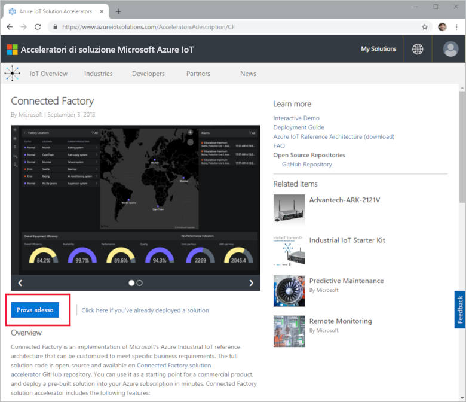

Nella pagina **Crea soluzione Connected Factory** immettere un valore univoco per **Nome soluzione** per l'acceleratore di soluzione Connected Factory. Questo nome è il nome del gruppo di risorse di Azure che contiene tutte le risorse dell'acceleratore di soluzione. Questa guida introduttiva usa il nome **MyDemoConnectedFactory**.

Selezionare **Sottoscrizione** e **Area** da usare per distribuire l'acceleratore della soluzione. In genere, si sceglie l'area più vicina. Per questa guida introduttiva selezionare **Visual Studio Enterprise** e **Stati Uniti orientali**. È necessario essere [amministratore globale o utente](iot-accelerators-permissions.md) nella sottoscrizione.

Fare clic su **Crea** per avviare la distribuzione. Questo processo richiede almeno cinque minuti:

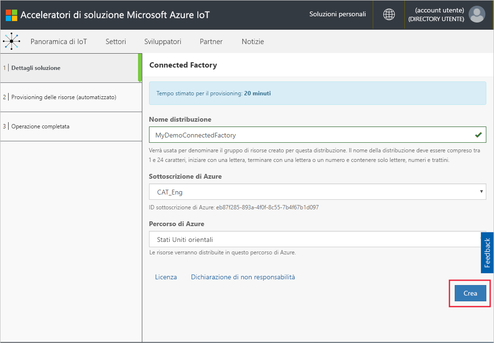

## Accedere alla soluzione

Al termine della distribuzione nella sottoscrizione di Azure, verrà visualizzato un segno di spunta verde e la dicitura **Pronto** nel riquadro della soluzione. È ora possibile accedere al dashboard dell'acceleratore di soluzione Connected Factory.

Nella pagina **Soluzioni di cui è stato effettuato il provisioning** fare clic sull'acceleratore di soluzione Connected Factory:

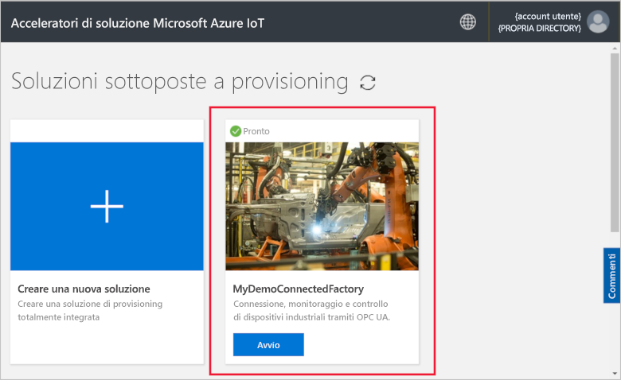

È possibile visualizzare informazioni sull'acceleratore della soluzione Connected Factory nella pagina che si apre. Scegliere **Vai a Acceleratore di soluzione** per visualizzare l'acceleratore della soluzione Connected Factory:

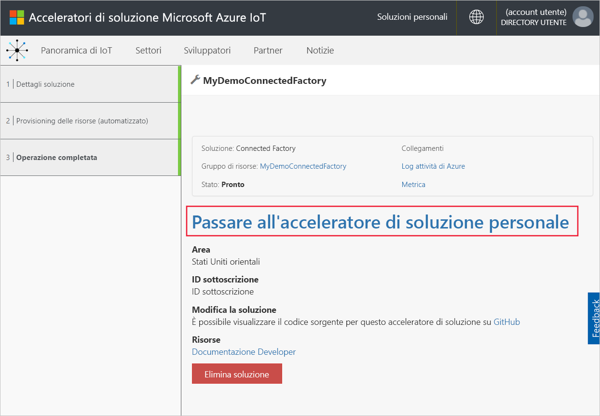

Fare clic su **Accetta** per accettare la richiesta di autorizzazioni. Il dashboard della soluzione Connected Factory viene visualizzato nel browser. Viene visualizzato un set di stazioni, linee di produzione e stabilimenti simulati.

## Visualizzare il dashboard

La visualizzazione predefinita è il *dashboard*. Per passare ad altre aree del portale, usare il menu a sinistra della pagina:

[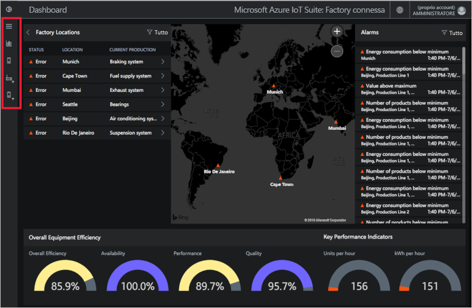](./media/quickstart-connected-factory-deploy/dashboard-expanded.png#lightbox)

Usare il dashboard per gestire i dispositivi IoT industriali. Connected Factory usa una gerarchia per visualizzare una configurazione globale degli stabilimenti. Il livello superiore della gerarchia è l'azienda che contiene uno o più stabilimenti. Ogni stabilimento contiene linee di produzione e ogni linea di produzione è costituita da stazioni. A ogni livello è possibile visualizzare l'efficienza complessiva delle attrezzature e gli indicatori KPI, pubblicare nuovi nodi per la telemetria e rispondere agli avvisi.

Nel dashboard è possibile visualizzare:

## Efficienza complessiva delle attrezzature

Il pannello **Efficienza complessiva delle attrezzature** mostra i valori di efficienza complessiva delle attrezzature (OEE, Overall Equipment Efficiency) per l'intera azienda o per lo stabilimento, la linea di produzione o la stazione in esame. Questo valore viene aggregato dalla vista della postazione fino al livello aziendale. Il valore OEE e i relativi elementi costitutivi possono essere analizzati nei dettagli.

[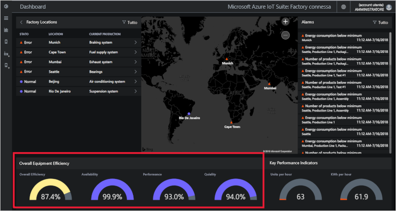](./media/quickstart-connected-factory-deploy/oee-expanded.png#lightbox)

Il valore di efficienza complessiva delle attrezzature valuta l'efficienza del processo di produzione usando parametri operativi correlati alla produzione. Il valore di OEE è una misura standard del settore calcolata moltiplicando la disponibilità, le prestazioni e la qualità: Valore di OEE = disponibilità x prestazioni x qualità.

È possibile analizzare ulteriormente l'efficienza complessiva delle attrezzature per qualsiasi livello della gerarchia dei dati. Fare clic sul comando radiale della percentuale di efficienza complessiva, disponibilità, prestazioni o qualità. Viene visualizzato un pannello contestuale con visualizzazioni che mostrano i dati su scale cronologiche diverse:

[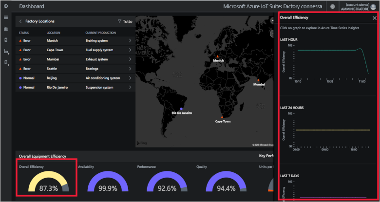](./media/quickstart-connected-factory-deploy/oeedetail-expanded.png#lightbox)

È possibile fare clic su un grafico per eseguire ulteriori analisi dei dati.

### Indicatori di prestazioni chiave

Il pannello **Indicatori di prestazioni chiave** visualizza il numero di unità prodotte all'ora e l'energia (kWh) usata dall'intera azienda o dallo stabilimento, dalla linea di produzione o dalla stazione in esame. Questi valori vengono aggregati dalla vista della postazione fino al livello aziendale.

[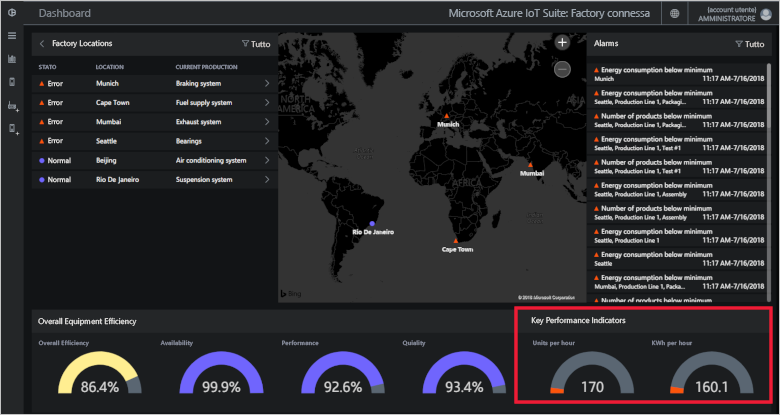](./media/quickstart-connected-factory-deploy/kpis-expanded.png#lightbox)

È possibile analizzare ulteriormente gli indicatori KPI per qualsiasi livello della gerarchia dei dati. Fare clic sul comando radiale della percentuale di efficienza complessiva, disponibilità, prestazioni o qualità. Viene visualizzato un pannello contestuale con visualizzazioni che mostrano i dati su scale cronologiche diverse:

[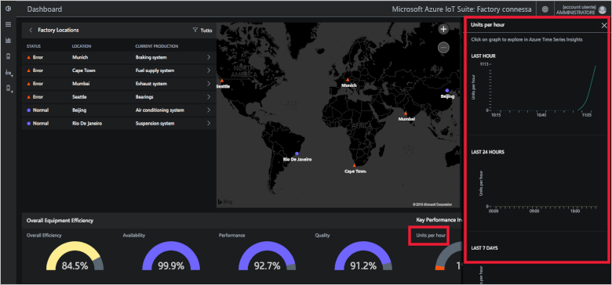](./media/quickstart-connected-factory-deploy/kpidetail-expanded.png#lightbox)

È possibile fare clic su un grafico per eseguire ulteriori analisi dei dati.

### Località della fabbrica

Un pannello **Factory locations** (Posizioni factory) che visualizza stato, località e configurazione di produzione corrente nella soluzione. Alla prima esecuzione dell'acceleratore di soluzione, il dashboard mostra un set di stabilimenti simulato. Ogni simulazione delle linee di produzione è costituita da tre server OPC UA reali che eseguono attività simulate e condividono i dati. Per altre informazioni su OPC UA, vedere le [domande frequenti su Connected Factory](iot-accelerators-faq-cf.md):

[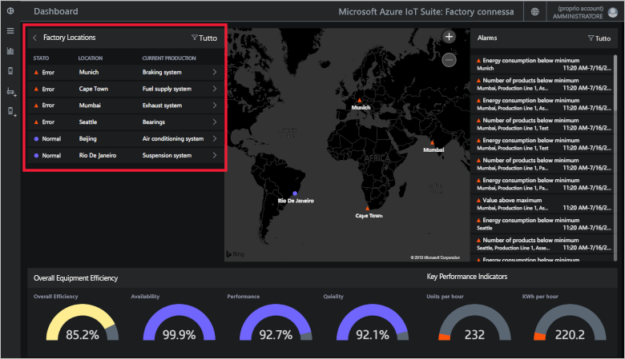](./media/quickstart-connected-factory-deploy/factorylocations-expanded.png#lightbox)

È possibile spostarsi all'interno della gerarchia della soluzione e visualizzare i valori di efficienza complessiva delle attrezzature e gli indicatori KPI a ogni livello:

1. In **Località della fabbrica** fare clic su **Mumbai**. Verranno visualizzate le linee di produzione nella località selezionata.

1. Fare clic su **Production Line 1** (Linea di produzione 1). Verranno visualizzate le stazioni su questa linea di produzione.

1. Fare clic su **Packaging** (Imballaggio). Verranno visualizzati i nodi OPC UA pubblicati da questa stazione.

1. Fare clic su **EnergyConsumption** (Consumo energetico). Verranno visualizzati alcuni grafici che rappresentano questo valore su scale cronologiche diverse. È possibile fare clic su un grafico per eseguire ulteriori analisi dei dati.

[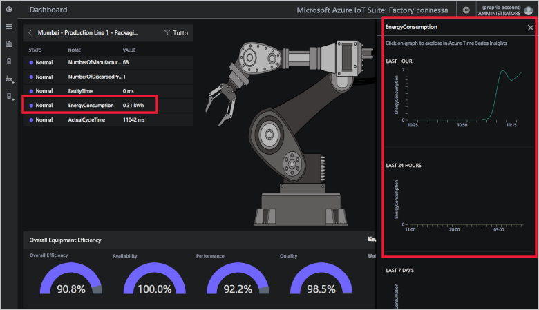](./media/quickstart-connected-factory-deploy/explorelocations-expanded.png#lightbox)

### Mappa

Se la sottoscrizione ha accesso all'[API di Bing Mappe](iot-accelerators-faq-cf.md), la mappa degli *stabilimenti* visualizza la posizione geografica e lo stato di tutti gli stabilimenti presenti nella soluzione. Per esaminare i dettagli, fare clic sulle località visualizzate sulla mappa.

[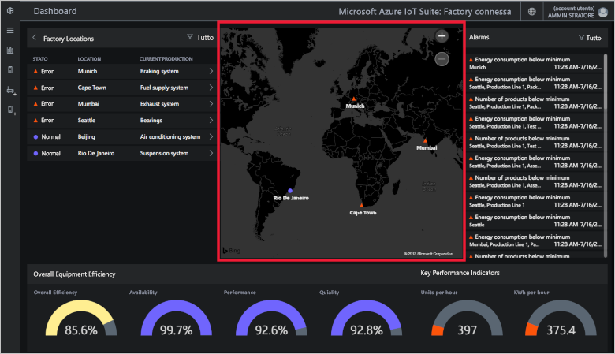](./media/quickstart-connected-factory-deploy/map-expanded.png#lightbox)

### Avvisi

Il pannello **Avvisi** mostra gli avvisi generati quando un valore restituito o un valore OEE/KPI calcolato è superiore a una soglia configurata. Questo pannello visualizza gli avvisi per ogni livello della gerarchia, dal livello delle stazioni a quello dell'azienda. Ogni avviso include descrizione, data, ora, località e numero di occorrenze:

[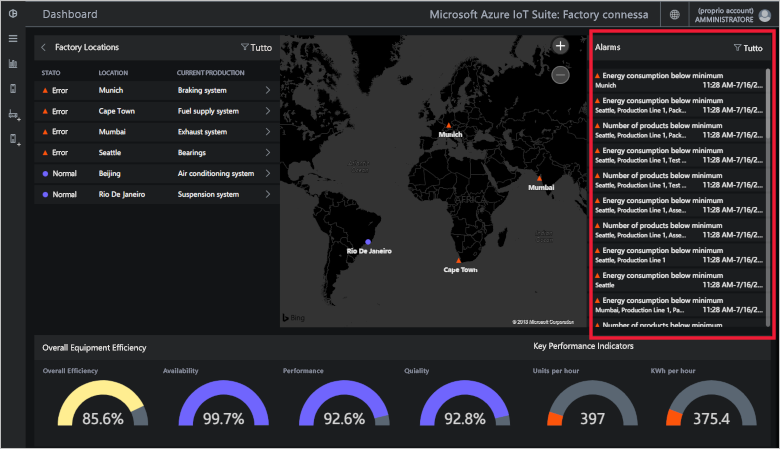](./media/quickstart-connected-factory-deploy/alarms-expanded.png#lightbox)

È possibile analizzare i dati che hanno causato l'avviso dal dashboard. Gli amministratori possono eseguire azioni predefinite sugli avvisi, ad esempio:

* Chiudere l'avviso.
* Confermare l'avviso.

Fare clic su uno degli avvisi nell'elenco a discesa **Scegliere un'azione**, scegliere **Conferma avviso** e quindi fare clic su **Applica**:

[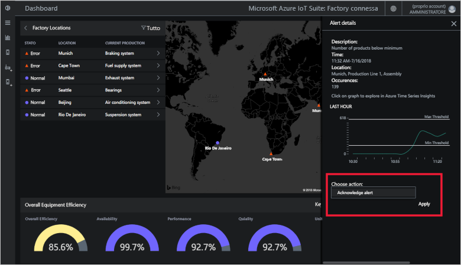](./media/quickstart-connected-factory-deploy/acknowledge-expanded.png#lightbox)

Per eseguire altre analisi sui dati dell'avviso, fare clic sul grafico nel pannello degli avvisi.

Questi avvisi vengono generati da regole specificate in un file di configurazione nell'acceleratore di soluzioni. Queste regole possono generare avvisi quando i valori di OEE o KPI o del nodo OPC UA superano una soglia configurata. È possibile impostare questo valore soglia.

## Pulire le risorse

Se si prevede di esplorare la soluzione ulteriormente, lasciare distribuito l'acceleratore di soluzione Connected Factory.

Se l'acceleratore di soluzione non è più necessario, eliminarlo dalla pagina [Soluzioni di cui è stato effettuato il provisioning](https://www.azureiotsolutions.com/Accelerators#dashboard) selezionandolo e facendo clic su **Elimina soluzione**:

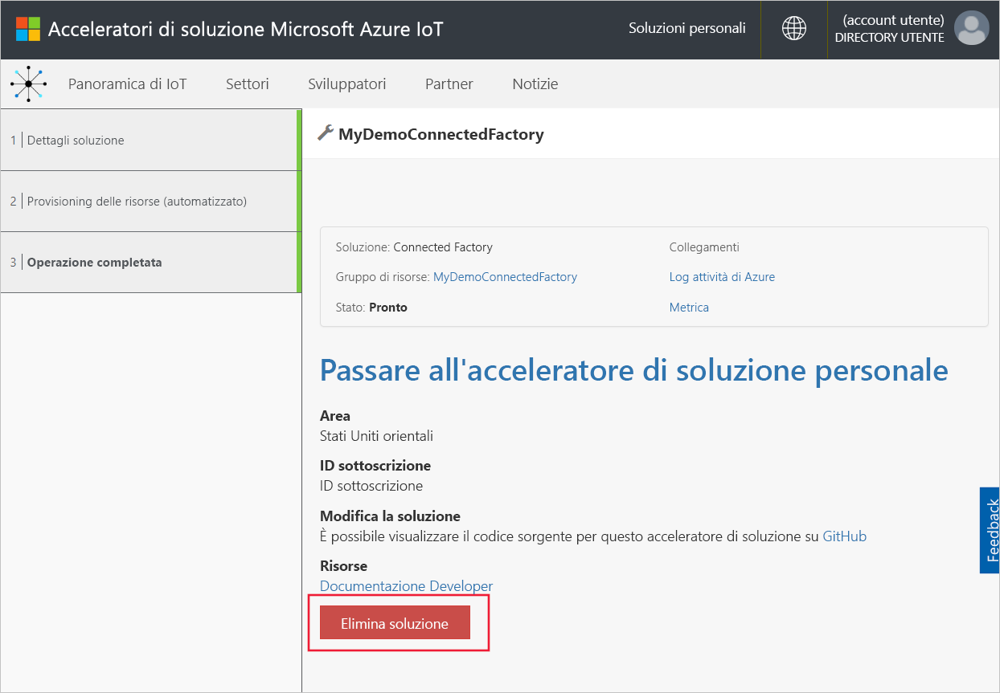

## Passaggi successivi

In questa guida introduttiva è stato distribuito l'acceleratore di soluzione Connected Factory e si è visto come spostarsi all'interno di stabilimenti, linee di produzione e stazioni. È stato anche illustrato come visualizzare i valori OEE e KPI a qualsiasi livello della gerarchia e come rispondere agli avvisi.

Per informazioni su come usare altre funzionalità nel dashboard per gestire dispositivi IoT industriali, continuare con la guida pratica seguente:

> [!div class="nextstepaction"]
> [Use the Connected Factory dashboard](iot-accelerators-connected-factory-dashboard.md) (Usare il dashboard di Connected Factory)